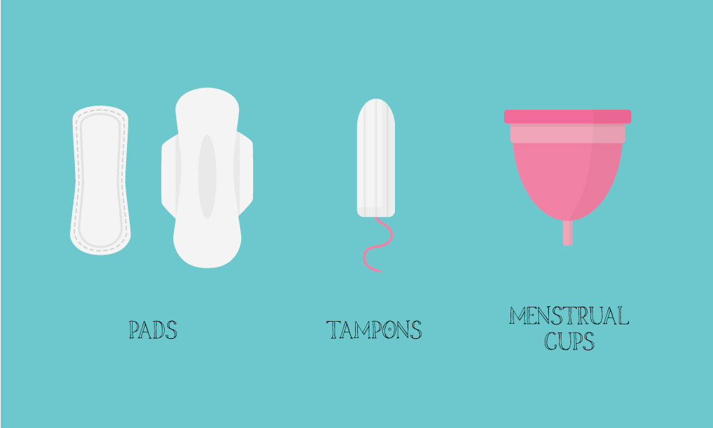
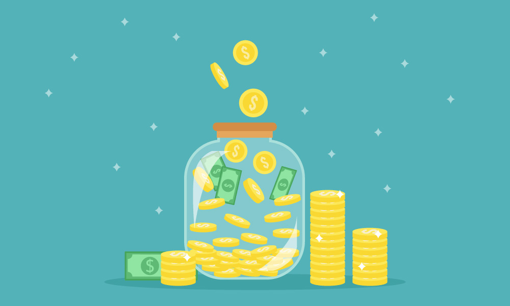
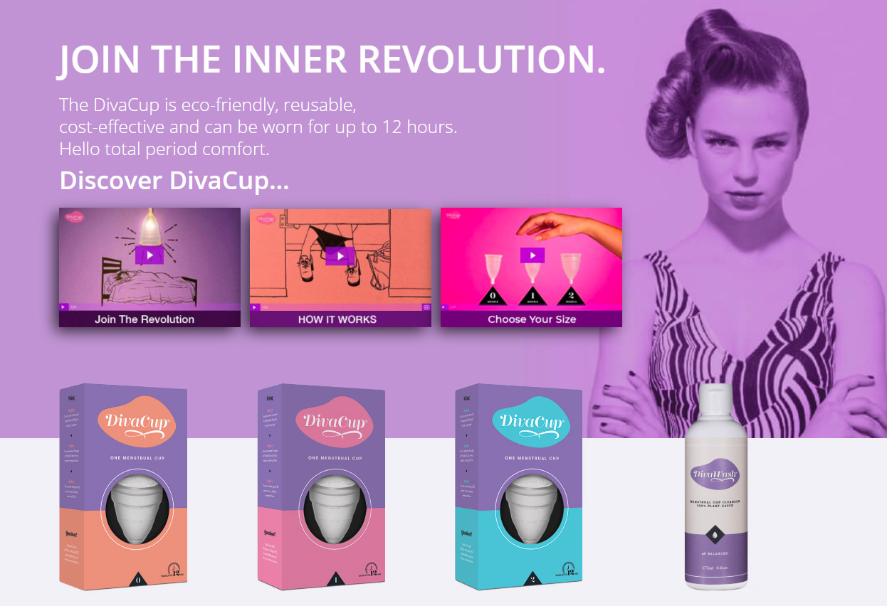

日本でも徐々に注目が集まって来ているような気がする月経カップ（生理カップ）。  
私は3年ほど前に月経カップに切り替えて以来、あまりの快適さに手放せなくなりました。

しかし、まだまだ生理用品と言えばナプキンかタンポンの2択だと思い込んでいる方や、月経カップについて聞いたことはあるけど何だか怖いと思っている方も多いと思います。

そこで今回は、3年以上月経カップを使い続けてきた私なりのメリット、デメリットと、実際に友人から受けた質問に対する私の回答についてシェアしていきます。

## 月経カップとは

まずは簡単に月経カップについて説明しますね。

月経カップとは生理用品の一種で、ナプキン、タンポンに続く第三の生理用品と言われています。  
ちなみに英語では Menstrual Cup といいますよ。

大抵は医療用シリコンで出来ていて、膣の中に挿入し、経血をそのカップに溜められるようになっています。  
そして、経血が溜まったら取り出して、中身を捨てて、カップを洗い、再装着が可能です。

---

## 月経カップに移行したきっかけ

カナダに留学して1年目。  
私はカレッジの学生で、既に学費を払った後なので貯金額は少なく、さらに1年の学生期間は貯金を切り崩しながら生活しないといけないため、なるべく節約して過ごしていました。

しかし、もちろん生理は毎月起きるので、生理用品は購入しなければならない。  
どのブランドがいいかなんて分からないし、節約もしていたので、安いものを購入。

使ってみたところ、ただナプキンを下着に当てているだけなんですが、何だか股がしみるような、痛いような感じ。  
何だろうと思って、付けていたナプキンを外し、新しいものに取り換えてみても、同じ感覚。  
何と言うか化学薬品が股にしみているような感じ？  
これはマズイと思って速攻でオーガニックコットンのナプキンを購入し、取り換えたところ治まりました。  
特に酷い事にならなくてよかった。

その時に、ナプキンのこと、タンポンのことを調べまくって、特にタンポンの危険性に関する記事を読んで衝撃を受けると同時に、月経カップの存在を知り、そのままドラッグストアで購入。

使ってみると、再利用できる月経カップは、節約生活を送る学生にとって経済的でありがたく、またタンポンのような危険性もなく、ゴミが出ないので環境にもやさしいく、今では手放せない存在になりました。

正直、こんなに便利なプロダクトが日本で流行してしまったら、ナプキンやタンポンを作ってる会社は大打撃だろうなと思う。

---

## メリット

### 環境にやさしい

月経カップはシリコンのカップを洗って再利用するため、ゴミが出ません。

タンポン派ならまだしも、ナプキン派だと、毎回のゴミの量がすごいことは、女性のみなさんならご存知ですよね。  
平均的な女性は、生きている間に1万4000枚もの使い捨てナプキンを使うんだそうです。

一方の月経カップは最長10年使えると言われています。  
私は1つの月経カップを使い続けて、まだ3年を過ぎたばかりですが、今のところ全く問題はありません。

また、既に環境問題は深刻なことになっている現在、エコフレンドリーな取り組みを進めている国や企業も多く、世界的にも環境に配慮することはトレンドとなっています。  
そんな中、毎月大量にナプキンを捨てる行為自体が何だかダサいな、と思っていました。

さらに、私はかなりの面倒くさがりなので、ゴミが少ないと、単純にゴミを出しに行く回数が減るので嬉しいです。

### お財布にやさしい

私は3年ほど前に3,000円くらいで買った月経カップを今でも使い続けています。

以前は、タンポン、夜用ナプキン、厚めの昼用ナプキン、薄めの昼用ナプキン、おりものシートなど、何種類もナプキンを揃えていました。

しかし今では、買い足すのはおりものシートだけ。  
おりものシートも布製の再利用できるタイプにすればもっと経済的なので検討中です。

### 生理中でもセクシーな下着を履ける

この点はタンポンでも一緒なんだけど。

ナプキンを付けるために、サニタリーショーツを履かなくていいんですよね。

私、サニタリーショーツが大っ嫌いで。  
ただでさえ、生理中だというだけで気分が落ちているのに、全然セクシーじゃないサニタリーショーツを履いていると、「うわー、私、今日、おばあちゃんみたいなパンツ履いてる…」と、さらに気分がブルーになります。

セクシーレースのタンガ以外は履きたく無い！ということで、ナプキンを付けなくていい月経カップはお気に入りです。

### 省スペース

ナプキンの収納って結構かさばりますよね。  
1人暮らしならまだしも、女性が何人も一緒に住んでいたら、結構なスペースをとるんじゃないでしょうか？

月経カップに変えた場合、

- おりものシート
- 月経カップ
- 月経カップ専用の洗剤

のみでいいので、トイレの収納スペースが少なくて済みます。

ちなみに、この専用洗剤も3年ほど前に月経カップと合わせて購入したものです。  
毎月ちょっとずつしか使わないので、まだ無くならない…。  
別に専用の洗剤じゃなくても良さそうなので、きっとこの洗剤が切れたら次は買わないと思います。

また、私は別にミニマリストでも何でもないんですが、物が少ない方が気分が落ち着く性格なので、省スペースだと嬉しいです。

### トキシック・ショック症候群のリスクがない

これは私の中でも大きな理由のひとつ。

トキシック・ショック症候群という疾患を聞いたことがあるでしょうか？  
これは細菌感染による敗血症で、その原因のひとつがタンポンだと言われています。

トキシック・ショック症候群は、約20%の人が保持していると言われる黄色ブドウ球菌の毒素によって引き起こされると考えられているんですが、タンポンの合成繊維は、その細菌の繁殖に最適な環境を作ってしまうのです。

2017年には、私の住むBC州でティーンの女の子がトキシック・ショック症候群によって命を落とし、ニュースになりました。

https://globalnews.ca/news/4295468/b-c-teen-died-toxic-shock-syndrome/

また、2012年にトキシック・ショック症候群を起こし、右足を切断したモデルのローレン・ワッサー（Lauren Wasser）は、去年、残った左足も切断しています。

import Instagram from '../../../src/components/Instagram';

<Instagram id="Bs8to1BH0pP" />

私は日本にいる時、タンポンのリスクなんて、ちっとも知りませんでした。  
みんなが当たり前に使っている物だったので、疑って調べてみたこともありませんでした。

しかし、生理は女性にとって切り離せない問題。  
だからこそ、タンポンを製造、販売しているメーカーは、そのあたりのリスクがあることをきちんとユーザーに伝えるべきですよね。  
（もしかしたら、箱の裏に小さい文字で書いてあったのかも？）

そして、ユーザーもリスクを理解した上で、タンポンを使用する分には問題無いと思います。やっぱり手軽ですし。

レアな疾患かもしれません。  
しかし、リスクのあるものを私は積極的に使いたくはないです。  
自分自身にもですが、もし私に娘がいたとしたら、絶対に勧めないだろうと思います。

何より、私としては、月経カップに比べて、環境にも、ユーザーのお財布にも、ユーザーの健康にも配慮していない企業のプロダクトを、わざわざ選んで購入して、彼らの利益に協力なんてしたくないな、と思ってしまいます。

### ニオわない

この点も、タンポンと同じですが。

生理中のニオイは、経血が空気に触れることや、生理用品でのムレによって起きています。  
月経カップだと、そもそも経血がほぼ外に出ないのでニオイません。

ただし、ずっと使っているとだんだんカップ自体の着色やニオイが気になってくるので、たまに重曹を入れたお湯で煮沸消毒しています。  
（着色に関しては、最初から濃い色のカップを買った方が、気にならないかも）

### 自分の健康状態を把握できる

血の量や出てくる塊など、自分の状態を目で見て確認することができます。  
血液を見たくない人もいるかもしれませんが、健康状態を把握できるので、私は毎月観察するのがちょっとだけ楽しいです。  
（この感覚は私だけかもしれないけど）

---

## デメリット

### 衛生面が心配

再利用するので衛生面が心配ですよね。  
膣には自浄作用があるから、水で洗うだけでいいと言う人もいますが、私は気になるので、1日の終わりには洗剤で洗っています。  
また、生理の終わりには、煮沸消毒をしたりしなかったり。

また、最長12時間となっているので、ちゃんと出しましょう。  
長時間入れ続けていたら、雑菌が繁殖します。  
（これはタンポンと同じですね。）

### 洗うのが面倒

使い捨てに比べると面倒ですよね。

ただ、ひとつだけお知らせしておきたいのは、私はそこらの人たちには絶対に負けない自信があるくらいの面倒くさがりです。  
割と物事の判断基準が、面倒か面倒でないかで判断することが多いくらい。

そんな私が毎月使い続けられているので、そこまで大きな手間じゃないと思います。

### 人によっては異物感や痛みがあるかも？

私は一切痛みを感じなかったのですが、挿入に慣れるまでには多少時間がかかるかもしれません。  
折りたたんで突っ込む角度とか。

ブランドによって形やサイズが違うので、試してみないことには分からないですね、こればかりは。

異物感はタンポンと同じ感じです。  
挿入した後すぐは多少何か入ってる感がありますが、5分もすると忘れてる。

---

## FAQ

オススメした時に友人からもらった質問をシェア。  
ただし、あくまで私に限った話ですのでご了承ください。

### どのくらいの頻度で取り替えるの？

2日目以外は、朝から挿入して、夕方仕事が終わって家に帰るまで取り替えなくても漏れません。

2日目は4〜5時間でカップがいっぱいになるので、取り替える必要があります。

夜は2日目でも一晩持ちます。

### 漏れないの？

0ではない。ちょこっとだけ漏れる時もあります。  
なので、私はおりものシートを付けています。  
ただ、おりものシートが血に染まってびっしょびしょになることはありません。

私は最初の数ヶ月、不安だったので、月経カップと一緒にナプキンを付けていました。  
しかし、漏れたとしても本当にちょろっとなので、今はおりものシートで事足りています。

ちなみに、生理2日目以外ならヨガをやっても大丈夫です。

### 外出先ではどうしてるの？

そう、これが問題なんですよね。  
私もまだどうするのが一番いい方法なのか模索してるんだけど。

基本的に生理2日目じゃなければ、12時間までは保つので、外出先で取り替える必要がありません。

で、問題の生理2日目。

私の会社が入っているオフィスビルには、1階に障害者用トイレがあるので、会社にいる時はそれを利用してます。

また、生理2日目は調子も悪いので、仕事休んだり、仕事に行っても早めに切り上げたり、家から作業したりすることも多いです。これは職種にもよると思いますが。

他のブログでは、ペットボトルに水を汲んで個室に持って入るという方や、アルコールパッドで除菌するという方、清潔なトイレットペーパーで拭くだけという意見も多かったです。

あとは、綺麗な月経カップをもう1つ持って行っておいて、取り替えるのもアリかな。

### 衛生面は大丈夫なの？

少なくとも私は、3年間月経カップを使い続けて、つい先日PAPテストを受けましたが、何も問題はありませんでした。

### 思ったよりでっかいけど入るの？

生理の時は膣が血液やその他のもので潤っているので、けっこうツルっと入ります。

ただ、ちょっと膝を曲げて中腰の状態で挿入する姿は誰にも見られたくありません。  
でも、その態勢が一番ツルっと入るんですよね。

### どれがいいの？

ごめんなさい、最初に買った DivaCup を使い続けているので分かりませんが、DivaCup で特に問題は感じてないです。

[DivaCup](https://divacup.com/ "DivaCup")

日本で買える月経カップは以下の4つくらいかな？

import Amazon from '../../../src/components/Amazon';

#### スクーンカップ

日本人の体型にフィットするらしい。

<Amazon
  asin="B00J94DXZM"
  title="【初心者向け月経カップ】 初めてでも使いやすい生理カップ スクーンカップ オーガニックコットンポーチつき ハーモニー（アクア） サイズ1 未経産婦用"
  linkId="e38e425b687567ba8390c3f79689fe49"
/>

#### エヴァカップ

<Amazon
  asin="B0797PC1ZR"
  title="【月経カップ】エヴァカップ（EvaCup）初めてでも使いやすい生理カップ コットンポーチ付き／ラベンダー（パープル）・サイズ１（スモール）"
  linkId="8cc656ff1a9c435cd76e0b5f51c6fcbf"
/>

#### メルーナ

<Amazon
  asin="B072V2G83V"
  title="月経カップ メルーナ 取り出しやすいリング型・ソフト・Sサイズ・ピンク"
  linkId="db3b786e65feaa87725ced1ec205b55e"
/>

#### スーパージェニー

<Amazon
  asin="B079YY3DKK"
  title="【月経カップ】スーパージェニー（SuperJennie）容量たっぷりスーパーソフトな生理カップ コットンポーチ付き／ティール（水色）・サイズ１（スモール）"
  linkId="5bcdd63afd0245dd18c9411ee9f5c01d"
/>