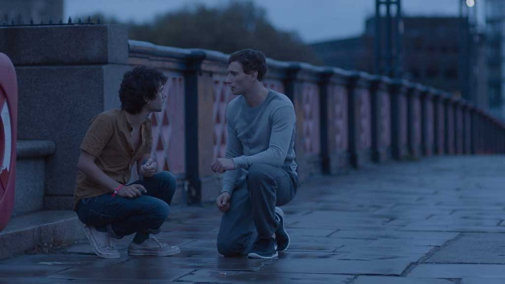
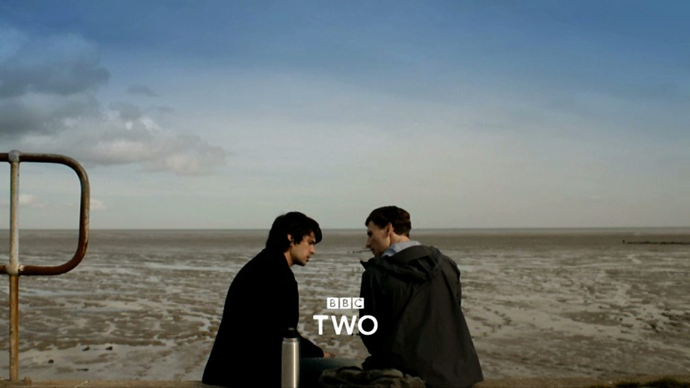

Source : [BBC Two - London Spy](https://www.bbc.co.uk/programmes/b06pmnwn)

ここ最近見て衝撃を受けたBBCドラマ『[ロンドン・スパイ](https://www.bbc.co.uk/programmes/b06pmnwn)』について、ぜひ語らせて頂きたい。  
2015年にイギリスBBCで放送されたドラマで、特に新しいドラマでもないんだけど、非常に私好みでした。

万人受けするようなストーリーではないですが、爆発爆発なハリウッド映画よりも、しっとりしたストーリー性のある邦画やヨーロッパ映画の方が好きな方にはお勧めです。

レビューサイトを見ても評価は真っ二つに分かれてるんだけど、好きな人は熱狂するほど好きだと思う（私含め）。

このブログを書いている今も、ドラマを思い出しただけでまた胸が高鳴ります。

## あらすじ

二人の出会い、Source : [BBC Two - London Spy](https://www.bbc.co.uk/programmes/b06pmnwn)

ダニー（ベン・ウィショー）はクラブ帰りの朝、テムズ川の橋の上で青年ジョー（エドワード・ホルクロフト）と出会う。貧乏で友人たちと安アパートに暮らすダニーと、投資銀行で働くエリートのジョーは、全く違う世界に生きていたが、急速に惹かれ合っていった。

デート中、Source : [BBC Two - London Spy](https://www.bbc.co.uk/programmes/b06pmnwn)

しかし、彼らの幸せな日々は突然終わりを迎える。ジョーが無残な姿で発見されたのだ。彼の謎の死をきっかけに、次々と突きつけられる「事実」。彼は実はMI6のスパイであり、ダニーは最愛の人の本当の前すら知らなかったのだ。ショックを受けながらも、愛する人の「真実」を探すうち、ダニーはスパイの世界へと飲み込まれていく。

だいたい、こんな感じです。

もう、最初は、

- ベン・ウィショー主演
- 主人公たちがゲイカップル
- スパイもののスリラードラマ

という、半分以上が邪な理由で見始めたんだけど、私の嗅覚に間違いはなかった。

公式のトレーラーはこちら。

## キャスト

### ダニー / ベン・ウィショー

映画『007 スカイフォール』シリーズで科学者Qを演じていたのが有名かと思います。実力派のイギリス人俳優。

私も『007 スカイフォール』と『パフューム ある人殺しの物語』を見て大好きになったんですが、演技力はもとより、母性本能をくすぐられる可愛さが尋常ではない。30歳過ぎてあの可愛さは何なんだ…。  
『リリーのすべて』は途中で挫折したんで、もう一回見てみよう。