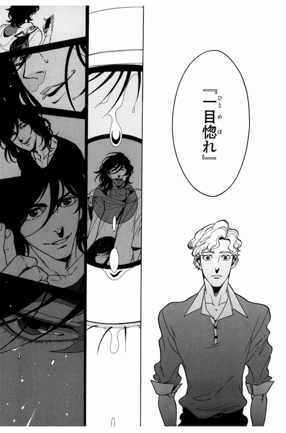

import { Amazon, Blockquote, SaleInfo } from '../../../../src/components/blog'

<SaleInfo />

2018年に出会ったBLマンガの中で、全私が震えるほどの衝撃を受けた作品のうちの1つ。  
こういう作品が読みたかった！と叫びたくなるほど、私の好きが全て詰まった最高の作品、 [ZAKK(@ZAKK_ccc)](https://twitter.com/ZAKK_ccc) 先生の『CAINS Dear Mr.rain』と『CAINS Dear Hatter』をご紹介します。

<Amazon
  asin="B08TWG21Y8"
  title="CANIS-Dear Mr.Rain-"
  url="https://amzn.to/3aZx334"
  author="ZAKK"
  renta="https://ck.jp.ap.valuecommerce.com/servlet/referral?sid=3549505&amp;pid=886731192&amp;vc_url=https%3A%2F%2Fwww.papy.co.jp%2Fcnt%2F%3Fac%3Da-rvaluec2cf1%26pg%3D%252Frenta%252Fsc%252Ffrm%252Fitem%252F240773%252F"
/>

## CAINS シリーズ

2019年1月の時点で５冊発売されており、これらは全て世界が繋がっています。

### 帽子職人とNYからやってきたミステリアスな男の恋物語

今回ご紹介する3冊。完結済み。

- [CANIS-Dear Mr.Rain-](https://amzn.to/2CZSlvy)
- [CANIS-Dear Hatter-#1](https://amzn.to/2O6edM7)
- [CANIS-Dear Hatter-#2](https://amzn.to/344GY1e)

タイトルは違っていますが、この3冊で1つのストーリーです。

### リョウのボスとその仲間の過去

**現在進行中。**

- [CANIS THE SPEAKER #1](https://amzn.to/2qAk03s)
- [CANIS THE SPEAKER #2](https://amzn.to/2qnmaDO)

上の3冊と全然雰囲気が違っていて、暗く暴力的でハードボイルドな作品。もう恋愛とかそんな生易しい話ではない。  
こちらの作品も素晴らしく、早く続きが読みたくて仕方がありません！

## あらすじ

<Blockquote srcName="CANIS-Dear Mr.Rain-" srcURL="https://amzn.to/2CZSlvy">
帽子屋を営む沓名聡は、道端に"落ちていた"不思議な男・柏葉リョウを拾う。ニューヨークから来たというリョウに、何の気なしに来日の目的を聞くと「死ぬために」という意味深な答えが返ってきて……。大胆な筆致と力強いストーリーが評判の大型新人・ＺＡＫＫの初単行本がついに登場！
</Blockquote>

## カップリング

### 沓名聡

帽子屋「DANTE」を営む、帽子職人。  
初登場時29歳。  
仕事に厳しいため従業員がすぐに辞めてしまう。  
女性にはモテるが、仕事にしか興味がないため続かない。

### 柏葉リョウ

NYからやってきたアメリカ人。  
初登場時19歳。  
父親が日本人とアメリカ人のハーフで、母親がイタリア人。  
日本にそのまま住み着いているのと、小さい頃に日本に住んでいたとあったので、おそらく日本国籍持っているっぽい。  
作中で20歳を迎えたので、アメリカ国籍は捨てることになるのかしら？

## みどころ

### ポップでオシャレなイラスト

イラスト集があれば、間違いなく買うほどに大好きなイラストです。  
ちょっとアメコミっぽさもある独特の絵柄ですので、好き嫌いが分かれるかもしれませんが、表紙を見て躊躇している人がいたら、そんな勿体ないことしてないで、とりあえず読んで欲しい。

キャラクターの所作や視線に妙な色気があるイラストなんですよね。  
かと思えば、デフォルメしたキャラはコミカルですごく可愛いし。

さらに、背景への描き込みが緻密。  
どうしてもBLマンガを読んでいると、キャラクターの顔ばかりで背景があまり描かれていないマンガも多いんですが、この作品は違います。  
帽子屋DANTEの店内、NYの街並みなど、描き込みが細かく、世界観に厚みが増し、ストーリーに引きずりこまれます。

### 恋愛だけに止まらない骨太なストーリー

1冊で完結する作品が多く、中身が薄くなりがちなBL業界の中で、ストーリー重視な方でも絶対に満足できる骨太な内容。

むしろ恋愛はそこまでストーリーの中心ではなく、マフィア、裏社会、人の生と死、クリエイター魂、ネグレクト、などのテーマがぎっしりと盛り込まれています。

これらのテーマがシリーズ通して断片的に出て来るんですが、盛り込まれ過ぎて置いていかれる程でもなく、ちょうどいい。  
そして、シリアスなテーマが盛り込まれている割には、コミカルなシーンも多く、重すぎず軽すぎずバランスが絶妙。

私自身、これだけブログでBLだM/Mロマンス小説だって言ってますが、おそらく一番読んでいるマンガのジャンルは青年誌。  
どうも、まるまる1冊恋愛の話だけの「少女漫画かよ！」な作品は苦手なんですよね。  
でも、ボーイズラブというコンセプト自体は好き、という私の嗜好に見事クリーンヒットした作品でした。

正直、BLってくくりに納めないで、もっと色々な人に読んでもらいたいくらい。

### オシャレすぎるファッション

作者のセンスの良さに惚れ惚れします。  
もともと私もファッションが大好きで、日本にいた頃は服や靴、帽子、アクセサリー等を大量にコレクションしていたり、モード系やハイファッション系の雑誌をよく読んでいたので、なんだかもうこの漫画を読んでいると、ストーリー以外の部分でもトキメキがすごくて。

1コマ1コマよく観察しながら読むと、服や小物まで本当に細かく描き込んであるんですよね。  
そして、それぞれのキャラクターに似合い、そのキャラクターを掘り下げるようなファッションチョイス。

### 作者の画力、テクニックの高さ

この作家さんは何者なのでしょうか？  
作品のあらすじには「大型新人」と書かれていましたが、コマ割りや絵の構図など、どう見ても長年マンガを描いているような玄人感があるというか。  
イラストも、ストーリーも、マンガのテクニックもレベルが高くて。  
余白の使い方もうまいよな、といちいち感動しながら読みました。

さらに、1冊目～3冊目まで通して読むと、さらにレベルが上がって行ってます。

### 沓名さんって完璧じゃないですか？

帽子職人としての実力も実績もあり、仕事へのプライドと情熱は計り知れない程。  
常に身だしなみには気を使っていてオシャレでセンスがいいのに、その洗練されたルックスからは想像できないほど、中身は優しくて純粋。  
ちょっと天然な可愛さも持ち合わせている。  
刈りあがった髪型はセクシーだし、家で黒ぶちメガネを掛けている姿も好み。  
そして経済力もある。

あれ、沓名さんって完璧じゃないですか？

せっかくマンガを読むなら、彼のような現実世界には絶対にいない、魅力的過ぎる男の話を読んで **トキメキ** たいですよね。

### 恋愛だけではない彼らの関係

全くと言っていいほど共通点がない二人。  
年齢も、育った国も違うし、今までの経歴も全然違う。  
偶然が重ならなかったら、出会うことなんて絶対になかったと思います。

沓名さんは帽子職人として、過去の自分を超えることへのプレッシャーや、何のために作るのか、などクリエイターらしい悩みを抱えていて。

リョウくんは両親や信頼していたボスに捨てられた過去から、生き方や目標が分からずにいる。

そんな二人が出会い、苦悩し、葛藤する過程で、お互いが無くてはならない存在であることに気付き、伝えあい、確認し合う。  
それは、友情も、恋愛感情も、親愛も混じり合った感情で。

控えめに言って最高です。

そして、よく考えたら二人ともノンケでしたよね。  
なんと言うか、このお話は恋愛というよりも、人間と人間の結びつきを描いた作品だったので、ゲイとかノンケとか気にせずに読んでいました。  
たまたま男同士だったっていう感じで。  
何より、この二人自身も、男とか女とか、物事を性別で分けるのではなく、別のカテゴリで分けてそうな性格だな、と。

### 愛すべき脇役たち

どの脇役もいいキャラクターしてるんですよね。  
沓名さんのおばあちゃんとか、小太郎とか、さらにこの後の SPEAKERS に出てくる面々とか。  
その中でも特に印象的なのが、沓名さんのお店スタッフ、英子ちゃん。

BLマンガでは女性キャラの立ち位置ってすごく難しかったりするんですが、彼女はいい仕事をしてくれます。

３冊目の最後に、彼女が沓名さんの帽子を被って泣いちゃうスピンオフが収録されているんですが、デザイナーになりたかった彼女が沓名さんの作品に出会い、惚れて、彼をサポートする側に回る彼女の生き方がカッコいい。

そして、ずっと沓名さんを見てきたからこそ分かる、彼女視点の発言がちょこちょこ加わることで、ストーリーに奥行きが出ている気がします。

さて、ここからは好きなシーンをひたすらあげていきます。  
正直、あげだすとキリがないですが。

## CANIS-Dear Mr.Rain-

### じゃあこっちもらうね

_Source : [CANIS-Dear Mr.Rain-](https://amzn.to/2CZSlvy), ZAKK, 2017, 茜新社, P.45_

ほとんどラブ要素がない1巻での、数少ない接触シーン。  
とはいえ、全然ロマンティックでもなんでもない。  
むしろ、ミステリアスなリョウくんへの「？」が増しただけのシーンでした。

それにしても、こんなことがサラっと出来てしまう19歳、末恐ろしいわ…。

### 一目惚れ

_Source : [CANIS-Dear Mr.Rain-](https://amzn.to/2CZSlvy), ZAKK, 2017, 茜新社, P.55_

赤面する沓名さんも可愛いんですけどね。  
それ以上に、彼の瞳に浮かんだリョウくんの描写が、なんだかキラキラしている！  
沓名さんの目を通して見ると、こんなにキラキラした存在なんだな、と。

### リョウくんが初めて見せた感情

<Blockquote srcName="CANIS-Dear Mr.Rain-" srcURL="https://amzn.to/2CZSlvy">
ねぇ、今の俺だったらなんだって言うこと聞くよ。なんでも、なんでも、なんでも！！なんだってできる、なんだってやってやる、どんな犬にだってなれる。だから、お願いだから、いらないなんて言わないで。そばに置いて……。命令でいいから声をかけてくれ…！
</Blockquote>

病院で初めてリョウくんの感情が溢れだしたシーン。  
両親から捨てられ、その後の拠り所となったハロルドからも捨てられたリョウくんの切羽詰まった告白は、こちらの胸が締め付けられるようでした。

この時点では彼らの関係に、恋愛感情は全くなく（自覚してないだけかもしれませんが）、傷ついたリョウくんは依存先を渇望していました。  
そんなリョウくんを受け止めるだけの器を持った沓名さん。  
いい男過ぎるよ。

そして、気になる医療費。  
死ぬためにやってきたくらいだから、きっと保険なんて入ってなくて全額自己負担だったんだろうな。  
沓名さん、なんてお人よし。

### 甘えてもいいと思える人、サトルさんが初めてなんだ

_Source : [CANIS-Dear Mr.Rain-](https://amzn.to/2CZSlvy), ZAKK, 2017, 茜新社, P.159_

出会えてよかったねと心から祝福したくなったシーン。  
人生でそういう相手がいるって本当に大事ですよ、うん。  
なかなかそんな人に出会えませんし、出会えたと信じて素の自分を出してみるも、裏切りやなんやで傷つく事の方がよっぽど多いわけで。

### もう、歯ブラシ交換しよ！

ちょっとびっくりしたシーンでした。  
私個人の感覚として、口ってすごくプライベートな部分なので、歯ブラシの共有にはもっと抵抗があるものだと思っていました。  
私は自分のパートナーの歯ブラシだろうと使いたくないですし。

なので、全くと言っていいほど嫌悪感なく、同じ歯ブラシを使っている二人に驚き。  
これは私が敏感過ぎるのか、それともこの二人が気持ち悪いとも思わないほど、自然とお互いを許しているということなのか…。

## CANIS-Dear Hatter-#1

### 「了」という漢字

_Source : [CANIS-Dear Hatter-#1](https://amzn.to/2O6edM7), ZAKK, 2017, 茜新社, P.90_

リョウともサトルとも読む「了」という漢字。

このシーンを読んでいろいろと納得しました。  
もちろん、リョウともサトルとも読むということから、彼らの関係（一対ということ）を示唆していることも、その意味から終わりが近づいていることを暗示してるところもなんですが。

それ以上に、ずっと違和感を感じていたリョウくんの名前。  
アメリカ人で名前が「リョウ」はありえないので、何でわざわざこの名前を選んだのかな？と、読んでいる間ずっと疑問でした。

というのも、実は英語圏には、日本語の「リョウ」という発音がないんです。  
「リョウ」と言っても、英語圏の人たちには「Yo」としか聞こえない。  
（日本人が L と R や B と V を聞き分けるのが難しいのと同じように）

なので、海外に住んでいる「リョウ」という名前の日本人は、あえて「リオ」と名乗っていることが多いです。それだと一発で通じるので。

そんなわけで、この「了」という漢字のシーンを見て、 **「なるほど、だからかあえてリョウだったのかー！」** と納得しました。

### ステージ裏でのキス

_Source : [CANIS-Dear Hatter-#1](https://amzn.to/2O6edM7), ZAKK, 2017, 茜新社, P.169_

ファッションショーでの出番が終わり、ステージ裏で込み上げる嬉しさをどうにか表現したいリョウくんのとった行動。  
帽子で顔を隠してキス。  
ニクイ演出。  
もう素敵過ぎるだろう。  
隠されると余計に想像してしまうじゃないですか。

そして、ここで大げさに堂々と抱き着いたり、愛の告白まがいのことを言って盛り上げることも出来たはずなのに、サラっとキスするだけに収める作者さま大好きです。

### 抱きたい…夢と…希望を…

NYに残ることを決意した後、それを沓名さんに伝えようとするも、伝えきれず。  
思わず、好きだという感情が溢れだしてしまうシーン。

このあたりの言葉の選び方が大好き。  
セクシーなシーンなのに、ちょっとズレていて抜けてる感が可愛い。

### 大人は利用してなんぼ

こんなことを言える大人になりたい。

## CANIS-Dear Hatter-#2

### 無意識に沓名さんを探してしまう

_Source : [CANIS-Dear Hatter-#2](https://amzn.to/344GY1e), ZAKK, 2017, 茜新社, P.61_

<Blockquote srcName="CANIS-Dear Hatter-#2" srcURL="https://amzn.to/344GY1e">
どうしても目を奪われる。あの人が見につけていたもの。あの人が好きだったもの。あの人が与えてくれたもの。
</Blockquote>

街行く人を見ては、沓名さんの影を目で追ってしまうリョウくん。  
彼の中で沓名さんの存在がどれほど大きくなっているか、ハロルドを追うよりもプライオリティが高くなってしまっていることを自覚し、戸惑い、苛だつシーン。

頭の中に、山崎まさよしの「One more time, One more chance」が鳴り響いてしまいます。

### そして、沓名さんも自分の気持ちに気付く瞬間

_Source : [CANIS-Dear Hatter-#2](https://amzn.to/344GY1e), ZAKK, 2017, 茜新社, P.90_

<Blockquote srcName="CANIS-Dear Hatter-#2" srcURL="https://amzn.to/344GY1e">
頭の中にリョウが現れるたびに、ちょっとした苛つきを覚えるのは。顔を見ただけで手が震えてしまうのは。この感覚は―。 
「勘違いだろ」 
受け入れることができなくてごめん。胸がざわつく理由を認めることができなくてごめん。 
…だけど、自分勝手だけど、もう二度とお前に会えないのだけは、 
「絶対に嫌だ…っ」
</Blockquote>

まずは、このポスターで使っている写真が最高にいい。  
英子ちゃんも、撮影したカメラマンもグッジョブです。  
屈託なく笑うリョウくんの笑顔が最高。

そして、そのポスターを見て動揺し、震える手でタバコを吸い始める沓名さん。  
リョウくんへの感情に気付いてしまい、二度と会えないのは「絶対に嫌だ…！」と涙を流すシーン。  
この1ページどーんと使って、余白の多いページレイアウト素敵ですね。  
腕に伝う涙と、立ち昇るタバコの煙すらセクシーです。

**この3冊のマンガの中で一番好きなシーンです。**

### 3度目があるとすれば

道に落ちているリョウくんを2度拾い、

<Blockquote srcName="CANIS-Dear Hatter-#2" srcURL="https://amzn.to/344GY1e">
三度目があるとするならば、頭をさげることなく、軽く言葉を交わして、もう一度握手を。
</Blockquote>

ちょっとどういう意味なんだろう？と考え込んだシーン。

まずは「頭をさげることなく」から、1回目や2回目のように倒れている状態じゃないこと。  
つまり、リョウくんが無事でいて欲しい。

そして、「頭をさげることなく」「握手を」から、拾うとか依存するのではなく、彼とは対等な関係でいたい、と思ってるのかな。

そして、ここ「握手」なんですよね。「ハグ」ではなく。  
彼と会えなくなることは嫌だと気づいた沓名さんですが、彼との「関係」が切れてしまうのが耐えられないのであって、そこに必ずしも「恋愛感情」が含まれてなくてもいい、って感じなのでしょうか？

### 一緒に歩いていこう

_Source : [CANIS-Dear Hatter-#2](https://amzn.to/344GY1e), ZAKK, 2017, 茜新社, P.148_

セリフがおしゃれ過ぎる。  
後藤さんを待っている間にもらった4つのキャンディーは、このシーンへの布石だったんですね。

### 一緒にシャワー

_Source : [CANIS-Dear Hatter-#2](https://amzn.to/344GY1e), ZAKK, 2017, 茜新社, P.170_

みなさん待ちに待った、二人の濡れ場…、文字通りの濡れ場です。  
3冊目の最後でようやく…！

このセリフの少ないシャワーシーンのセクシーさと言ったら、もう言葉になりません！  
見つめ合う二人の目つきの色っぽさ。

それにしても沓名さん、いくら男同士でも全裸で一緒にシャワーは誘ってるようにしか聞こえませんよ、うん。

### 店頭で男同士のSEXについてググる

地味に笑ってしまったシーン。

### 2時間だけ待っててくれ

_Source : [CANIS-Dear Hatter-#2](https://amzn.to/344GY1e), ZAKK, 2017, 茜新社, P.186_

NYでのシャワーシーンで、お尻の方に手を伸ばすリョウくんを制止した沓名さんですが、改めてリョウくんの「サトルさんを抱きたい」という気持ちを聞き、決心を固めるシーン。

「お前とだったら試してみてもいいかと思って…」  
「2時間だけ待っててくれ」  
と潔く準備しにバスルームへと消えていく沓名さんがカッコよ過ぎます。  
こういう部分も含めて、沓名さんて器が大きいというか、受け入れ力が高いですよね。

とは言え、何となく彼ら、今後はリバでも楽しめそうな雰囲気です。

そして、結局挑戦するもなかなか上手くいかずに「あと2週間待って…」というオチ。  
ただ、この時のリョウくんの優しい笑顔が可愛いですね。  
もう、沓名さん好き好き大好きって言うのが現れてる。

## おまけ

### 対になった表紙

マンガの表紙がキャラクターのアップというのは、あまり好きではないので、「ふーん、顔のアップなのか、なんだ」ぐらいに思っていました、ごめんなさい、土下座。

実は中表紙カラー絵が、表紙を更にアップにしたイラストなんですが、瞳の中！お互いがいる！  
そう、見つめ合っているんですね。素敵な演出です。  
さらに、リョウくんは涙を浮かべているような？

### 始まったばかりの関係

3冊目の最後でようやく恋人っぽくなった二人。  
この先の彼らの日常も読んでみたいな、と想像を膨らませてしまいます。

そのうち、リョウくんがやりたい事を見つけて、出発しちゃったりしそうな気もしますし。

2週間たった後のSEX中に、思わずリョウくんが「Oh, baby...」とかこぼしたのを聞いた沓名さんが「Baby!?」と思いながらも言い返すぼどの余裕がない、的なシーンが見たいです。

---

いつものことですが、感想ブログを書くと、ついつい長くなってしまいますね。  
ここまでお付き合い頂き、ありがとうございました。

こんな素晴らしい作品があるのに、それを知らずに生きていたことが恥ずかしくなるくらい、大好きな作品です。

<Amazon
  asin="B08TWG21Y8"
  title="CANIS-Dear Mr.Rain-"
  url="https://amzn.to/3aZx334"
  author="ZAKK"
  renta="https://ck.jp.ap.valuecommerce.com/servlet/referral?sid=3549505&amp;pid=886731192&amp;vc_url=https%3A%2F%2Fwww.papy.co.jp%2Fcnt%2F%3Fac%3Da-rvaluec2cf1%26pg%3D%252Frenta%252Fsc%252Ffrm%252Fitem%252F240773%252F"
/>

<Amazon
  asin="B08XKLYNXK"
  title="CANIS-Dear Hatter-#1"
  url="https://amzn.to/301yMym"
  author="ZAKK"
  renta="https://ck.jp.ap.valuecommerce.com/servlet/referral?sid=3549505&amp;pid=886731192&amp;vc_url=https%3A%2F%2Fwww.papy.co.jp%2Fcnt%2F%3Fac%3Da-rvaluec2cf1%26pg%3D%252Frenta%252Fsc%252Ffrm%252Fitem%252F245865%252F"
/>

<Amazon
  asin="B08XK2VSSQ"
  title="CANIS-Dear Hatter-#2"
  url="https://amzn.to/37VXlBa"
  author="ZAKK"
  renta="https://ck.jp.ap.valuecommerce.com/servlet/referral?sid=3549505&amp;pid=886731192&amp;vc_url=https%3A%2F%2Fwww.papy.co.jp%2Fcnt%2F%3Fac%3Da-rvaluec2cf1%26pg%3D%252Frenta%252Fsc%252Ffrm%252Fitem%252F245865%252F"
/>
