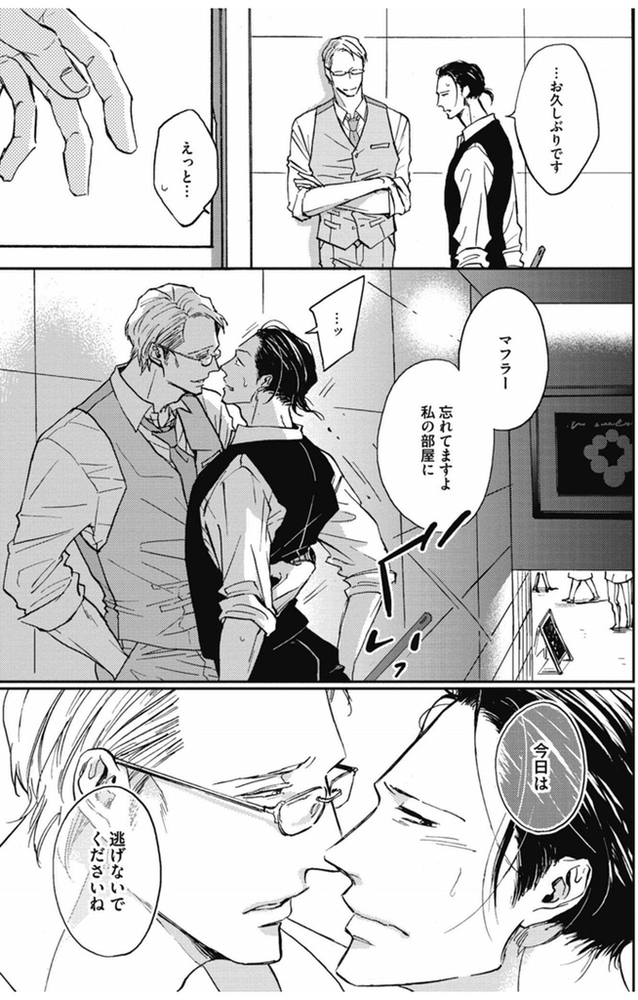

import { Amazon, Blockquote } from '../../../../src/components/blog'

まずは作者さま、アマゾンの評価が高かったので購入してはみたものの、この表紙を見た時に「またBLによくあるSEXしてるだけで面白くないマンガだったら嫌だな」なんて思いながら読み始めたことを猛反省しております。

個人的にBLにおいて「表紙の肌面積は内容の濃さと反比例する」と思っているので、なるべくそういう表紙の作品は避ける傾向にあるんです。

ただ、こちらの作品はよかった。  
いや、単に私がおじさん好きだから、というのも大きいかもしれませんが。

<Amazon
  asin="B07JLGTN65"
  title="恋が落ちたら"
  url="https://amzn.to/3hlusQL"
  author="上田アキ"
  rakuten="https://hb.afl.rakuten.co.jp/ichiba/1ce58288.c1901dcf.1ce58289.c2be2c6c/?pc=https%3A%2F%2Fitem.rakuten.co.jp%2Frakutenkobo-ebooks%2F2e87e85591393687bb8aa68afb4bd789%2F&link_type=hybrid_url&ut=eyJwYWdlIjoiaXRlbSIsInR5cGUiOiJoeWJyaWRfdXJsIiwic2l6ZSI6IjI0MHgyNDAiLCJuYW0iOjEsIm5hbXAiOiJyaWdodCIsImNvbSI6MSwiY29tcCI6ImxlZnQiLCJwcmljZSI6MCwiYm9yIjoxLCJjb2wiOjAsImJidG4iOjEsInByb2QiOjB9"
  renta="//ck.jp.ap.valuecommerce.com/servlet/referral?sid=3549505&pid=886731192&vc_url=https%3A%2F%2Frenta.papy.co.jp%2Frenta%2Fsc%2Ffrm%2Fitem%2F168622%2F%3Fref%3Dvc"
  cmoa="//ck.jp.ap.valuecommerce.com/servlet/referral?sid=3549505&pid=886731152&vc_url=https%3A%2F%2Fwww.cmoa.jp%2Ftitle%2F160585%2F%3F%2F%3Fcmoa%3Ditag01%26cmoa_pg%3D125%26itag01%3D"
  ebookjapan="//ck.jp.ap.valuecommerce.com/servlet/referral?sid=3549505&pid=886731133&vc_url=https%3A%2F%2Febookjapan.yahoo.co.jp%2Fbooks%2F499324%2FA002049543%2F%3Fdealerid%3D30064%26utm_source%3Dasp%26utm_medium%3Dvc%26utm_campaign%3Drate"
  honto="//ck.jp.ap.valuecommerce.com/servlet/referral?sid=3549505&pid=886731272&vc_url=https%3A%2F%2Fhonto.jp%2Febook%2Fpd_29585281.html%3Fpartnerid%3D02vc01"
/>

## あらすじ

<Blockquote srcName="恋が落ちたら" srcURL="https://amzn.to/2QBO5KN">
“同情なんかで欲情はしません——" 
イケおじ×お人好しゲイの“パンツ"から始まる恋? 
ノンケのおじさんに翻弄される——

ある夜、彼氏にフラれた直後の伊瀬の頭上に、なぜかパンツが降ってきた。 
落とし主はどこか放っておけない雰囲気のある菱本という男で、 
木にひっかかってしまった洗濯物を一緒に取ることに。 
お礼がしたいと言う菱本の自宅に上がると、 
実は伊瀬のことが気になりワザと洗濯物を落としていたと告げられる。 
さらに「おじさんには興味ないでしょうか?」と迫られてしまい——…?
</Blockquote>

さらに正直なところ、あらすじを読んだ時点で「え、パンツ？シリアスな話じゃなかったら嫌だな」なんて思いながら読み始めたことも、猛反省しております。

## カップリング

### 伊勢くん

薄い顔立ち、長めのストレート黒髪、細身、ゲイ。  
職業はビリヤード台のあるパブのスタッフ。  
好きになると尽くしてしまうタイプで、元カレにはそれで「重い」と言われ振られた経験があり、恋愛にビビっている。  
20代半ばくらいでしょうか？

### 菱本さん

長身、眼鏡、スーツ、紳士、ノンケ。  
職業は書かれてませんでしたが、何やら大手企業で役職もってそうでしたね。仕事できる男感が漂う。  
恋愛に熱を上げたことが無く淡泊なため、振られることが多いが追うこともない。バツイチ。  
40代前半かな？個人的な好みで言うと、もう少し年上でもよかった。

## 見どころ

キュン死ポイントを的確に押さえてくる  
細かく、そしてしっかり的確に、ぐっとくるポイントを押さえくる作者さまに感謝感激です。

例えば、

- 自分の手袋の外し方
- 相手の手袋の外してあげ方
- 服を脱いだ後の髪の乱れ
- ズレた眼鏡の戻し方
- 腕時計の外し方
- 相手のうなじの髪の毛のすき方
- 相手の顎の持ち上げ方
- 壁に押さえつけた時の、足の押し付け具合
- ビリヤードの打ち方
- 3ピースのスーツ
- 腰を引き寄せる時にポケットに入っている片手

_Source : [恋が落ちたら](https://amzn.to/2QBO5KN), 上田アキ, 2018, コアマガジン_

などなど、挙げだすとキリがないんですが、それはもう細々と萌えシーンが作品を通して散りばめられていて、じっくりゆっくり1コマずつ読み進めたくなる作品です。

### お互いへの尊敬や思いやりが溢れてる

お互いを苗字で呼び合っていたり、二人がずっと敬語で話しているのも好印象。  
見守っていたくなる可愛いカップルですよね。

作中ではとにかく伊勢くんが健気で。  
可愛いんだけど、もっと自分に自信もっていいのにな、とも思いますが、そこも彼の良さかな。  
フェラしながら自分で準備するシーンはエロ可愛い過ぎでした。

そんな伊勢くんを気遣う菱本さんの優しさと包容力。  
そして彼を可愛くてしょうがないと思っているのが感じられて、もう私が幸せです。

### ちゃんとコンドーム付けてる

コンドームやローションなしでSEXしてるBLマンガを読むと心配になって集中できないので、指にも股間にも付けてくれてる今作に安心しました。

## 二次元で楽しむに限る

この作品を読んでキュンとして、何度も読み返したんですが、読めば読むほど実感すること。  
それは **「ステキおじさまとの歳の差恋愛はマンガや小説に限る」** と。

私は、紳士で上品でセクシーなおじさまが大好きだー！  
でも、現実世界に、紳士で！仕事が出来て！優しくて！誠実で！コミュ力あって！包容力のある！独身！のおじさまなんて、存在しませんからー！

何より、10歳も20歳も年下の子と付き合ってる人って、単にその人の精神年齢が低いんだと思うんですよね。まぁ、例外はあるにせよ。

現実世界で好みのステキおじさまを見つけ手を出すと火傷する可能性大なので、フィクションでドキドキ悶えながら、現実では信頼できる落ち着いたパートナーと過ごすに限ります。

ただ、この作品を読んで、伊勢くんの「こんなきもちいいの初めてで…」ってくだりで思い出したことがあって。  
20代半ばまで、SEXって男の子がしたいからさせてあげてるものであって、自分が楽しむものでは全然なかったんですよね。  
それが、私好みのヒゲ×メガネ×スーツおじさんと出会い、声をかけ、セフレになってしたSEXが気持ち良過ぎて、自分の中でのSEXに対する考え方がガラッと変わったので、思わぬ共感もありました。

作品全体を通して、パンツを洗ったり干したり落としたりしてますが、ギャグになりすぎてないのもよかったです。  
ギャグマンガは苦手で…。  
ちなみに、私はお気に入りの下着が汚れるのが嫌なので、とっとと先に自分で脱ぐ派です（ｷﾘｯ）

こちらの作品が気に入ったので、作家の他の作品も全て買って読んでみました。  
どれも2周以上するくらい、それぞれ面白かったんですが、この「恋が落ちたら」がダントツでよかったです。

<Amazon
  asin="B07JLGTN65"
  title="恋が落ちたら"
  url="https://amzn.to/3hlusQL"
  author="上田アキ"
  rakuten="https://hb.afl.rakuten.co.jp/ichiba/1ce58288.c1901dcf.1ce58289.c2be2c6c/?pc=https%3A%2F%2Fitem.rakuten.co.jp%2Frakutenkobo-ebooks%2F2e87e85591393687bb8aa68afb4bd789%2F&link_type=hybrid_url&ut=eyJwYWdlIjoiaXRlbSIsInR5cGUiOiJoeWJyaWRfdXJsIiwic2l6ZSI6IjI0MHgyNDAiLCJuYW0iOjEsIm5hbXAiOiJyaWdodCIsImNvbSI6MSwiY29tcCI6ImxlZnQiLCJwcmljZSI6MCwiYm9yIjoxLCJjb2wiOjAsImJidG4iOjEsInByb2QiOjB9"
  renta="//ck.jp.ap.valuecommerce.com/servlet/referral?sid=3549505&pid=886731192&vc_url=https%3A%2F%2Frenta.papy.co.jp%2Frenta%2Fsc%2Ffrm%2Fitem%2F168622%2F%3Fref%3Dvc"
  cmoa="//ck.jp.ap.valuecommerce.com/servlet/referral?sid=3549505&pid=886731152&vc_url=https%3A%2F%2Fwww.cmoa.jp%2Ftitle%2F160585%2F%3F%2F%3Fcmoa%3Ditag01%26cmoa_pg%3D125%26itag01%3D"
  ebookjapan="//ck.jp.ap.valuecommerce.com/servlet/referral?sid=3549505&pid=886731133&vc_url=https%3A%2F%2Febookjapan.yahoo.co.jp%2Fbooks%2F499324%2FA002049543%2F%3Fdealerid%3D30064%26utm_source%3Dasp%26utm_medium%3Dvc%26utm_campaign%3Drate"
  honto="//ck.jp.ap.valuecommerce.com/servlet/referral?sid=3549505&pid=886731272&vc_url=https%3A%2F%2Fhonto.jp%2Febook%2Fpd_29585281.html%3Fpartnerid%3D02vc01"
/>
