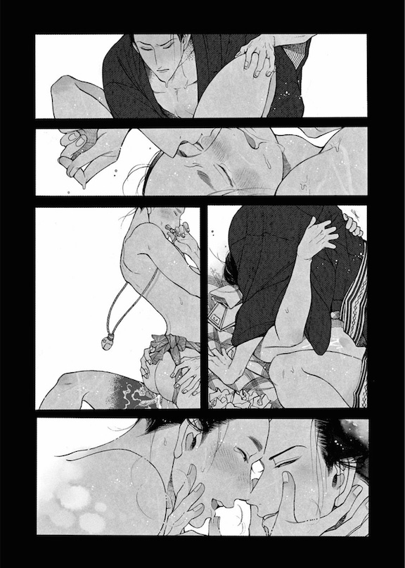
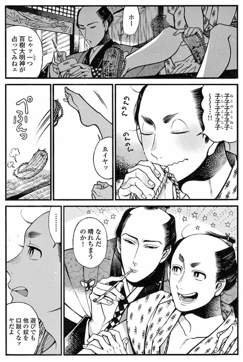
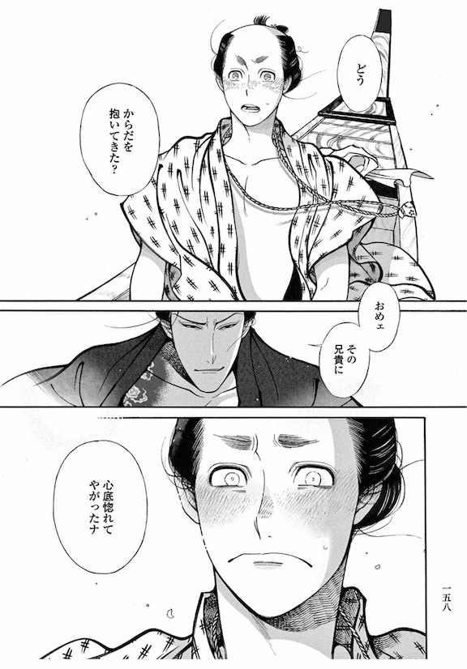
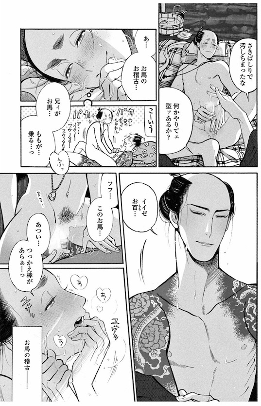
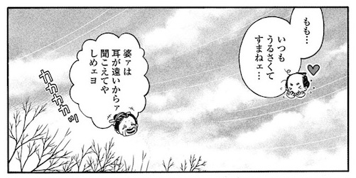
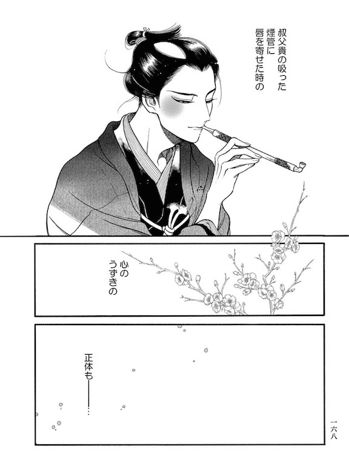
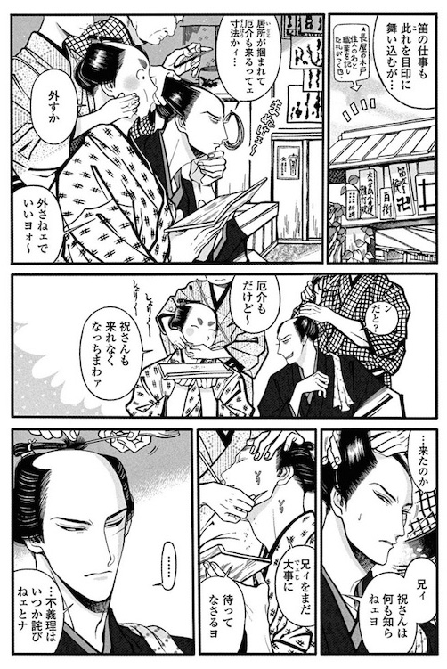

import { Amazon, Blockquote } from '../../../../src/components/blog'

2018年に読んだBLマンガの中で衝撃を受けた作品を紹介するシリーズ、第三弾。  
今回は、 [紗久楽さわ(@climnon)](https://twitter.com/climnon) 先生の『百と卍』です。

2019年2月の時点で2巻まで発売されていまして、今回は1巻と2巻まとめて感想をお送りします。

<Amazon
  asin="B06XGCKL43"
  title="百と卍"
  url="https://amzn.to/33nWiFJ"
  author="紗久楽さわ"
  rakuten="https://hb.afl.rakuten.co.jp/ichiba/1ce58288.c1901dcf.1ce58289.c2be2c6c/?pc=https%3A%2F%2Fitem.rakuten.co.jp%2Frakutenkobo-ebooks%2F78d18ed794d239f5a98d2c43868b7360%2F&link_type=hybrid_url&ut=eyJwYWdlIjoiaXRlbSIsInR5cGUiOiJoeWJyaWRfdXJsIiwic2l6ZSI6IjI0MHgyNDAiLCJuYW0iOjEsIm5hbXAiOiJyaWdodCIsImNvbSI6MSwiY29tcCI6ImRvd24iLCJwcmljZSI6MSwiYm9yIjoxLCJjb2wiOjAsImJidG4iOjEsInByb2QiOjAsImFtcCI6ZmFsc2V9"
  renta="//ck.jp.ap.valuecommerce.com/servlet/referral?sid=3549505&pid=886731192&vc_url=https%3A%2F%2Frenta.papy.co.jp%2Frenta%2Fsc%2Ffrm%2Fitem%2F124502%2F%3Fref%3Dvc"
  cmoa="//ck.jp.ap.valuecommerce.com/servlet/referral?sid=3549505&pid=886731152&vc_url=https%3A%2F%2Fwww.cmoa.jp%2Ftitle%2F127234%2F%3F%2F%3Fcmoa%3Ditag01%26cmoa_pg%3D125%26itag01%3D"
  ebookjapan="//ck.jp.ap.valuecommerce.com/servlet/referral?sid=3549505&pid=886731133&vc_url=https%3A%2F%2Febookjapan.yahoo.co.jp%2Fbooks%2F399237%2F%3Fdealerid%3D30064%26utm_source%3Dasp%26utm_medium%3Dvc%26utm_campaign%3Drate"
  honto="//ck.jp.ap.valuecommerce.com/servlet/referral?sid=3549505&pid=886731272&vc_url=https%3A%2F%2Fhonto.jp%2Febook%2Fpd_28377308.html%3Fpartnerid%3D02vc01"
/>

## あらすじ

<Blockquote srcName="百と卍" srcURL="https://amzn.to/33nWiFJ">
時は江戸時代･後期。真夏の蒸し暑くせまい長屋で、熱い吐息交じりにまぐわう男がふたり―。客に男色を売った男娼の総称＝陰間（かげま）。元･陰間の百樹（ももき）は、ある雨の日に卍（まんじ）に出逢い拾われた。陰間の仕事としてではなく、やさしく愛おしく、恋人として抱かれる瞬間はまるで夢のようで、そんな日々に百樹は幸せでいっぱいなのだった。たとえ過去に、どんなことがあったとしても。伊達男×陰間あがり。溺れるほど愛おしい江戸男子の艶ごと極上エロス。江戸漫画の革命児、紗久楽さわが描く、初のBL作品！
</Blockquote>

## カップリング

### 百樹(ももき)

陰間あがり。  
お尻がもっちもち。  
1巻登場時に、数えで20歳。

### 万次(まんじ)

篠笛吹き。  
背中に鬼を殺る武者の入れ墨。

## みどころ

### そもそも歴史物が大好物

ブログでBLだ、M/Mロマンス小説だと言ってますが、実は歴史物のマンガが大好きでして。  
[『ヴラド・ドラクラ』](https://amzn.to/2Ov4UV9) [『チェーザレ 破壊の創造者』](https://amzn.to/2KFdWO9) [『ヴィンランド・サガ』](https://amzn.to/2QJ6JQK) [『狼の口 ヴォルフスムント』](https://amzn.to/2QD4Zc3) みたいな無骨な感じの作品が一番好き。

なんですが、BLで歴史ものって、そもそも数が少ない上に、なんちゃって衣装だけみたいな作品が多いんで、なかなか満足できないんですよね。

そんな時に、彗星のごとく現れたこちらの作品。  
読み終わった後、呆然としてしましました。

研究されつくした江戸風俗、  
妖艶なエロさ、  
幸福な愛、  
明るい可愛らしさ、  
切なく暗い過去、  
**全て揃った傑作！**

### 研究されつくした江戸文化

まずは登場人物の言葉遣い。  
江戸っ子言葉が、時にはとても可愛く聞こえたり、時にはとても色っぽく聞こえたりと、現代の標準語にはない味わいがあります。  
また、普段ほぼ英語だけで生活していて改めて日本語に触れると、日本語って本当に美しい言語だなと感じるんですよね。

1巻で火事が起きて逃げるシーンから始まり、花火大会、見世物小屋、髪結い、風呂屋、出会い茶屋、夜鳴き蕎麦、などなど挙げだしたらキリがないんですが、リアルな江戸文化が満載です。

江戸が舞台のお話はいくつか読んでいるので、「これこれ、待ってました！」なネタから、「へー、そうなんだ、知らなかった！」と新たな発見もあり、知らなかった江戸文化に関してはさらに詳しく知るためにインターネットで調べまくったりと、私の知識欲を盛大に刺激してくれる作品です。  
さらに、巻末にある江戸文化の自由研究ページも非常に興味深く、何度も読み返しました。

また、筆で書いたような文字も多用されていて、いっそう雰囲気を盛り上げています。  
そのせいか、たまに浮世絵っぽさすら感じる。

物語の奥行きが深く、見事にどっぷり引き込まれてしまいました。

### リアルとフィクションのバランス

とは言え、ただのリアルな江戸のお話で終わっていないのが、私が好きなポイント。  
これだけリアルな江戸文化が描かれているのに、マンガならではのフィクションもしっかりと散りばめられていて、そのバランスが絶妙なんです。  
百のお尻のもちもち具合とかね。

### セクシーな月代

十代の頃から「月代ってセクシーだよね！」と、鼻息荒めに友人に語っても、なかなか理解されずに残念に感じていました。  
今回、百と卍を読んで、やっぱり月代はとびっきりセクシーだと思うし、同じように感じる作者さまやファンのみなさんを Twitter で眺められて幸せです。

### 甘い幸せに満ちた二人の暮らし

恋愛を扱ったマンガは、出会いから付き合うまでを描いた作品が多く、どうしてもストーリーは、付き合うか付き合わないかの、キャラクターの心の動きに焦点が当たります。

もちろん、それはそれで素敵なんですが、この作品で百と卍の間には、 **既に揺るがない程の圧倒的な愛がある前提** で話が進んでいきます。  
それが読んでいてとても愛おしい。

作品から迸る甘々な幸福感に酔いながらも、彼らがそれぞれ問題を背負い、乗り越えようとする姿にぐっときますね。

### 子犬のように可愛い百

体は卍よりも大きいんだけど可愛らしい百。

1巻の半分は彼の蔭間時代のお話。  
実の兄に仕込まれ、その兄を恋慕うも拒絶され、仕事として客に抱かれる日々（さまざまなプレイを強要されつつ…）。  
そんな過去があるなんて信じられないほど、無邪気で明るく、子犬のように卍を慕う百は本当に可愛い。  
彼はとても強い人なんだろうなぁ。

あと、チャームポイントのもっちもっちなお尻は、私も揉んでみたいです。

### 流し目が粋な伊達男、卍

切れ長で涼やかな目元の卍。  
もう何度、彼のカッコよさ、色っぽさに痺れたか数えきれないほどです。  
篠笛や煙管など、セクシーさをブーストするようなアイテム満載ですし。  
さらに、彼は適度にヘタレさもチラつかせてくるので、もう手に負えません。

彼にとって、百が大事で可愛くて仕方がないといった様子が伝わってくるし、結局、百には敵わないという力関係も可愛いですよね。

## 好きなシーンをひたすらあげる(1)

### 幸福感溢れるSEXシーン

_Source : [百と卍 (1)](https://amzn.to/2Xy7kWZ), 紗久楽さわ, 2017, 祥伝社, P.22_

一切のセリフがなくて、こんなにも幸福なSEXシーン初めて見た。

### 百樹大明神の占い

_Source : [百と卍 (1)](https://amzn.to/2Xy7kWZ), 紗久楽さわ, 2017, 祥伝社, P.53_

こういう当時の文化がしれっと盛り込まれているのが大好き。  
卍の裃姿も素敵ですし。

そして、ひたすら筆っぽい文字や小物で江戸感出してるのに、急に星が飛んでるコマが可愛くてポップでいいですね。

### 卍の悋気

_Source : [百と卍 (1)](https://amzn.to/2Xy7kWZ), 紗久楽さわ, 2017, 祥伝社, P.158_

何度見ても胸にドスっと刺さる卍の言葉。

しかし、この後、  
「兄ィの方が百万倍もももには恋だ」  
と、百のセリフが続きます。

きっと卍も百が実の兄よりも卍を好きなことくらい分かってたと思うんですよね。  
しかし、それを確かめざるを得ない卍の弱さと、そんなもの吹き飛ばす勢いで、大きな愛を投げ返す百。

ずっと見守らせてください。

### お馬の稽古

_Source : [百と卍 (1)](https://amzn.to/2Xy7kWZ), 紗久楽さわ, 2017, 祥伝社, P.173_

俗にいう騎乗位ですが、お馬のお稽古っていうんですね、なんて雅な。

割としっかりと濡れ場の多いマンガですが、お馬のお稽古しかり、出会い茶屋で女物の着物を着たり、張り型を懐紙で拭いているシーンがあったりと、江戸の春画風俗が満載で、ただただエロいだけのBLマンガでは全くありません。

## 好きなシーンをひたすらあげる(2)

### 二人を見守る大らかな人々

_Source : [百と卍 (2)](https://amzn.to/347gDjg), 紗久楽さわ, 2018, 祥伝社, P.33_

江戸時代ってこんな感じだったんでしょうか？  
男二人のカップルを見守る周囲の暖かさが素敵ですよね。

私自身が田舎育ちなので、近所づきあいの面倒くささや気持ち悪さは十分に味わったので、もうあんな密なコミュニティには絶対に近づきたく無いとは思うんですが、マンガで読む分には、この大らかで温かくて世話焼いて焼かれてる感じは、不思議と心地よく感じます。

### 火消し時代の卍

_Source : [百と卍 (2)](https://amzn.to/347gDjg), 紗久楽さわ, 2018, 祥伝社, P.127_

この少年の可愛らしさもさることながら、卍の叔父である祝さんは、もうかなりのおじさんなんですが、紗久楽さわ先生が描くと色気がすごいし渋くてカッコいいしで。

### 髪結い

_Source : [百と卍 (2)](https://amzn.to/347gDjg), 紗久楽さわ, 2018, 祥伝社, P.216_

こういった彼らの日常のシーンが好きなんですよね。  
髪結ってもらってたり、ヒゲ剃ってもらってたり。

別にただ長屋で2人でお茶でもすすりながら喋ってるだけでも成立するシーンだと思うんですよ。  
しかし、こういう当時は当たり前だけど、現代には無い習慣をさりげなく盛り込んでいるところに、作者のセンスの良さを感じざるを得ません。

---

それにしても、読み終わってあまりの素晴らしさに呆然としてしまいました。  
日本のBLマンガ家のレベルの高さたるや。

絵柄が独特ですし、表紙がもろ絡んでいる構図なので、お手に取りにくいかもしれませんが、絶対に後悔しませんから！！

<Amazon
  asin="B06XGCKL43"
  title="百と卍"
  url="https://amzn.to/33nWiFJ"
  author="紗久楽さわ"
  rakuten="https://hb.afl.rakuten.co.jp/ichiba/1ce58288.c1901dcf.1ce58289.c2be2c6c/?pc=https%3A%2F%2Fitem.rakuten.co.jp%2Frakutenkobo-ebooks%2F78d18ed794d239f5a98d2c43868b7360%2F&link_type=hybrid_url&ut=eyJwYWdlIjoiaXRlbSIsInR5cGUiOiJoeWJyaWRfdXJsIiwic2l6ZSI6IjI0MHgyNDAiLCJuYW0iOjEsIm5hbXAiOiJyaWdodCIsImNvbSI6MSwiY29tcCI6ImRvd24iLCJwcmljZSI6MSwiYm9yIjoxLCJjb2wiOjAsImJidG4iOjEsInByb2QiOjAsImFtcCI6ZmFsc2V9"
  renta="//ck.jp.ap.valuecommerce.com/servlet/referral?sid=3549505&pid=886731192&vc_url=https%3A%2F%2Frenta.papy.co.jp%2Frenta%2Fsc%2Ffrm%2Fitem%2F124502%2F%3Fref%3Dvc"
  cmoa="//ck.jp.ap.valuecommerce.com/servlet/referral?sid=3549505&pid=886731152&vc_url=https%3A%2F%2Fwww.cmoa.jp%2Ftitle%2F127234%2F%3F%2F%3Fcmoa%3Ditag01%26cmoa_pg%3D125%26itag01%3D"
  ebookjapan="//ck.jp.ap.valuecommerce.com/servlet/referral?sid=3549505&pid=886731133&vc_url=https%3A%2F%2Febookjapan.yahoo.co.jp%2Fbooks%2F399237%2F%3Fdealerid%3D30064%26utm_source%3Dasp%26utm_medium%3Dvc%26utm_campaign%3Drate"
  honto="//ck.jp.ap.valuecommerce.com/servlet/referral?sid=3549505&pid=886731272&vc_url=https%3A%2F%2Fhonto.jp%2Febook%2Fpd_28377308.html%3Fpartnerid%3D02vc01"
/>
