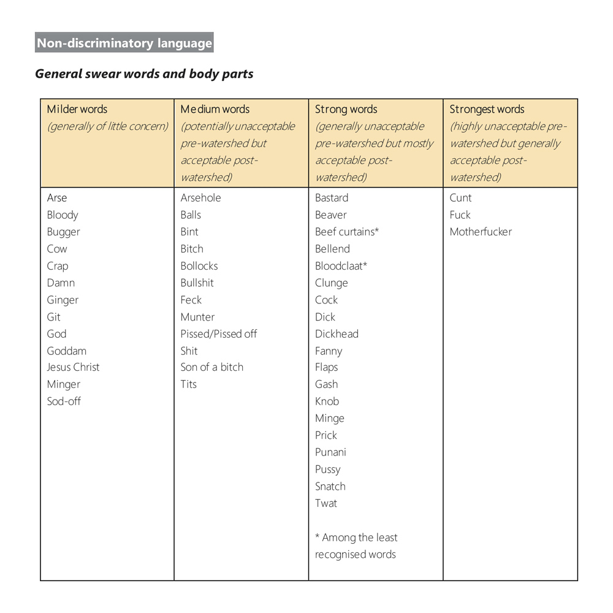

import { Blockquote, Amazon, Vocabulary, SoThisIsChristmasIndex, Instagram, AffiliateBanner } from '../../../../src/components/blog'

クリスマスシーズンですね！ So This is Christmas ですね！

北米のこの時期は、お店も会社も家の中もクリスマスデコレーションをしていて、街も人もみんながワクワクハッピーなムード。私もついつい浮かれてしまいます。  
日本でクリスマスに「リア充爆発しろ」と思いながら仕事をしていた日々が懐かしい…。

そんなわけで、いきなりシリーズ6作目になりますが、So This is Christmas の萌えどころと悶えどころを紹介していきたいと思います。

ちなみに、私の住んでいる街、バンクーバーでは、公共交通機関のバスもクリスマス仕様で、行き先が「Merry Christmas」になったり、トナカイバスになったりします。  
バスの行き先は分かりません。

<Instagram id="Bqd8vrtH-Lj" />

では、さっそく、始めましょう！

<SoThisIsChristmasIndex />

**※日本語翻訳版は読んでいないので、各英文の翻訳部分は私の意訳です。間違ってたら教えてください！**

## 知りたくなかった妹の情事

<Blockquote srcBook="soThisIsChristmas" lang="en" book>
“And you were busy not selling books. But we’ll discuss it later.” “Fine. Okay. Yes, Mr. Scrooge, we did take Christmas off.” “And other things too, it seems, but like I said, we’ll discuss later.”
</Blockquote>

（「本を売る以外でも忙しかったみたいだけど、まぁ、それは後で話し合おうか。」「ええ、わかったわよ、ミスタースクルージ。私たちはクリスマス休暇を取ったわ。」「それ以外のことも取ったみたいだけど、まぁ、さっきも言ったけど、それは後で話し合おう。」）

**we’ll discuss it later**

アドリアンのこのフレーズの繰り返しがいいですよね。冷静でいようとしている感があって。

それから、このあたりのアドリアンのナタリーに対する反応は、何だか「お兄ちゃん」感が出ているというか。  
私も兄がいるので分かるんですが、この心配してくれてるんだけど、ちょっと鬱陶しい感じ。（いや、ありがたいんですよ、うん）

<Vocabulary en="Fine" ja="わかったよ、もういいよ" />

日本人が最初に教わる英単語の一つ、fine。  
その「I'm fine.（私は元気です）」以外の使い方ですね。  
海外ドラマや映画を見始めて、私も知ったんですが、何か話し合いや言い争いをしていて、「あーもう、それでいいよ、わかったよ」みたいな時に使います。

<Vocabulary en="Mr. Scrooge" ja="守銭奴、『A Christmas Carol』の主人公の名前" />

日本語で守銭奴って言っちゃうと、ものすごい悪口っぽいですね…。

<Vocabulary en="take 〜 off" ja="休みを取る、服を脱ぐ" />

take offには意味が色々あるんですが、今回がアドリアンが2つの意味を掛けて言っていますね。  
「休みを取る」と「服を脱ぐ」。

## ちょいちょい入る惚気が可愛い

<Blockquote srcBook="soThisIsChristmas" lang="en" book>
We were hoping to rendezvous for lunch—and just the idea of that, of being able to casually meet Jake for lunch, instantly warmed me.
</Blockquote>

（僕たちは一緒にランチをとるつもりだったんだけど、その気軽にジェイクとランチに行けるということを思うと、瞬時に温かい気持ちにさせてくれた。）

私も瞬時に温かい気持ちになりました。

<Vocabulary en="rendezvous" ja="会う約束、待ち合わせ" />

辞書を引くと単なる「会う約束、待ち合わせ」な意味しかなかったんですが、ネイティブのパートナーに確認したところ、「Sexy Meeting」とのこと。

綴りを見たらフランス語から来た単語だな、と予想はついてたんですが、彼曰く「フランスから来た言葉はだいたいセクシー」だそうで。  
まぁ、ジョークだろうけど...。

ただ、確かこの本の最後の方で、ケビンとの待ち合わせにもこの言葉使ってあったような？後ほど要確認案件。

<Blockquote srcBook="soThisIsChristmas" lang="en" book>
As painful as it had been getting dumped by Mel, I didn’t regret a minute of that heartbreak because my path had ultimately led to Jake.
</Blockquote>

（メルに振られた痛みを、その失恋を僕は少しも後悔していない。だって、僕の人生は最終的にジェイクへと繋がっていたから。）

<Vocabulary en="As painful as ～" ja="～と同じくらいの痛み" />

<Vocabulary en="get dumped" ja="（恋人に）捨てられる、振られる" />

<Blockquote srcBook="soThisIsChristmas" lang="en" book>
I didn’t reassure him about all the fish in the sea. Because it doesn’t help when you’re in love with a particular fish.
</Blockquote>

（特定の誰かに恋している時には分からないから、僕は「男なんて星の数ほどいる」なんて言葉で、安心させようとはしなかった。）

He isn't the only fish in the sea.  
海にいる魚は彼だけではない

There are plenty of fish in the sea.  
海には大量に魚がいる

これらは慣用句で、つまり「恋の相手は星の数ほどいる」ってことですね。

ちなみに北米には、 [POF(Plenty of Fish)](https://apps.apple.com/us/app/pof-dating/id389638243?ign-mpt=uo%3D4) というオンラインデーティングアプリがあります。  
今はちょっと分かりませんが、3年ほど前に使ったときは、機能としては悪くないのに、UIがクソだなーという感じで、もったいない印象でした。  
割と使っている人も多そうだったのに...。

## やな奴、やな奴、やな奴！

<Blockquote srcBook="soThisIsChristmas" lang="en" book>
He was a good player but a total prick off the court. Happily, once my health had sidelined me, I’d never had to deal with Terrill again.
</Blockquote>

（テリルはいい選手だったが、コートを出ればただの嫌な奴だった。ありがたいことに、僕が病気でプレイできなくなってから、一度も彼と会わずに済んだけど。）

そもそもアイヴァーのお兄さんの名前「Terrill」はカタカナで書くと「テリル」でいいんでしょうか？綴り通りに読むとそうなんですが、英語だと「テロ」に近い発音なので、日本語翻訳版でどうなっていたのか気になるところです。  
「Adrien」も英語の発音だと「エイドリアン」に近いけど、綴り通り「アドリアン」になってますし。

<Vocabulary en="prick" ja="嫌な奴" />

「チクチク刺す」という意味から派生して「男性器」、そこからさらに派生して「嫌な奴」。

こういうスラングって、なかなか辞書を引いただけではニュアンスが分からないですよね。嫌な奴といっても、どの程度の Asshole 具合なのか、と。

ちょっと古いデータなんですが、2016年にUKで調査された「悪口の強さランキング」を見つけました。

この表だと「Prick」は「Strong words」に入ってますね。

ただ、カナダ人のパートナーに尋ねたところ、「Prick」は「Annoying」や「Mean」よりも強めだけど、「Arsehole」よりも弱いよ、と言っていたので、国によっても人によっても感覚は違いそうですね。

[Ofcom explores latest attitudes to offensive language](https://www.ofcom.org.uk/about-ofcom/latest/media/media-releases/2016/attitudes-to-offensive-language)

## 私も幸せです、ありがとうございます

<Blockquote srcBook="soThisIsChristmas" lang="en" book>
I smiled. Because even in these not very cheerful circumstances, knowing I could call on Jake for help, could count on Jake now and forever, filled me with…happiness. Yeah. Happiness.
</Blockquote>

（僕は微笑んだ。あまり喜ばしくない状況であっても、今、そしてこれからもずっと、ジェイクに助けを求められる、ジェイクを頼れる。そう思うと、幸せで、そう、幸せで満たされるようだった。）

<Vocabulary en="even in" ja="にあっても、でさえも" />

<Vocabulary en="call on ... for help" ja="（人）に助けを求める" />

<Vocabulary en="count on ..." ja="（人）を頼りにする、当てにする" />

今作はアドリアンが幸せを実感する場面が多くて、読んでいて癒されますね。  
ストーリー自体も短かったので一気読みでした。

## 書籍紹介

<Amazon book="soThisIsChristmas" />

<AffiliateBanner type="english" />

<SoThisIsChristmasIndex open />
