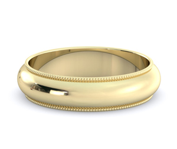

import { Blockquote, Amazon, Vocabulary, SoThisIsChristmasIndex } from '../../../../src/components/blog'

いよいよ So This is Christmas の最終チャプターですね。  
この本自体がおまけのような作品なので、ちょっとストーリーが都合よく行き過ぎ感は否めませんが、純粋に二人が幸せなら私も幸せです。

では、さっそく、始めましょう！

<SoThisIsChristmasIndex />

**※日本語翻訳版は読んでいないので、各英文の翻訳部分は私の意訳です。間違ってたら教えてください！**

## 大酒飲みなアイルランド人

<Blockquote srcName="So This is Christmas (The Adrien English Mysteries #6)" srcURL="https://amzn.to/2OzE8fN" book>
“Of course I want you there. But…we’re Irish. We get drunk and say stupid things. I can’t guarantee that someone there tonight won’t say something stupid.” It was tempting to answer, “I’m English. We stay <strong>sober</strong>, <strong>kick ass</strong>, and <strong>enslave</strong> your lot for eight hundred years.”
</Blockquote>

（「もちろん、来てほしいさ。でも…、俺の家族はアイルランド人だ。酔っぱらってバカなことを言う生き物なんだよ。俺は今夜、誰かがバカなことを言わないとは約束できない。」「僕はイングランド人だ。僕らはアイルランド人を素面で叩きのめして、800年間奴隷にしてきたんだよ。」と、返したくなる誘惑にかられた。）

<Vocabulary en="sober" ja="酔っていない、しらふの" />

<Vocabulary en="kick ass" ja="負かす、やっつける" />

<Vocabulary en="enslave" ja="奴隷にする" />

アイルランド人に限らず、イギリス人は酒飲みなイメージがありますが、以前、redditにアップロードされた、UK内のパブに印をつけたマップが印象的でした。  
この赤い印、全部パブなんですよ。真っ赤。

_Source : [Map of every pub in the UK. : europe](https://www.reddit.com/r/europe/comments/8esrzt/map_of_every_pub_in_the_uk/)_

どれだけパブ必要なのよって。

## 本名ジェームズだったのね

<Blockquote srcName="So This is Christmas (The Adrien English Mysteries #6)" srcURL="https://amzn.to/2OzE8fN" book>
He looked slightly taken <strong>aback</strong>. “James?” He shoved open the screen door. “Come in. Come in.” “Happy New Year.” Jake handed over a bottle of Laphroaig. “This is Adrien. Adrien, this is my <strong>old man</strong>.”
</Blockquote>

（彼は少しだけ驚いたようだった。「ジェームズ？」彼はスクリーンドアを押し開けた。「入れ、入れ。」「ハッピーニューイヤー。」ジェイクはラフロイグのボトルを渡した。「彼はアドリアン。アドリアン、これが俺の父親だ。」）

<Vocabulary en="aback" ja="後方へ" />

<Vocabulary en="old man" ja="父親" />

ジェイクの本名は「ジェームズ」だったんですね。  
彼のように常にニックネームを使っている場合、オフィシャルな書類以外は基本的に全てニックネーム表記するから、本名が何なのかは尋ねない限り分かりません。  
会社のメールや名刺、自己紹介もニックネームだし。

特に彼のような「ジェームズ」や、「ロバート」「エリザベス」「デイヴィッド」みたいな王族っぽい名前を持っている人は、本名だと固すぎるからニックネームを好むみたい。  
確かに日本人でも「信長」とかだと名前負けしちゃいますよね。

ただ逆に、親がもう最初から「ジェイク」と名付ける場合もあるので、本当に尋ねない限り分からない。

そして、ジェイクのお父さんの名前も同じ「ジェームズ」。  
私、この名前を受け継ぐ文化は結構好きなんですよね。  
なんだか素敵だなぁと思っていて。  
考える手間が省けそうっていうのもあるんですが。

## 理解できなくても受け入れる努力

<Blockquote srcName="So This is Christmas (The Adrien English Mysteries #6)" srcURL="https://amzn.to/2OzE8fN" book>
They were trying. I could see that. For Jake’s sake they were going to make the effort. And I would do the same.
</Blockquote>

（ジェイクの家族は受け入れようとしていた。それは僕にもわかった。ジェイクのために、彼らは努力していこうとしている。そして、僕も同じ努力をするだろう。）

LGBTに限らずに、何事にも大事だなって思うんですよ、これ。  
別に理解できなくてもいいから、否定しないで受け入れようとする努力ぐらいはする。  
それだけで、随分と生きやすい世の中になるのにな、と。

## たぶんお酒のせい

<Blockquote srcName="So This is Christmas (The Adrien English Mysteries #6)" srcURL="https://amzn.to/2OzE8fN" book>
Maybe it was the <strong>booze</strong>. They could drink, that was for sure. Even Janie could <strong>put it away</strong>. Whatever it was, round about eleven thirty, the brothers started slapping Jake on the back during the storytelling, and the sister-in-law and <strong>aspiring</strong> sister-in-law stopped <strong>visibly wincing</strong> every time they caught my eye.
</Blockquote>

（たぶん、お酒のせいかもしれないけど。確かに彼らは大量に飲んでいたし、ジャニーでさえ本当によく飲んでいた。それが何であろうと、11時半を回った頃には、ジェイクの弟たちは話の途中にジェイクの背中を叩き始めたし、その妻や妻候補の女性たちは、僕と目が合うたびに目に見えて動揺しなくなっていた。）

<Vocabulary en="booze" ja="大酒" />

<Vocabulary en="put ～ away" ja="（食物を）平らげる" />

<Vocabulary en="aspire" ja="熱望する" />

<Vocabulary en="visibly" ja="明白に" />

<Vocabulary en="wince" ja="たじろぐ、しかめる" />

## 新年のキス

<Blockquote srcName="So This is Christmas (The Adrien English Mysteries #6)" srcURL="https://amzn.to/2OzE8fN" book>
When the song ended and everyone turned to kiss their spouse, Jake rested his hand against my face. His own face was flushed and his eyes were bright. He looked self-conscious in a way he had not looked all evening. I opened my mouth to say—I have no idea what. Hey, don’t worry about it. Old habits die hard. But he cut me off with a kiss, his mouth firm, almost gentle on my own. Come to think of it, it was the best New Year’s Eve party ever.
</Blockquote>

（歌が終わり、全員がそれぞれの相手に向き合いキスをした時、ジェイクは僕の顔に手を添えた。彼の顔は上気していて、目は輝いていた。今夜一切見せなかったような、照れくさそうな表情をしていた。僕は、ー何か分からないけど、まぁ、気にするなよ。古いしきたりはなかなか消えないよな、とでも言うつもりで口を開いたんだけど、ジェイクの唇が力強く優しく僕の唇を塞いだ。思い返せば、今までで最高の新年パーティーだった。）

この本を通して、ジェイクがPDAを気にせずに、肩に手を回したりするようになったシーンがいくつかありましたが、知らない人の前と、家族の前とでは違いますよね。  
なので、アドリアンが気を使ったのも理解できるし、それをジェイクがキスで塞ぐのもカッコよすぎです。  
この場面は何度も想像してはキュンとしてしまいました。

正直なところ、以前私は、この新年のキス自体にさほど重要な意味はないと思ってたんですよ。  
それもあって、去年のお正月は私が1人で旅行に出ていて、上海の友人宅で新年を迎えたので、パートナーとのキスはなかったんです。  
今年はバンクーバーで友人たちとパーティをしていたので、シャンパンで乾杯した後に、それぞれのパートナーとキスしていました。

なんだか、そういう節目節目に一緒にいて「今年も一年一緒にいっぱい楽しみましょう」と確かめ合うのは、非常に小さい事なんですが、これから先の関係を続けていく上では、意味があるんじゃないかな、と思いなおした新年でした。

## 君の家族は僕の家族

<Blockquote srcName="So This is Christmas (The Adrien English Mysteries #6)" srcURL="https://amzn.to/2OzE8fN" book>
“Thank you for tonight.” “You don’t have to thank me. I mean it. Your family is my family.” Unless they hurt him again, in which case next holiday season I’d be poisoning the gift baskets.
</Blockquote>

 （「今夜はありがとう。」「僕にお礼なんて言わなくていいよ。君の家族は僕の家族でもあるわけだし。」彼らがまたジェイクを傷付けない限りはね。もしそんなことがあれば、次のホリデーシーズンには、僕が毒を仕込んだギフトバスケットを送ってあげるよ。）

私、この毒入りギフトバスケットを送り付けてあげる発言好きなんですよね。  
こういうことを、さらっと言えるようになりたい。

そしてアドリアンの「君の家族は僕の家族だよ」発言にも出てるんですが、いつも感じる日本との感覚の違い。  
なんだか北米の人たちって家族との距離が近いんですよね。

私はというと、日本に住んでいようが、カナダに住んでいようが、実家に行くのは年に1回だし、基本的に連絡もしないし、それで全然十分だと思っていたんですよ。  
あ、家族仲はいいですよ。

自分の親でさえそんな感じなので、ましてや「ボーイフレンドの親に会いに行く」っていう発想自体が頭になくてですね。  
で、全然行かなかったら、しばらくして「お願いだから遊びに来て。」とお願いされてしまいました。  
彼のご両親は車で1時間程のところに住んでいるのもあって。  
いや、嫌ってるとかそういうのじゃないんですよ、ほんと。

そして、逆に彼の方も私の家族に会いたがったりしていて。  
何だか感覚が違うなーと実感させられました。

## むしろ何て言おうとしたの…？

<Blockquote srcName="So This is Christmas (The Adrien English Mysteries #6)" srcURL="https://amzn.to/2OzE8fN" book>
“Oh, you found the champagne glasses. Great! Now if we can just find the flannel sheets…” Jake drew a deep breath. “You know the other night when you were talking about being a better boyfriend?” “Okay,” I said quickly.
</Blockquote>

（「お、シャンパングラス見つけたの？やったね。じゃぁ、あとはフラネル生地のシーツさえ見つけられれば…」ジェイクは深いため息をついた。「この間、お前がもっといいボーイフレンドになるって話していたの、覚えてるか？」「覚えてる。」僕は即座に答えた。）

むしろ、どんなジョークを言うつもりだったのかの方が気になります。

これから先、ジェイクがこんな風にため息つくシーンは多発すると思われる。

## まさかのプロポーズ

<Blockquote srcName="So This is Christmas (The Adrien English Mysteries #6)" srcURL="https://amzn.to/2OzE8fN" book>
“I have one last Christmas present for you.” “Oh? Really? You don’t want to save it until next year?” “No.” He looked momentarily confused. “I don’t.” “Okay.”
</Blockquote>

（「最後にもうひとつだけクリスマスプレゼントがあるんだ。」「え、本当に？来年まで取っておかなくていいの？」「いや。」彼は一瞬困惑したような表情を見せた。「今渡したいんだ。」「わかった。」）

このあたりの二人のすれ違った空気がいいですよね。  
ニヤニヤしてしまします。

先日、同じように新年パーティでプロポーズした友人カップルにも同じような空気が流れてました。  
もうすぐカウントダウンのタイミングで、突然、彼が彼女に  
「（プロポーズしたいから）ちょっと立ってくれる？」  
「は？」  
「いや、ちょっとお願いだから。」  
「え、なんで？」  
「（説明するわけにはいかない）いいから、お願い。」  
みたいな妙な空気。非常に微笑ましい。

## エンゲージリング

<Blockquote srcName="So This is Christmas (The Adrien English Mysteries #6)" srcURL="https://amzn.to/2OzE8fN" book>
I opened the box and saw the gold, <strong>milgrain-edged</strong> band before it <strong>dissolved</strong> in the sudden, hot blur in my eyes.
</Blockquote>

（僕は箱を開け、縁にミル打ちが施された金の指輪が目に入ったが、熱いものが込み上げて来て、形がにじんだ。）

<Vocabulary en="dissolve" ja="分解する、解散する、溶ける" />

<Vocabulary en="milgrain-edged" ja="縁にミル打ちが施された" />

こういうやつですね。

_Source : [5mm 14K Gold Wedding Band, Milgrain Edges - eWeddingBands](https://www.e-weddingbands.com/store/wedding/gold-wedding-band-milgrain-edges-5mm-14k.html)_

指輪のサイズ知ってたのかな？  
お決まりの寝てる間にこっそり測るってやつでしょうか？

アドリアンは指が細そうなイメージなので、細身のリングが似合いそうですよね。

## Adrien-with-an-e

<Blockquote srcName="So This is Christmas (The Adrien English Mysteries #6)" srcURL="https://amzn.to/2OzE8fN" book>
I wiped my eyes, looked at him. In the soft light his gaze was shiny and <strong>solemn</strong>, his face a little pale. “Will you marry me, Adrien-with-an-e?”
</Blockquote>

（僕は目をぬぐい、彼を見つめた。やわらかな光の中、彼の瞳は真摯に輝いていて、顔色は少し青ざめていた。「俺と結婚してくれるか、e 付きのアドリアン？」） 

<Vocabulary en="solemn" ja="真面目な、重苦しい" />

はい、1巻で出てきたアドリアンの綴りの話に戻ってきました。  
もう私の方が泣きそうですよ。

あれだけジョーク言ったり、皮肉言った後に、涙ぐむアドリアンが可愛いすぎる。

## I Said Yes!

<Blockquote srcName="So This is Christmas (The Adrien English Mysteries #6)" srcURL="https://amzn.to/2OzE8fN" book>
I closed my fingers around the loosened loop of his tie, drawing him slowly, <strong>inexorably</strong> in. Before our lips met, I whispered, “Baby, I thought you’d never ask.”
</Blockquote>

（僕は彼のゆるめたネクタイに指をかけ、ゆっくりと迷うことなく彼を引き寄せた。そして唇が触れる前に囁いた。「ベイビー、やっと言ってくれたね。」） 

<Vocabulary en="inexorably" ja="容赦なく" />

アドリアンの返事、
**「I thought you’d never ask.」**
は、文字通り読んでしまうと、「もう言ってくれないのかと思ってた。」って感じで、割とネガティブっぽく聞こえるんですが、 **ずっと期待して待ってました！** みたいな時に使う決まり文句です。

「やっと言ってくれた。」  
「その言葉をずっと待っていた。」

もしくは、言い方や表情次第で、  
「言うのが遅いよ。」  
みたいな皮肉っぽくも言える。

ちなみに、マーメイド･マーダーズでも、ラストは唇が触れる直前に囁いて終わりでした。  
ジョシュ･ラニヨンさん、好きなんでしょうか、この展開。

私自身、ジェイクは離婚して間もないので、プロポーズするとは全然予想していなかったので、このシーンには結構驚かされましたが、彼らの今後がどうなるのか想像を膨らませてしまいます。

北米の文化として、指輪を持って片膝ついてプロポーズした後、すぐには結婚しないで婚約状態のまま何年も過ごすカップルも多いです。  
もちろん、ゆっくり結婚の準備をするカップルもいれば、婚約したものの別れてしまうカップルもいるしで。  
わりとその辺は自由。

彼らはどうするんでしょうね？  
白いタキシード2人で着たりするのかしら？  
彼らの家の庭でガーデンパーティとかいいなーと思うんだけど。  
その場合ってガイも来るんだろうか、あの調子で…。

それにしても、シリーズ最終巻は二人が幸せそうなシーンが多くて、読んでいて癒される一冊でしたね。  
そして私自身、非常に楽しみながら、学びながら全チャプターをブログに出来て大満足です。  
最後までお付き合いいただき、ありがとうございました。

## 書籍紹介

### 原書

<Amazon
  asin="B01N9AERR2"
  title="So This is Christmas (The Adrien English Mysteries #6)"
  linkId="7da7f3a0fdcb9c4569abe4fdc90d6f9e"
  author="Josh Lanyon"
/>

### 日本語翻訳版

<Amazon
  asin="B077ZGFZ7S"
  title="So This is Christmas (アドリアン･イングリッシュ #6)"
  linkId="5037e032af9be9f42823c82d674e6462"
  author="ジョシュ･ラニヨン"
/>

<SoThisIsChristmasIndex open />