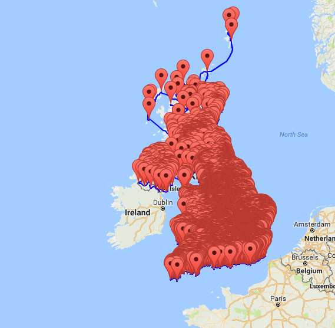

import { Blockquote, Amazon, Vocabulary } from '../../../../src/components/blog'

いよいよ So This is Christmas の最終チャプターですね。  
この本自体がおまけのような作品なので、ちょっとストーリーが都合よく行き過ぎ感は否めませんが、純粋に二人が幸せなら私も幸せです。

では、さっそく、始めましょう！

**※日本語翻訳版は読んでいないので、各英文の翻訳部分は私の意訳です。間違ってたら教えてください！**

## 大酒飲みなアイルランド人

<Blockquote srcName="So This is Christmas (The Adrien English Mysteries Book 6)" srcURL="https://amzn.to/2OzE8fN" book>
“Of course I want you there. But…we’re Irish. We get drunk and say stupid things. I can’t guarantee that someone there tonight won’t say something stupid.” It was tempting to answer, “I’m English. We stay <strong>sober</strong>, <strong>kick ass</strong>, and <strong>enslave</strong> your lot for eight hundred years.”
</Blockquote>

（「もちろん、来てほしいさ。でも…、俺の家族はアイルランド人だ。酔っぱらってバカなことを言う生き物なんだよ。俺は今夜、誰かがバカなことを言わないとは約束できない。」「僕はイングランド人だ。僕らはアイルランド人を素面で叩きのめして、800年間奴隷にしてきたんだよ。」と、返したくなる誘惑にかられた。）

<Vocabulary en="sober" ja="酔っていない、しらふの" />

<Vocabulary en="kick ass" ja="負かす、やっつける" />

<Vocabulary en="enslave" ja="奴隷にする" />

アイルランド人に限らず、イギリス人は酒飲みなイメージがありますが、以前、redditにアップロードされた、UK内のパブに印をつけたマップが印象的でした。  
この赤い印、全部パブなんですよ。真っ赤。

_Source : [Map of every pub in the UK. : europe](https://www.reddit.com/r/europe/comments/8esrzt/map_of_every_pub_in_the_uk/)_

どれだけパブ必要なのよって。

## 本名ジェームズだったのね

<Blockquote srcName="So This is Christmas (The Adrien English Mysteries Book 6)" srcURL="https://amzn.to/2OzE8fN" book>
He looked slightly taken <strong>aback</strong>. “James?” He shoved open the screen door. “Come in. Come in.” “Happy New Year.” Jake handed over a bottle of Laphroaig. “This is Adrien. Adrien, this is my <strong>old man</strong>.”
</Blockquote>

（彼は少しだけ驚いたようだった。「ジェームズ？」彼はスクリーンドアを押し開けた。「入れ、入れ。」「ハッピーニューイヤー。」ジェイクはラフロイグのボトルを渡した。「彼はアドリアン。アドリアン、これが俺の父親だ。」）

### aback

後方へ

### old man

父親

ジェイクの本名は「ジェームズ」だったんですね。  
彼のように常にニックネームを使っている場合、オフィシャルな書類以外は基本的に全てニックネーム表記するから、本名が何なのかは尋ねない限り分かりません。  
会社のメールや名刺、自己紹介もニックネームだし。

特に彼のような「ジェームズ」や、「ロバート」「エリザベス」「デイヴィッド」みたいな王族っぽい名前を持っている人は、本名だと固すぎるからニックネームを好むみたい。  
確かに日本人でも「信長」とかだと名前負けしちゃいますよね。

ただ逆に、親がもう最初から「ジェイク」と名付ける場合もあるので、本当に尋ねない限り分からない。

そして、ジェイクのお父さんの名前も同じ「ジェームズ」。  
私、この名前を受け継ぐ文化は結構好きなんですよね。  
なんだか素敵だなぁと思っていて。  
考える手間が省けそうっていうのもあるんですが。

## 書籍紹介

### 原書

<Amazon
  asin="B007ZRH38I"
  title="Fatal Shadows (The Adrien English Mysteries Book 1)"
  linkId="bd33facb93fd9be921ae4a1b8a37ebd9"
  author="Josh Lanyon"
/>

### 日本語翻訳版

<Amazon
  asin="B00KW25SO4"
  title="アドリアン･イングリッシュ（１）天使の影"
  linkId="492d12015b0bab90543171c3968d30df"
  author="ジョシュ･ラニヨン"
  KindleUnlimited
/>