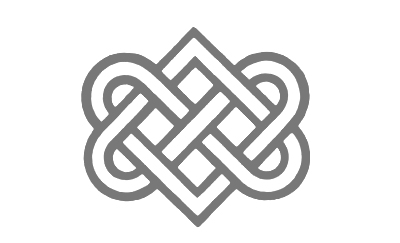

import { Blockquote, Amazon, Vocabulary, SoThisIsChristmasIndex } from '../../../../src/components/blog'

この巻で一番盛り上がったのではないかと思う、二人のリバシーンのあるチャプター7。

私は人生、何事も経験で、楽しみは多い方がいいと思う方なので、リバ大歓迎なんですが、先日Twitterでリバに関するアンケートが流れてきて、意外とリバ苦手な方も多いことに驚きました。

では、さっそく、始めましょう！

<SoThisIsChristmasIndex />

**※日本語翻訳版は読んでいないので、各英文の翻訳部分は私の意訳です。間違ってたら教えてください！**

## アドリアンの誘い文句

<Blockquote srcBook="soThisIsChristmas" lang="en" book>
I wanted to fix it for him, and <a href="/vocabulary/since/">since</a> I couldn’t, I wanted to comfort him any way I could. I lifted my face to his and said, “Are you still hungry? Because I don’t know about you, but right now I need more than Tom Yum Goong soup inside me…”
</Blockquote>

（僕はこの問題を解決してあげたいけど、出来ないから、僕が出来る限りの方法で元気づけてあげたい。僕は顔を上げ尋ねた。「まだお腹すいてる？君はどうか分からないけど、僕は今、トムヤムクンスープより熱いのが欲しいんだ」）

熱々で辛いトムヤムクンスープ。Hot にも Spicy にも「セクシー」という意味があるので、ね。

<Vocabulary en="since" ja="だから、なので" />

because と同じように理由を説明する時に使われますが、because とはちょっとだけニュアンスが違います。私は留学するまで since のこの用法は知らなかったのですが、日常会話で頻出です。

since と because との違いは、後に続く情報を相手が知っているかどうか。

- since　　  →　相手も知っている情報だけど、理由として念のため伝えておくね
- because　→　相手は知らない情報なので、理由を教えますね

つまりジェイクの家族の問題をどうにかしたいけども、アドリアンにはそれが出来ないのは周知の事実だから、ここではsinceを使っていますね。むしろ、家族にとっての問題はアドリアンだったりするので…。

こういうちょっと遠回しなSEXへの誘い方は素敵だし、アドリアンらしいなと思います。

[アドリアン･イングリッシュ（2）死者の囁き](/mm-romance/a-dangerous-thing/) で2人が初めてSEXした時、ジェイクの誘いが「Do you wanna fack?」で、アドリアンの返事が「Sure.」だったので、「え？そんな感じなの？ロマンチックなシチュエーションじゃないの？」と衝撃を受けました。  
まぁ、今考えると、あの時のジェイクはまだ「男同士でのロマンスは受け入れられない」状態だったので、しょうがなかったのかな。

だがしかし、こういうSEXへの誘い方は、割と高い英語力が必要だと思うんですよ！

3年ほど前、今よりもっと英語力が低い時は、なるべくシンプルな単語で、ストレートにものを言ってもらわないと理解できない状態でして。  
当時、パートナーにそれっぽい誘い文句を言われていたようなんですが、聞き取れず、というか意味が理解できず、「え？何？ごめん、もう1回言って？」となっていて、今思うと「ごめん」って感じになります。

## たとえ話にいちいち反論するのが彼らしい

<Blockquote srcBook="soThisIsChristmas" lang="en" book>
“Come on, baby. I know you haven’t <a href="/vocabulary/always/">always</a> played <a href="/vocabulary/catcher/">catcher</a>.” No. Not <a href="/vocabulary/always/">always</a>. But then I hadn’t exactly thought of what I did in terms of sports metaphors either. If I had, it would have been something like men’s singles tennis champ or extreme ping-pong player.
</Blockquote>

（「なぁ、ベイビー、君だっていつもキャッチャーじゃないんだろ？」うん、いつもじゃない。でも、その行為をスポーツに例えたこともない。僕がもし例えるなら、男子シングルテニスのチャンピオンか、ものすごい卓球選手とか、そういうのにするんじゃないかな。）

ごめん、キャッチャーは分かるとしても、それ以外の例えがすぐにピンと来なかった。

推測するに、今までのアドリアンのSEX経験はチームスポーツじゃなくて、1人でプレイしていたようなもの。つまり、ひとりで気持ちよくなっていた、あまり相手と楽しんでいなかった、相手との結びつきを感じていなかった、って感じかな？

## どう訳せと…

<Blockquote srcBook="soThisIsChristmas" lang="en" book>
Delicately, I brushed a fingertip against the hot, tight—and <a href="/vocabulary/clench/">clenching</a> tighter—entrance to his anus. The nexus? A Celtic knot.
</Blockquote>

（その熱く固い、―さらに固く締まっている―アナルの入り口、僕たちの絆、ケルトの結び目に、指先でそっと触れた。）

どう訳したらいいんでしょうか…。英語だとまだ韻を踏んでいたりするんですが。

<Vocabulary en="nexus" ja="関係、つながり" />

人と人との「関係」や「つながり」という意味。  
つまり「彼らの固く結ばれた関係」と「ジェイクの固く結ばれたアナル」の対比？  
私は真面目に何を言っているんだろう、という気持ちになってきました。

<Vocabulary en="Celtic knot" ja="ケルトの結び目模様、シンボル" />

_Source : [Celtic Knot Meaning - Types of Celtic Knot](https://www.celtic-weddingrings.com/celtic-knot-meaning)_

ジェイクがアイリッシュだからというのもあるんだと思いますが、この結び目模様はケルト文化でかなり昔から装飾に使われている模様なんだそうです。

私は全然アクセサリー等に興味が無いので知らなかったんですが、今でも結婚指輪に使われるモチーフらしい。  
「Celtic Knot」にもいろいろバリエーションがあるんですが、上の画像はその内の1つである「Celtic Love Knot」と言い、 **永遠の愛の証** なんだとか。なるほど。

まさかアナルひとつで、これほど、それぞれの文言にどのような意図があるのかを調べまわることになるとは思いませんでした。

## 新しい単語を続々と覚えられますね

<Blockquote srcBook="soThisIsChristmas" lang="en" book>
“Yeah, that’s it,” he muttered as I sought delicately, experimentally for the nub of his <a href="/vocabulary/prostate/">prostate</a>.
</Blockquote>

(そっと前立腺の突起を探ってみると、彼が「そう、そこだ」と漏らした。)

<Vocabulary en="nub" ja="こぶ、突起、核心、俗語でクリトリス" />

<Vocabulary en="prostate" ja="前立腺" />

That's it って、いろいろと使い方があるんですが、

- これで終わりです、以上です（レストランの注文の時とか）
- それそれ！それだよ！その通り！（探していたのはそれだ！）
- それだけだ（前途したことを強調）

今回の場合は、ちょうど気持ちいいポイントを探り当てて「そこだ！」って感じですね。

<Blockquote srcBook="soThisIsChristmas" lang="en" book>
He tensed. And I didn’t blame him. The age old question: how the hell was Tab A ever going to fit inside Slot B? And yet it did. It would. I was living proof of that.
</Blockquote>

（彼は体を強張らせた。無理もない。昔からある疑問だ。一体どうやってタブAがスロットBの中に収まるっていうんだ？でも、収まるんだ、もちろんジェイクにも。僕が生き証人なんだから。）

ちょっとこの living proof の部分は読んだ時に、少しクスっと笑ってしまいました。

<Vocabulary en="Tab A, Slot B" ja="SEXの婉曲表現" />

日本語でもネジやコネクタなど、オスメスって言いますよね。そういうところは、万国共通なんだなぁ。

<Vocabulary en="yet" ja="けれども、それにもかかわらず" />

普段は「Not yet.」みたいに、「まだ」という意味で使うことが多いのですが、この場合は接続詞「けれども」の意味で使われてます。

## なぜ日本語では裏表なのか？

<Blockquote srcBook="soThisIsChristmas" lang="en" book>
All that overwhelming physical sensation—his body clasped mine so tightly that every fractional movement sent jolts of exquisite sensation flashing up and down my spine—but it was also the mind fuck of it. Of this reversal. Which would ordinarily not be a big deal, but because it was Jake…was a very big deal.
</Blockquote>

（圧倒的な肉体への刺激、―彼の体は僕をとてもきつく締めつけ、少しの動きですら強烈な刺激となって背骨に走り―、それと同時に衝撃的な出来事だった。このリバという行為が。それは一般的に言うと、大したことじゃないんだけど、でも、あのジェイクとのリバは、とても大きな問題だ。）

毎回思うんですが、こういったシーンは知らない単語が多くて、辞書が欠かせないんですよね。でも、雰囲気からセクシーで重要なシーンだとは分かるので、読み飛ばしたくはない。

<Vocabulary en="exquisite" ja="鋭い、強烈な、激しい" />

<Vocabulary en="spine" ja="脊椎、背骨" />

<Vocabulary en="reversal" ja="逆転" />

日本語で言う「リバ」って、何で「リバーシブル（裏表）」になっちゃったんでしょうね？裏と表って。裏と表なのか？

## ジェイクの可愛らしい「初めて」発言

<Blockquote srcBook="soThisIsChristmas" lang="en" book>
He looked at me, and his face appeared…younger, happy, moved. “Another first,” he said.
</Blockquote>

（僕を見る彼の顔は、若く、幸せで、感動しているように見えた。「また別の初めてだな」と彼が言った。）

いつも少しだけ乙女チックなことを言うのはジェイクの方だよな、と。  
まぁ、ジェンダーロールうんぬんの話をすると、「乙女チック」なんて言葉を使うべきではないのかもしれませんが。  
その歳で「初めての経験」が残っててよかったね、うん。

## この本の中で私が一番好きなライン

<Blockquote srcBook="soThisIsChristmas" lang="en" book>
“Baby.” His eyes glittered, and he put his face to mine. Not kissing me, just resting his face against mine, breathing with me. I could feel the flicker of his eyelashes and the heat beneath, the unsteadiness of his lips. He didn’t say anything. But somehow his silence said it all.
</Blockquote>

（「ベイビー」彼は目を潤ませ、そして額を合わせた。キスはせず、ただ、顔をくっつけて、一緒に呼吸をする。彼のまつ毛の揺れ、その下の熱、震える唇を感じた。彼は何も言わなかったけど、ただ何となく、この沈黙が全てを物語っているようだった。）

この最後のシーン大好きです！  
ジェイクの喜びと幸せがしっとりと表現されていて、私までちょっとウルっとなってしまいました。

今回は、どの部分をピックアップするか悩みましたし、長くなってしまいましたが、楽しく学んで頂けたら幸いです。

## 書籍紹介

<Amazon book="soThisIsChristmas" />

<SoThisIsChristmasIndex open />
