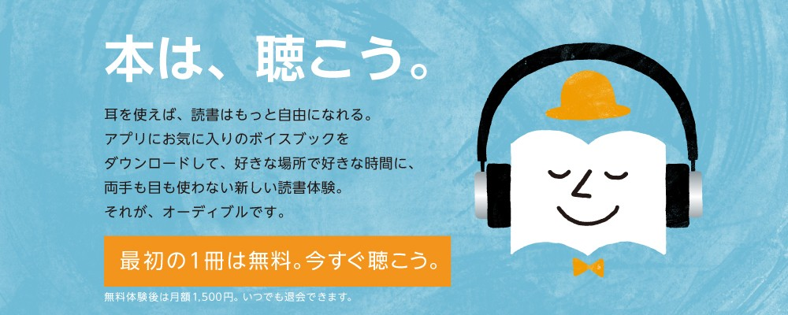

import { Amazon, Button } from '../../../../src/components/blog'

[先日の記事](/english/so-this-is-christmas-5/) でオーディオブックについてチラッと触れたんですが、チラッとではオーディオブックが好きすぎる私の気持ちが収まらないので、もっと詳しく語ろうと思います！

最近、M/Mロマンス小説（海外版のBL小説）を読むのにハマっているのですが、一度読んだ作品のオーディオブック（本の朗読）を聴くと、また違った味わいがありまして、すっかりオーディオブックの魅力に憑りつかれてしまいました。

また、私は小説を読むのは好きですが、ビジネス書や自己啓発系の本は、読み始めてもすぐに飽きてしまうことが多いんです。  
そんな時、オーディオブックなら一方的に情報を耳に流し込んでくれるので、止まることなく聞き続けられ、気になった部分だけを拾い上げることができて便利です。

今日はそんなオーディオブックの魅力と、オーディオブックを提供しているサービス、 [Audible(オーディブル)](https://www.amazon.co.jp/b/ref=adbl_JP_as_0068?ie=UTF8&node=5816607051&tag=ayutak04-22) についてご紹介します。

## セクシーボイスにのたうち回る

この記事で何が一番言いたいかというと、これに尽きるんですが。

ナレーターの方々は、朗読するのが上手いのは言うまでもないんですが、M/Mロマンス小説のナレーターは、物凄くセクシーな声の方が多いです。  
耳元で囁かれると悶絶ものです。

私が今お気に入りなのは、 [Kale Williams(@kalewilliamsvo)](https://twitter.com/kalewilliamsvo) さん。  
[アドリアン・イングリッシュシリーズ(6)『So This Is Christmas』](https://amzn.to/35l2OxK) を聴いて恋に落ち、 [The Art of Murder](https://amzn.to/2KHAsG6) シリーズも続けて聴きましたが、もう素敵ボイス過ぎて思わず叫びたくなるシーンが多くてですね。  
**もう、私の預貯金通帳を送り付けたくなる勢いで好き。**

BLドラマCDは全然興味が無くて聴いていなかったのですが、そういうコンテンツが人気なのも理解できました。

## 英語学習に最適

英語が第二言語の場合、洋書を読みながら頭の中で再生される音は、結局自分の英語レベルの音なので、へっぽこなんですよね。表現力が乏しい。  
キャラクターの細かい感情の変化や強弱を読み取れていなかったり、英語はイントネーションの上下が重要な言語なのに、フラットに読んでしまっていたり。

そこで、本を読んだ後にオーディオブックを聴いてみると、新たな発見が多く、より一層本を楽しむことが出来る上、発音やイントネーションを知ることも出来ます。

そして、オーディオブックを聴いた後に、もう一度本を読むと、今度は音だけでは聞き逃していた、知らない単語やフレーズを目で確認して覚えることが出来ますし、脳内再生される音もオーディオブックの音で再生されるようになります。  
そうやって何度も何度も脳内再生させていると、目と耳両方から記憶に定着していきます。

また、逆に **洋書に挑戦するも挫折してしまう人にこそ、オーディオブックはおススメ** です。  
オーディオブックで最後まで聴き、全てを理解しなくてもいいので全体像を掴んでから、改めて洋書を読み始めると、止まらずに読み進められますよ。

## 忙しい人にもハンズフリーで最適

オーディオブックは手でページをめくる必要も、目で文字を追う必要もないので、何かをしながら聴くのに最適です。  
以下、私がオーディオブックを聴くタイミングをご紹介。

### 通勤/通学中に

会社まで歩いて30分ほどなので、毎日の通勤で聴いています。

### 家事をしながら

掃除や料理など、家事をするときは必ずオーディオブックを聴きながらやります。  
そもそも家事が好きではないのですが、「はやくオーディオブックの続きを聴きたい！」という思いから、積極的に家事をしたくなります。

### 運動をしながら

家でヨガポーズをとりながら聴いています。  
ジムのランニングマシンで走りながら、または外でウォーキングしながら聴く人も多いようですね。

### おやすみ前に

寝る前はなるべくリラックスしたいので、ベッドに横になってオーディオブックを聴いています。  
お気に入りのナレーターの声に癒されながら眠りに落ちるのは至極です。

<Button url="https://www.amazon.co.jp/b/ref=adbl_JP_as_0068?ie=UTF8&amp;node=5816607051&amp;tag=ayutak04-22" label="30日間無料で試してみる" />

## Audible(オーディブル)とは？

_Source : [Audible(オーディブル)](https://www.amazon.co.jp/b/ref=adbl_JP_as_0068?ie=UTF8&node=5816607051&tag=ayutak04-22)_

オーディオブックを聴けるサービスは、他にもいくつかあるんですが、私は普段から Amazon Kindle のお世話になりっぱなしなので、自然とAudible(オーディブル)に登録しました。

大前提として、Audible(オーディブル)は普通のAmazonでのお買い物のように、Audible会員にならなくても、1タイトルずつクレジットカードで直接購入することができます。  
しかし、もしオーディオブックに興味があるなら、Audible会員になった方が断然お得なので、どうお得なのかをご紹介していきます。

**※以下は2018年12月時点の情報です。**

## Audible(オーディブル)のシステム

Amazonアカウントを使って簡単に登録できるんですが、システムがちょっと分かりづらいので詳しく解説していきますね。

_Source : [Audible(オーディブル)](https://www.amazon.co.jp/b/ref=adbl_JP_as_0068?ie=UTF8&node=5816607051&tag=ayutak04-22)_

### 30日間の無料体験

登録して **最初の30日間だけ無料** で試すことができます。  
30日後に1,500円が課金されますので、退会したい方は30日が過ぎる前に、忘れずに退会しましょう。

※古いブログなどで「Amazonプライム会員だと3ヶ月無料」キャンペーンが紹介されていますが、2017年10月でキャンペーンは終了し、現在はプライム会員であろうとなかろうと「30日間のみ無料」で利用できます。

### コイン制

1ヶ月毎に1コインがもらえます。  
1コインを使って好きなタイトルを1本購入できます。  
毎月1,500円払って1コイン買っているイメージですね。

※利用しなかったコインは自動的に翌月に繰り越しますが、コインは6か月で失効しますのでご注意ください。

### 30%オフ

コインを使わずに、直接クレジットカード決済で購入する際、定価の30%オフで購入できます。

**ここで注意**

Audible(オーディブル)のタイトルにはそれぞれ定価があり、その値段はまちまちです。  
例えば、このシャーロック・ホームズの定価は **10,500円** もしますが、

<Amazon
  asin="B07DNNPTML"
  title="Sherlock Holmes: The Definitive Collection"
  linkId="40d9099f21e67caa3038c3aefaade949"
  author="Arthur Conan Doyle"
/>

この人間椅子の定価は **600円** です。

<Amazon
  asin="B0109SX8CO"
  title="人間椅子"
  linkId="0fef7de838a27b6ec25a7b530b1f9123"
  author="江戸川乱歩"
/>

先ほども言いましたが、会員だと定価から30%オフで購入できるので、タイトルによってはコインで買うよりも、直接クレジットカードで購入した方がお得な場合もあります。

### いつでも返品可能

購入したタイトルは、1年以内であればいつでも返品ができます。  
コインで買ったタイトルは、すぐに1コインが戻ってきます。  
クレジットカードで直接買ったタイトルは、そのクレジットカードに返金されますが、返金までに数日かかることがあります。

ヘルプに返品期限は「1年以内」となっていて、WEBサイト上からは返品できなくなってるんですが、1年以上前に買ったタイトルをメールで返品依頼したところ、対応してもらえました。  

[Audibleヘルプ：会員の返品特典について](https://audible-jp.custhelp.com/app/answers/detail/a_id/9593/kw/%E8%BF%94%E5%93%81)

※返品可能な回数は無制限ではないようですが、問い合わせてもハッキリとした返答がありませんでした。

### 退会しても手元に残る

ストリーミング配信サービスと違い、Audible(オーディブル)は買い切り制なので、退会後もコインで購入したタイトル、クレジットカードで直接購入したタイトル、どちらも手元に残ります。

ただし、未使用のコインを保持したまま退会すると、コインは消滅しますのでご注意ください。

### 休会できる

一時的に忙しくなったり、長期出張などがあってオーディオブックが聴けない場合は、休会することが出来ます。  
1年に1度、3ヶ月まで休会できます。  

[Audibleヘルプ：休会はできますか？](https://audible-jp.custhelp.com/app/answers/detail/a_id/9594/kw/%E4%BC%91%E4%BC%9A)

<Button url="https://www.amazon.co.jp/b/ref=adbl_JP_as_0068?ie=UTF8&amp;node=5816607051&amp;tag=ayutak04-22" label="30日間無料で試してみる" />

## Audible(オーディブル)の料金は高い？

NetflixやSpotifyなどのストリーミング配信サービスを普段から利用している方にとっては、聴き放題でもないのに月額1,500円は高く感じるかもしれません。  
というか、私は感じてました。

しかし、コインで購入したタイトルは1年以内であればいつでも返品でき、1コインが戻ってくるので、またそのコインを使って別のタイトルを購入することが可能です。  
ですので、結果的には何度でも交換して、何タイトルでも好きなだけ聴くことができますので、ある意味「聴き放題」とも言えます。

何より、私が普段聴いているオーディオブックは1本7～10時間くらいのタイトルなんですが、1日で聴けるのは頑張っても2～3時間程度なので、1ヶ月でそんな大量に聴けるものでもありません。

## 会員プランのバリエーション

残念ながらAudible(オーディブル)で利用できるプランは **「1ヶ月1コイン1,500円」** のみです。

複数人で利用できるファミリープランや、もう少し安いプラン、または1ヶ月2コインもらえるようなプランはないのかと思い問い合わせてみたんですが、「検討中」とぼんやりした回答を頂きました。

アメリカ版(.com)には「2ヶ月毎に1コイン15ドルのシルバープラン」や、カナダ版(.ca)には「3か月間のみ1ヶ月1コインを半額の7.5ドルで利用できるプラン」など、安いプランもあったりするんでけどね。

## コインの追加購入

残念ながら、現時点でコインの追加購入はできませんので、1ヶ月に2タイトル以上を買い切りたい場合は、2タイトル目を直接クレジットカードで購入するしかありません。

公式には「3コインまとめてご購入いただける特典もご用意する予定です」とありました。  
コインの追加購入もアメリカ版(.com)やカナダ版(.ca)では可能なので、早く実装して欲しいですね。

[Audibleヘルプ：コインは追加で買えるのですか？](https://audible-jp.custhelp.com/app/answers/detail/a_id/9600)

## マーメイド・マーダーズ祭り

ちなみに私は現在、ジョシュ・ラニヨン氏のM/Mロマンス小説、マーメイド・マーダーズの日本語翻訳版が発売されたのを記念して、Audible(オーディブル)で3コインを追加購入し、1～3巻までオーディオブックをダウンロードして繰り返し聞き続けるという、「マーメイド・マーダーズ祭り」を1人で開催中です。

仕事が手につかない勢いで沼にハマっていますが、幸せでたまりません。

▼マーメイド・マーダーズのオーディオブック

<Amazon
  asin="B07DVCS2G7"
  title="The Mermaid Murders (The Art of Murder #1)"
  linkId="f9754ef5f55cf07cd13bab5a8977c48f"
  author="Josh Lanyon"
/>

 ▼日本語翻訳版の小説もぜひ

 <Amazon
  asin="B07L8WN6FL"
  title="マーメイド・マーダーズ (殺しのアート #1)"
  linkId="07cfbb3a9521433b9de000f5f0755346"
  author="ジョシュ・ラニヨン"
/>