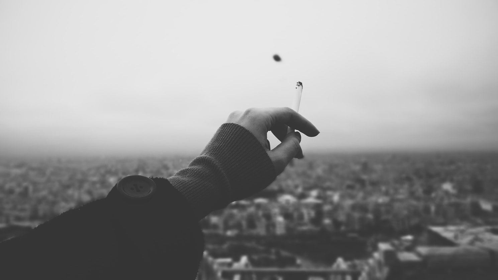

import { Amazon, Blockquote } from '../../../../src/components/blog'

言い訳するつもりはないんだけど、ここ半年ほどブログの更新が途絶えていた理由の1つに、自分のiPhoneから全てのソーシャルメディア系アプリ（TwitterやFacebook、Instagramなど）を削除したことが大きい。

というのも、ブログを始めるまでの数年間は、なるべく落ち着いた気持ちで日々過ごせるように、意識的に取り入れる情報を取捨選択するよう心掛けていました。

しかし、ブログを始めると同時にTwitterアカウントを新設すると、ブログ読者の皆様から頂けるコメントが嬉しかったり、気になるアカウントをフォローしては長時間フィードを眺めてしまったりと、見事にのめり込んで行ってしまいました。

もちろん、それがTwitterの楽しさではあるし、フォロワーの方々との交流は楽しいし、知らなかった情報もたくさん取得できたんだけど。

一方で、Twitter上には毎日怒っている人たちがいて、そのツイートがフィードに流れて来ては、私まで一緒になってイラ立ちを覚えたり（関係ないのに）。  
怒りって伝染しますよね。

また、いわゆる ”インフルエンサー” たちによるコスメや美容グッズ等の宣伝によって、何だか自分まで物欲を刺激されてしまったり（もともと物欲薄いのに）。

私の気持ちが赤の他人によって引っ掻き回されるのが不快になって、意識的に情報を遮断した半年でした。（その間にメッセージを送って下さった方々、本当にごめんなさい。）

そんなこんなですが、相変わらず洋書は読み続けていて、ちょうど先日、ジョージタウン大学でコンピュータサイエンスを教える、カル･ニューポート教授が書いた『[デジタルミニマリズム (Digital Minimalism)](https://amzn.to/2ATjOhA)』という本を読みました。

私にとってタイムリーで、且つ、非常に共感する内容。親も学校も教えてくれないけど、現代人には絶対に必要なスキルだと思うので、今日はこの本と私自身の経験について書きたいと思います。

<Amazon
  asin="B07DBRBP7G"
  title="Digital Minimalism: Choosing a Focused Life in a Noisy World"
  linkId="b58fbf797360a9b737f2309281b9a086"
  author="Cal Newport"
/>

~~日本語版は「現在在庫切れです」表示になってるけど、発売日が決まってないのかな？~~  
**追記：2019/10/3に早川書房さんから日本語翻訳版が出版されました！**

<Amazon
  asin="B07YG2PH4Q"
  title="デジタル･ミニマリスト: 本当に大切なことに集中する"
  linkId="6c24c972b38b5872175c0ffbf9e29f85"
  author="カル･ニューポート"
/>

## ざっくりあらすじ

この本は、カル･ニューポート教授が行った実験とその結果を元に、いかにデジタル情報（主にソーシャルメディア）が人々に悪影響を与えるのか。どうやってそれらのデジタル情報とうまく付き合っていくのか。さらに、「いいね」をもらうこと（注目を集めること）が石油よりも価値があるとさえ思える歪な現代社会について書かれています。

その中で、 **「デジタルミニマリズム」** という考え方が紹介されていました。この本の中でいう「デジタルミニマリズム」とは、現代の休みなく降ってくるニュースや写真、動画などのデジタル情報から離れて、もっと日々の生活に満足感ややりがいを感じるにはどうしたらいいかを考え実践することを指します。

## 教授の実験

まず、教授が行った実験というのは、1,600人のボランティアを対象に、教授が作ったガイドラインに沿って、1ヶ月間デジタル情報から離れて生活してもらい、実験の前と後ではどう心境が変化したかのフィードバックを集めました。

実験前にはソーシャルメディアから離れることで、友人と疎遠になったり、世間の情報から取り残されそうな不安を感じている被験者が多くいました。

しかし、１か月後、実際にデジタル情報から離れて生活してみたところ、とある男性は、（オンラインではなくリアルでの）友達との繋がりに価値を感じ、さらに、ワークアウトや読書、ボランティア、楽器の練習にもっと時間が取れるようになったと語っています。

## ソーシャルメディアはタバコの様な依存性がある

_Photo by [Hesam Sameni](https://unsplash.com/@hesamsameni?utm_source=unsplash&amp;utm_medium=referral&amp;utm_content=creditCopyText) on [Unsplash](https://unsplash.com/search/photos/cigarette?utm_source=unsplash&amp;utm_medium=referral&amp;utm_content=creditCopyText)_

### 企業の掌で転がされてる感

そもそもソーシャルメディアというものは、中毒になるようデザインされている、と。

何と言うか、私もそういった広告/テック業界にいるので、非常に分かります。  
どうやって頻繁にサイトに訪れる、もしくはアプリを開くようにするか、  
どうやって気を引くき、中毒状態にするか、  
ひたすら戦略を練る日々です。

そんな企業の戦略にまんまと踊らされて中毒状態になるのは、何だか癪ですよね笑。

### 何でそれが必要なの？

私は以前、タバコも吸っていて、今は止めてるから思うんですけど。私の場合、当時タバコを吸っていた理由は2つありました。

- 長時間仕事をしている時の、唯一の休憩時間だった
- 仕事や恋愛等でイラついた時にクールダウンするため

ということで、そもそもタバコが好きな訳ではなく、吸う原因は別のところにあり、日本を離れたことで長時間働かなくなったし、長期で付き合っている恋人ができたので、メンタルが安定し、単純にタバコが必要なくなりました。

もし、ソーシャルメディアが手放せない人がいても、原因は他にあるかもしれません。寂しさを感じているとか、自分に自信がないとか、暇を持て余しているとか。

※中毒性のあるものの例としてタバコが出ていますが、私は闇雲に「タバコは体に悪いやめましょう！」なんて言う気はありません。タバコの味や、吸っている時間、喫煙所コミュニティが好きで好きでしょうがない！って人を止めようとは思いません。

なので、ソーシャルメディアに関しても、他人の（作られた）私生活を眺めるのが好きで好きで堪らない！って人は、もちろん好きなだけ使ってもらって構わないと思います。

### コンマリに学ぶミニマリズム

_Source : [KonMari ～人生がときめく片づけの魔法～ | Netflix (ネットフリックス) 公式サイト](https://www.netflix.com/jp/title/80209379)_

気が付いたら KonMari が北米でやたら人気になっていて、「KonMari」が英語の動詞として使われてるのがちょっと面白いんだけど笑。  
例えば、How to KonMari your Twitter followers. みたいに。

話がズレました。

[KonMari ～人生がときめく片づけの魔法～ | Netflix (ネットフリックス) 公式サイト](https://www.netflix.com/jp/title/80209379)

### Less Can Be More

「ミニマリズム」 という言葉はもう割と浸透してると思うんだけど、日本ではいかにも意識高い人たちがオシャレ感覚でやってるイメージや、やたら圧強めで捨てろ捨てろ言うイメージがあったりして、苦手な人も多いんじゃないか、という気がします。

ミニマリズムの理念って、単に自分を幸せにするには、何が必要で何が不必要なのか明確にするってだけだと思うんですけどね。その基準は人それぞれですし。

### 半強制的な必要最低限生活

私自身、カナダに留学してから3年ほど、必要最低限な物だけで生活をしていた時期があります。その経験を踏まえて、「ミニマリズム」について少しだけ。

カナダに降り立った日、持ち物は大きなキャリーバッグ1つだけでした。中身はもちろん生活に必要な厳選した物たち。その後、家具付きの家に住み続けたので、家具を買うこともなく、さらに、1年に1回は引っ越しをしていたので、引っ越しの度に不要なものを処分し、常にキャリーバッグ1つに収まる程度しか物を持たないのは、非常に身軽でした。  
**当時は大好きなマンガすら一切読んでいなかったほど！**

そんな身軽な生活も気に入ってはいたものの、やっぱりその生活は「必要最低限」でしかなく、「満たされる」ものではなかったんですよね。

例えば、ダイニングテーブルの上に飾ってある生花は、生きる上で必要ではないですが、毎日仕事から帰ってきてそれを眺めながら取る夕食は癒されますよね。

また、家具付きの家だと、シーツや布団カバーなんかも提供されるんですが、基本的に質が悪いし、洗ってはありますが既に他人が使った後なので少々気持ちが悪い。シーツはやっぱり自分専用がいいし、肌触りのいいエジプトコットンに包まれると、気持ちよく眠れます。

私にとって生花も新しいシーツも、「生きる」ためには必要ないけど、「満足」するためには必要なものでした。

そんな感じで、「生きる」ために必要な物だけの状態から、自分が「満足」するために必要な物をひとつひとつ選び、追加していきました。それにより、日本にいた頃に比べると格段に家の中の物は少ないのに、心地よく暮らせています。

前置きが長くなりましたが、つまりデジタル情報に関しても同じことが言えるのではないかと。

日々、容赦なく降りかかってくるデジタル情報の中から、暮らしが豊かになると思う情報だけをピックアップすればいい。一度、全ての情報を遮断してみると、やっぱり欲しいと思えることが明確になります。

### アーミッシュに学ぶミニマリズム

_Photo by [Clark Young](https://unsplash.com/@cbyoung?utm_source=unsplash&amp;utm_medium=referral&amp;utm_content=creditCopyText) on [Unsplash](https://unsplash.com/search/photos/amish?utm_source=unsplash&amp;utm_medium=referral&amp;utm_content=creditCopyText)_

アーミッシュって日本人にはあまり馴染みがないかもしれないんですが。かくいう私もカナダに来るまで存在自体を知りませんでした。

<Blockquote srcName="Wikipedia" srcURL="https://ja.wikipedia.org/wiki/%E3%82%A2%E3%83%BC%E3%83%9F%E3%83%83%E3%82%B7%E3%83%A5">
アーミッシュ（英語: Amish、ドイツ語: Amische）は、アメリカ合衆国のオハイオ州･ペンシルベニア州･中西部などやカナダ･オンタリオ州などに居住するドイツ系移民（ペンシルベニア･ダッチも含まれる）の宗教集団である。  
移民当時の生活様式を保持し、農耕や牧畜によって自給自足生活をしていることで知られる。原郷はスイス、アルザス、シュワーベンなど。人口は20万人以上いるとされている。
</Blockquote>

誤解されがちですが、彼らは近代技術を嫌ったり否定したりはしていません。

新しいテクノロジーを取り入れるかどうかは、その都度、本当に必要かどうかをしっかり考え、試した上で、取り入れた方が幸せになる場合だけ取り入れているそうです。

このアーミッシュの考え方は、同じようにデジタルにも応用できると思います。

ここで重要なのは、取り入れるかどうかの判断基準は「自分」だということ。他人から見た価値は気にしなくていい。自分が幸せになるものだけを取り入れる。

そう考えると、ソーシャルメディアってその真逆を行ってますよね。みんなから「いいね」される物を手に入れるって感じで。みんなって誰だよって感じです。

ちなみに、アーミッシュと言えばこのマンガですね。

<Amazon
  asin="B07DF8JFJT"
  title="ラムスプリンガの情景"
  linkId="1f06157fa9d56745f8fe107c6214f560"
  author="吾妻香夜"
/>

この流れでBL本を挙げるのもどうかと思いますが、大好きなお話です笑。

## これからのデジタル情報との付き合い方

ソーシャルメディアに浸かるほど寂しさを感じるという研究結果も紹介してありました。何だか本末転倒ですよね。

[Social Media Use and Perceived Social Isolation Among Young Adults in the U.S. | American Journal of Preventive Medicine](https://www.ajpmonline.org/article/S0749-3797(17)30016-8/fulltext)

もちろん、ソーシャルメディア自体が悪だとは一切思いません。私で言うと、Twitterが無くなると誰ともM/Mロマンスの話が出来なくなりますし笑。

デジタル情報自体は非常に便利ですし、有益な情報もたくさんあります。単に必要と不必要に分けるのではなく、どの程度取得して、どの程度無視するのか。自分にとってのちょうどいいラインを見つけるのが大切だなぁと思います。

では、どのように付き合っていくのか。 本の中でいくつか例が紹介されていました。

- 毎日何時間もメッセージをやり取りするより、週に1度の電話、月に1度、実際に合っておしゃべりする方が、より家族や友人との繋がりを感じられる
- ソーシャルメディアでニュースを拾わず、Instapaperなどを利用し、厳選されたニュースのみを読む
- Twitterでフォローしている気になるアカウントは、だらだらとフィードを眺めず、週に1度、パソコンからその人のページを開いて、アップデートされている情報だけを確認する

などなど。

私もまだまだ模索中ですが、参考になったでしょうか？

## 学校教育もそろそろ変えていくべき

余談ですが、本屋さんに行くといつも「ベストセラー」として並んでいたので、何となく手に取った本、イスラエルの歴史学者、ユヴァル･ノア･ハラリの『[21 Lessons: 21世紀の人類のための21の思考](https://amzn.to/2oaSMzv)』にも、似たようなことが書いてありました。

21世紀の学校教育は、従来のように情報をどんどん子供たちに詰め込むのは止めるべきであり、どれほど膨大な量の情報が毎日休みなく自分たちに降りかかって来ているのかを理解して欲しい。

そして、子供たちは必要な情報とそうでない情報（自分に一切関係がない情報や、フェイクニュースなど）を区別できるようになる必要がある、と。

どんな情報でもスマホで簡単に手に入れられるように見えて、かえって自分にとって必要で、正しく、適切な量の情報だけを探すのは大変になりましたね。

まぁ、私が学校教育を受けたのは、もう15年以上前なので、今は少し変わって来ているんでしょうか？

<Amazon
  asin="B079WM7KLS"
  title="21 Lessons for the 21st Century"
  linkId="e23cd599173615453128b06ceaf312f2"
  author="Yuval Noah Harari"
/>

日本語翻訳版も2019/11/12に発売されるみたいです。

<Amazon
  asin="4309227880"
  title="21 Lessons: 21世紀の人類のための21の思考"
  linkId="3aeec306019d358a439a720cff40be2a"
  author="ユヴァル･ノア･ハラリ, 柴田裕之"
/>

## 関連リンク

カル･ニューポート教授のブログ。  
[Study Hacks - Decoding Patterns of Success - Cal Newport](https://www.calnewport.com/blog/)

教授の別の本。こちらの方が有名みたい。  
もっと仕事に特化した話っぽいですね、読んでみようかな。  
日本語翻訳版も出ています。

<Amazon
  asin="B00X7D8X8S"
  title="Deep Work: Rules for Focused Success in a Distracted World"
  linkId="a8c350f61564bc0e2a002f21636f9ade"
  author="Cal Newport"
/>

<Amazon
  asin="B01N4AT0ZD"
  title="大事なことに集中する"
  linkId="2168602de56772c25aa679020f872b97"
  author="カル･ニューポート"
/>