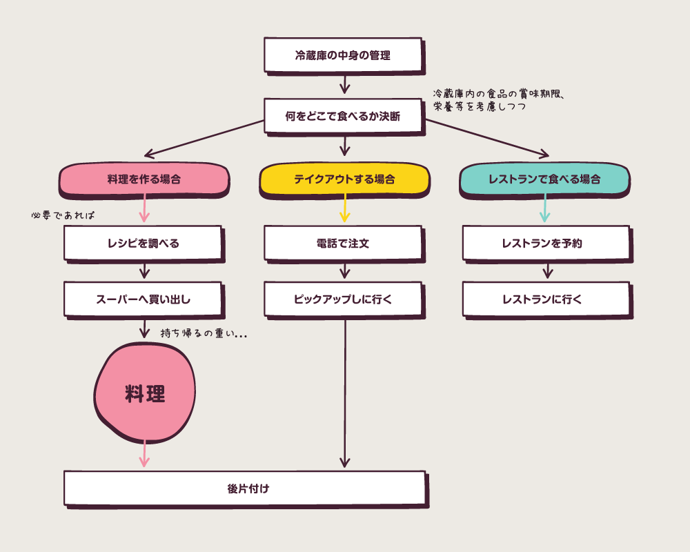
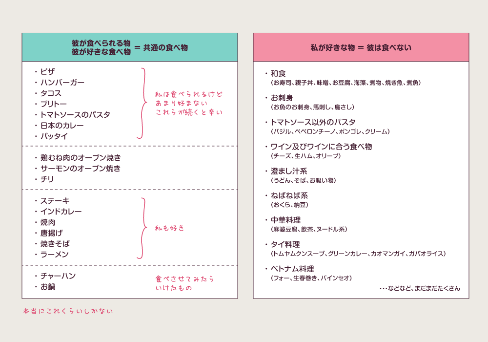

import { Amazon } from '../../../../src/components/blog'

先日、たまたまtwitterのフィードに流れてきた、 [元鈴木さん(@Motosuzukisan)](https://twitter.com/Motosuzukisan) という方の、夫婦間の家事分担についてのブログを読みました。

[「家事は誰のものか」と考えること／元鈴木さん | TOFUFU](https://tofufu.me/motosuzukisan_8/)

共感できるところも多く、また、丁度パートナーと共同生活を始めて1年が経ったタイミングだったのもあり、改めて、この1年で私たちカップルの家事事情がどう変わってきたのかを考えてみることにしました。

結論から言うと、1年前は私がイライラしてばかりで、だんだんと家に帰るのが億劫になっていたのに対し、最近ではとても平和で、むしろラブラブ度は増している気がします。

そこで今日は、数ある家事の中から『料理』について、私たちカップルの問題と改善例をご紹介します。

## 家事としての『料理』のタスクを細分化

一口に『料理』と言っても、家事の中で一番と言っていいほど、細かいタスクが組み合わさっています。まずはそれを見える化。

_家事としての『料理』タスクフロー_

## 私とパートナーの基本情報

付き合い始めて2年が過ぎたあたりで同棲開始しました。  
二人ともフルタイムで仕事中。  
どちらも家から徒歩30分くらいのオフィス勤務で、勤務時間もお互い8時間程度。  
子供はなし。

### ジーナ

料理は嫌いじゃないけど、特別に好きなわけではない。  
毎日外食してお金が減るストレスに比べれば、家で料理をした方がまし、くらい。  
何でも食べるが、やっぱりシンプル薄味の和食が好きな日本人。

### パートナー

1人暮らし歴は長いが、作れる料理はゆで卵くらい。  
冷蔵庫の中身の管理ができないので、腐ったものコレクションを作る。  
好き嫌いが多く、ピザとハンバーガーをこよなく愛するカナダ人。

## 『家事は女の仕事』という概念が根底にあった

そもそも、彼に強要されたわけでもないのに、自ら進んで家事を引き受けていました。そこには、私の根底に『家事は女の仕事』という概念があったように思います。

父親が家事を一切しない＋専業主婦でもないのに家事を全て請け負っていた母、という家庭で育ったので、知らず知らずのうちに、無駄に自分にプレッシャーをかけていたようです。

そのうち「何で私ばかりが…」という、八つ当たりとも言えるイライラが発生。

### 【現在】

そもそも彼は私に、家事をやってほしいなんて望んでいないことに気がつきました。  
そして、彼は家事をしないのではなく、私が何でも先にやってしまうので、彼が手を出す隙がなかったような気もします。

今は、キッチンが汚れていようと、冷蔵庫が空になっていようと、先回りして動くのはやめました。  
彼がしびれを切らして動き始めたら手伝うくらいのスタンスで丁度いい。

## 綺麗に保とうとし過ぎていた

引っ越したばかりのキッチンは綺麗ですよね。  
キッチンカウンターも、コンロもオーブンも綺麗で、それを維持しようと必死になって小まめに掃除していました。  
よく考えれば、我が家にお客さんは滅多に来ないのに…。

### 【現在】

まぁ、いいか…と、多少散らかっていても、汚れていても、放置するようになりました。

## 同棲を始めて張り切っていた

「彼に喜んでもらいたい♡」みたいな可愛らしい思いもあった気がします。

実際は、割と時間を使って料理を作ったとしても、彼は10分ぐらいで無言で食べ、「じゃ、お風呂入ってくるね～」と席を立たれてイラっとしたり、気合を入れた料理よりもドミノピザを渡しておいた方が喜ぶのを見て、もうそれでいいかな、と。

### 【現在】

彼を喜ばせたいなら、料理で張り切るよりも、自分がどうやったら毎日機嫌よく過ごせるかを考え、実践するよう心がけました。  
機嫌がよければ、彼とも仲良く過ごせるので、彼の喜びにもつながるのではないかと。

## 健康面を気にし過ぎていた

『食育』という文化がない北米。  
ピザ → ハンバーガー → タコス → ブリトー → トマトパスタ  
のローテーションを繰り返す彼を見ていて愕然！  
私が彼の健康を考えて、少しでも体にいい献立を考えないと！という謎の使命感を感じていました。

### 【現在】

個人差はあれ、添加物まみれのご飯を食べていた人でも80歳を余裕で超える時代なので、そこまで神経質にならなくてもいいんじゃないかと思い始めました。  
さらに、30年間で培った味覚を変えるのは難しいというのも悟り、まぁ、出来る範囲でやればいい、という方向にシフト。  
例えば、パスタを作った日にはサラダをつけたり、ハンバーガーやピザを家で作ったり。

## お小言が過ぎる彼

割と細かい自分ルールがたくさんある彼。  
同棲して最初の頃は、何かにつけて私の行動に口を出してきたので、毎日イライラMAXでした。

それは料理中にも及び、料理ができないくせに、いちいち口出ししてくる彼に嫌気がさして、「もう黙ってビデオゲームでもしとけよ！」と、ますます1人で料理も片付けもしていました。

### 【現在】

もちろん、私が料理をしていて、彼がビデオゲームをしていたら、それはそれでイラつくので途中で作戦変更。

ありがたいことに、彼も『手伝わずにビデオゲームするのはおかしい』くらいの常識は持っていたので、「僕のヘルプいる？」と必ず尋ねてきてくれました。  
（この際「ヘルプ」という単語に噛みつくのは置いておいて）

そして、なるべく手伝ってもらうようにしつつも、お小言が始まったら、  
「姑がいびってくるー怖いー！」  
「偉大なシェフのありがたいアドバイス痛み入りますー！」  
などと、なるべくジョークっぽく嫌味を飛ばし続けたら、いつの間にか何も言われなくなりました。

## 献立の内容

彼の食べ物の嗜好は、ピザとハンバーガーをこよなく愛する典型的な北米人です。  
嫌いな食べ物も多く、彼が食べられるメニュー数は、両手の指で数えられるほど。  
私が彼に合わせないと、同じ料理を一緒に食べることは出来ません。

しかし、何でも食べるし、いろいろな国の料理を食べるのが大好きな私にとって、彼に合わせた食事内容のルーティンは、だんだんとしんどくなってきました。

_好きな食べ物の違い_

### 【現在】

そもそも同じ料理を食べる必要は無いことに気が付きました。  
何となく『家族はみんな同じ食べ物を食べて共感すべき』と思い込んでいた私。

今では、食卓には一緒につくけど、それぞれ違う物を食べる日もあります。  
2人分全く別の料理を用意するのは手間なので、例えば自分のために1品余計に作ったりします。  
また、パスタだったら、私用にバジルソースを用意して、彼用のトマトソースは彼自身に用意してもらったり。  
それぞれ違う物を食べたとしても、仲が悪くなることはありません。  
それよりも、食べたくもない物を食べて、機嫌が悪くなる方がよっぽど問題です。

## 誰が献立を考える

仕事が終わる5時くらいに「今日何食べる？」と、ほぼ日課のように彼からテキスト(SMS)が入っていました。  
先ほども言いましたが、ジョークになるくらい食べられるメニュー数が少ない彼。  
私にとってその質問は「今日何食べる？（僕が食べれる範囲の中で君が考えてね）」だったので、もう頭を悩ますわけで。

そもそも、彼が食べれる物（ビザやタコス）は、私にとっての食べたくない物だったりするので、たいして食べたくもない物を提案し、買い出しし、料理するのは、なかなかに苦痛でした。

### 【現在】

献立を決めるのはBot（ボット）に任せてみました。  
これに関しては、別記事に詳しくまとめようと思うんですが、両手で数えるくらいしか献立の選択肢がないなら、もう私の頭で考える必要ないじゃないか！と。

また、想像以上に日々の小さな決断は、ストレスとして積み重なるので、なるべく避けたいんですよね。  
イチローのカレーや、ジョブズのタートルネックみたいなものですよ。

ということで、私の本職がWebデベロッパーなのもあり、Slackというビジネス用のチャットツールで使えるBotを開発しました。

彼がSlackで「今日何食べる？」とメッセージを送ってきたら、Botがあらかじめ用意しておいた選択肢の中からランダムに1つ選んだ献立を返信する、というだけの単純なもの。  
選択肢が少ないからこそ単純な仕組みで済みました。  
また、選択肢についてはGoogle Sheetsで管理し、私も彼も編集ができる状態にしておきました。

あとは、彼がSlackを使わず、直接口頭で、またはテキスト(SMS)で「今日何食べる？」と尋ねてきたら、「Botにきいて」と返事をすることに。  
これを繰り返しているうちに、「今日何食べる？」という無責任な質問をしてこなくなり、代わりに「今日はギリシャ料理のテイクアウトにする？」「今日は鳥と野菜のオーブン焼きはどう？」など、提案してくれるようになりました。

## 手料理にこだわっていた

これも彼から指示されていたわけでもないんですが、『テイクアウトや外食はなるべく控え、手料理を作るのが当たり前』だと思い込んでいました。

近くにレストランなんて無い田舎で育ったので、私にとって毎日母が手料理を作ることが当たり前だったからです。

### 【現在】

揚げ物や手間のかかる料理は、外食やテイクアウトで済ませ、家では簡単な料理だけをするようになりました。  
逆に、週末の時間がある時には、彼と一緒に手間のかかる料理を一緒に作ったりもします。  
また、金曜の夜や土日のブランチなど、デートと称して外食することも多いです。

## いつ後片付けをするのか

我が家は割と大きな食器洗い乾燥機があるので、後片付けといっても、それほどの大仕事ではないとはいえ、毎日一人でやっていればイライラは募ります。

料理を全て私が担当していた時、「私は準備したから、後片付けはお願いね～」と、彼に依頼すると、「OK、後でやるね～」と調子よく返事をするものの、彼の『後で』はいつまで経ってもやってこず、結局、次の日、私が仕事から帰ってきて料理を始める時、汚れた食器や調理器具が積み重なっているのを見つけ、イライラしながら後片付けをし、そしてやっと料理を作り始める、という日々でした。

また、私は汚れた食器等があるキッチンで料理をするのが、生理的に嫌いでした。

### 【現在】

最初に彼が料理のお手伝いを始めた時、彼に出来ることは「片付け」くらいだったので、まずは私が料理を作り、彼が片づける、というスタイルで始めました。  
そして、少しずつ彼が料理を覚えてきたので、彼に料理を任せて、私はその間に片づけを担当することも多くなりました。

うれしいことに、片付ける習慣が身についたのか、食時の後に私が何も言わなくても、率先して後片付けをしてくれるようになりました。

## 炭酸水争奪戦

私と彼はご飯の時、またそれ以外でもよく炭酸水を飲みます。  
我が家には普通の水を炭酸水にしてくれるマシンがあるので、常に1リットルの炭酸水が冷蔵庫に入っていました。

暗黙の了解で『飲み終わった人が次を作る』というルールだったのですが、まぁ、作るのは面倒くさいですよね。  
彼は小賢しいことに、ボトルの底に数滴だけ残して、ほぼ空のボトルを冷蔵庫に放置するようになり、私がお風呂上りに冷蔵庫を開けると、炭酸水が無くてキレる、私が炭酸水を作り、少し飲んで冷蔵庫に入れる、彼が飲んで数滴残してほぼ空のボトルをキープ、私がキレるという無限ループが起きていました。

### 【現在】

ボトルを分けました。  
私用のボトルと彼用のボトル。  
炭酸水の残量管理は自己責任でやってくれ、と。  
『緊急で相手のボトルの水が欲しい時は、承諾を得てから飲む』というルール。  
おかげで、冷蔵庫を開けて「キェー！」と怒ることがなくなりました。  
共有しない方がいいこともあります。

## 冷蔵庫のセクション分け

冷蔵庫内の管理が出来ない彼。  
食べ残し等を冷蔵庫に入れると、四次元ポケットだとでも思っているのか？と思うほど、その存在を忘れてしまうんです。  
そして、冷蔵庫内に腐った物コレクションが出来上がっていく。

一方、冷蔵庫内に腐った物があると、ものすごく不快に感じる私。早く捨てたい！  
しかし、捨てると今度は、食べ物を粗末にしている感に苛まれてイライラ…。

### 【現在】

しばらくは、私の方で全て管理していましたが、それでは成長しないので、彼専用セクションを作ることにしました。

前途の通り、私と彼は食べ物の嗜好が全く違うので、冷蔵庫の中身も「私のもの」「彼のもの」と分けられることに気が付きました。  
（共通のものは、私が管理すればいい）  
これで、責任の所在がはっきりしますよね。  
彼専用セクションは、私は一切触りません。

ただし、定期的に「これまだ食べれるの？」と声かけをしたり、もう食べれなさそうな物を発見したら、本人に捨てさせるようにしています。  
もちろん、私の「また食べ物を粗末にしたな…」という視線の中で。  
が、これに関してはまだまだ発展途上です。

## その他

### 毎日ご飯は一緒に食べない

週に3日くらいは仕事帰りにヨガに行くので、一緒にご飯を食べません。  
1～2日、一緒にご飯を食べない日があると、逆に「明日は一緒に食べたいね」という気分にさせてくれます。

また、ヨガの後は、私の好物（彼は嫌い）を一人で好きなだけ食べれるので、一緒に食べない日も別の意味で楽しみです。  
そして、彼自身も一人でご飯を食べる時は、彼の好物（私は嫌いじゃないけど好きでもない）ピザ等を食べるので、私が彼と一緒にピザ等を食べる頻度も減って、2倍ありがたい。

また、週に3日くらいしか家で料理をしなくなると、スーパーへの買い出しが、週に1回行けば事足りるようになりました。  
土日に近所のスーパーまで車で一緒に行けば、重い荷物を一人で運ぶ必要もないし、スーパーで一緒に献立も考えられるし、時間も節約できて、思わぬ収穫でした。

### 朝ご飯は用意しない

私もパートナーも朝食は取らない派なので、平日の朝ご飯は一切用意しません。  
またカナダでは、シリアルやパン、コーヒーやお茶、ミルクなどが無料で会社に用意してあることが多いので、朝ご飯しっかり派でない場合は、それらで充分です。  
その代わり、土日のブランチはよく一緒に用意して、ゆっくり食べることが多いです。

### レシピを共有

Botを作ったときに、2人のSlackアカウントを作ったので、食べ物全般のチャンネルを作り、そこにレシピを共有するようにしました。  
普段のやり取りはテキスト(SMS)ですが、Slackだとログが残るので、後から検索したり、重要な情報は保存しておいたり出来るので便利です。

彼は料理自体が嫌いなのではなく、単に知識と経験がないだけだったので、レシピを共有して一緒に料理をしているうちに、簡単な料理は担当して作ってくれるようになりました。  
また、レシピが分かるので、自主的にスーパーへ買い出しにも行ってくれるように。

最近では、レパートリーにない新しいレシピを探してきて「これ今度一緒に作ってみよう」と提案してきたり、レストランで食べて美味しかった料理を再現してみようと、実験したりしていて、もう私は嬉しい限りです。

### 機械に頼る

自分が楽になるための出費はいとわないので、便利な機械をいくつか購入しました。

#### ミキサー

肉をこねたり、パンをこねたりできるので、時間短縮できますし、料理が楽しくなります。

<Amazon
  asin="B07H11XZPZ"
  title="【国内正規輸入品】キッチンエイド Kitchen Aid スタンドミキサー KSM150+2.8Lボウル・フードグラインダー・注入用カバー付き エンパイヤレッド"
  linkId="11651c13b0df79bcf219e01b681dd3e0"
/>

#### スロークッカー

前日に切った食材と調味料を入れておき、次の日の朝、会社に行く前にスタートボタンを押すだけで、帰ってきたらご飯が出来てる！

<Amazon
  asin="B00HNCG2DM"
  title="KitchenAid KSC6222ACS スロークッキング 簡単に使えるガラス蓋付き 6クォート ココアシルバー"
  linkId="8a8c660c8cf3ad0c4c9bb9b43e0925d0"
/>

#### フードプロセッサー

みじん切りは時間がかかるので機械にお願いしています。

<Amazon
  asin="B077VL6M6T"
  title="KitchenAid MINI FOOD PROCESSOR 9KFC3516 キッチン ミニ フードプロセッサー 3.5カップ"
  linkId="6400df82d9a467894aaa0ecd96be94c9"
/>

#### 炭酸水を作るマシン

ペットボトルを買いに行く手間が減り、ゴミも減って、ごみを出しに行く回数も減り、環境にもやさしく、お財布にもやさしい、という良いこと尽くめ。

<Amazon
  asin="B071L86L73"
  title="ソーダストリーム ジェネシスデラックスv2 スターターキット (レッド)"
  linkId="35964234d21e072b91e1d03a3102bd4d"
/>

### 自分が好きな食べ物は友人と楽しむ

例えば、ワインに生ハム、オリーブ、チーズなどや、お寿司や純和食が食べたくなれば、共感できる仲のいい友人たちと楽しんでいます。  
彼にトライさせたり、逆に私が好きな物を我慢するのはやめました。

喜びの全てを彼と共感する必要はないですよね。  
それぞれ適材適所？に分散させていいと思います。

### なるべく彼にお願いする

料理以外の家事もそうなんですが、基本的に頼めばやってくれるので、なるべくお願いしたり、一緒にやったりしています。  
「手伝ってー！」（もちろんイラついた口調ではなく）と声をかけ、やってくれたら盛大に褒め称えていると、次第に何も言わなくても、彼が進んで家事をやり始めるようになってきて、さらに褒めちぎって感謝し倒しています。

### 話し合い

結局、何と言ってもコミュニケーションが大事だと実感しました。  
何か問題があれば、伝えないと対策の取りようもないですし、上に挙げたような対応も、状況が変われば、また話し合っていく必要がありますし。

---

いかがだったでしょうか？

書き始めてみると、意外と項目が多くなってしまいましたが、改めて、共同生活はお互いの好みやルールのすり合わせの連続だと再確認しました。  
どちらか一方に合わせるのではなく、お互いに納得できる2人の丁度いいラインを見つけていく作業。ちょっと面倒でもありつつ、楽しくもありますよね。

少しでも誰かの参考になれば幸いです。
