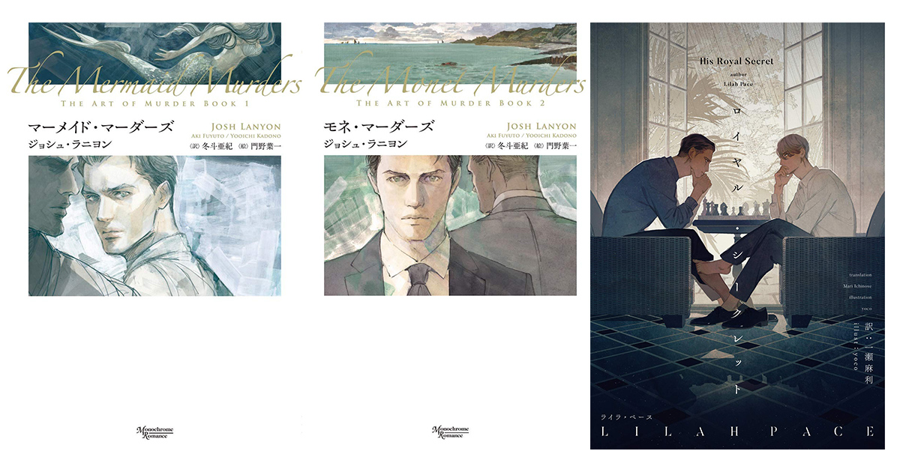
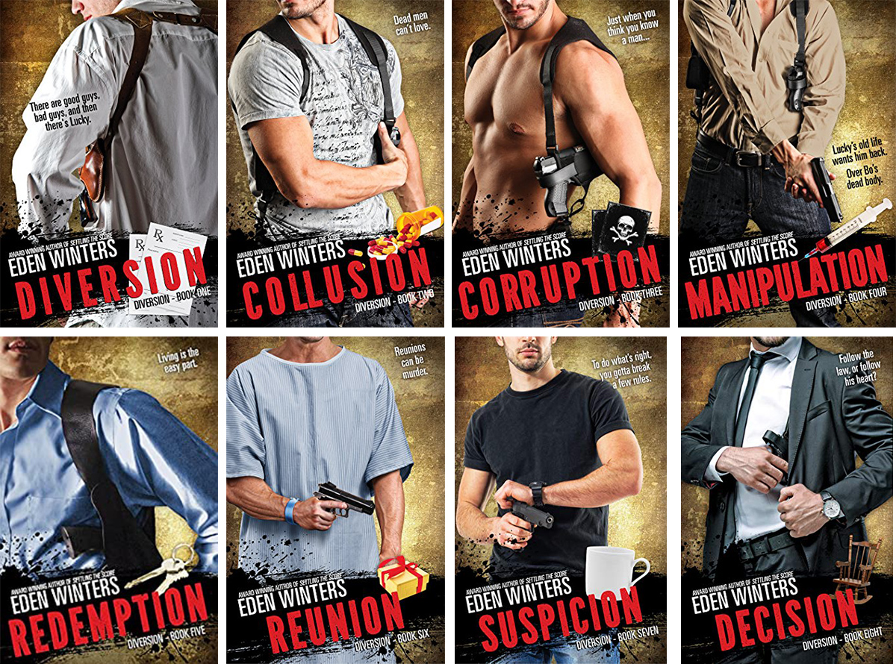
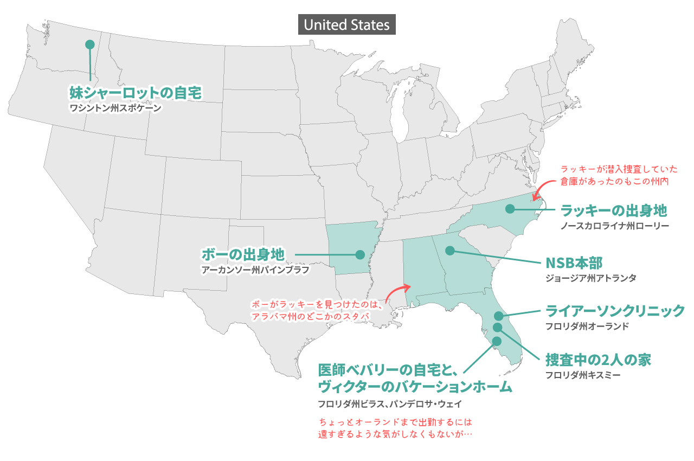

import { Blockquote, Twitter, Amazon, InternalLink, EventAnnouncement } from '../../../../src/components/blog'

自粛生活でストレスを感じている方も多いと思う今日この頃。  
たまにはCOVID-19のことを一切考えない時間があった方が、精神衛生上いいだろうな、と思いつきで開催したオンライン読書会。

無事に1回目が終了しました。  
参加してくれたみなさん、本当にありがとうございます。

話は本の内容に留まらず、M/Mロマンス小説をより多くの方に楽しんでもらうための勝手なマーケティング戦略や、国によっての文化の違い、家族、社会福祉、LGBTQなど、国によって違う社会問題に対しての話にまで広がり、ただ萌えるだけの恋愛もので終わらない、いろいろと考えさせられるM/Mロマンス小説って大変素晴らしいですね。

それにしても、みなさん本当に作品が好きで読み込んでるようで感動。

## 課題図書

<Amazon book="diversion" />

こちらの本は、私が以前ブログ記事にもした大好きな作品です。

<InternalLink slug="/mm-romance/diversion/" />

## 参加者

- [アユ･ヤマネ(@ayu_ymn)](https://twitter.com/ayu_ymn)さん
- [ベル☆Belle(@darling_belle)](https://twitter.com/darling_belle)さん
- にしこさん
- [轟梧郎(@projectodoroki)](https://twitter.com/projectodoroki)さん

と、私ジーナの5人で2時間喋り倒しました。

## 反省点

ちょっと先に申し訳なかったと思ったのが、私自身が普段から友人と話す時も、聞き役に回っていることが多いので、ついつい読書会でも聞き続けてしまったと反省しております。

次回から、もう少し本の内容を掘り下げて話し合えるように、トピックを用意してシーンとなった時に取り出せるようにしておきたいです。  
特にアユさん、出来ない私の代わりに話を回してくれて、本当にありがとうございました。

また、割と2巻以降の原書の話も多くなってしまったので、翻訳本読みの方々には申し訳なかったです。  
聞き入ってるだけじゃなく、発言が少なめな方には話を振っていかないとな、と。

ではでは、読書会のハイライトをご紹介します。

## 無料お試しで読めるチャプター中、ラッキーがずっと下品

だいぶ序盤に飛び出したこちらの発言が個人的に一番のヒットでした😆

先に言っときますが、ラッキーはすごく可愛くて優しくていい子なんです！いい子なんです！…が、残念なことに、物語の最初の方は下品な言動を繰り返していて（それも彼の過去からの人間不信が影響してるんですが）

- モノクローム･ロマンス文庫さんは無料で最初の1〜2チャプターを公開しているそうで、そこだけ読むとラッキーがずっと下品で、この小説はずっとこんな感じなんだと誤解され、読者を逃してそう。

- 言語の問題もあるんですが、スラングやスウェアワード（swear words）を多様するので、翻訳するとどうしても下品っぽさが増してしまうのかもしれない。

- また、物語の序盤、ラッキーが潜入捜査をしているという情報が与えられないまま、トラックを盗んでいくので、主人公が犯罪者なのはちょっと…と、さらに読者を逃してしまいそう。

と、もう本当にいい作品なだけに、惜しくて仕方がない…。

## 各キャラクターの印象

興味深かったのが、人によってそれぞれのキャラクターのイメージが微妙に異なっていて、読み手が受ける印象ってちょっとずつ違うんだなと思いました。

### ボー

ボーのキャラクターが掴みづらかったという声。

私も日本語版のあらすじを先に読んでしまっていたので、お堅い優等生イメージがついてしまっていたので、読んでいくうちに、そういうわけでもないんだなと印象が変わっていきました。

また、誰に対してもいい子で、すごく優しい印象なんですが、実はアフガニスタンで4年間従軍していたりと、タフな一面もあったりする彼。

他にも、日本語翻訳版では、あらすじやイラストに引っ張られてクールビューティな第一印象が強かった、や、かなり言葉が甘えた雰囲気、など。

しかし、実際には結構情けなかったり、弱かったり、ダメな部分が描かれていて、そこが非常に可愛かったりするんだけど！

ボーの外見に関しては、背が高くて、女の子たちからもモテるような美形なんだけど、そんな描写が出てくるのはチャプター12とかなり後半。

<Blockquote srcBook="diversion" lang="en" book>
The pony-tailed woman peered up from her computer screen to appraise Lucky overtop of her glasses. “Don’t tell me this is the lucky guy who removed Wil-licious from the dating pool?”
</Blockquote>

（パソコン画面の向こうからポニーテールの女性が顔を出し、メガネの上からラッキーを観察するかのようにじっと見つめてきた。「まさかこの人が食べ頃ウィルくんをものにしたラッキーな男だって言うんじゃないわよね？」）

それまでは、お尻の形がいいとか、筋肉質で細身だとか、体毛を剃っているとか、体に関してしか描かれてなかったので、顔の造詣は勝手な想像しかできなかったんですよね。

### ラッキー

ラッキー本人は、あんまり見た目が良くないと言ってましたが、実際はどうなんだろう？という話。

アッシュブロンドで背が低いという描写しかないんですよね。  
ただどうしても、物語の初めの方の下品な印象が強いと、なかなかイケメンを想像するのは難しいかもしれない。

しかし、若くて綺麗な男の子が好きなヴィクターの恋人だったので、本人が言うほどブサイクではないのかも？という声も。

性格で言うと、最初の印象は置いておいて、とにかく優しい！もう本当に優しい！  
ボーのベジタリアンフードに合わせてるなんて!  
自分だったら絶対お肉食べちゃうよね、と一同同意。

## 好きなシーンのハイライトが128個

みなさん共通の悩み、紙だと付箋がいっぱいいっぱいになってしまうとか、電子書籍だとハイライトを付け過ぎてページが真っ赤とか。

その中でも、話題に上がった好きなシーン。

### 張り込み中のちょっとした"暇つぶし"

<Blockquote srcBook="diversion" lang="en" book>
Bo focused on something outside the window, his jaw clenching and releasing. “I may be into leather, but don’t like being tied down. No humiliation, no cutting. Other than extreme kink and barnyard animals, it’s pretty much anything goes.”
</Blockquote>

（ボーは窓の外の何かに集中していたが、口元をギュッと引き締め、そして話し始めた。「僕はたぶんレザーに興味があるかもね。でも、縛られるのは好きじゃない。辱められるのも、皮膚を切るのも嫌いだ。極端に変態な行為や、納屋の動物を使ったプレイ以外は何でもいける。」）

ラッキーの下ネタに乗っかって来た上、予想よりもヘビー級な性癖を放り込んできたボーに驚愕しちゃうラッキー。  
私も驚いたんですが、同時に頭の中で「Yeaaaaaaas!」みたいになってました。

この後、言葉と想像だけのSEXが始まるんだけど、全然ギャグっぽくなって白けることなく、最高にセクシーなシーンに仕上がってるのがすごいよね、と。

また、このシーンまでラッキーいいところが1つもないのに、よくボーは乗っかってきたよな、性欲に負けたのかな？など。

唯一あるとすれば、公園のベンチで薬物検査を受けて動揺が激しいボーの話を聞いて、理解してあげて、キスしたことでしょうか。それがあったから、ボーも乗っかってきたのかな？

### ラッキーが高速でお皿洗い

<Blockquote srcBook="diversion" lang="en" book>
“Uh-uh,” Bo said, words garbled against Lucky’s T-shirt. “Dishes first.” Lucky’d never washed dishes faster in his life.
</Blockquote>

（「ダメダメ。」と、ボーが言ったが、声はラッキーのTシャツでくぐもっていた。「お皿洗いが先だよ。」ラッキーは今までの人生最速で皿を洗った。）

可愛い、もう可愛いしか言うことがない…！

上手くボーにあしらわれちゃってるよね、と。  
でもラッキーは優しいから、あえてボーのあしらいに乗ってあげてるんだとも思える。

### クリスマスプレゼントが気になって仕方がない

<Blockquote srcBook="diversion" lang="en" book>
Bo cast a few <a href="/vocabulary/glance/">glances</a> toward that corner of the living room during TV time, but otherwise said nothing. However, when Lucky lay in bed the next morning, waiting for the scent of breakfast to beckon him to the kitchen, he swore he heard paper rattling. He struggled to keep his smugness in check over an egg white omelet and coffee. Sure enough, his packages weren’t quite where he’d left them.
</Blockquote>

（テレビを見ている間、ボーはリビングの隅を何度かチラリと見たが、それ以外は何も言わなかった。しかし、翌朝、ラッキーがベッドにいて、朝食の香りに誘われてキッチンに行くのを待っていた時、確かにラッピングペーパーがガサガサいう音を聞いた。ラッキーは白身のオムレツを食べ、コーヒーを飲みながら、自分の自惚れを抑えようと必死だった。思った通り、プレゼントはラッキーが置いた位置からわずかに動いていた。）

絶対、ラッキーが現れないか確認しながら、プレゼントを振ったんだろうね、という予想。

本当はプレゼントが気になって仕方がないのに、気にならないふりして、早朝に確認するボーも可愛いし、そんなボーを観察してるラッキーも可愛い。

2巻の内容になってしまうんだけど、ボーは恋人の誕生日を祝ったり、プレゼントを送ったりするのが大好きな人なので、ラッキーからのクリスマスプレゼントはものすっごく嬉しかったはず（中身はレザーのタンガとディルドX2でしたが）。

### 気恥ずかしいキャンドル

<Blockquote srcBook="diversion" lang="en" book>
Approaching the checkout line, Lucky passed a shopping cart loaded with discounted items. Staring at an odd assortment of candles, he firmly declared under his breath, “I am not going to get mushy.” But when other shoppers approached he snatched up two white jarred candles and shoved them into his cart before he changed his mind. Only to keep someone else from getting them. Yeah, that worked.
</Blockquote>

（ラッキーがレジ前の列に近づいた時、割引商品を積んだカートの前を通り過ぎた。変わったキャンドルの品揃えを見つめながら、「俺はロマンチックにしすぎないぞ」と力強く宣言。しかし、他の買い物客が近づいてきた時、ラッキーは白いジャーに入ったキャンドルを2つつまみ上げ、気が変わる前にカートに押し込んだ。あくまで、他の誰かにキャンドルを取られないようにしたんだ。うん、うまく行った。）

自分はビールの方が好きだけどワインを選び、ベジタリアン向けのレストランでテイクアウトして、疲れているであろうボーにディナーを用意するラッキー。もう本当に優しい。

そして、さも自分が作ったかのように振る舞い、気恥ずかしさを感じながらもキャンドルを用意するのが可愛過ぎて。

### 謎のハイライト

<Blockquote srcBook="diversion" lang="en" book>
A sudden appearance by Walter, and imagining him in a Speedo, put an end to Lucky’s budding erection. Worked every time. Walter suffered what southerners called “Dunlap’s syndrome”, as in “Belly done lapped over his belt.”
</Blockquote>

（頭の中にウォルターを突然登場させ、そのままスピードスーツを来た姿を想像すれば、ラッキーの勃起はおさまる。毎回うまくいく方法だ。ウォルターはアメリカ南部の人々が言うところの「ダンラップ症候群」、つまり「ベルトの上に乗っかった腹」に悩まされているから。）

Kindleだと多くの人がハイライトした部分を表示してくれるんですが、この興奮してしまったラッキーがウォルターを思い浮かべて熱を沈めるシーンにハイライトが多数引かれたようで困惑、との声。

後から確認したんですが、確かに人気の一文でした。

世間の人はこの文章に何を思ってハイライトを引いたのか？改めて読んでみても、謎のままです。

もしかしたら、このダンラップ症候群のあたりが、アメリカ文化、さらに南部の文化を知ってないと、面白さが理解できないジョークなのかもしれない。

あと、私も個人的に人気のハイライトが表示される機能は好きなんですよね。自分とは違うことが多くて興味深い。

## 人気BL作家のイラストは必要なのか？

みなさま日本語翻訳版のイラストにはいろいろと思うところがあるようで、私だけではなかったのかと、共感で首を縦に振りまくってました。

出た意見としては、

- イラストレーターさんが嫌いなわけではない、むしろ好きだけど、M/Mロマンス小説には合っていない気がする

- どうしてもBLマンガっぽい印象があり、手に取らない読者層がいそう（もちろん逆にBL小説好きな人にはリーチしてるんだろうけど、割とリバるのでBL小説好きの中でも読者を選んでしまう）

- 挿絵を無くして、表紙もイメージ写真など手に取りやすいものだったら、海外ドラマのミステリーや刑事バディもの、ブロマンスものが好きな人は読んでくれそう

- M/Mロマンス小説が好きな読者は、その中身に惚れ込んでいるので合って、そもそもイラストは必要ない

- マンガっぽさが強く、イメージを引っ張られる（まぁ、これは他のラノベ等にも言えることですよね）

- 『[殺しのアート](https://amzn.to/2YJ7OfJ)』シリーズや『[ロイヤル･シークレット](https://amzn.to/3cerSKO)』のイラストは、作品の雰囲気を壊すことなく、むしろ相乗効果を発揮している

_Source : [モノクローム･ロマンス文庫](https://www.shinshokan.com/monochrome/)_

一方、ドラッグ･チェイスシリーズの原書の表紙は、ハードボイルドな感じでまとめられています。

_Source : [Diversion Series](https://amzn.to/2YHu6hH)_

ただ、M/Mロマンス小説の原書だと、今度は半裸の男性画像が多いので、それはそれでブックカバーが必要になったり、本に出てくるキャラクターと表紙の男性が全然合っていなかったりするので、なかなか本の表紙って難しいですね。

## M/Mロマンス小説的SEX描写

私は気づいてなかったんですが、原書の最初に注意書きがあります。エロいので未成年は注意とのこと。

<Blockquote srcBook="diversion" lang="en" book>
This book contains adult language and themes, including graphic descriptions of sexual acts which some may find offensive. It is intended for mature readers only, of legal age to possess such material in their area. This is a work of fiction. Any resemblance to actual people, places, or events is purely coincidental.
</Blockquote>

（本書にはアダルトな言葉やテーマ、性的な行為の描写が含まれており、不快に感じる方もいるかもしれません。お住まいの地域の法律で成人と定められた年齢以上の読者に向けた本です。この本はフィクションで、実際の人物、場所、事件との類似は、完全に偶然です。）

まぁ、エロいのはエロいんだけど、無駄にエロいわけもなければ、SEXシーンが多過ぎて辟易するわけでもない、バランスがいい、というかむしろ私が求めていたのはこれだよ！これ！と思える今作。

やはり、2人の心理描写であったり、起きている事件であったり、絡み合う人間関係だったり、2人の深いバックグラウンドだったりを丁寧に描いてあるので、そこそこSEXシーン自体はあるんだけど、全然「また？！」という感じがしない、という共通認識。

あと、私は日本のBL小説の「あっ…あん…あっ、ぃや……」みたいな喘ぎ声(いざ書こうとすると難しいな…)が苦手なのですが、M/Mロマンス小説好きには同じような感覚の方が多いみたい。

### 朝チュン

SEXシーンが多くならないよう、朝チュンで飛ばしてあるシーンが多々見受けられる今作。そして、それがいいという声。

SEXシーンが多くなり過ぎないというだけでなく、昨夜のSEXを匂わせる1文や、2人の会話は、下手にSEXシーンを描くよりもニヤッとさせられ、悶えさせられます。

ちなみに私が好きな、というか笑ってしまった朝チュンシーンはこちら。

<Blockquote srcBook="diversion" lang="en" book>
“Did you make coffee? It tastes like something died in my mouth.” Bo sniggered. “I don’t know about died, but something came in your mouth. Twice.”
</Blockquote>

（「コーヒー淹れた？なんか、口の中で何かが死んだような味がする。」ボーはクスクス笑いながら「死んだかどうかは知らないけど、あんたの口の中でイッたから。2回も。」）

どういうプレイをしたのか気になって気になって！

分かってます、この朝チュンで飛ばされたシーンをものすごく見たいけど、見せないことで想像力を掻き立てられて余計に興奮させられてるということも分かってます。でも見たい！いや、見たくない！

### SEX以外で激萌するシーン多数

SEXシーン以外の激萌するシーンが多いという意見。

もう本当にそうですよね。直接的ではなく、さりげないちょっとした1文に、それぞれの愛を感じるシーンが多い。  
むしろSEXシーンよりも、これらの方が悶え具合が激しいという声に納得。

## 2人の出身地

ちょっと2巻の内容にはなってしまうんだけど、それぞれどこの出身かという話と、ついでに1巻で頭に入れておきたいアメリカの土地。

ラッキー：ノースカロライナ州ローリー北部 (Raleigh, North Carolina)  
ボー：アーカンソー州パインブラフ (Pine Bluff, Arkansas)

改めて調べてみて、Raleighを日本語表記するとローリーになるのも意外だったけど、田舎出身だと思ってたラッキーのホームタウンは州都だったんですね。まぁ、タバコ農場と言っていたので、割と街から外れたエリアではあったんだろうけど。

全体的にアメリカ南東部のお話なんですが（作者の出身地なのかな？）、敬虔なクリスチャンが多く、保守的な考えが強い地域なので、ラッキーがやたらゲイなのを隠したがってる様子や、たまに言葉にクリスチャンっぽさが滲むのもそれが理由なのかと。

それにしても、M/Mロマンス小説を読むようになって、Googleマップを眺めるだけでも楽しくなってしまう。  
ラッキーがトラックを運転してて眠気を感じた交差点はこのあたりかーとか考えながら。

## ただの恋愛、ただの性欲で終わらないM/Mロマンス小説の良さ

きっと私含め、みなさんがM/Mロマンス小説にハマった理由は、イケメンのペラッペラな愛や恋だけを語るストーリーではなく、それぞれのキャラクターにしっかりとしたバックグラウンドがあったり、社会問題も絡めながら、家族の絆や友情、強さと弱さ、ダメダメなところ、彼らの人生まるごと眺めている気分にさせてくれる作品が多いからじゃないかと。

現実世界は厳しいから、キラキラした世界だけを見ていたいという気持ちも分かるけど、リアルで人間の美しさも醜さも描いてあるM/Mロマンス小説は読み応えがあります。

特にこの作品は、自分の恥いるような弱さを受け入れ、相手が理解してくれて、認め合い、お互いが一番の理解者だと確信していく物語でした。あぁ、なんて最高なんだろうっ…！

## 原書への第一歩

日本語翻訳版と原書をどちらも読むと、「よくこの文章をこの日本語に訳したなぁ」と感心することがあるとのこと。  
確かに私も逆に「この文章どう日本語に訳したんだろうか？」と思うこともしばしば。

また、日本語翻訳版を読んでいて「この文章は原文でどうなってるんだろう？」と思うのが、原書への第一歩に繋がるという話に。

実際に興味があるネタの方がモチベーションになって、英語の勉強が続きますからね。  
__BLへの愛という推進力は何者にも代え難い。__

それから、[ディープル翻訳](https://www.deepl.com/ja/translator)という翻訳サービスの話へ。

実は私も普段からディープル翻訳を愛用しています。  
こちらのサービスは、翻訳後の文章をそのまま使えるほどではないですが、結構ナチュラルな感じの翻訳結果を返してくれます。Google翻訳よりもナチュラルな気がする。

私はこのブログ以外にも、もう1つブログを運営していて、そちらは日本語と英語で記事を更新しているんですが、私の場合、最初に日本語で書くんですよね。そっちの方がストレスなく手早く書きあがるので。  
それから、その日本語の記事をディープル翻訳にかけて、大雑把に英訳。  
それを[Grammarly](https://www.grammarly.com/)という文法や言い回しなどをアドバイスしてくれるサービスを利用しながら、全体的に調整していきます。  
翻訳サービスを使った方が、日本語を0から英訳するより断然早いので。

## ファンアートがノベルティグッズに！

参加者の一人、アユさんがラッキーとボーのファンアートをTwitterに投稿したところ、エデン･ウィンターさん本人から連絡があり、LGBTロマンスの祭典である[GayRomLit Retreat](https://gayromlit.com/)で配るノベルティグッズに採用されたそうです。

なんて素敵なお話っ…！

<Twitter id={'1166251758290489344'} />

このイベント、毎年開催されているんですが、私もぜひ参加してみたいです。  
2020年は10月15日〜18日の4日間、ミズーリ州のセント･ルイスで開催されるとのこと。4日間も…！

## オーディオブック

<Amazon book="diversion" audiobook />

原書のオーディオブックなんですが、ナレーターのDarcy Starkさんの声質が堪らなくいい！特にボーのイメージにぴったり。

また、このナレーターさんはキャラクターによって声音を変えながら朗読してくれるので、今誰が話してるんだろう？となる心配がありません。

オーディオブックを制作する際、作者のエデン･ウィンターさんはナレーター選びが難航したそうで。ナレーターの技量や、声のイメージ、予算を考慮すると、なかなか大変だったとか。

その甲斐もあって、非常にぴったりのナレーターだと思います！

## 日本語翻訳の続きは発売される？

このドラッグ･チェイスシリーズの1巻、還流が発売されたのが2016年。

続編が翻訳されるかは、1巻の売り上げ次第だそうで、続きが出るのは絶望的かもしれないとのこと。

うーん、もっと盛り上げて署名活動とかしたらいいのかしら…。とりあえず、私は2巻以降の感想記事を書いていく予定です。

---

当日の楽しかった思い出を書き始めたら、全然書き足りなくて長くなってしまった…。

参加して頂いたみなさま、楽しい時間を本当にありがとうございました。  
また、普段ブログを読んでくれているM/Mロマンス小説好きな方々も、次回の参加をお待ちしております。

<EventAnnouncement title="第2回M/Mロマンス小説オンライン読書会" bookName="殺しのアート#1 マーメイド･マーダーズ" bookUrl="https://amzn.to/2Wcn6HT" date="2020年5月24日（日）13:00〜" capacity="5名くらい" tool="zoom" />

~~後ほどTwitterで参加者を募集する予定です。~~  
__2020/05/08更新：参加者を募集中です！__

<Twitter id={'1258613106554490880'} />

個人的に、紙で読んでいる方々が次から次に本を取り出し、画面に向けてくれるのが大好きでした。

移住する時に、ほぼ全ての紙の本を処分して電子のみに以降したので、紙ってやっぱりいいよなぁとしみじみ。

次回からもぜひぜひカメラの前に設置しておいてもらえると嬉しいです！
