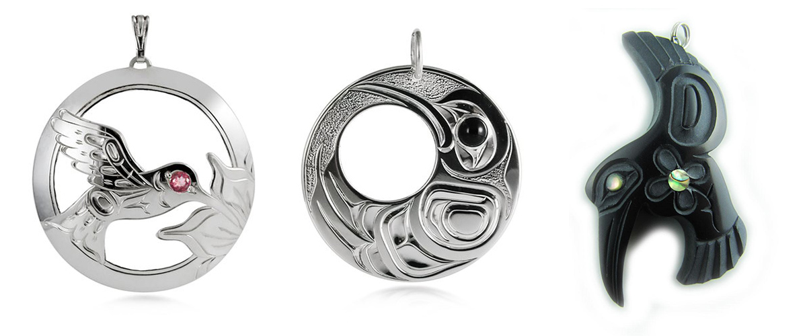

import { Blockquote, Amazon, Series, InternalLink, Twitter } from '../../../../src/components/blog'

先日、このシリーズ1巻についてのオンライン読書会を開催し、ドラッグ･チェイス熱が私の中で再燃していて、書かずにはいられなかった2巻の感想記事。

その読書会のレポートはこちらです。

<InternalLink slug="/mm-romance/book-club-1/" />

また、最近7巻を読み終えたんですが、7巻では1巻や2巻を思い出すようなシーンがとても多かったので、改めて2巻を読むと非常に感慨深い！  
「7巻のあのシーンは2巻のこのシーンに繋がってたのか、ふふふ…」とほくそ笑みながら読みました😏

ではでは、2巻の内容に入っていきますが、日本語翻訳版が発売されていない作品ですので、ネタバレにはご注意ください。

**※各英文の翻訳部分は私の意訳です。間違ってたら教えてください！**

## ドラッグ･チェイスシリーズ

原書のシリーズ名は「Diversion Series」。  
8巻まで発売されていて、まだ完結していません。どこまで続くんでしょうね？

<Series name="DiversionSeries" />

## あらすじ

元麻薬密売人のリッチモンド･ラッキー･ラックライダーは、刑期と引き換えにアメリカ南東部の薬物捜査局で10年間働き、その職務を全うして”殉職”した。サイモン･ラッキー･ハリソンとして生まれ変わるために。彼が訓練した新人、元海兵隊のボー･ショールンバーガーは、現在、彼の仕事上の（おそらくプライベートでも）パートナーである。しかし、誰かと恋愛関係になることを知らず、まともな人間がベッドで何をするのかも分かってないラッキーにとって、ボーとの関係が何なのかは判断がつかない。ボーが近くにいるのは確かに嬉しいが、ラッキーにとって人生を共にするような”パートナー”としては考えられないのだ。

ボーは従軍からのPTSD、恐ろしい子供の頃の記憶、さらに処方箋薬による中毒と戦いながら、過去に犯した罪を償っている。薬剤師のライセンスを善良な人々のために使うことで、学校では得られない経験を積んでいる。ボーは頭の固いパートナーと潜入捜査をしながら、医薬品界の闇を学ぶことになる。

処方箋薬の不足で、ロザリオ小児がんセンターの患者が危険にさらされると、この機に便乗して儲けようとする人々と敵対するだけでなく、ボーとラッキーはお互いにも衝突してしまう。彼らはどうやって悪者を見分けることができるのだろうか？悪者は黒い帽子を被らず、白いコートを着ているかもしれない。

だいたいこんな感じ。

## カップリング

<h3>ラッキー (Simon “Lucky” Harrison)</h3>

リッチモンド･ラッキー･ラックライダーは死んだことになっており、サイモン･ラッキー･ハリソンとして、前科もキレイさっぱり無くなって生まれ変わった。

愛称「ラッキー」はそのまま。  
作中の4月11日、36歳の誕生日を迎える。  
ノースカロライナ州のローリー出身。

<h3>ボー (William Patrick Schollenberger III)</h3>

31歳。  
嫌っている父親と同じウィリアムという名前を持つので、ボーという愛称を好む。  
アーカンソー州のパインブラフ出身。  
ダークヘアにハイライト入り。魅惑のお尻。

私、以前からボーって愛称は名前のどこから来たのか疑問だったんだけど、先日の読書会で、ウィリアムだからビルで、そこからボーかも？って話が出て、なるほど！と納得しました。

## みどころ①：2人の関係性の変化

もう今作はこれに尽きるんじゃ無いでしょうか？

ファックバディからLワードが出るまでを描いた重要な1冊！  
（いや、シリーズ通してどの本も重要ではあるんだけど）

1巻終了時点では、まだまだ公式なボーイフレンドになってない彼ら。

ボーとしては、出会って6ヶ月が過ぎ、定期的に会って、一緒にご飯を食べて、泊まって、SEXしてるし、仕事の上でも尊敬してるし、何よりラッキーのことが好きだし、2人の関係を一歩前進させたい。

一方ラッキーは、ボーイフレンド？何それ、食べ物？みたいな、全くそんなことを考えていない様子。  
外でゲイだと知られることすら嫌っている。

しかし、心の奥底ではボーと過ごす時間が心地良いと感じていて。  
もっと彼と一緒にいたいという想いが頭をよぎる度、初めての感情に混乱し、ぐるぐる考え混んでしまうんですよね。  

そんなラッキーが、ボーへの愛を確信して、言葉に出して伝えるまでのお話です。

## みどころ②：アメリカの処方箋薬が足りない問題

実際にアメリカで起きた問題だったようなんですが、私は全然知りませんでした。  
（知らないことを知るきっかけになるから、やっぱり本って好きなんですよね）

作者のエデン･ウィンターさんは、この処方箋薬不足の問題について前書きをしてあるんですが、結構長いので要点をまとめると、

### 最悪の処方箋薬不足

2011年にアメリカでここ30年で最悪の処方箋薬不足が発生（特に抗がん剤）。不足の理由はメーカーの設備故障から原材料の不足まで様々。

### 医療機関の対応

通常だとリーズナブルな価格の薬が手に入らなくなり、薬局のバイヤーは薬の調達のため奔走、医者はどの患者に優先して薬を処方するか、効果の低い治療法に切り替えるのか、それとも治療を遅らせるのか、頭を悩ませる事態に。

さらに、医療機関の中にはFDA認可を受けていない外国からの輸入品（中には効果のないものも）を違法に購入しているところも。

### グレーマーケット

この絶好の機会に儲けようと、必要とされる薬を買い占め高額で転売するような人々が、グレーマーケットに溢れていた。

また、偽の薬や、似たような名前の薬が出回り、薬局のバイヤーは患者のことを考えると、安易に薬を購入出来なくなる始末。

さらに、グレーマーケットによる薬の価格の高騰で、患者や保険会社、メディケイドなどの政府プログラムにも経済的な負担がのし掛かった。

### 実際の事件を元にしたフィクション

このお話はフィクションだけど、処方箋薬不足とグレーマーケットの問題は実際に起きていて、現在、状況はかなり改善されてはいるんだけど、まだまだ完全に解決された問題ではないようです。

なんだか新型コロナウイルスの影響で、マスクやトイレットペーパー、アルコール消毒などがありえない高値で転売されてる今の状況と通じるものがあるな、と思いました。

---

さぁ、ここから順を追って私が好きなシーンをあげて行きますよ！

## 1. 会えない時間

1巻ラストの再会から4ヶ月が経った4月の半ば。

いつも通り、製薬会社の倉庫で潜入捜査中のラッキーこと、今回の偽名はマーヴィン･バーケンヘイガン（Marvin Barkenhagan）。  
相変わらずお気に召さない名前ようですが。

倉庫でお仕事も3週間が過ぎ、今日が待ちに待ったショータイムの日。

<Blockquote srcBook="collusion" lang="en" book>
A memory danced into his consciousness—dark brown eyes, mischievous smile, tanned skin appearing even darker against white cotton sheets. He’d spent most of his life avoiding weaknesses, not getting involved ’cause the resulting heartache and betrayal wasn’t worth the grief. And one man had to go and sneak in under his defenses, reawakening feelings he’d denied himself for far too long.
</Blockquote>

（ダークブラウンの瞳、いたずらっぽい笑顔、白い綿のシーツに映える日焼けした肌、ラッキーの頭の中でボーの記憶が踊る。人生の大半を、弱みを晒すことなく、他人と関わらずに過ごしてきた。誰かと付き合ったあげく、裏切られたて心を痛めることほど、無意味なことはないから。でも、1人の男が、ラッキーの硬く閉ざした鎧の中に侵入してきて、長い間押し殺してきた感情を呼び覚ます。）

仕事の休憩時間に外に出て、夜空を眺めながらボーを思い出すラッキー。

ずっと人と深く関わること避けてきて、心に鎧を纏って生きてきたけど、そんなガッチガチに武装したラッキーに、いともたやすく入りこんで来るボー。  
過去の傷から、人を愛するって感情は捨てたはずなのに…。

まだまだ、ラッキーはボーとの関係を進展させる気は全然ないんですが、会えない時間に相手のことを考えてたら、もうそれは完全に恋に落ちてるわよ、ラッキー。

英語にも有名なことわざがあります。  
__Absence makes the heart grow fonder.__  
_（会えない時間が愛を育てる）_

深夜シフトが終わる明け方、作業中に薬を抜き取っては売り捌いていた同僚3人を逮捕して、無事に任務は終了。

## 2. 3週間ぶりの再会

### 喜びのタックル

それぞれ別のところで潜入捜査をしていたラッキーとボーは、SNBオフィスに向かう途中で久々の再会。

ボーに気づかれないように近づいて、エレベーターの中でタックル！

<Blockquote srcBook="collusion" lang="en" book>
“Damn it, Lucky!” he spat when he finally came up for air. “You about gave me a fucking heart attack!” “Yeah, I missed you, too.” Lucky got in another kiss and a grope to the man’s muscular backside before turning to face the door.
</Blockquote>

（「おいっ、ラッキー！」ボーはようやく息を吸い抗議した。「心臓発作起こすところだったよ！」「あぁ、俺も会いたかったよ。」ラッキーはドアの方を向く前にもう一度キスし、ボーの筋肉質な尻をまさぐった。）

この本でたびたび出てくる、この2人のやりとりが大好きなんですよ！

ボーが抗議気味に「心臓発作起こすところだったよ！」って言ってるのに、「あぁ、俺__も__会いたかったよ。」って答えるラッキー。

すかさず、唇だけじゃなく、大好きなボーのお尻も堪能してます。  
まぁ、抱き着くとちょうどいい位置にありますもんね。

### ボーの帰りを心待ちにしてるくせに

その日の夕方、先に仕事が終わったラッキーはスーパーに買い物に行き、家で料理の下ごしらえをしながらボーの帰りを待つことに。

<Blockquote srcBook="collusion" lang="en" book>
A vehicle turned in to the driveway, distracting Lucky, and he dashed outside to toss a match on the grill, pretend he hadn’t been glancing out the window every two minutes, anticipating Bo’s arrival, and stash the card in the tool shed.
</Blockquote>

（車が敷地内に入って来たことに気付き、ラッキーは外のグリルにマッチを投げ込んで、誕生日カードを工具入れに隠した。まるで、ボーの到着を予想してたかのように。実際は2分置きに窓の外を確認してたんだけど。）

チラッチラと2分置きに外を見て、まだ帰って来ないかなって確認してる上に、そんなことしてなかった風を装ってるラッキーが可愛過ぎて可愛過ぎて。

彼、根っこが本当に可愛いですよね。  
誰も信用せず、他人と距離を置くような行動をしてるんだけど、本当は純粋で可愛らしい人。

### 今夜のディナーはデザートだけ

ボーの車は到着したはずなのに、いくら待ってもボーはリビングにやって来ない。

<Blockquote srcBook="collusion" lang="en" book>
“Took you long enough.” Bo switched on the bedside lamp and Lucky stopped in his tracks. Bo lay sprawled on the bedspread, wearing nothing but a pair of leather chaps and a smile. Happy fucking birthday to me!
</Blockquote>

（「遅かったじゃないか。」ボーがベッド脇のランプを点けるた瞬間、ラッキーは立ち止まった。ボーはベッドの上に寝そべり、レザーチャップスだけを履いて、笑顔を浮かべていた。誕生日おめでとう、俺！）

ベッドルームで裸にレザーチャップスだけ着てお出迎えするボー。  
男はいつでも緊急事態だわ。

4月11日、今日がラッキーの誕生日だということを、ボーはもちろん知らないから偶然なんだけど、最高の誕生日プレゼントもらいましたね😏

まぁ、私は読みながら「いや、ご飯食べようよ…」って思ったシーンではあったんですが。食欲より性欲が先、と。

<Blockquote srcBook="collusion" lang="en" book>
“I don’t care if you missed me or not. I’ve missed you enough for the both of us.”
</Blockquote>

（「君が僕に会いたかったかどうかなんて気にしないよ。僕が2人分会いたかったから。」）

「会えなくて寂しかった？」っと尋ねるボーに、「ちっとも。」なんて答えるラッキーなんだけど。  
もう、寂しがってたじゃないか！素直じゃ無いんだから！夜空を眺めながらボーを想ってたじゃない！

でも、そんなラッキーに「僕が2人分寂しかったからいいや」って、さらっと返せるボーがまた、__どこまでもいい子…！__

そして、いつも通り、いえそれ以上に熱いSEXシーンが続きます。3週間ぶりですしね。今回はラッキーがボトム。

<Blockquote srcBook="collusion" lang="en" book>
Lucky gripped Bo’s head and pulled. Their teeth clacked together.
</Blockquote>

（ラッキーはボーの髪を掴んで引き寄せた。2人の歯がぶつかる。）

ラッキーがイク瞬間、ボーの髪を掴んで引き寄せ、2人の歯がぶつかるんだけど、勢いがあって、熱さが迸ってて堪らない。

しかし、実はこの時、ボーはコンドームを着けていなくて、そもそも着ける/着けないの話し合いもしてなかったのよね。  
「生でセックスしちゃったけど、ボーイフレンドになるってことなのか？」と、ぐるぐる考え始めるラッキー。  
あぁ、もう、この子は…。

まぁ、出会って以来、2人とも別の人と関係を持ったりはしてないっぽいけどね。

余談ですが、フィクションであってもコンドーム着ける/着けないの話し合いについて言及があるので、海外作品は好きなんですよ、私。

### ボーの面倒見の良さとラッキーの戸惑い

特に何があるわけでもないんだけど、再会した次の日の朝は、ささやかな愛が溢れてて好きなんですよ。

ボーが隣にいることで熟睡してしまってたラッキー。  
起きた時には、ボーは既にシャワーを浴びて、帰った後なんだけど。  
シャワールームから立ち上る湿気とシャンプーの匂いで、シャワー浴びたんだなって感じとる描写が、なんだか恋人のいる日常って感じでいい。

キッチンには、コーヒーメーカーにラッキーお気に入りのマグカップがセットされてて、カップの底にはスティビアが入ってるし。  
シンクに放置してた汚れたお皿も消えてる。  
ボーの全然見返りを求めないラッキーへの愛が堪らん。

そんなボーに影響されたのか、いつも通り出勤途中でスタバに寄った時、無意識にボーのための緑茶も買ってしまったり。  
その緑茶にスティビアを入れてあげたり。

そこでふとラッキーが気づくんですよ。  
何でボーに対して優しく振舞ってるのか、と。  
見返りを求めるわけでもなく無意識に。

初めての感情と行動にラッキーが戸惑う戸惑う。  
そんな彼の姿をお母さんになったような気持ちで目を細めながら眺める私。

## 3. コミュニケーション不足からの喧嘩

### 2人の関係に名前がつかない苛立ち

SNBオフィスでラッキーのサプライズ誕生日パーティーがあったんだけど、そこで初めてラッキーの誕生日を知ったボー。激おこです💢

6ヶ月もデートしてて、誕生日すら教えてくれないなんて！と。ごもっとも。  
一方ラッキーは、その6ヶ月のうち3ヶ月は、ラッキーが "死んで" たり、別々に潜入捜査してたりして会ってないじゃないか。そもそも俺たちデートしてないよ！と。

全然向いてる方向が違うというか、全然感覚が違ってる2人。

また、会う時は必ずラッキーの家なんですよね。ボーの家は頑なに拒否る。  
それは過去にビクターと住んでた影響もあって、他人の家だと居心地が悪いってのもあるみたいなんだけど。なら、そう伝えればいいのに。

<Blockquote srcBook="collusion" lang="en" book>
“No, if I come over, we’ll fuck, we won’t talk.” Sounded like a plan. “And you don’t like fucking because?” “Am I just a fuck to you? And a cook? Is that all I am?” “No! You’re an incredible fuck!” Lucky’s intended joke missed the target.
</Blockquote>

（「行かないよ！行ったら話し合わずにヤルだけじゃないか！」それの何がいけないんだ？「何でヤリたくないんだよ。」「お前にとって僕は料理してSEXするだけの人間かよ。」「お前とのSEXは最高だよ！」ラッキーのジョークは完全に的外れだった。）

「料理と体が目当てなの？」って、よく男女でも聞くセリフですよね。

「体が目当てなの？」に対して、「最高の体だよ！」と答えるラッキーは好きだけど、そこはジョークじゃなくて、ちゃんと答えるべきよ。

また、これ言い合ってるのがSNBのオフィスだから、周りを気にして声を落としたいラッキーの様子も気に入らないよね、ボーは。

### 思い出のクリスマスカクタス

シャコバサボテンと書いた方がいいのかしら？

ボーのデスクの上に、彼らがフロリダで一緒に住んでいた時に買ったクリスマスカクタスが飾ってあって、ボーは大事に世話をしてるんですよ。

誰にでも優しくて、植物でさえも優しく世話をするボーが、もし喧嘩したままラッキーを全く気にしなくなってしまったら…。  
嫌だ！そんなの嫌だ！  
ということで、はい、謝りに行こうね、ラッキー。

はぁ、それにしても、私、誕生日を祝うことを大事にしてたり、思い出の品であるサボテンを愛でるようなタイプのボーが大好きだー！

<Blockquote srcBook="collusion" lang="en" book>
Lucky dropped the grocery bags to the floor and ran his fingers through the waves at the back of Bo’s head, pulling him down for a kiss. Bo’s anger seemed gone, for he returned Lucky’s greeting. “Mmm… Good to see you, too,”
</Blockquote>

（ラッキーはスーパーの袋を床に落とし、ボーの後頭部に指を這わせ、引き寄せてキスをした。ボーの怒りは消えていたようで、ラッキーの挨拶への返事をした。「ん…、僕も会いたかったよ。」）

また出ました。  
ドアを開けた瞬間の力強いキス、からの「僕__も__会えて嬉しいよ」と返すボー。  
好きなんですよ、本当に、このやり取り。

### お互いに関係の進め方を知らない

確かに改めて考えるとですね、19歳でヴィクターに出会ってから25歳で捕まるまで、ラッキーはヴィクターと一緒に住んでたんだけど。  
彼らの関係って、あくまで愛人であって、全然対等で健全なカップルじゃなかったんですよね。

ヴィクターは勝手にラッキーの誕生日を調べて、欲しいものを調べて、ぽいっとムスタングを贈り、ラスベガスへ連れていくような男で。

ラッキーは、いわゆる一般的なカップルが2人の関係を築いていく過程を経験したことがない。  
コミュニケーションをとって、少しずつ関係を2人で作り上げるってことを知らない。

ボーはボーで、大学時代はセフレがいたけど、海兵隊じゃストレートの男に恋してたし、ステディな相手がいたことはない。

そう、2人とも初めてなんですよ、愛とか信頼とかを積み重ねる作業が。それは上手くいかないよね。

一般的にはどうか知らないけど、私も誰かと付き合う時に将来のことまで視野に入れた「関係の構築」なんて考え始めたのは30歳過ぎてからだったから、彼らの感覚に共感。

### お互いをもっと知っていこう

ということで、仲良しカップルの秘訣はコミュニケーションから。出会って6ヶ月過ぎて、ようやくお互いを知っていく作業開始。

キッチンで一緒に料理をしながら、2人の出身地や家族構成などなど、ひたすらおしゃべりしていきます。ディーナーを食べながらも話し続けて、やっとこさ、夜の話題へ。

ボーへの質問。「騎乗位以外で何が好き？」への答えが2つ。

<Blockquote srcBook="collusion" lang="en" book>
“I stripped some in college to make a few extra bucks,” Bo said, beginning to pant. He ran his hands up and over his sweat-slicked chest. “Guys used to shove dollar bills in my thong.”
</Blockquote>

（「僕は大学生の頃、お小遣い稼ぎにストリップショーに出てたんだ。」とボーは言って、荒い息を漏らし始めた。汗で濡れた胸の上をボーの手がなぞる。「男たちが僕のタンガに金を突っ込んでたんだ。」）

1つ目、ストリップショー。

ボーは見られるの好きなんですよね。あと、踊るのも。

ラッキーをベッドに座らせ、音楽をかけて、ボーが焦らしながら徐々に服を脱いでいくんだけど、セクシーだとは思いつつ、ちょっと読みながら、どんな顔して読めばいいのか、非常に気恥ずかしくなってしまったシーンでした。

プライベートストリップショーなんて、下手したら白けそうだけど、2人とも大興奮してるみたいで何より。

それにしても、私もボーのタンガ姿を見たいし、彼のタンガにお札を突っ込みたい！

<Blockquote srcBook="collusion" lang="en" book>
Lucky weighed several possible responses, settling for, “You want me to use this on you?” Bo nodded. Holy shit! Lucky must’ve fallen asleep and started dreaming his favorite fantasy. Mouth suddenly dry as dust, he managed to get out, “Lie down.”
</Blockquote>

（ラッキーはボーがディルドを取り出した理由をいくつか慎重に考えた後、「これを使って欲しいのか？」と尋ねると、ボーは頷いた。なんてことだ！ラッキーは今眠ってて、大好きな夢を見ているに違いない。口の中が急に乾き、彼は何とか「横になって。」と囁いた。）

2つ目、ディルド。

ディルドを使って責めて欲しいってボーの要望に、息を飲むラッキー。  
そう、ディルド使うのってラッキーの大好物の妄想だったから！

結局、エロいことに関しては、すごく気が合ってて仲良しなんですよね、この2人。  
さっきまで恋愛初心者みたいに、上手く関係が築けないで、見てるこっちがハラハラしてたけど、ことエロに感じては息ぴったり。

それにしても、物語の前半30%くらいにエロい描写が集中していて、もうお腹いっぱいですって感じ。

### お誕生日限定、ベーコンと卵の朝ごはん、朝フェラを添えて💕

日曜日の朝、改めてラッキーの誕生日を祝うため、内緒でベーコンを焼いて、朝食をベッドまで運ぶボー。

私が日本人だからか、朝食をベッドまで運ぶっていう夢シチュエーションに全然萌えはしないのだが、まぁ、それは置いておいて。

<Blockquote srcBook="collusion" lang="en" book>
“Yes, I did. And unlike you, I love birthdays. Come September, be prepared to spoil me rotten. But today is for you, or rather, until we have to go to work.” He rolled to his side and <a href="/vocabulary/nibble/">nibbled</a> Lucky’s earlobe. “I’ll make your birthday a day to remember.” “Not my birthday,” Lucky mumbled, instantly distracted when Bo shimmied down the bed to take Lucky’s cock in his mouth. First bacon, now a blow job? “Given time, I might learn to like birthdays!” Lucky <a href="/vocabulary/moan/">moaned</a>.
</Blockquote>

（「もちろん、誕生日プレゼントを用意したよ。君と違って、僕は誕生日ってイベントが大好きなんだ。9月の僕の誕生日には、僕を思いっきり甘やかす準備をしておいて。でも、今日は君のための日だ。というか、仕事に行くまでの間だけど。」ボーは横に寝転がってラッキーの耳たぶを甘くかじる。「君の誕生日を忘れない日にしてあげる」ラッキーは「今日は俺の誕生日じゃない。」と抗議しようとしたが、ボーがベッドの下の方に移動して、ラッキーのペニスを咥えると、すぐにそんな気は吹き飛んだ。ベーコンに始まって、次はフェラ？「今だけは、誕生日が好きになるかもしれない！」と、ラッキーは呻いた。）

この「9月の僕の誕生日にはでろっでろに甘やかしてね」「君の誕生日を忘れない日にしてあげる」ってセリフが大好きでして。

ボーが恋人ってなんて最高なんですかーーーー！

ターキーとはいえ、普段絶対禁止のベーコンを焼いてくれた上に、なんとフェラまでしてくれる恋人。

うん、知ってる、ラッキー朝フェラ好きだもんね。ずっと言ってたもんね、して欲しいって。  
「誕生日が好きになるかも」って、もう、素直な可愛いやつめ。

さぁ、甘い雰囲気はそこまでにして、今日中にアンダーソンへ移動しましょう。明日からお仕事よ、2人とも。

## 4. 潜入捜査開始

次の舞台はサウスカロライナ州、アンダーソンにあるロザリオ小児がんセンター。アメリカ内でも有名な大きい病院みたい。今回演じる役は、

### ラッキー

偽名：レジナルド･ピクルサイマー（Reginald Picklesimer）

ピクルサイマーって🤣笑ってごめん、ラッキー。

病院へ薬を運ぶ配達員として、デリバリーされる薬をチェックする。ウォルターとの連絡係も。

### ボー

偽名：エリック･スコット（Eric Scott）

調剤薬局バイヤーのアシスタントとして、病院の内部へ潜入。

### すれ違いが続く日々

捜査が始まってからというもの、全然会えない日々が続く2人。  
今回の捜査では家も別々ですし。

ロザリオ小児がんセンターも例外でなく、処方箋薬不足（特に抗がん剤）の真っ只中で、調剤薬局バイヤーとして薬の調達に奔走するボー。  
早朝から夜中まで、土日も関係なく、毎日忙し過ぎる日々。

しかも、ここは__小児がんセンター__。そう、薬がなくて死の危険にさらされてるのは、小さな子供たち。

SNB職員として一線を引くことができず、任務上の役にのめりこみ、子供が死ぬかもしれない状況に打ちのめされていくボー。任務2日目から、そんな状況に対応できずに涙が流す彼の優しさ。

植物でさえ愛を注ぐ男なんですよ。子供の死なんて耐えられるはずがない。

### 精神的に限界のボーと衝突

任務開始から1週間が過ぎる頃には、もうボーは体力的にも精神的にもボロボロに。

調剤薬局バイヤーで上司であるグラハム･ダンバーズを完全に信用してしまってる上に、バイヤーとしての仕事に忙殺され、胸を炒めるボーに、一線をひいて仕事をしろと忠告するラッキーだけど、ボーから見ると「子供がどうなっても構わないなんて、なんてラッキーは冷たい男なんだ」ってなるわけで。  
全然噛み合わないよね。精神的に追い詰められていくボーと比例して、ラッキーとの心の距離は開いていく。

どっちが言ってることも理解できますけどね。目の前の子供が死にそうだったら、感情的になってしまうだろうし、でも、客観的な視点で仕事すべきだとも思うし。

### ステファニーとの出会いと猫のラッキー

ラッキーが配達の途中で出会った少女、ステファニー。  
車椅子に乗り、抗癌剤治療のため髪がなく、彼女と同様に髪がないバービー人形を抱えていた。

病気と戦っている状態ながら、知らない人間にも屈託のない笑顔を浮かべ、話しかけてくる少女に胸を打たれるラッキー。

家で猫を飼っていたと話していた彼女に、猫のぬいぐるみを買い、受け付けに届けると、

<Blockquote srcBook="collusion" lang="en" book>
“Well aren’t you an angel?” Angel? Lucky’d been accused of being many things before—angel wasn’t one of them. Another nurse wandered by. “Brenda! Guess what this nice man did—” Lucky hightailed it down the hall. The last thing he needed was their misguided praise.
</Blockquote>

（「まぁ、あなたは天使なの？」天使？ラッキーはいろいろな言葉で非難されてきたが、天使は初めてだった。別の看護師が通りかかる。「ブレンダ！この素敵な人が何をしたと思う？」ラッキーは急いでその場を去った。称賛されるなんて慣れてない。）

嫌われ者を気取って、ツンツンしてるラッキーが、「なんて素敵な人なの！天使なの？」って言われて、居心地悪くなってるのがね。非常に可愛い。

### 痺れるラッキーの制服姿

任務開始から2週間ほどが過ぎたようとしていた時、ボーの上司グラハム･ダンバーズが突然の解雇。

処方箋薬が手に入らない状況で患者を救うため、FDAが許可していない薬を購入しようとしていたのが原因なんだけど、そこから事態は急激に悪化。

病院にはデモ隊が押し寄せ、ボーが標的に！

何も知らない周りの人々は、グラハム･ダンバーズは子供を救うために仕事をしていたヒーローなのに、病院側は無情にも彼を解雇した。さらに、ダンバーズの地位を奪うため、病院側に彼を解雇させたのはボーだと信じて疑わない。

病院に脅迫状まで届き始めた。

<Blockquote srcBook="collusion" lang="en" book>
He ripped off his T-shirt and reached into the back of the closet for his equivalent of a superhero’s costume—a navy blue golf shirt emblazoned with “SNB.” He adjusted the matching cap in front of the bathroom mirror.
</Blockquote>

（ラッキーはＴシャツを脱ぎ捨て、クローゼットの奥に手を伸ばし、スーパーヒーローのコスチュームのような「SNB」と刻印された紺色のゴルフシャツを手に取った。バスルームの鏡の前で、おそろいの帽子も調整する。）

デモ隊が押し寄せる中、ボーを救いに制服姿で駆けつけるラッキー。

一番の見せ場だったんじゃないかな。ボーも初めて見るラッキーの制服姿にキュンっとしてましたし。

### 子供が2人死んだことが発覚

<Blockquote srcBook="collusion" lang="en" book>
Bo struggled, but not hard, and not long. He melted into Lucky’s arms. Sniffles escaped, Bo’s whole body trembling. Lucky held tightly through the tears, rubbing Bo’s back and whispering, “It’s going to be okay. I’ve got you. Let it out.” Anyone else and he’d be running. He’d never desert Bo.
</Blockquote>

（ボーは抵抗していたが、そう強くも長くもなかく、ラッキーの腕の中に沈み込んだ。すすり泣く声が漏れ、全身が震えている。ラッキーはボーの涙ごと強く抱きしめ、背中をさすりながら囁いた。「大丈夫。俺が受け止めるから、全て吐き出して。」他の誰かだったら逃げだすかもしれないが、ボーだけは絶対に見捨てたりしない。）

どんどん悪化していく状況。

無垢な子供の死を知って、泣きじゃくるボーを全力で受け止めるラッキー。  
ラッキーって体は小さいけど、強くて大きな人ですよね。

ボーは一通り泣いた後、仕事モードに戻って子供の死の原因を詳しく調べはじめる。  
どうも処方した薬に問題があったよう。

ボーは子供達の担当医であるスタンリー･グレイソンに疑いの目を向ける。  
医師がFDAに認められていない中国から輸入した薬を独自に購入し、患者に与えていたようだ。

しかし、デモ隊は子供を殺したのは調剤薬局バイヤーであるボーの責任だと訴えて、襲ってくる勢い。あぁ、もう、やめてくれ…。

ボーの身も危険だし、捜査も一通り終わったので撤収。ただし、ラッキーはもう一仕事あって。

## 5. ラッキー単独での捜査

ロザリオ小児がんセンターのもう1人の配達員、サミーに呼ばれて、以前は工場として使われていたであろう古い建物へ向かうラッキー。

実はこのサミー、医師スタンリー･グレイソンのお使いで、子供が死ぬ原因になった薬を工場で受け取り、グレイソンへ届けてお小遣いをもらっていたんですね。知らず知らずのうちに、薬の運び屋になっていた、と。  
でも、ラッキーがSNB職員だと知り、子供が死んだことにもショックを受け、怖くなり協力することに。

サミーを警察へ引き渡し、1人で工場の中を見にいくラッキー。  
…嫌な予感しかしないよ。

工場の中で、ロザリオで問題になっている薬と同じ小瓶を見つけるも、敵に見つかり、追われ、窓から飛び降りた時に、足首を故障。そのまま車で拉致られて山の中へと捨てられてしまう。

### 極限状態での本音

負傷した足を引きずり、山の中を彷徨い、一夜を明かしながら、ひたすら頭に浮かぶのはボーのことばかり。  
極限状態で死を覚悟した時、ラッキーの本音がぽろぽろと。

<Blockquote srcBook="collusion" lang="en" book>
Gradually he relaxed, lulled by birds chirping overhead and wishing, not that he was home, but that he’d taken Bo up on the offer to go hiking together. Right now he’d give anything to see the man.
</Blockquote>

（ラッキーは頭上でさえずる鳥の声を聞き、徐々にリラックスしてきた。ボーと一緒に、家ではなく、彼が行きたがってたハイキングに行きたいと願った。今、ボーに会うためなら何だってする。）

<Blockquote srcBook="collusion" lang="en" book>
The picnic he’d refused to attend, all the times he’d shied away from Bo’s apartment, every missed opportunity condemned him. In that moment, Lucky would’ve gladly strolled into the office hand-in-hand, just to see the man one more time.
</Blockquote>

（（ボーが一緒に行きたがった）SNBオフィスのピクニックへの参加を拒んだこと、幾度となくボーのアパートへ行くことを拒否したこと、ボーと一緒に過ごせばよかったのに拒絶してきた機会、全てをひどく後悔した。今だったら、ボーと手をつないでオフィスへ入ることだってできる。もう一度、彼に会えるのだったら。）

今まで拒んできた全てのこと、ハイキングにも一緒に行くし、オフィスのピクニックにも一緒に参加するし、ボーのアパートにも行くし、SNBオフィスに手を繋いで入ることだってできる。  
ボーにまた会うためなら、何だってするよって。  
ラッキーーーーーーーーーー😭

### 感動の再会のはずなんだけど

やっと救助がやって来たんだけど、その時ラッキーはというと。

<Blockquote srcBook="collusion" lang="en" book>
“Yeah, baby, like that.” Lucky lay on his back, Bo rising and falling above him. Tight heat squeezed Lucky’s cock.
Bo’s leather chaps creaked and <a href="/vocabulary/groan/">groaned</a> as Lucky thrust up into him. Bo reached out, slapping Lucky’s cheek.
Lucky grinned. “Oh, you like the rough stuff do you? I learn something new about you every day.”
Bo grabbed him by the shoulder, giving him a good hard shake.
“Oh my God!” someone shouted. “Are you okay?”
What the hell?
“I found him near the falls. Yeah. It’s him.” Why was Bo speaking into a two-way radio during sex? Why did he sound far away? And why did Bo sound like someone else?
</Blockquote>

（「あぁ、ベイビー、そうだ。」仰向けに寝そべったラッキーの上で、ボーが上下に動いている。タイトな熱がラッキーのペニスを締め付ける。ボーが喘ぎ、レザーチャップスが軋み、ラッキーは彼を突き上げる。ボーは手を伸ばし、ラッキーの頬を叩いた。ラッキーはニヤリと笑った。「あぁ、荒っぽいのがいいのか？毎日新しい発見があるな。」ボーは彼の肩をつかみ、強く揺さぶった。「オーマイゴッド！」誰かが叫んだ。「大丈夫か？」一体何が起きてるんだ？「滝の近くで見つけた。あぁ、彼だ。」なぜ、ボーはSEX中にトランシーバーに向かってしゃべってるんだ？なぜ、彼の声が遠くに聞こえるんだ？そしてなぜ、ボーの声は別人みたいなんだ？）

ラッキーが見てる夢がひどくて🤣

きっと一番幸せな瞬間を夢見てたんでしょうね。  
やっぱりレザーチャップスですか…。

きっと体力なかったはずだから大丈夫だとは思うけど、実際に声に出してなかったらいいな。ニヤけた顔とか、涎とか垂らしてなければいいな。

もう、どこまでもラッキーはラッキーなんだから…。

<Blockquote srcBook="collusion" lang="en" book>
“I thought I’d lost you. Don’t you ever scare me like that again!”
</Blockquote>

（「死んだかと思ったよ。もう2度と、こんなことしないでくれ！」）

感動の再会から続くボーのセリフを読んで、1巻でもラッキーが死んだと思ってボーはショックを受けて、2巻でもまたって感じですよね。

ハイキングが得意なボーは、山の中で行方不明になったラッキーの捜索隊に加わり、そしてラッキーの元に駆けつけるんだけど、まぁ、出来すぎた話だとは思いつつ、ラッキーは無事に助かったし、何よりボーへの想いを痛感するきっかけになったから、いいかなって。

だんだんとガッチガチに武装したラッキーの鎧も外れてきつつあるのが嬉しい。

それにしても、改めて危険と隣り合わせな仕事をしてますよね、2人とも。いつ何が起こるか分からない。

## 6. 怒涛のクライマックス

### 死んだ4人の子供のうち、1人がステファニーだと発覚

ロザリオ小児がんセンターで、さらに子供が2人亡くなってしまった。そして、そのうちの1人が、猫のぬいぐるみを贈ったあのステファニーだと発覚。

もう完全に取り乱して、家で泣き崩れ、暴れまわるラッキー。

大家の猫の1匹が勝手にラッキーの家に入り込んで来るんだけど、それがステファニーの猫と同じ白黒タキシード柄。  
嫌でもステファニーを思い出させるし、さらに、イノセントで可愛い子猫の様子がステファニーとダブって見えるようで。  
もう、ラッキーの痛みを余計に抉ってくるわ😭

<Blockquote srcBook="collusion" lang="en" book>
He <a href="/vocabulary/wail/">wailed</a>, long and hard, like he hadn’t since finding out about Victor’s suicide.
</Blockquote>

（ラッキーは激しく泣き叫んだ。ビクターの自殺を知った時と同じように。）

ラッキーが「もっと激しく抱いてくれ！」って要求して、ボーが押さえつけながら激しくSEXするシーンへと移るんですが、普段、彼らのSEX描写って非常に楽しそうでセクシーなのに、ここはもう何度読んでも泣いてしまうんですよ😭

痛みと快楽を欲するラッキーと、それに全力で応えるボー。

そして、さらっと「ビクターの自殺を知って以来の悲しみ」って一行が、10年経っても、まだまだラッキーの中でヴィクターは地雷で、全然終わってない出来事なんだなぁと感じてしまいます。

### ラッキー狩りへ

ステファニー含む4人の子供達を死へ追いやった人々がどうなったかと言うと、メキシコやカナダに逃げ出した後で、もうSNBの管轄外で罪には問えない状況。これにはラッキーもボーも憤るんだけど、どうしようもなくて…。

そこでラッキーはステファニーへの餞に、彼らを自らの手で捕まえようと決意。もちろん、SNBには退職届を提出して。

ラッキーが追うのは全部で4人。

1人目は、医師スタンリー･グレイソン。  
患者を救うためとはいえ、グレーマーケットの薬に手を出し、結果、4人の子供を死へ追いやった人物。  
現在は、メキシコに潜伏してるもよう。

あとの3人は、アン･フレッチャー、テオドア･ラスミューセン、ルーサー･カルフーン。  
子供を殺す原因となった中国製の薬の取引をしていた仲介業者で、ラッキーを拉致して山に置き去りにした人たち。  
現在は、カナダへ逃げたもよう。

まずは、医師グレイソンを追ってメキシコへ、それからカナダへ！

ここでラッキーがボーに協力を仰ぐのも、ラッキー少し変わったな、と思ったのよね。  
今までだったら絶対1人でどうにかしようとしてたはずなのに。  
ボーを信頼してて、バディと認めた証拠だなぁって。

### I Love You

旅立つラッキーを空港までお見送り。

<Blockquote srcBook="collusion" lang="en" book>
He stepped away, holding Lucky’s gaze. “Happy hunting.” Lucky nodded and turned away. To himself he said, “Yeah, I love you too.”
</Blockquote>

（ボーは離れながら、でもラッキーと視線を合わせたまま言った。「よい狩りを。」ラッキーは頷き、背を向けた。「あぁ、俺も愛してるよ。」とつぶやくために。）

さぁ、また出ましたよ！  
ボーの「よい狩りを」への返事が、「俺__も__愛してるよ」って。

面と向かって言おうよ！！！とは思ったけど、独り言でもそう言えるようになっただけ、大きな進歩よ、ラッキー。

このシーンもグッと来るものがあるですよ。  
物語の冒頭で、ロザリオ小児がんセンターの任務へ出発する時、ラッキーはボーに向かって「気をつけて（Take care）」としか声をかけれなくて、「気をつけて」って何だよ、もっと気の利いた言葉ないのか？でも、それ以外の甘い言葉も違うし…と、もやもやしてたので。

まずは、メキシコのカンクンに行き、情報を集め、匿名のタレコミを現地の警察に入れて、1人目の医師スタンリー･グレイソンを逮捕。医師免許を剥奪されることになるみたい。

そして、また情報を集め、その他3人がカナダのアルバータ州カルガリーの空港に降り立つという情報を現地の警察に流し、無事に3人も逮捕。

### ラッキーにとってのボーとは？

カルガリーのギフトショップで、ボーへのお土産を選んでいた時、店員から「あなたは彼といる時、どういう風に感じる？」と質問を受けたラッキー。

<Blockquote srcBook="collusion" lang="en" book>
“No matter what’s going on, no matter how bad things get, when I’m around him, everything seems better. He takes care of people, never putting himself first. He doesn’t let life get him down. Oh, and he’s a little too trusting at times.”
</Blockquote>

（「何が起こっても、どんなに悪いことがあっても、彼と一緒にいると、全てが良くなるように思える。彼は人々を大切にしていて、絶対に自分の方を優先しない。彼の人生に負けずに生きてる。あぁ、それから、少し他人を信用しすぎるところがあるかな。」）

そんな誰にでも無償の愛を注ぐボーへ、店員が選んでくれたのはハチドリのペンダント。そのシンボルの意味は、

<Blockquote srcBook="collusion" lang="en" book>
“Joy, loyalty, beauty in living, quiet courage.”
</Blockquote>

（「喜び、忠誠心、生きることの美しさ、静かな勇気」）

カナダのカルガリーで買ってるから、多分ファーストネーションのシンボルの話をしてるんだと思うのよね。  
こちらのサイトに、それぞれのシンボルの意味が日本語でも載ってました。

[ファーストネーション シンボルの意味 - Silvertalks](https://silvertalks.com/ja/blog/2012/jan/1/native-symbol-figures/)  
_（というかこのサイトのお店はバンクーバーにあるようで、通りでものすごく見覚えがある外観）_

ファーストネーションアートで、目が宝石で、ペンダントだから、こんな感じだろうか？

_Source : [Silvertalks](https://silvertalks.com/en/categories/tourmaline+hummingbird+canadian-first-nations/), [SPIRITS OF THE WEST COAST ART GALLERY](https://spiritsofthewestcoast.com/collections/the-hummingbird-symbol/products/hummingbird-spirit-pendant)_

ちなみに、私はこの話を読んで以来、森でハチドリを見かけたら、漏れなくボーを思い出すようになってしまったけど。

### フロリダ州ペンサコーラでエンディング

ウォルターがふらっとやってきて、ラッキーが送った辞表のメール無くなっちゃったから、有給消化しただけだってことで。じゃ、月曜からまた出社よろしくっと言って去って行きました。

いい上司だね、ラッキー。

そして、愛しのボーと再会。

開放的なトロピカルなビーチ、満月の夜、なんてロマンティック！

ビーチでイチャイチャしながら（この時点で今までのラッキーだったら絶対にありえないんだけど）、「今だ、言え、言うんだ！」と心の中で自分を奮い立たせるラッキー。  
もう、可愛いな、お前は本当に…。

<Blockquote srcBook="collusion" lang="en" book>
Oh dear Lord in Heaven. Standing on a beach, in front of God and everybody, and Bo just… Lucky muffled a <a href="/vocabulary/groan/">groan</a> against Bo’s shoulder and shouted, “I love you, you son of a bitch!” into a mouthful of shirt.
</Blockquote>

（天の主よ。浜辺に立ち、神と皆の前で。そして、ボーは...。ラッキーはボーの肩に顔を埋め、シャツに向かってくぐもった声で叫んだ。「愛してるよ、この野郎！」）

神と皆の前でって、まるで結婚式のような言い草ですが、そんな神聖なものでもなく、ゲイバーの前のビーチでお互いの体を弄りながら、イク瞬間に言うってシチュエーションで…。

しかも、「you son of a bitch」って付けなきゃだったの？ラッキー。もう、まぁ、ラッキーらしくていいんだけどさ…。

これが彼らっぽい神聖な儀式だったんだろうなぁ。

<Blockquote srcBook="collusion" lang="en" book>
“And I never have to turn around to see if you’re there. I know you got my back.” Waves crashing on the beach, fragments of music from the seaside bars, all faded into the background. The night boiled down to Bo. Smiling. Staring at Lucky, and truly seeing him as no one else did.
“Yeah, I got your back. <a href="/vocabulary/always/">Always</a> will.” Lucky shut up before things turned sappy.
The promise in Bo’s eyes no longer inspired fear. “I love you too,” he said. “T-Rex.”
</Blockquote>

（「僕は2度と、君がそこにいるかどうか確認するために、振り向く必要はないよ。君が僕の後ろで支えてくれてるって分かってるから。」浜辺に打ち寄せる波、海辺のバーから聞こえてくる音楽の断片、全てが背景へと消えていき、ボーだけしか見えない。彼は微笑み、ラッキーを見つめていた。他の誰でもなくラッキーを理解していた。「あぁ、俺がついてる。これからも。」ラッキーは感傷的になりすぎる前に黙った。ボーの瞳に映る誓いに、もはや恐怖を感じることはない。「僕も愛してる。」と彼は言った。「Tレックス。」）

Awwwww!💕

ロマンティック過ぎるわーーー！

Tレックス発言が大好きだーーーーー！

私がこの作品を好きなのって、ただの性欲の恋愛だけじゃなくて、友情も、仕事上の信頼も、（先になるけど）家族愛も含めて、2人が本当のパートナーになっていく様子を描いてるからなんですよね。

バディものの信頼関係構築していくような作品ってホント好きだ。

## 書籍紹介

### 原書

<Amazon book="collusion" />

日本語翻訳版が出ることを切に願ってます。
