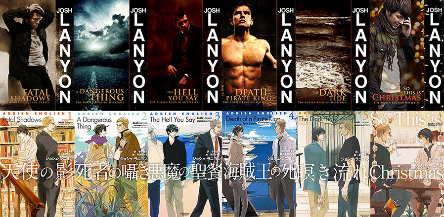

import { Blockquote, Amazon, Series } from '../../../../src/components/blog'

久々にアドリアン･イングリッシュシリーズの1作目[『天使の影』](https://amzn.to/2oekbk6)を読み返したので、感想記事も合わせて書きますね。

この本は私が初めて読んだM/Mロマンス小説で、私をこの世界へ引き込んだ原因でもあります。  
初めて読んだのは5ヶ月ほど前なんですが、久しぶりに読み返してみると、当時は読めていなかった細かい情報が読み取れるようになっていて、自分の英語力の成長を感じられました。

昔、私が受けていたESLクラスの先生が言っていたんですが **「英語学習は筋トレと同じだ」** と。  
1週間やったところで成果は見えないけど、毎日続ければ1年後に振り返った時に、絶対に伸びている。そして、どちらも継続を止めると落ちていく。

もう、本当にその通りだなとつくづく実感します。  
英語学習って勉強と言うより、トレーニングって感じ。

ではでは、毎回のことですが、感想記事は長くなりますし、盛大にネタバレしていますのでご了承ください。  
ただし、シリーズ2～6の内容には触れませんのでご安心を。

**※日本語翻訳版は読んでいないので、各英文の翻訳部分は私の意訳です。間違ってたら教えてください！**

## アドリアン･イングリッシュシリーズ

原書でも日本語翻訳版でも6巻まで出版されていて、完結しているお話です。

<Series name="AdrienEnglishSeries" />

シリーズを通して彼らの関係性が変化していくので、1巻ではほぼ2人の間にロマンス的なことは起きません。  
しかし、ちょこっとだけ私の心をくすぐるようなロマンスの火種が、たまーにチラッチラッと見えるので、もどかしくてページをめくる手が止まらなくなります。

## あらすじ

<Blockquote srcName="天使の影 (アドリアン･イングリッシュ #1)" srcURL="https://amzn.to/2LTouKs">
LAでミステリ専門の書店を営みながら小説を書くアドリアン･イングリッシュの元をふたりの刑事が訪れる。従業員であり友人のロバートが惨殺されたのだ。前日レストランで口論して別れたアドリアンに、殺人課の刑事･リオーダンは疑いの眼差しを向ける。調査に乗り出したアドリアンだったが、犯人の深い憎悪と狂気はやがてアドリアンに向かう。彼の危機に飛び込んで来たのは!?それぞれの運命と向き合う男たちを描き上げたM/Mロマンスの金字塔、ついに刊行。
</Blockquote>

## カップリング

### アドリアン･イングリッシュ (Adrien English)

LAでミステリ専門の書店「Cloak and Dagger」を営みながら、自身も推理小説を執筆している。  
ちょっと長めのダークヘア、青い瞳、色白。  
身長は 5'11 1/2 (181.61cm)でスレンダー。  
32歳、乙女座。  
愛車は Black Ford Bronco。  
Stanford University の文学部を卒業。  
16歳の時に罹ったリウマチ熱により心臓疾患持ち。

### ジェイク･リオーダン (Jake Riordan)

LA警察、殺人課の刑事。  
ナチヘアカットのブロンド、ヘーゼルの瞳。  
身長は 6'3 (190.5cm)で、筋肉質。  
39歳。  
自身がゲイなのを認められないホモフォビア。  
SMクラブ「Ball and Chain」ではご主人様。

## みどころ

### 本格ミステリー＋ゲイロマンス

もともと恋愛だけに焦点を当てた作品は苦手なので、 **「たまたま主人公ゲイで、事件に巻き込まれ、それを解決していく中で、彼及び彼を取り巻く人々の人生を追っていくと、そこにゲイロマンスもある」** な感じのこの作品は、私の好みど真ん中でした。  
単なるエロいBLが読みたい人には向かないですが、ストーリー重視の方には絶対にオススメ。

#### ミステリー

私はミステリーというか、シリアルキラーのお話が大好きで。  
ポッドキャストの[シリアルキラーズ(Serial Killers)](https://www.parcast.com/serial/)という、実在したシリアルキラー達の紹介と考察をする番組は、毎週楽しみにしています。

このシリーズでは、ミステリー自体にトリック等はなく、どちらかというと犯人やその周りの人たちの心情を探っていく感じ。  
ミステリー好きには物足りないかもしれないんですが、複雑に入り組んでいないので、私には丁度いいです。  
複雑だと確実に英語で読んでいて着いていけなくなりそう…。

#### ゲイロマンス

舞台はアメリカ西海岸のLA。  
アメリカの中では比較的ゲイにオープンな地域なんですが、もちろん職種や宗教的にクローゼットな方々もいます。

自身のセクシャリティにオープンなアドリアンと、クローゼットな上にホモフォビアなジェイク。  
現実に有りえそうな設定のおかげで、夢物語で終わらない作品です。

### 深いキャラクター造形
それぞれのキャラクターが大変魅力的。  
キャラクター造形が深いので、自然にストーリーが転がっている感じがします。

ただ単なる恋愛ものでも、ミステリものでもなく、実際に存在する二人の人生を見守っているような気分になる小説です。

### アドリアンのウィットに富んだ話し方

話し方から頭の良さとお育ちの良さが滲み出ているアドリアン。  
まぁ、実際に頭もいいんだろうけど。スタンフォード大学卒ですし。

彼のウィットに富んだ話し方が大好きなんですよね。  
皮肉たっぷりで、ユーモアのセンスが抜群。  
こんな人に会ったら、私も恋に落ちそうだわ。

日本には皮肉を混ぜたジョークを言う文化があまりないので、  
（というか、日本語の「皮肉」と英語の「sarcasm」はちょっと質が違う気がする）  
カナダに来てから、よくそんなポンポン皮肉が出るなーと思いながら、ネイティブスピーカーの会話を聞いていました。  
私のパートナーもよく言っています。

私はこの皮肉を言いまくるスタイルは面白くて大好きなので、私もアドリアンみたいな会話出来るようになりたい！と思い、彼のセリフを口ずさんでみたりしている…。

### ジェイクの苦悩

とりあえず、１巻でのジェイクの言動はかなりクソです（まぁ、本人も分かってるんだろうけど。）  
いかにも刑事って感じで威圧的だし、差別的な発言も多い。  
読みながら、私もアドリアンと一緒になってイライラさせられました。

1巻だけ読むと、「アドリアン、相手は本当にジェイクでいいの？」とすら思うんだけど。  
でも、彼の残りの選択肢はシリアルキラーだけだったからな…。

ただ、彼もゲイである自分を認められずにいて、誰にもカミングアウトしてないんですよね。  
女性と付き合ってますが、「女は好きだ。…男の方がもっと好きなだけ。」なんて、自分の性的嗜好は分かってはいるみたいなんだけど。  
男と恋人関係になるなんてありえないけど、自身の欲望は満たされないので、BDSMクラブでプレイとしてしか男性とセックスできないジェイク。  
なんだか可哀想になってきます。

それにしても、ジェイクの見た目って絶対にゲイにモテると思うのよね。  
そして、長身で筋肉質な体には、レザーがよく似合いそう。

まぁ、とにかく、彼は彼なりに自分のセクシャリティに苦悩していて、その結果としてのクソな言動。  
ホモフォビアなんだけど、アドリアンに惹かれて仕方がない。  
そんな彼が苦悩しながらも変わっていく様を見守って欲しいので、1巻だけで読むのを止めないで！

## 好きなシーンをひたすらあげる

### ファーストネームで呼ぶ

<Blockquote srcName="Fatal Shadows (The Adrien English Mysteries #1)" srcURL="https://amzn.to/2oekbk6" book>
Riordan said, “Give me your keys, Adrien. I’ll check out upstairs. Make sure nobody’s hiding under the bed.”
</Blockquote>

（「鍵をくれ、アドリアン。俺が２階を調べる。誰もベッドの下に隠れていないか確かめないと。」と、リオーダンが言った。）

急にファーストネームを呼んだので、私の方がキュンとしてしまったシーン。  
ジェイクは家で、アドリアンの名前を呟いてみたりしてたのかな？と邪推してしまいます。

### いい男はいつもストレート

<Blockquote srcName="Fatal Shadows (The Adrien English Mysteries #1)" srcURL="https://amzn.to/2oekbk6" book>
Had he been following me? Would he have shot me? And why is it the best looking ones are always straight?
</Blockquote>

（彼は僕を尾行していた？僕を撃つつもりだった？そして、なぜ最高にかっこいい男はいつもストレートなんだ。）

この意見は賛成できないわよ、アドリアン。  
北米では、清潔でファッションにも気を使ってる男性のほとんどはゲイなんだから！  
ストレートでもファッショナブルな日本人男子と違って、北米のストレート男子の服のダサさっぷりは本当に酷い…。

それどころか、ストレートな男性はやたらゲイっぽく見られないように気を使うんですよね。  
トートバッグを持つとか、細身のズボンを履くとか、私からしたら別に普通なんだけど、必要以上に避けようとする。  
そのせいで、やたら太いズボンなんて履いて、ダサく仕上がってる人も多いんですよね。

### クローゼットな人に面と向かってクローゼット嫌い

<Blockquote srcName="Fatal Shadows (The Adrien English Mysteries #1)" srcURL="https://amzn.to/2oekbk6" book>
“Yeah. Monday when you pretended to be looking for prowlers in my closet.” He laughed. “Hey, it’s not much of a closet is it?” “No. It’s not. I don’t like closets. Life’s too short to spend hiding in the dark.”
</Blockquote>

（「あぁ、月曜日、君が僕のクローゼットに不審者を探しに行くふりをした時。」彼は笑った。「おいおい、そんなクローゼットじゃないだろ？」「あぁ、僕はクローゼットな人たちは嫌いだ。人生は暗闇に隠れて過ごすには短すぎる。」）

この時はもちろん、アドリアンはジェイクがゲイだとは知らないわけですが。  
面と向かって、しかもちょっと好意を寄せている相手から「クローゼット嫌い」と言われたジェイクの心情はどうだったのか。  
言葉に詰まり、事務的なことだけ伝えて去っていくジェイク。

### ジェイクとのBDMSなシーンを妄想

<Blockquote srcName="Fatal Shadows (The Adrien English Mysteries #1)" srcURL="https://amzn.to/2oekbk6" book>
Then I got another mental image of him, broad chest covered in blond pelt, muscular forearms, big smooth cock jutting out of a silky nest. Riordan ordering me down on my knees, his hand tangling in my hair as he pulled my head toward his heat.
</Blockquote>

（そして、彼の別のイメージが浮かんだ。ブロンドの胸毛に覆われた強靭な胸板、筋肉質な二の腕、シルクの巣から飛び出た大きく滑らかなペニス。リオーダンが僕に膝を折るよう命令し、彼の手が僕の髪を掴み、僕の頭を彼の熱へと引き寄せる。）

むしろ見たい。このシーンを見たい。

アドリアンはBDMSの趣味はないと言ってますが、瞬時にこのような自分が受け身側のイメージが浮かぶあたり、全く願望がない訳ではなさそうな気がするんですけどね。

### 危険な香りが漂う

<Blockquote srcName="Fatal Shadows (The Adrien English Mysteries #1)" srcURL="https://amzn.to/2oekbk6" book>
“Am I coming on too strong? I feel like there’s kind of a connection between us. I felt it that first day. At the funeral. Is it just me?”
</Blockquote>

（「強引過ぎる？俺は、俺たちの間に何か繋がりがあるように感じたんだ。最初に出会った日に。葬式で。そう感じたのは俺だけ？」）

一見ロマンチックにも聞こえるブルースのセリフ。  
1冊通して彼の発言は、いつも甘さと危険さを伴っていて、読みながら警戒する気持ちが強くなって行きました。

そして、ロマンチックな言葉を言われてみたいという女心はあれど、個人的にこんなセリフを吐く男は信用ならない。

### 冬の寒さと雨音と恋人

<Blockquote srcName="Fatal Shadows (The Adrien English Mysteries #1)" srcURL="https://amzn.to/2oekbk6" book>
Listened to pinpricks of rain against the windows. The wettest winter since El Niño, everyone kept saying. That’s something I missed, lying in bed listening to the rain with someone I loved. That’s something I missed, having someone I loved.
</Blockquote>

（窓を叩く雨音を聴く。エルニーニョ以降、一番雨の多い冬だとみんなが言っている。僕が恋しいもの、愛する人とベッドに横になり雨音を聴くこと。僕が恋しいもの、愛する人がいること。）

すごく共感できるアドリアンの独白。  
北米西海岸は冬でも0度を下回ることが稀なくらい温暖なんですが、その分、毎日雨が降る。しとしとくらいの雨がずーっと続くんです。

毎日暗くて雨だと、太陽の光を浴びれないので、気分が落ち込み、だんだんと辛くなってくるので、ビタミンDの摂取が欠かせません。冬季鬱と言われています。

でも、恋人がいると、雨で家に引きこもっていても、二人で映画でも見ながら、のんびりゴロゴロできるので、幸せを感じられるんですよね。

私もパートナーと「今はお互いがいるから冬でも辛くないね」と、毎年冬が来る度に言い合っている気がする。

### ジェイクに惹かれてしまう

<Blockquote srcName="Fatal Shadows (The Adrien English Mysteries #1)" srcURL="https://amzn.to/2oekbk6" book>
Riordan was not remotely my type. Even without the whips and canes and butt plugs. I don’t understand the wish — let alone the need — to be dominated, controlled. Not presuming to judge, just not something I wanted for myself. And yet. And yet there was something about his strength, his arrogance, his sheer size that got under my skin. He probably couldn’t even spell vanilla. He was probably selfish in the sack. Probably selfish and greedy and … unsophisticated. And hung like a horse.
</Blockquote>

（リオーダンは僕のタイプから掛け離れてはいない。鞭打ちやアナルプラグが無かったとしても。僕にはその支配され、管理されたい願望ー必要性は言うまでもなくー理解できない。ジャッジされるからではなく、ただ僕が自分にとって欲しいものではないだけだ。それなのに。それなのに、彼の強さや傲慢さ、単に彼の大きな体も、僕の興味をそそる。彼はおそらくvanillaすら正しく書けない。おそらくベッドでも自分勝手だろう。きっと、自分勝手で、貪欲で、…手馴れてない。そして、巨根。）

ちょっと最後の巨根で笑ってしまったんだけど。

威圧的で差別的な発言をされても、それでも、どうしてもジェイクに惹かれてしまうアドリアン。

「vanillaのスペルすら綴れない」の部分は、BDMSで言う所の **Vanilla Sex (SM要素のない普通のSEX)** をしたことない？もしくは出来ない？って言ってるんでしょうか。

しかし、正直なところ、この時点では「いや、でも、彼はやめとこうよ。」とアドリアンの肩を叩きたくなってしまいます。

### ジェイクの匂いと温もりが残るジャケット

<Blockquote srcName="Fatal Shadows (The Adrien English Mysteries #1)" srcURL="https://amzn.to/2oekbk6" book>
He shrugged out of his suede jacket, tossed it to me. It felt like something newly dead hanging there in my hands. After a moment I fumbled my way into it. It was warm from his body and carried the scent of his soap.
</Blockquote>

（リオーダンは肩をすくめてスエードのジャケットを脱ぎ、僕へ放った。僕は手にぶら下がっているものが、何か新しいもののように感じた。すぐにそのジャケットに袖を通す。彼の体温が残るジャケットは温かく、ソープの残り香がした。）

昔からロマンスには欠かせない、ジャケットを掛けてあげるシーン。  
じんわり伝わる体温と、ジェイクの残り香で少し落ち着きを取り戻すアドリアン。

使い古された手ですが、想像するとやはりキュンとしてしまいますよね。

### 口が減らない

<Blockquote srcName="Fatal Shadows (The Adrien English Mysteries #1)" srcURL="https://amzn.to/2oekbk6" book>
“I told you to call me last night.” “I wasn’t home last night. I left a message for you this morning.” “Just shut up and listen.” “Well since you ask so nicely … .” There was silence. I listened. He didn’t say anything. “Are we communicating through the Psychic Hotline or what?” “Shut up a sec,” he said from between his pearly whites.
</Blockquote>

（「俺は昨日の夜に電話するよう言ったはずだ。」「昨日の夜は家にいなかったんだ。今朝、君にメッセージを残しただろ。」「黙って聞け。」「君がそんなに丁寧に頼むのなら…」沈黙。僕は耳を澄ます。彼は何も言わなかった。「僕らは超能力電話か何かで話してるの？」「少し黙れ。」彼は真珠のように白い歯の間から言った。）

アドリアンの皮肉が炸裂してます。  
もう、彼ってホントに「口が減らない」という言葉がぴったり。  
本人もディベートは得意だと言っていましたもんね。

そして、シリーズを通して、ジェイクは全然口でアドリアンに勝てない。  
ジェイクの方が「もう黙ってくれ…」と、やり取りの途中で折れるシーンはこれからも度々出て来るので、今からニヤニヤしてしまいます。

### 殺人鬼と生でセックス

<Blockquote srcName="Fatal Shadows (The Adrien English Mysteries #1)" srcURL="https://amzn.to/2oekbk6" book>
He pushed in and I had to bite my arm to keep from crying out. It wasn’t just the lack of preparation; he wasn’t wearing a condom. Jesus. I remembered telling Riordan I was strictly a safe sex guy, and now here I was engaging in unprotected sex with a homicidal maniac. Define safe, Adrien.
</Blockquote>

（彼が挿入し、僕は叫び声を上げないように腕を噛まないといけなかった。それは、ただ前戯が足りなかっただけではなく、彼はコンドームを着けていなかった。ジーザス。僕はセーフセックスを徹底する派だとリオーダンに言った矢先に、今ここで殺人鬼と生でセックスしているなんて。コンドームの意味分かってるのか、アドリアン？）

彼の言い回しにちょっと吹き出してしまいました。  
「セーフセックスを徹底する派だと言った矢先に、殺人鬼と生でセックスしているなんて！」

シリーズを通して、このような自分へのツッコミが多いアドリアンですが、その度に、「君、割とまだ余裕あるよね？」と思ってしまいます。

### 大丈夫か、ベイビー？

<Blockquote srcName="Fatal Shadows (The Adrien English Mysteries #1)" srcURL="https://amzn.to/2oekbk6" book>
“Okay, baby?” Riordan was walking toward me. I realized he was talking to me.
</Blockquote>

（「大丈夫か、ベイビー？」リオーダンが歩いて僕の方に向かってきた。だから彼が僕に対して話しかけているんだと気づいた。）

一番盛り上がったシーンじゃないでしょうか？

そして、この後、抱き寄せるリオーダンと、ただ彼の心音を聞いているアドリアン。  
二人とも何も言わずに抱き合うシーンに、書かれてはいないけど、二人の間に何か感じるものがあったんだろうなと思います。

気になったのは、アドリアンとブルースがセックスしていた一部始終を、ジェイクは聞いていたわけで。  
そこでおそらく嫉妬のような感情を抱いたことも、クローゼットな彼がアドリアンとの関係を少しだけ進めてみようと思うきっかけになったのかな。

### 最高のエンディング

<Blockquote srcName="Fatal Shadows (The Adrien English Mysteries #1)" srcURL="https://amzn.to/2oekbk6" book>
His glance slid my way. “You know, this won’t be an easy thing, Adrien.” An officer-involved shooting was not going to be fun, righteous or not. “The investigation you mean?” “No.” He gave me that crooked smile. “No, I don’t mean that.” I stared out at the first blush of sunrise lighting the surrounding Chatsworth hills. Despite myself, I started to smile.
</Blockquote>

（ジェイクが僕の方をチラッと流し見た。「簡単に行かないのは分かってるだろ、アドリアン。」警察官が絡んだ銃撃戦は楽しくない、正当防衛だろうとなかろうと。「捜査のこと？」「違う。」彼は僕にその少し曲った笑みを見せた。「違う、そう言う意味じゃない。」僕は周囲のチャッツワースの丘を染める朝焼けを眺めた。意に反して、僕は笑みを隠せなかった。）

エンディングがおしゃれすぎる、素敵すぎる。  
こんな終わり方されたら、即2巻を開かないといけないじゃないですか。

赤面しているのはアドリアンの方だと思うんだけどね、とニヤニヤしてしまったシーン。  
blush of sunrise （朝焼け）とアドリアンの blush（赤面）をかけてるんじゃないのかな。

そして朝日の眩しさ、美しさが、彼らの今後を指し示すようで素敵ですね。

---

ということで、1巻の終わりでようやくスタート地点に立った2人。  
1巻だけ単体で読むと、ほぼロマンスはないし、物足りなさを感じる人は多いかもしれません。  
しかし、ここからなので！ここからなので、ぜひ1巻で読むのを止めないで欲しい。

そしてシリーズ最終巻まで読んで、この1巻に戻って来ると、もう何だか感慨深くて。  
最初に読んだ時とは、また違った感想が湧いてきます。

## 書籍紹介

### 原書

<Amazon
  asin="B007ZRH38I"
  title="Fatal Shadows (The Adrien English Mysteries #1)"
  linkId="bd33facb93fd9be921ae4a1b8a37ebd9"
  author="Josh Lanyon"
/>

### 日本語翻訳版

<Amazon
  asin="B00KW25SO4"
  title="天使の影 (アドリアン･イングリッシュ #1)"
  linkId="492d12015b0bab90543171c3968d30df"
  author="ジョシュ･ラニヨン"
  KindleUnlimited
/>