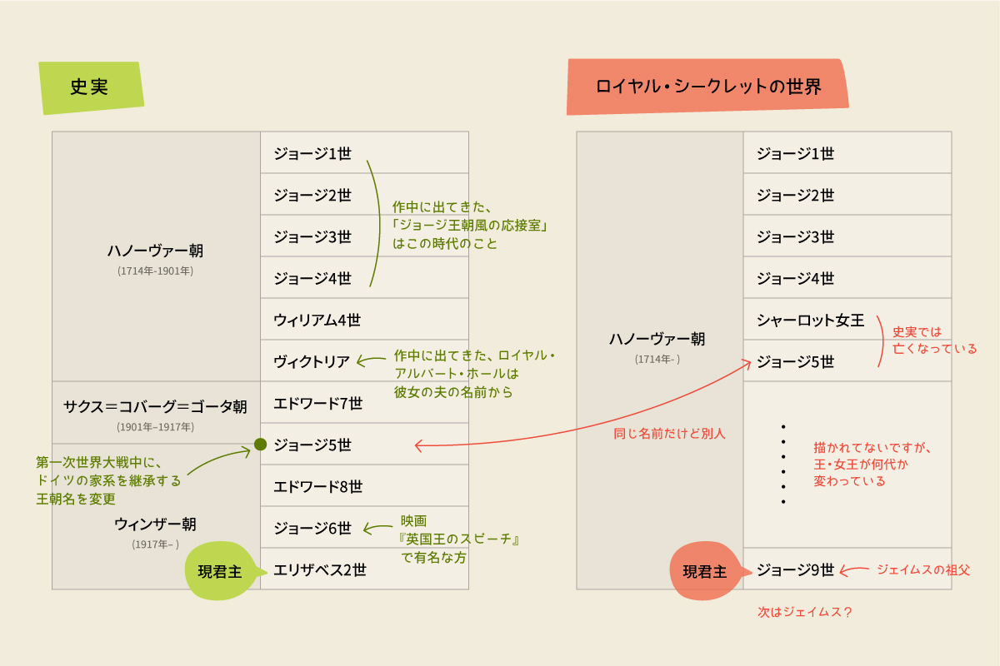

import { Blockquote, Amazon, Twitter } from '../../../../src/components/blog'

先日、私が運営する[M/Mロマンス（海外BL小説）コミュニティ](/mm-romance/community/)内で、「M/Mロマンス小説に出てくるキャラクターで、もし自分が付き合うとしたら誰がいい？」というトピックで話していた時に、本作のベンが激推しされていまして。「それは読まなくては！」と一気読みした今作。

想像以上に熱くて甘い恋人たちのロマンスって感じの作品でした😆  
さっそく感想を書いていきます！

**※各英文の翻訳部分は私の意訳です。間違えていたら教えてください！**

## あらすじ

<Blockquote srcBook="hisRoyalSecret" lang="jp">
ニュース配信社の記者、ベンジャミンは、英国の次期国王ジェイムス皇太子を取材するためケニアにやってきた。滞在先のホテルの中庭で出会ったのは、あろうことかジェイムスその人だった。雨が上がるまでの時間つぶしに、ベンの部屋のテラスでチェスを始めた二人は、駒を取られるたびに一つ秘密を打ち明ける取り決めをする。それは軽いゲームのはずだった。しかしいつのまにか二人の間に不思議な感覚が通い始め―。世界で一番秘密の恋が、いま始まる。
</Blockquote>

## カップル

### ジェイムス

英国皇太子、後に摂政皇太子。29歳。  
茶色い髪に、グリーンの瞳、色白。  
身長は低め（とは言え、白人なので170cm台の半ばくらいはありそう）  
血色のいい赤い唇。

私の中では典型的な、ほっぺがすぐ赤くなるタイプのイギリス人イメージで読みました。

### ベン（ベンジャミン･ダーハン）

経済系のニュース記者。  
ダークヘアに、ダークブラウンの瞳。  
イスラエルで生まれ、13歳で両親と死別し、遠い親戚に引き取られてドイツへ。

王子様なジェームスに対比するようなちょっとワイルドめなイメージだったので、肌の色も日焼けした感じを想像してたんですが、ストーリーの途中で、ベンも結構肌は白いと描写があって、急いで脳内イメージを書き換えた思い出。

### その他の登場人物

登場人物がね、多いんですよ…。でも、これ以上削れないよなーとも思う。

#### ジェイムス側

- インディゴ（アメリア･カロライン･ジョージアナ）ジェイムスの妹、不安障害持ち
- キンバリー･ツェンジェイムスの補佐

- キャス（カサンドラ･ロクスバラ）ジェイムスの親友で、彼の恋人役を演じている
- スペンサーキャスの恋人

- ジョージ9世ジェイムスの祖父、現イギリス国王、作中に脳卒中で倒れる
- ルイーザ王妃ジェイムスの祖母、現イギリス王妃

- エドマンド皇太子ジェイムスの父、飛行機事故で他界
- ローズ妃ジェイムスの母、飛行機事故で他界

- クラレンス公リチャードジェイムスの父、エドマンド皇太子の双子の弟、王位を狙う
- アルバーテリチャードの妻、元スウェーデンの王女
- ニコラス王子リチャードの長男、ジェイムスやインディゴのいとこ

- グローヴァージェイムスの執事
- ハートリーインディゴの執事、78歳

- ゼイル王子ギリシアとデンマークの王子、インディゴのお見合い相手

- ハッピー&グローリアスクラレンス･ハウスで飼われているコーギー

#### ベン側

- ワーナー･クリフトンベンの初恋の相手

- フィオナ･ド･ウィンターベンの上司、グローバル･メディア社のロンドン支局を率いる女性
- ロベルト･サンティエステバンベンの同僚、アフリカ系アメリカ人

Twitterで [kasumi(@kasumi_novels)](https://twitter.com/kasumi_novels) さんによる人物相関図が公開されてます！みなさん、これを片手に読みましょう😊

<Twitter id={'1333235114784899072'} />

## イギリス王家のリアルとフィクション

現イギリス及び史実と、ロイヤル･シークレット内での設定を比較していきます。  
ストーリーに関係ない話が続きますので、興味がない方は[次のパート](#無駄のない読み心地)へと進んでくださいね。

### イギリス王朝の違い

みんさんご存知、イギリスの現君主はエリザベス2世ですよね。

_Source : [Wikipedia](https://ja.wikipedia.org/wiki/%E3%82%A8%E3%83%AA%E3%82%B6%E3%83%99%E3%82%B92%E4%B8%96)_

しかし、作中での現イギリス国王はジェイムスの祖父であるジョージ9世であり、王朝も実際は[ウィンザー朝](https://ja.wikipedia.org/wiki/%E3%82%A6%E3%82%A3%E3%83%B3%E3%82%B6%E3%83%BC%E6%9C%9D)なんですが、作中では[ハノーヴァー朝](https://ja.wikipedia.org/wiki/%E3%83%8F%E3%83%8E%E3%83%BC%E3%83%B4%E3%82%A1%E3%83%BC%E6%9C%9D)になっていました。

作中に現在の歴史とどう違うのか、チャプター6でチラッと解説してあったんですが、

<Blockquote srcBook="hisRoyalSecret" lang="en" book chapter="6">
It turned out the survival of the House of Hanover had been very much at risk in the early nineteenth century, when King George III had only one legitimate grandchild, Princess Charlotte.
一九世紀初頭、ハノーヴァー家は存続の危機に見舞われた。ジョージ三世の跡を継ぐ者が、嫡出の孫、シャーロット王女だけだったのだ。
The fragility of the royal line had become even more apparent when the princess very nearly died giving birth to her one and only son.
最大の危機は、王女が出産で命を落としかけたときだった。
But thanks to the use of forceps—then a newfangled medical device distrusted by many—both she and her son survived to become Queen Charlotte and King George V, respectively.
だが、鉗子を使ったおかげで──当時は新奇な医療道具だとして使用が憚られていた──母親も、男の赤ん坊も命が助かった。このふたりこそ、のちのシャーロット女王とジョージ五世である。
</Blockquote>

史実ではジョージ3世の孫娘である[シャーロット王女](https://ja.wikipedia.org/wiki/%E3%82%B7%E3%83%A3%E3%83%BC%E3%83%AD%E3%83%83%E3%83%88%E3%83%BB%E3%82%AA%E3%83%BC%E3%82%AC%E3%82%B9%E3%82%BF%E3%83%BB%E3%82%AA%E3%83%96%E3%83%BB%E3%82%A6%E3%82%A7%E3%83%BC%E3%83%AB%E3%82%BA)は、息子を死産した際に共になくなっているのですが、今作では息子共々助かって、後にシャーロット女王、ジョージ5世になった、という設定のようです。

表にするとこんな感じ。

やはり[『英国王のスピーチ』](https://www.amazon.co.jp/dp/B015PAW9H6?tag=muchimemo-22)や[『ザ･クラウン』](https://www.netflix.com/jp/title/80025678)のように史実を元にしたお話じゃない場合は、パラレルワールドにしておく必要があるのかな？

ただ、作中に[ロイヤル･アルバート･ホール](https://ja.wikipedia.org/wiki/%E3%83%AD%E3%82%A4%E3%83%A4%E3%83%AB%E3%83%BB%E3%82%A2%E3%83%AB%E3%83%90%E3%83%BC%E3%83%88%E3%83%BB%E3%83%9B%E3%83%BC%E3%83%AB)は出てくるんですよね。  
「それはあるのかよ！」とツッコミをいれてしまったんだけど😅  
ヴィクトリア女王の夫の名前なんですが、今作の設定ではヴィクトリア女王は存在していないので。  
きっと、描かれて無い歴史のどこかに別のロイヤル･アルバートさんがいたんでしょうね。

### デンマークとギリシャの皇子

インディゴのお見合い相手として、デンマークとギリシャの皇子であるザイル王子が登場しました。

現イギリス女王エリザベス2世の夫であるフィリップ殿下は、もともとギリシャ王室の生まれで、デンマークとギリシャの皇位継承権を持っていた（もちろん結婚するときに放棄している）ので、それを設定に取り入れてるのかな？

### イギリスでの同性婚

ジェイムスがカミングアウトできない理由の1つとして上げられていたのが、カミングアウトによって王族が政治介入してしまうかもしれない、という懸念。

<Blockquote srcBook="hisRoyalSecret" lang="en" book chapter="4">
“If I come out before the House of Lords rules on gay marriage, that becomes a de facto political statement, and I may have violated the constitution.”
「貴族院が同性婚を可決する前に私がカミングアウトしてしまったら、事実上、政見を示したことになり、憲法に違反することになる」
</Blockquote>

実際の貴族院（上院）は、2013年7月15日に同性婚法案を賛成多数で可決しているんですが、今作ではまだ可決されていない、という設定のようです。

まぁ、ロマンスへの障害は多ければ多いほど燃えあがりますもんね😊

### 英国国教会とLGBT

もう1つ、ジェイムスのカミングアウトに対して、問題になるとされていた[英国国教会](https://ja.wikipedia.org/wiki/%E3%82%A4%E3%83%B3%E3%82%B0%E3%83%A9%E3%83%B3%E3%83%89%E5%9B%BD%E6%95%99%E4%BC%9A)との関係。

<Blockquote srcBook="hisRoyalSecret" lang="en" book chapter="1">
“I have to become Supreme Governor of a church that’s leaning more strongly away from supporting gay clergy and gay marriage."
国王になったら、英国教会総裁も務めることになる。
“I have to lead a country that’s inching toward being progressive but is absolutely not ready for a gay king."
教会はゲイの聖職者にも、同性婚にも強く反対する立場をとっている。
</Blockquote>

まぁ、現時点では現実世界でも、英国国教会は同性の結婚を許可していません。

ただ、つい先日（2020/11/9）、英国国教会が2022年までにLGBTQ+の問題に対する姿勢を見直す可能性がある、というニュースが流れたので、あくまで可能性なんだけど期待したいですね。

[Church of England could rethink stance on LGBTQ+ issues by 2022 | Anglicanism | The Guardian](https://www.theguardian.com/world/2020/nov/09/church-of-england-could-rethink-stance-on-lgbtq-issues-by-2022)

### コモンウェルスとLGBT

さらにもう1つ、ジェイムスのカミングアウトに対して、問題になるとされていた[コモンウェルス](https://ja.wikipedia.org/wiki/%E3%82%A4%E3%82%AE%E3%83%AA%E3%82%B9%E9%80%A3%E9%82%A6)。

<Blockquote srcBook="hisRoyalSecret" lang="en" book chapter="1">
“As Prince Regent, I’m not only the head of state for the United Kingdom, I’m also the head of the Commonwealth of Nations.”
摂政皇太子として、私は目下、英国君主であるだけでなく、英連邦加盟国の首長でもあるんだ。
“Some states in the Commonwealth would accept a gay man as their symbolic leader, but some of them definitely would not.”
ゲイの首長を容認する国もあるだろうが、断固拒否する国もあるはずだ。
“Does Uganda opt out? What about Malta, Rwanda, Pakistan? Does the Commonwealth survive their departures?”
ウガンダは脱退するかもしれない。マルタやルワンダ、パキスタンだってわからない。英連邦は解体の危機に陥るかもね。
</Blockquote>

実際、54の加盟国のうち、同性婚が合法なのは19カ国のみで、34カ国での同性愛は依然として犯罪なんですよね😥  
上でジェイムスが上げているウガンダ、ルワンダ、パキスタンもしかり。

ただ、マルタでは2017年9月1日から同性婚が合法化されました✨

気になったのが、マルタって同性婚が合法化されたこと自体は最近ですが、むしろこの国はヨーロッパの中でも同性愛への理解が進んでいる国の1つだと思っていたので、ジェイムスがマルタをウガンダ等の国と並べて語ってるのが疑問だったんですよね🤔  
以前は違ったのかしら？でも、こういう問題って急には変わらないですよね。ご存知の方がいたら教えて欲しい。

### Red, White & Royal Blue

余談ですが、同じくゲイのイギリス皇太子のロマンスを描き、2019年のGoodreadsのロマンス部門と新人賞に輝いた小説[『Red, White & Royal Blue』](https://www.amazon.co.jp/dp/B07J4LPZRN?tag=muchimemo-22)。

アメリカ大統領の息子とイギリス皇太子のロマンス、というトンデモ設定なんだけど。  
この本の設定も事実とはちょっとだけ変えてあるんですよね。

2016年にヒラリーさんとトランプさんが争った大統領選挙で、ヒラリーさん的ポジションの女性大統領（主人公アレックスの母親）が誕生していたら？というパラレルワールドになっています。  
なので、当たり前のようにオバマさんの名前や、カナダのトルドー首相の名前も出てくる。

ロイヤルシークレットに比べて、主人公カップルの年齢がどちらも20代前半と若いので、話の流れも軽く、現代の若者感があるなーと思いながら読みました。

来年の初旬に日本語翻訳本が出版されるそうなので、こちらも楽しみですね😊

<Amazon book="redWhiteRoyalBlue" />

さて、長くなりましたが、そろそろロイヤル･シークレットの感想に入ります。

## 無駄のない読み心地

正直に言うと、私はこのような1冊まるまる恋愛について語っているような本は、途中で飽きてしまったり、最後まで読んでも「うん、それで？」みたいな感想しか沸かなかったりするんだけど。  
（どうしても死体とか出てくる話の方が好きで…）

そんな私でも一気読みできるほど、ストーリーに無駄が無く、飽きることなく読めました。  
とにかくこの作者さん、小説を書くのが上手いんだと思います。

2人の心情の変化に関しても、唐突なこともなく、違和感もなく、だんだんと変化していく様子が素晴らしい。

また、私はイギリスに住んだことも無ければ、ロイヤルファミリーに対する知識もなく、イギリスに対するベーシックな情報があまり無い状態で読んだんですが、それでも全然スルッと読めるんですよね。小難しくなく、説明し過ぎるわけでもなく。

それでいて、ジェイムスを取り巻く環境が、どこかリアルに感じました。  
（実際にどのくらいリアルなのかは分からないけど）

それにしても、作中で描かれていたようなイギリス王室に対するゴシップ記事には心底うんざりさせられますね、低俗😒

## どこまでも誠実で可愛いジェイムス

とりあえず、イギリス皇太子といっても、お伽噺に出てくるようなキラキラ王子じゃないんですよ。

富も権力もあって、特殊な環境で育ったジェイムスですが、もうどこまでも誠実なんです。  
全く擦れてなくて、傲ることもなくて。  
もういい人過ぎませんか？

妹への愛に溢れ、キャスへの愛も深くて。

さらに、いい人なだけじゃなく、彼の内面がとにかく可愛らしくて堪らない💕

例えば、

ゲイクラブに行ったことがない王子のために、ベンがゲイクラブごっこをしてくれるシーン。  
ジェイムスはいたくお気に召した様子で、バカ正直に自分の今後のおかずについても語るんですよ。もう可愛い！

<Blockquote srcBook="hisRoyalSecret" lang="en" book chapter="5">
He’d daydream about this every time he needed to get himself off, from now until—
これからずっと1人でする時は、このシチュエーションを思い出すだろう。
</Blockquote>

また、ベンのアパートへ訪れ、部屋までの階段を上がる瞬間。  
もう、これだから王子様は…て思っちゃう発言。

<Blockquote srcBook="hisRoyalSecret" lang="en" book chapter="7">
Good God these steps were narrow, was that allowed? Wasn’t there some sort of ordinance?
階段の狭さときたら……合法なのか、これは？条例か何かでサイズとか決まっていないのか？
</Blockquote>

他にも、

恋人の小さなアパートで週末を過ごすことに喜んでたり、  
狭いトイレにジョークを言ったり、  
ショッピングカタログの商品を衝動買いしようとしたり、  
アパートで聞こえてくる上の階の人の生活音に反応したり、  
チキン･ティッカ･マサラに大喜びしたり、  
そこらの公園で散歩することを喜んだり、  
マスタードが黄色過ぎると思ったけど意外と美味しかったり、

などなど。

もうジェイムスの身悶えするような可愛いエピソードが多すぎるのよ🙈

## ワイルドさとインテリジェンスを併せ持つベン

非の打ち所がないと思いませんか？この男。

いや、ジェイムスはジェイムスですごくいい子で可愛いって感じだったんですが、ベンはもう理想の男って感じ？

まず、ジェイムスに比べるとワイルドなイメージがありますよね。  
いろいろな国を渡り歩いていたり、ゲイクラブで遊んでたり、ジェイムスへの命令口調の時とかすっごくセクシーだったり。

でもそれだけじゃなく、新聞記者としてもすごく頭の切れる人で。  
かと言ってそれを鼻にかけるわけでもなく、普段から努力も怠らないし。  
ジェイムスに負けず劣らず誠実な人ですし。

何より、繊細で相手のことをとにかく考えてくれる人だな、と。

彼は今まで特定の相手を作らないようにして生きてきた人けど、ベンが本気で相手を愛し始めたら、もう堪らないだろうなと思えてならない。

## 孤独な2人の間で起きる化学反応

王族という重い立場に生まれ、さらにゲイということを隠し、本当の自分との違いに葛藤するジェイムス。

自分が望むキャリアを手に入れ、定住せず、自由を謳歌しているように見えて、愛を知らず、むしろ自分から愛を遠ざけるようにして生きてきたベン。

そんな孤独な2人が出会うんですけど、それぞれの人生に足りなかったピースがガチーッとハマる感じといいますか。もうお互い以外いないって感じなんですよ。  
そんな相手と出会えてよかったね、と思えてなりません。

また読みながら、ベンの孤独感については、ちょっとだけ分かるなーと思いました。

私もベン程じゃないですが、3年ほどフィリピンやカナダに住みながら、スーツケース2つだけを持って生活したことがあるんです。  
最初の1〜2年は全然大丈夫で、むしろフットワーク軽く引っ越せるのが快適だったんですけどね。

常に家具付きのアパートに住んでたんですが、やはり自分の家ではない感が日に日に増してくるんですよ。  
部屋の家具は自分で選んだ好みの物じゃないし、基本的に安物が置かれていて見栄えも悪く、愛着も沸かず、じわじわと気持ちがすり減っていくと言うか、孤独感が募っていきました。

3年ほど前の引越しを機に、定住しようと家具を買って自分の部屋を作り始めたんですが、些細なこととは言え、日々感じる安らぎは違うと思います。

ただ、定住したらしたで、ちょっとだけまた他の国へ飛び出したい欲も出てきてるので、もしベンがジェイムスと暮らすようになったら、普段は平気でも、また世界を自由に飛び回りたい！なんて思いそうな気もします。

## お互い秘密を賭けたチェス

今作最大の見せ場！  
物語が始まってすぐなんですが、私が1番好きなシーンです😍

このゲームをしている時の2人の空気感がたまりません。

まず、秋のケニアで降りしきる雨という情景がいい。部屋の中にいても、雨の匂いや湿度、気圧まで感じられそうで。

そして、ホテルの一室でチェスの駒を1つ取る毎にお互いの秘密を打ち明ける、というゲームを始める2人。  
ジリジリとお互いに惹かれ始めるんだけど、決定的な言葉は口にせず、探り合うような緊張感のある会話を繰り広げます。

最終的にゲームに勝利したジェイムスに対して、ベンが告げた最後の秘密がこちら。

<Blockquote srcBook="hisRoyalSecret" lang="en" book>
“My final secret is this.”
「俺の最後の秘密は、」
Ben took another sip of his rum, then said,
ベンはラムをもう一口飲み、そして言った。
“I want you. And I know you want me too.”
「お前が欲しい。お前もそう思ってるだろ。」
</Blockquote>

きゃ〜〜〜〜💕

そして、口にしたが最後、一瞬にして燃え上がる炎の熱量にもうドッキドキでした😆

日本語翻訳版の表紙もこのシーンですが、雰囲気がとっても素敵ですよね😊

## 燃え上がる恋

予想以上にSEXシーンが多い作品だったんですが、冗長にはなることなく、どのシーンも濃密で熱い！  
とろけるような熱いM/Mが読みたければ、コレ！って感じです。

数えてないけど、1冊の中で結構な回数いたしてますよね。あれやこれやとシチュエーションを変えて。  
2人の中で「割り切った関係」と決めているのもあって、ムードを作る等の時間が発生しないで急にベッドシーンが始まることも多くて。

ただ、次の巻では、もう少し事件が起こって欲しいなぁとも。

良くも悪くも、2人の甘い世界がひたすら描いてあるし、ちょっと君ら恋に盲目過ぎやしないか？と、ツッコミたくもなったんだけど（そこが可愛くもあったんだけど）、これからカミングアウトで起こるであろうドラマが楽しみです。

## イギリス英語

カナダに住んでいるので、普段話す言葉も、見る映画やドラマや本もアメリカ英語が多い私にとって、ちょいちょい出てくるイギリス英語が興味深かったです。ちょっとよく分からない表現もあったけど😅

例えば、

<Blockquote srcBook="hisRoyalSecret" lang="en" book>
Concentrate on the <strong>bloody</strong> game.
ゲームに集中しろ
</Blockquote>

チェスの最中のジェイムスの内心。アメリカ英語だとたぶん fucking game になるところが、bloody game なのよね。

これはほんの一例ですが、普段使う単語とは違うなーとか、言い回しが違うなーと思う部分が多くて興味深かったです。

## 初老の執事が好きです

昔から映画等に出てくる初老の執事が大好きなんですよ。

今作でもジェイムスとインディゴの執事、グローヴァーとハートリーが出てきて、やっぱり執事という存在に堪らないロマンを感じてしまうんですよね、私。

インディゴを孫のように愛してるハートリーのセリフが素敵。

<Blockquote srcBook="hisRoyalSecret" lang="en" book chapter="5">
“I just hope he likes me.”
「王子が私を気にいるといいんだけど。」
“He will if he has any sense,” James replied.
「気にいるさ。王子がまともならね」とジェイムス。 
Hartley handed Indigo her tea and added,
ティーカップをインディゴに手渡しながら、ハートリーが付け加えた。
“And if he has any eyes.”
「そして目がちゃんとついておりましたらね」 
</Blockquote>

## 親友のキャス

主人公たち以外のキャラクターもしっかりしているんですよね、このお話。

特にジェイムスの親友であり、彼女役を長年引き受けてくれたキャスは、本当に素敵な女性。

特にジェイムスがカミングアウトする決心を打ち明けた時のセリフが好きでした。

<Blockquote srcBook="hisRoyalSecret" lang="en" book chapter="9">
"Maybe I’m not ready for everyone to find out I’m just a woman like any other.”
「だって私が、どこにでもいる普通の人だってみんなにばれてしまうでしょ。」
</Blockquote>

学生の頃から、他の女の子たちと違ってジェイムスの気を引こうとするわけでもなく、自分の思うままに生きている彼女。

ジェイムスの彼女という設定のため、常にゴシップ誌からも、それを読んでいる読者たちからも「ビッチ」扱いされているんだけど、全然気にする素振りさえ見せないキャス。ジェイムスとの友愛が確かなものなんだな、と感じさせられる。

そんな彼女が発したセリフで、「破天荒な王子の彼女」という役がいつの間にか彼女のアイデンティティの1つになってたんだな、と思えて。

自分というものをしっかりと持っていて、世間に流されず、自由に生きているような彼女がこのセリフを言ったことで、キャスを身近に感じるというか、完璧な人間なんていないんだな、というか、さらにキャスのことが好きになりました。

## 続巻に期待

ただ、正直なところ、1巻だけだと物足りない。

この1冊だけじゃ、イギリス王室が舞台という設定が飛び抜けてるだけであって、ストーリーはロマンスによくある「運命の人と出会って大恋愛の末に結ばれて末永く幸せに暮らしましたとさ」的なお話なんですよ。

ずーっと2人だけの世界で盛り上がってる感じ。

1冊かけてやっとプロローグが終わったというか、起承転結の起と承が終わったんじゃないかと思います。

ですので、きっと2巻で、もっと私の心をかき乱してくれるような事件が起き、それを2人が乗り越えていくようなエピソードがあることを期待しています✨

## 書籍紹介

<Amazon book="hisRoyalSecret" />
