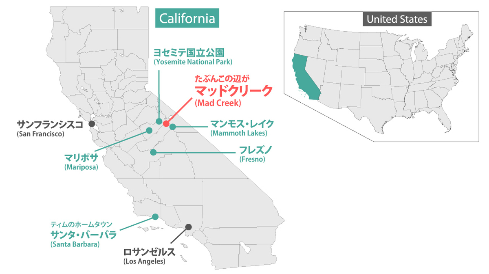

import { Blockquote, Amazon, Series, InternalLink, Twitter } from '../../../../src/components/blog'

現実的でシリアスなお話が好きなので、ドッグシフターたちのお話と聞いて敬遠してたんですが、読んでみると非常にコミカルで可愛いく、すっかり大好きになってしまいました。  
何事も食わず嫌いはいけませんね。

何より犬が可愛い。

**※日本語翻訳版は読んでいないので、各英文の翻訳部分は私の意訳です。間違ってたら教えてください！**

## 月吠えシリーズ

現在5巻まで発売されていて、今回はこの1冊目。  
1冊ごとにフォーカスするカップルは異なりますが、5冊通してドッグシフターたちが暮らす街、マッドクリークが舞台になっていて、少しずつタイムラインは動いていきます。

<Series name="HowlAtTheMoonSeries" />

ちなみに原書の方は [Kindle Unlimited](https://www.amazon.co.jp/kindle-dbs/hz/subscribe/ku/?tag=muchimemo-22&passThroughAsin=B0176KQPH8) で読めるのでお得ですよ。

## あらすじ

<Blockquote srcBook="howToHowlAtTheMoon" lang="jp">
人生に挫折したティムはひとりマッドクリークにやってきた。新種のバラをつくることで負け犬人生をやり直そうと。 
ところがその街には秘密があった。そこは犬シフターたちが暮らす犬たちの楽園だったのだ。 
よそ者にも優しいその街で、鋭い眼差しでティムを見つめる保安官･ランス。彼はティムがマリファナ栽培に関わっているのではないかと疑っていた。そこでボーダーコリーの姿で彼の車の前に飛び出しティムの家に潜入する。ティムの誠実な心に触れたランスは、翌朝犬がいなくなったことに傷心のティムを見て、心がうずく。 
一方、ティムの種は一向に芽を出す様子がなく、ティムは希望を失いかけていた。そんなある日心配するランスはそれが母親が関わっていることに気づいたーー。 
傷ついた心に寄り添う犬たちの街、マッドクリークで繰り広げられる犬と人間の交流。「月吠え」シリーズ第1作。
</Blockquote>

## カップリング

### ランス･ビューフォート

マッドクリークの保安官。  
31歳。  
黒い髪に青い瞳。  
ピタピタのユニフォームがトレードマーク♡

髪や瞳の色は違うんだけど、私の中で保安官ランスのイメージが完全にデービッド巡査。  
※画像2枚目(右)、3枚目、4枚目

<Twitter id={'1191515725900333057'} />

### ティモシー･ウェストン

長めのウェーブがかった茶色い髪に、ヘーゼルの瞳。  
20代前半。  
長身でスレンダー。

## 基礎知識

先にこのシリーズの設定まとめ。

### クイック

人から犬へ、犬から人へと姿をシフトできる人々。その起源や仕組みは解明されていないが（マッドクリーク出身の科学者･ジェイソンが絶賛研究中）、マッドクリークには2パターンのクイックが住んでいる。

#### 1. 人の姿で生まれるクイック

両親がクイックであり、人の姿で生まれる。  
個人差はあるが、6～7歳を過ぎるまでは犬の姿にシフト出来ない。

リリー曰く、クイックの赤ちゃん以上に可愛いものはなく、人と犬の赤ちゃんが同時に存在するような可愛さとのことですが、まぁ、見た目はほぼ人の赤ちゃん。手にちょっとだけクイックの特徴があるらしい。

#### 2. 犬の姿で生まれ、突然クイックに変化

犬の姿で生まれ、犬として生活するうちに、人との間に深い絆が生まれ、愛されることで「スパーク」が起こり、突然人の姿にシフトできるようになる。

もともと犬だったため、人の姿にシフトした後、人の生活習慣や読み書き、教養などを身に着けるのが大変である。

### マッドクリーク

クイックたちが暮らす街。クイックのパートナーであり信頼できる人間も多少住んでいる。

ちょっと疑問なのが、クイックたちの人種（白人、黒人、ヒスパニック、アジア系など）って、どう決まるんだろうか？アメリカ西海岸が舞台だから、自動的に白人をイメージしちゃってたんだけど…。

## マッドクリークのロケーション

場所はアメリカの西海岸、カリフォルニア州の中にある、 **「ヨセミテ国立公園」** と **「マンモス･レイク」** の間にある小さな町。  
一番近い大きな街は **「フレズノ」** 。

マップを作ってみました♪

本にあった通り、Google Mapを見たところマッドクリーク周辺にハイウェイは通っていませんでした。

ちなみにティムのホームタウン、 **「セント･バーバラ」** から、ヨセミテ公園までは車で約5時間、マンモス･レイクまでは車で約6時間。ティムがどういうルートで運転したのかは分からないけど、同じか、たぶんそれ以上の時間をかけて夜通し運転してきたんですね。  
相変わらず、北米の人たちって5～6時間くらいのドライブ当たり前って感覚で驚く。

以前、パートナーととある町に行こうという話になって、「何時間くらいかかるの？」と尋ねると、「a little drive」って言われたんだけど、よく聞いたら5時間くらいかかるって話で、それは決して「little」ではない！と憤ってしまいました。

## みどころ

### 「犬」という設定が上手く生かされている作品

いい意味で設定がずるいな、というのが第一印象。

単純に犬が可愛いっていうのもあるんだけど、それ以上に、

例えば、「犬はその人自身との結びつきを重視するから、性別は二の次。だからマッドクリークではゲイカップルも別にレアじゃない」という設定。そのおかげで、ゲイだとかストレートだとかの葛藤等を一切しないで済みますよね。

さらに、5巻までそれぞれ別のゲイカップルを取り上げるわけだけど、ひとつの街のゲイカップル率がやたら高くてなっても、上の理由でそれほど問題にならないですし。

また、主人公ランスの中の素直な「犬」と、世間のしがらみとか自分の役割とかに雁字搦めな「人」の部分がひたすら葛藤しつつも、結局「犬」の気持ちが抑えきれずに、そっちに従って動くっていうのが今回のポイントなんだけど。

結局これって「犬」と呼んで表現しいるだけで、色んなプライドなどの鎧を取り払った本当のランス素直な気持ちのことなんですよね。

なんだかこのシリーズを読んで、もっと素直に生きようと思った。

また、犬種の特徴が、そのまま人間の特徴にもなっていて。  
例えば、レトリーバーはフレンドリーだし、ボーダーコリーは責任感が強かったり、ブルドッグは穏やかで甘えん坊だし、シェパードは厳つい軍人っぽいし。

犬種が違うおかげで、キャラクターの特徴がそれぞれちゃんと立っていて、すんなり納得できる。

そして、関係ないけど [Chris Evans as Golden Retrievers (@retrievans)](https://twitter.com/retrievans) っていうTwitterアカウントがあって、きっとマッドクリークの人たちはこんな感じなんだと思う。

<Twitter id={'1175239551993802753'} />

### シンプルな英語で読みやすい

今まで読んだM/Mロマンス小説の中で一番読みやすかったんじゃないかしら？  
英語はシンプルだし、ストーリーも短いし、登場人物も全然複雑じゃないし。  
もし、M/Mロマンス小説の原書に手を出してみたい人は、このシリーズから入ることを強くお勧めします。

それから、オーディオブックも聞いてみたんですけど、すっかりナレーターMatthew Shawさんのファンになってしまいました。  
低過ぎず、柔らかい声質で、このドッグシフターたちの可愛い物語を語るのに非常にマッチしてる気がする。

ランスのカッコよさとセクシーさ、ティムの可愛いさ、リリーの面倒なおばさんなんだけど憎めない感じがよく表現されてます。

<Amazon book="howToHowlAtTheMoon" audiobook />

## 好きなシーンをひたすらあげる

### カナディアン･タキシード

<Blockquote srcBook="howToHowlAtTheMoon" lang="en" book>
Add in jeans, a jean jacket, and T-shirt, all of which had seen better decades, and Lance felt a touch of unease stirring in his belly.
</Blockquote>

（ジーンズに、デニムジャケットとTシャツ。どれもだいぶ着古してあるようで、ランスはお腹のあたりに不安が沸き起こるのを感じた。）

好きなシーンと言うわけではないんですが、ティムの服装がカナディアン･タキシードなのよね。上下ともにジーンズ。

こういうやつ。

<Twitter id={'1042140667596525568'} />

### こういうさりげないジョークが好き

<Blockquote srcBook="howToHowlAtTheMoon" lang="en" book>
A hair past a freckle, then.
</Blockquote>

（そばかす時、腕毛過ぎ、ね。）

日本語にすると、急にジョークが寒い感じになりますが…笑。

ティムがダイナーで「もうこんな時間！」と、時計を付けてない腕を見せた時のランスの一言。

いまだに英語で時間を言う時と、お金のカウントする時は混乱してしまうんですよね。  
例えば、5時15分って five fifteen って言ってくれれば瞬時に分かるんだけど、quarter past five とか、4時45分を quarter to five って言われると「？？？」となる。

まぁ、同じように、最近日本語教室に行き始めた私のパートナーは、「7時に」の母音が全て「i」なので、非常に言いにくいとぼやいていましたが。

### ベイビーよりティムの方がよっぽど可愛い

<Blockquote srcBook="howToHowlAtTheMoon" lang="en" book>
She’d understand if she’d seen the guy. Suspicious, yes, but in retrospect also weirdly cute. Probably way cuter than baby Samantha.
</Blockquote>

（もしリリーがティムに会ったら、きっと分かるだろう。疑わしいんだけど、思い返せばおかしなくらい可愛い。たぶんベイビーサマンサよりよっぽど。）

ベイビーサマンサよりも可愛いって、ランスだいぶティムのこと可愛いと思ってますね。まだ、かなり序盤なんだけど。

今思うと、ティムのことがやたら気になっていたのは、保安官として彼が疑わしいからってのもあったけど、それ以上に恋愛の相手として気になってたんだろうな、と。  
ランスは恋愛経験少なそうなので、その辺の区別がつかなかったんじゃないかな。

### お風呂で骨抜き

<Blockquote srcBook="howToHowlAtTheMoon" lang="en" book>
Right there. That little… Ah. Lance gave a <a href="/vocabulary/whimper/">whimper</a> as Tim’s lovely scrubbing fingers moved over an itchy place. What was Tim saying? Open access to the greenhouse. That would be good.
</Blockquote>

（そこそこ。そこをちょっと…あぁ。ランスは痒いところを擦るティムの見事な指使いにうなり声をあげた。ティムは何て言った？グリーンハウスのドアを開けておくって？それはいい。）

やっぱり犬だからお風呂嫌いなランスでしたが、みごとにトロトロにされてます。  
思考がまとまらないランスの様子が非常に可愛い。

上半身裸のティムの姿にドキッとしていましたが、犬だから視力は人間より悪いと思うけど、それでもドキッとするくらい衝撃があったのかな、とか。むしろ、ティムの体臭の方でドキッとしたんだろうか、とか考えてしまった。

### セクシー過ぎて罪

<Blockquote srcBook="howToHowlAtTheMoon" lang="en" book>
His black hair looked full and fluffy and his uniform was tight, as <a href="/vocabulary/always/">always</a>. God, you could see the man’s distinctly sculpted quad muscles as he walked, not to mention a considerable <a href="/vocabulary/package/">package</a>. That ought to be illegal. Seriously.
</Blockquote>

（彼の黒髪はふさふさでふわふわで、ユニフォームはいつも通りタイトだった。あぁ、歩く時にはっきりと太ももの筋肉が浮き彫りになっていて、言うまでもなく大きそうなパッケージも。違法にするべきだよ、真剣に。）

パッケージ(package)は俗語で男性器のことですね。  
もう、英語って全然セクシャルじゃない言葉が、急に俗語でセクシャルな言葉になったりするので気が抜けない…。

先日、「Foxy Box」っていう名前のブラジリアンワックスの店の前を通りかかった時、パートナーから「ボックス(box)は女性器だよ」と言われて、「またかよ！」と。  
なんでビーバー(beaver)も女性器なんだよ、カナダの国獣なのに…。もう、すぐセクシャルにしたがる。

まぁ、それはいいとして、この「違法にするべきだ！」コメントには笑ってしまいました。もう、どのくらいピタピタだったんだろうか。ピタピタユニフォームの保安官なんてみんな大好きだろうに！私も見てみたい！

<Blockquote srcBook="howToHowlAtTheMoon" lang="en" book>
Excuse me, officer. I want to make a citizen’s arrest for indecent exposure and inciting a riot.
</Blockquote>

（失礼、オフィサー。わいせつ物陳列罪と暴動誘発罪で市民逮捕させてください。） 

暴動を起こす勢いでセクシーとのことで、どれだけなんだ…。

実際、そこらへんにいる警察官のユニフォームって、そんなにタイトじゃないしなぁ。それでもじーっと見てしまうけど（警察官のユニフォームに弱い）。

### 1番可愛かった月夜のライブ

<Blockquote srcBook="howToHowlAtTheMoon" lang="en" book>
The song Tim chose for his moonlight run was We Will Rock You. Lance decided to jog along so he could hear the full rendition clearly. After three laps around the cabin, Tim ran out into the big clearing behind the house and continued to sing, now tossing his bangs around like a headbanger and playing an air guitar. Lance dashed back and forth around Tim like he was on speed. It was his dog’s way of laughing.
</Blockquote>

（ティムが月夜のランニングに選んだ歌は We Will Rock You。ランスは全編しっかりと聴けるように一緒に走ることにした。キャビンを３周した後、ティムは大きく何もない家の後ろの空間に飛び込み、歌い続けた。今度はヘッドバンするみたいに前髪を振り乱し、エアギターを弾きながら。ランスは、まるで薬でも使ったようにティムの周りを前後に飛び跳ねた。それは犬流の笑い方だ。）

完全に解き放たれてるランス。  
この嬉しくて踊り狂ってる姿と、普段のシリアスな彼とのギャップがすごい。

なんだか、ランスが何も考えずに心の底から楽しんでる姿を見て、よかったなぁと母親みたいな気持ちにさせられました。

### パピープレイ

<Blockquote srcBook="howToHowlAtTheMoon" lang="en" book>
“I AM NOT INTO PUPPY PLAY! AND HOW DO YOU EVEN KNOW THAT TERM?”
</Blockquote>

（「パピープレイなんてしてない！それから、どうやってそんな言葉を知ったんだ！？」）

パピープレイって知らなかったんでググったんだけど、こんな記事がありました。

<Twitter id={'1196668843701063681'} />

確かにちょっとそういう話を母親とはしたくないかもしれない。

でも、確かに言われてみると、パピープレイしてますよね、ランス。あらあら。  
まぁ、普段シリアスな人ほど、そういうのが必要って言いますし。 

ただ、よく考えたら、そこらのカップルでも、パピープレイとまではいかなくても、心を許した相手に対しては、子供みたいな言動をしてしまうことってありますよね。オンとオフって大事なのかもしれない。

### 全裸でおはようございます

<Blockquote srcBook="howToHowlAtTheMoon" lang="en" book>
If Tim caught him here like this, what would he think? He’d think that Sheriff Lance Beaufort had broken into his home and gotten into bed with him naked and horny and uninvited. He’d think Lance meant to rape him.
</Blockquote>

（もしティムがこの状態を見つけたら、どう思うだろうか？招いてもいない保安官ランス･ビューフォートが家に忍び込み、裸で欲情してベッドに入り込んだと思うだろう。ランスがレイプしようとしていると思うかもしれない。）

ハウスパーティの後、チャンスとしてティムと一緒にベッドで眠ってしまったランス。  
次の日、全裸で人の姿でティムと同じベッドで目覚めてしまいました。  
静かに盛大にパニックを起こすランス。

まぁ、ティムが起きたら起きたで面白い展開ではあったんですが。

でも、これはまずいですね。曲がりなりにも保安官ですから。いくらピタピタのユニフォームが犯罪級にセクシーなランスでも、裸で忍び込むのは大問題。

### ランスの独占欲

<Blockquote srcBook="howToHowlAtTheMoon" lang="en" book>
Tim kissed him like he was starving to death, and all Lance could feel was joy at being accepted this way, as a man, as a lover. And all he could think was: mine, mine, mine. The kiss stripped away the remaining tatters of his doubts and defenses, and Lance knew with certainly, by the swelling of his heart, that he had bonded with Tim completely.
</Blockquote>

（ティムは飢えたようにキスをした。ランスが感じられたのは、人の姿で、恋人として受け入れられていることへの喜びだけ。ランスの頭の中に浮かぶのは「俺のもの、俺のもの、俺のもの」という言葉だけ。キスはランスの既にボロ布のようになった疑念や警戒心を取り払い、そしてランスは膨らむ心で確かに、ティムとの結びつきを感じた。）

チャプター1で「誰とも強い結びつきをもったことがない」と言っていたランスの心境の変化に、本当に良かったなぁとお母さんみたいな気持ちになるシーン。

それにしても、この「mine mine mine」には、多少の疑問を感じずにはいられなかったんですよね。彼の支配欲や独占欲が出ているような気がして。

まぁ、4巻まで読んで特に彼らの関係に問題は起きてないから、許容範囲内での独占欲なのかな？

### もっとオフィサーって言って欲しい

<Blockquote srcBook="howToHowlAtTheMoon" lang="en" book>
“I know we just talked about me being, well, wary of violence? But I want you to know there’s another part of me that really wants you to push me up against a wall someday, Officer.”
</Blockquote>

（「たった今、僕が暴力に対して警戒心が強いって話したのは分かってるんだけど、でも別の部分の僕が、いつか君に壁際に押し付けられたいってすごく願ってるんだよ、オフィサー。」）

みんな大好き壁ドンですね。

これ以降、ちょこちょこ「オフィサー」って言葉付きで、誘い文句のようなセリフを吐くティムがセクシーで大好き。もっとお願いします。

ティムもベッドの中では支配されたい欲求ありな人でしょうか。だとしたらちょっとだけ支配欲が強そうなランスとの相性はちょうどいいのかもしれない。

### 私的1巻最大の疑問点、ランスの胸毛考察

<Blockquote srcBook="howToHowlAtTheMoon" lang="en" book>
“Oh, God. Your hair is so soft and so black. It’s really hot.” He did have pretty thick hair on his chest, and he was glad Tim didn’t mind.
</Blockquote>

（「あぁ、君の胸毛はすごく黒くて柔らかいね、なんてセクシー。」彼の胸毛は結構びっしり生えていて、ティムがそれを気にしないことに安堵した。）

ランスの胸毛はどのくらい毛深いのか？

ランスが「pretty thick hair」と言ってるし、本人が気にするほどの量らしいのだが。

人種によって体毛の濃さの基準って全然違うじゃないですか。日本人だと胸毛無い人も当たり前にいて。

だから、日本人の感覚での「pretty thick」と、（私の頭の中ではランスは白人だから）白人の感覚での「pretty thick」じゃぁ、量が違うだろうなぁと思い。

以前パートナーが、「僕はそんなにhairlyなタイプじゃないから」と言っていたけど、まぁ、今まで付き合ったどの日本人よりも全然しっかり生えてるわけで。

なので、想像以上にびっしり生えてるんだろうなと想像してるんだけど。  
でも、胸やお腹だけじゃなくて、上半身にびっしりとかは、ちょっと嫌かなぁ。

そして、ボーダーコリーみたいに、胸毛も直毛なんだろうか。

ただティムが「柔らかい」と言ってるので、毛自体が太くはなさそうですよね。ふわっふわでふっさふさ。うん、それは素敵。  
きっと腕や足にも同じような、むしろ胸毛よりも柔らかい毛で覆われてると思われるので、素肌で抱き着いて寝たらブランケットみたいで非常に気持ちよさそう。

### 完全に同意する最高な状況

<Blockquote srcBook="howToHowlAtTheMoon" lang="en" book>
“I fell in love with you too,” he said quietly. “I mean, I loved Chance so much, his soul. And the fact that Chance is you, that’s like… like you couldn’t even make up something that good.”
</Blockquote>

（「僕も恋に落ちたよ。」ティムは静かに言った。「つまり、チャンスを、チャンスの心をとても愛してた。で、真実は、チャンスは君で、それは、何ていうか…、こんな素晴らしいこと他にないよ。」）

想像以上にすんなりと「ランス＝チャンス」である事実を受け入れちゃいましたよね、ティム。  
もうちょっと戸惑いとか、混乱とか、葛藤とかあるかと思いきや。

しかし、「これ以上素晴らしいことはない」というコメントには完全に同意です。  
私もピタピタユニフォームの保安官とボーダーコリーが欲しい。

### 月夜に外で

<Blockquote srcBook="howToHowlAtTheMoon" lang="en" book>
Out there in the night, naked on a mountain top, with Lance’s beautiful and very male human form, but the beast still prowling just below the skin. There was something dangerous and primal about the animal nature—completely unself-conscious, focused, unashamed, and lost in its mate, driven by pure instinct.
</Blockquote>

（夜中に外で、裸で山の頂上に立つランスは、美しく男らしい人の姿だったが、まだ獣は肌の下にうろついていた。そこには危険で野生的な何かがあった。全く人目を気にせず、集中して、恥ずかしくもなく、純粋な本能によって導かたその交尾に没頭した。）

本を読むことの何が好きって、自分の人生は退屈に感じても、本の中ではすごくスリリングで、ロマンチックで、感動的な出来事が、毎日私を楽しませてくれるところなんですよね。

上記みたいな、月明かりの下で野性味溢れるSEXなんて、物語の中だからこそ読んでいて非常に楽しいのであって、自分で体験してみたいシチュエーションではないな、と改めて。

---

「あれ？それで結局のところ新種のバラはどうなった？」とか「悪いやつらはどうなったの？」という気もしますが、まぁ、いいです。M/Mロマンス小説ですから、細かいこと気にしてたらやっていけません。

月吠えシリーズのプロローグ的な役割の強い今作。  
正直に言うと、ストーリーとしてはドッグシフターという設定以外は、特に特筆することもない、よくあるロマンスの典型みたいな話なんですよね。ちょっとだけ退屈。  
ただ、2巻以降からもっと面白くなっていくための序章なので、1巻だけで読むのをやめないで欲しい！

## 書籍紹介

### 原書

<Amazon book="howToHowlAtTheMoon" />
