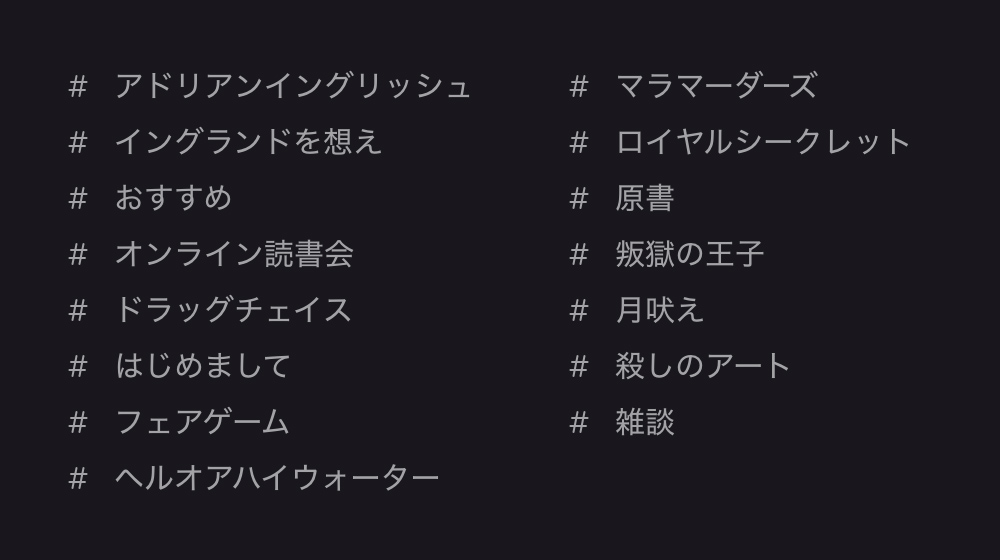

import { Button, Twitter } from '../../../../src/components/blog'

この夏、M/Mロマンス小説（海外BL小説）が好きな人同士で語り合えるクローズドなチャットコミュニティを始め、あっという間に3ヶ月が経ちました。

グループチャット内でのメッセージ総数も軽く __1万__ を超え、私もメンバーとのおしゃべりを毎日楽しんでいます😊

想像していた以上に盛り上がっているのが嬉しい限りなので、今日は私がチャットコミュニティを始めてよかったなーと思うことを紹介していきます。

## チャンネル毎におしゃべり

基本的に[モノクローム･ロマンス文庫](https://www.shinshokan.com/monochrome/)さんから出版されている作品毎にチャンネルが別れていて、その本について語り合える感じです。

今、このコミュニティにどんなチャンネルがあるかと言うと、

こんな感じ。

作品毎に別れているので、途中で話題がズレることがありません。

また、その作品を「読み終わったよ！」もしくは「読み返したよ！」報告に感想を添えたメッセージを書き込むと、またそこから作品についての語り合いが始まります。

読書は一人でするものですが、感想を言い合って共感し合ったり、解釈について意見を交わすと、より一層読書が楽しくなるな、と改めて実感しました。

## メンバーによるオススメ作品の紹介

M/Mロマンス小説だけに止まらず、メンバー同士でオススメのマンガ、小説、映画などについての情報交換をしています。

「M/Mロマンス小説が好き！」という、似たような嗜好のメンバーが集まっているので、メンバーがオススメしてくれる作品は、とにかく私の心に刺さります！

もう、Amazonの全然当てにならないレビューを見るより、メンバーに聞いた方が確実だと思える今日この頃。

このコミュニティを始めて、購入する本の数、見る映画の本数がぐっと増えました。

## 原書を読んでの質問や相談

モノクローム･ロマンス文庫で翻訳されている作品の続きが待てず、原書を読み始めるメンバーも多いです。

読んでいて何か分からない部分があれば、原書チャンネルに質問を投げかけると、誰かが答えてくれたり、メンバー同士で会議が始まったりします。

メンバーによる原書読解のポイントについての共有や、おすすめの辞書情報などもあり、原書を読むモチベーションにもなりますよ😉

また、[kasumi(@kasumi_novels)](https://twitter.com/kasumi_novels)さんによる日本語翻訳されていない短編作品の私訳も共有されており、ジョシュ･ラニヨン作品のサイドストーリー等を楽しめます。

## なんと二次創作も生まれました

もう、きっかけは何だったのか覚えていないんですが、[ジョシュ･ラニヨン](/tags/josh-lanyon/)先生の[『殺しのアート』シリーズ](/tags/the-art-of-murder/)の主人公カップル、ジェイソンとサムがもし日本にやって来たら？という妄想から始まった二次創作『マラ･マーダーズ』。

- アートが好きなジェイソン以上に、サムの方が春画に興味を示すんじゃないだろうか？
- 二人でしっぽり温泉宿に宿泊
- そこで起こる殺人事件
- 体位でプロファイリング

などなど。

果てしなく妄想が広がっていくうちに、なんとメンバーの[くじらー(@X3362)](https://twitter.com/X3362)さんによる、萌が詰まった二次創作小説がスタート！

Pixivに投稿されていますので、ぜひ読んでもらいたいです✨

[今すぐ『マラ･マーダーズ』を読む！](https://www.pixiv.net/novel/series/1370481)

また、メンバーの[raito(@raito02478264)](https://twitter.com/raito02478264)さんによる、『マラ･マーダーズ』にて真剣な顔して春画を眺めるサム･ケネディも！

<Twitter id={'1289571685767630848'} />

また、別件ですが、[アドリアン･イングリッシュ](/tags/adrien-english/)の主人公カップル、アドリアンとジェイクがスカーフによる目隠しと孔雀の羽プレイをするとしたら、アドリアン攻めの方が断然萌える！という妄想もグループチャット内で盛り上がったところ、メンバーの[アユ･ヤマネ(@ayu_ymn)](https://twitter.com/ayu_ymn)さんによるイラストが！

<Twitter id={'1304963285398089729'} />

楽しいです、眼福です、ありがとうございます。

## オンライン読書会への参加が増えた

月に1度、zoomを使ってのオンライン読書会を開催しているのですが、このグループチャットを始めてから、参加者も増えて非常に嬉しいです😊

先にチャットでおしゃべり済みなので、メンバーの顔は見たことなくても既に親しみが沸いていて、ビデオ通話での読書会に参加するハードルが下がるのかもしれません。

ちなみに、12月のオンライン読書会はメンバーによるプレゼン大会を予定しています。

メンバーによる人生で激推しのM/Mロマンス小説、BL小説/マンガ、映画などについて、熱く語り合う予定です。

日時：12/13（日） 10:00am 〜（日本時間）

大体いつも3時間くらいしゃべっていますが、途中参加･途中退場でも大歓迎ですよ🙌

参加を希望の方は、Twitterで[ジーナ(@muchimemo)](https://twitter.com/muchimemo)にダイレクトメッセージを送っていただくか、[お問い合わせフォーム](/contact/)からご連絡ください。

## 雑談チャンネルでいつでもおしゃべり

大した用ではなくても、雑談チャンネルに何か書き込みをすると、それに対して誰かが必ず返事をしてくれるので、何となく誰かと話たい時にはぴったりです。

メンバーが住んでいるタイムゾーンもそれぞれ違うので、24時間いつでも誰かが起きている気がします😆

現在、ロックダウンの真っ只中にいる私にとって、気軽に誰かと話せるのは本当に素晴らしくて。  
メンバーのみなさん、いつもありがとうございます。

ロックダウン中でも精神的にしんどくならず暮らせているのは、チャットのおかげでもあります😊

## 安心して楽しめるクローズドな空間

つくづく思うのは、内輪のコミュニティは安心･優しい･楽しい！ということ。

TwitterなどのSNSは、自分の発言を見ず知らずの人から叩かれる可能性があったり、常に誰かの怒っているツイートが流れてきたりして、疲れてしまうことがありますよね😥

メンバーの人数も現時点で21人と多くなく、みなさん分別のある大人であり、且つ、M/Mロマンス小説への愛に溢れているので、非常に平和で楽しい空間が出来上がっているな、と嬉しく思います。

また、新規メンバー加入時には、既存メンバーたちからの熱烈歓迎メッセージが飛び交う様子が、本当に素敵だなと思えてなりません。

## グループチャットへの参加

- ツール：[Discord](https://discord.com/)
- 参加費：__無料__
- 必要なもの：メールアドレス、M/Mロマンス小説への愛

Discordを使ったことがない方は、まず、[詳しい参加方法についての記事](/mm-romance/community/)をご覧ください。

Discordの使い方知ってるよ！という方は、下記のボタンからすぐに参加可能です。

<Button label='チャットに参加する' url='https://discord.gg/Py9TME9eNg' />

ぜひお気軽に参加してくださいね👋
