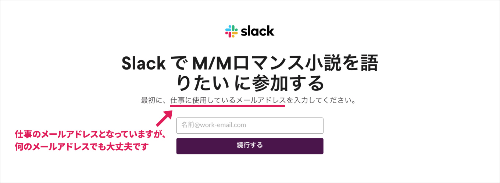
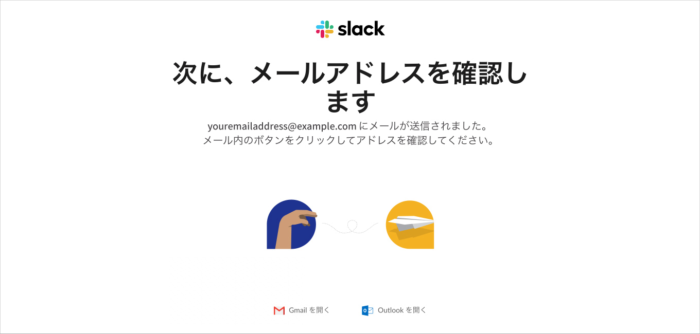
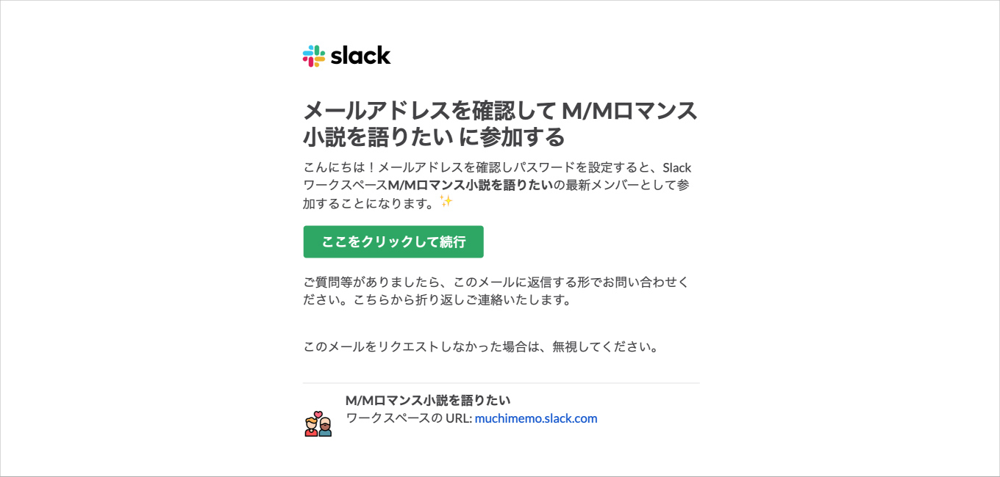
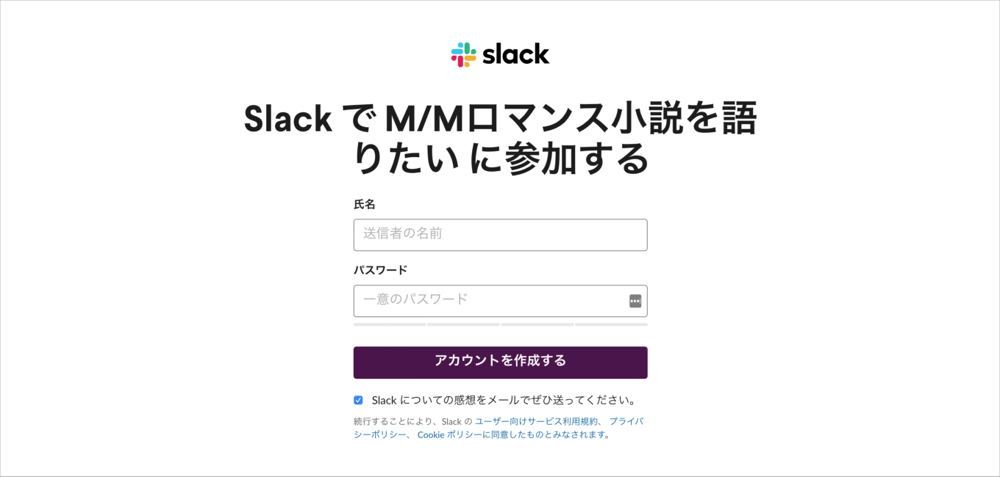
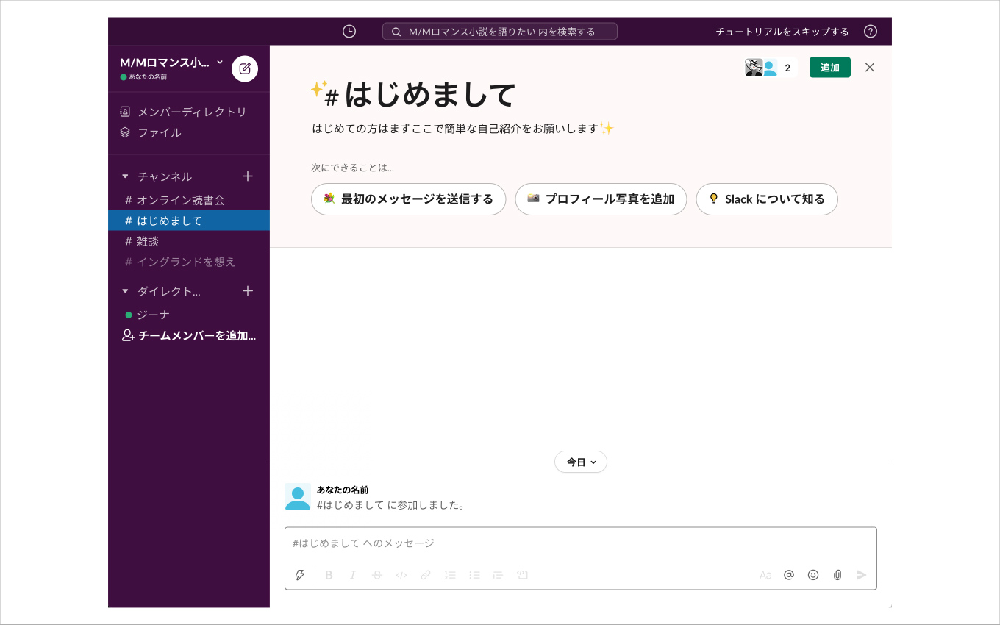
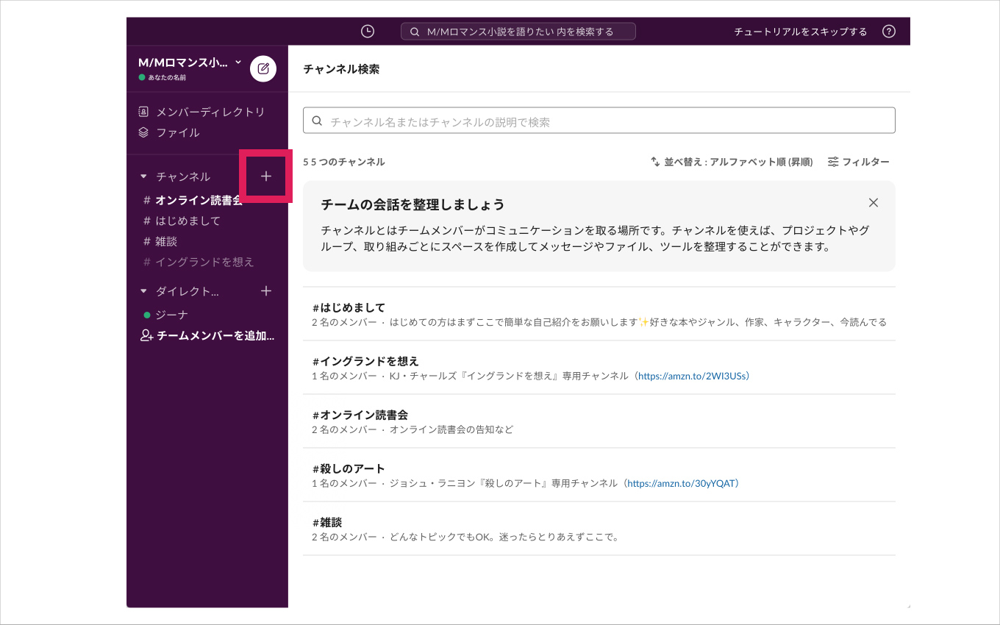
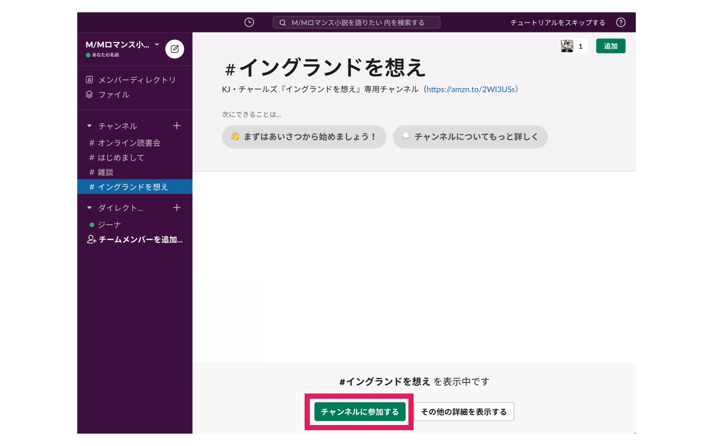
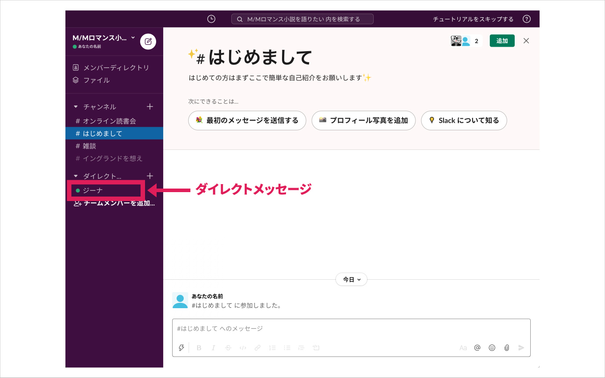
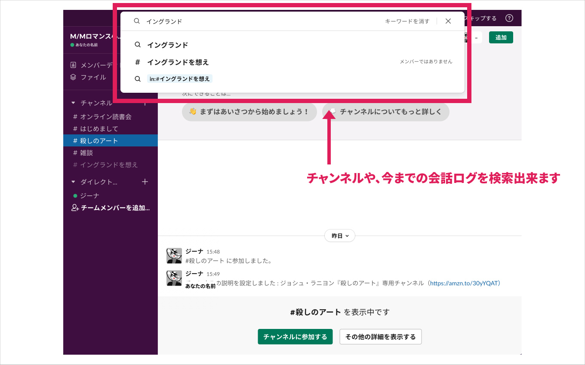

import { Button } from '../../../../src/components/blog'

M/Mロマンス小説（海外BL小説）が大好きだけど、語れる相手がいない！場所が無い！で情熱🔥を持て余している人々がいるという噂を小耳に挟んだので、テキストベースのチャットコミュニティを作りました🙌

## 概要

- ツール：[Slack](https://slack.com/intl/ja-jp/)
- 参加費：__無料__（あまりに運営が大変になったら考えます）
- 必要なもの：メールアドレス、M/Mロマンス小説への愛

Slackの使い方知ってるよ！という人は、下記のボタンからすぐさま登録画面へアクセスできます👍

<Button label='チャットに参加する' url='https://join.slack.com/t/muchimemo/shared_invite/zt-gacbhihc-KYkKyRITPBFmXAegJ6gOvw' />

## 簡単な参加方法

1. [こちらからご参加いただけます](https://join.slack.com/t/muchimemo/shared_invite/zt-gacbhihc-KYkKyRITPBFmXAegJ6gOvw)にアクセス
2. メールアドレスを入力
3. メールの案内にしたがって「続行」
4. 氏名（ニックネーム可）とパスワードを入力して完了！

## 詳しい参加方法

1. [こちらからご参加いただけます](https://join.slack.com/t/muchimemo/shared_invite/zt-gacbhihc-KYkKyRITPBFmXAegJ6gOvw)にアクセスすると、下記のページが表示されます。

2. メールアドレスを入力して「続行する」ボタンを押してください。

3. メールをチェックしてください！と言われるので、メールをチェックします。  
下記のようなメールが届いています。

4. メール内の「ここをクリックして続行」をクリックして続行してください。

5. 氏名（ニックネーム可）とパスワードを入力し、「アカウントを作成する」をクリックします。

ようこそお越しくださいました😀  
まずは、__#はじめまして__ チャンネルで簡単に自己紹介してもらえると嬉しいです。

ぜひ、お気軽にご参加ください👋

<Button label='チャットに参加する' url='https://join.slack.com/t/muchimemo/shared_invite/zt-gacbhihc-KYkKyRITPBFmXAegJ6gOvw' />

## Slackの使い方

### チャンネル

Slackチャットの特徴として、話すトピック毎に分かれた __チャンネル__ が存在します。

「＋」アイコンをクリックすると、チャンネル一覧を確認できます。

- #はじめまして *（まずはここから。簡単な自己紹介をお願いします。）*
- #オンライン読書会 *（オンライン読書会の告知など。）*
- #雑談 *（何でも。どのチャンネルか分からなかったら、とりあえずここへ。）*

上の３つのチャンネルはアカウント作成時に、自動的に参加になります。

その他のチャンネルとして、

- #殺しのアート
- #イングランドを想え

のような感じで、本やシリーズ毎にチャンネルを分けて、語り合っていきたいと思います。

興味があるチャンネルを見つけたら、「チャンネルに参加する」ボタンからメンバーになって、思う存分、愛を語ってください💕

また、特定のチャンネルを追加したい場合は、ジーナ宛にダイレクトメッセージを送ってくださいね😉

### ダイレクトメッセージ

みんなにシェアしたくない個人的なメッセージは、ダイレクトメッセージでお送りください。  
感想・要望などお気軽にどうぞ！

### 検索

今までの会話ログや、チャンネルを検索することができます。

## アプリ

Slackチャットはアプリがあるので、通知を受け取るのも簡単です。（iOS, Android, macOS, Windows 対応）  
下記のボタンをクリックすると、あなたの環境に合わせたアプリが表示されます。

<Button label='Slackアプリを取得' url='https://slack.com/intl/ja-jp/downloads/' />

## 全チャンネル一覧

[#はじめまして](https://app.slack.com/client/T014MVD863E/C01492K9F2S)  
[#雑談](https://app.slack.com/client/T014MVD863E/C0167AY63RC)  
[#おすすめ](https://app.slack.com/client/T014MVD863E/C018HCTQYRG)  
[#オンライン読書会](https://app.slack.com/client/T014MVD863E/C015Z3A5FGF)  
[#原書](https://app.slack.com/client/T014MVD863E/C018NQV7Q9G)  

#### 作品ごと：

[#アドリアンイングリッシュ](https://app.slack.com/client/T014MVD863E/C017KV220SW)  
[#殺しのアート](https://app.slack.com/client/T014MVD863E/C0172AYPSET)  
[#フェアゲーム](https://app.slack.com/client/T014MVD863E/C017KV0EEF4)  
[#イングランドを想え](https://app.slack.com/client/T014MVD863E/C0173LCP3NU)  
[#ヘルオアハイウォーター](https://app.slack.com/client/T014MVD863E/C017N5J7B6F)  
[#ロイヤルシークレット](https://app.slack.com/client/T014MVD863E/C017RH8G5BL)  
[#叛獄の王子](https://app.slack.com/client/T014MVD863E/C017C9PENF9)  
[#月吠え](https://app.slack.com/client/T014MVD863E/C017PKXRZ1T)  
[#ドラッグチェイス](https://app.slack.com/client/T014MVD863E/C017JHZE65T)

#### 二次創作：

[#マラマーダーズ](https://app.slack.com/client/T014MVD863E/C018C0R3X0A)

## 注意事項
- チャットコミュニティの内容は、SNSなどへ転記しないでください。
<!-- ・プロフィールの写真がない、フォロワーがいないなど、アカウントがアクティブではないと判断した場合、入会をお断りする場合があります。 -->
- 誹謗中傷行為やコミュニティ内の秩序を大きく乱す行為があり、改善の可能性がないと判断した場合は、強制退会とさせていただく場合があります。
- 来る者拒まず、去る者は追わずのスタンスなので、いつでも退会可能です。
- やむを得ない事象が発生した場合に限り、コミュニティ自体を解消する可能性がありますので、ご了承願います。

---

とりあえず、いろいろ決めずに小さなコミュニティを始めてみようと思います。

興味がある方は、ぜひお気軽にご参加ください👋

<Button label='チャットに参加する' url='https://join.slack.com/t/muchimemo/shared_invite/zt-gacbhihc-KYkKyRITPBFmXAegJ6gOvw' />
