import { Amazon, Blockquote, Youtube, Twitter } from '../../../../src/components/blog'

ここ最近見て衝撃を受けたBBCドラマ『[ロンドン･スパイ](https://www.bbc.co.uk/programmes/b06pmnwn)』について、ぜひ語らせて頂きたい。  
2015年にイギリスBBCで放送されたドラマで、特に新しいドラマでもないんだけど、非常に私好みでした。

万人受けするようなストーリーではないですが、爆発爆発なハリウッド映画よりも、しっとりしたストーリー性のある邦画やヨーロッパ映画の方が好きな方にはお勧めです。

レビューサイトを見ても評価は真っ二つに分かれてるんだけど、好きな人は熱狂するほど好きだと思う（私含め）。

このブログを書いている今も、ドラマを思い出しただけでまた胸が高鳴ります。

## あらすじ

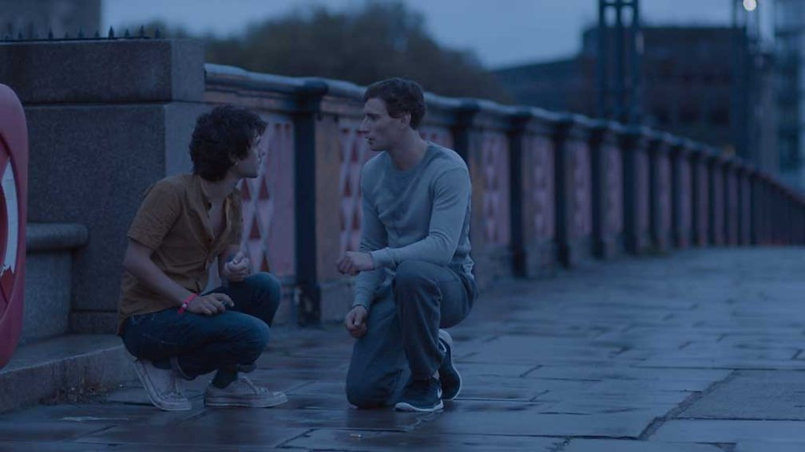
_二人の出会い、Source : [BBC Two - London Spy](https://www.bbc.co.uk/programmes/b06pmnwn)_

ダニー（ベン･ウィショー）はクラブ帰りの朝、テムズ川の橋の上で青年ジョー（エドワード･ホルクロフト）と出会う。貧乏で友人たちと安アパートに暮らすダニーと、投資銀行で働くエリートのジョーは、全く違う世界に生きていたが、急速に惹かれ合っていった。

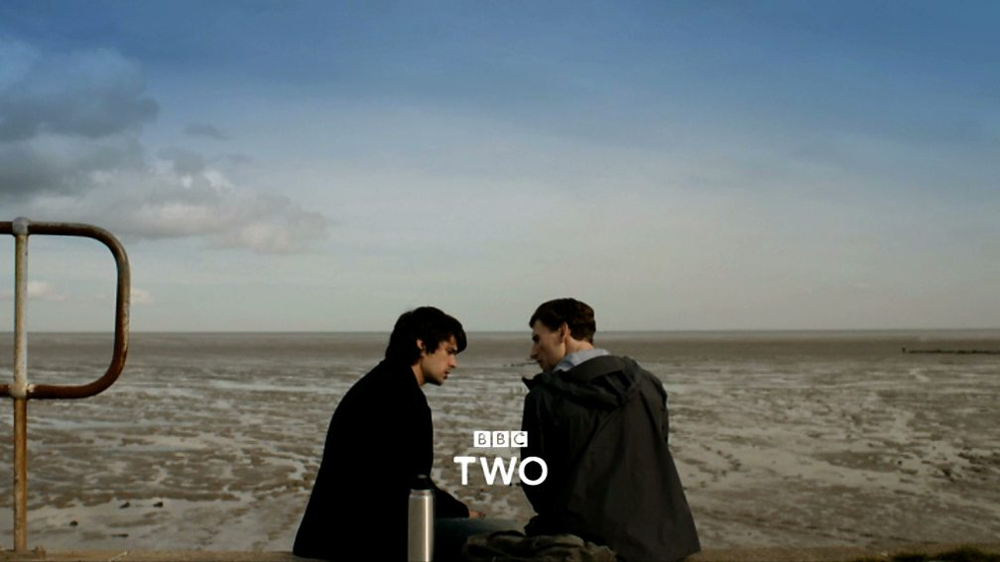
_デート中、Source : [BBC Two - London Spy](https://www.bbc.co.uk/programmes/b06pmnwn)_

しかし、彼らの幸せな日々は突然終わりを迎える。ジョーが無残な姿で発見されたのだ。彼の謎の死をきっかけに、次々と突きつけられる「事実」。彼は実はMI6のスパイであり、ダニーは最愛の人の本当の前すら知らなかったのだ。ショックを受けながらも、愛する人の「真実」を探すうち、ダニーはスパイの世界へと飲み込まれていく。

だいたい、こんな感じです。

もう、最初は、

- ベン･ウィショー主演
- 主人公たちがゲイカップル
- スパイもののスリラードラマ

という、**半分以上が邪な理由**で見始めたんだけど、私の嗅覚に間違いはなかった。

公式のトレーラーはこちら。

<Youtube id="O1PEQkpKTLI" />

## キャスト

### ダニー / ベン･ウィショー

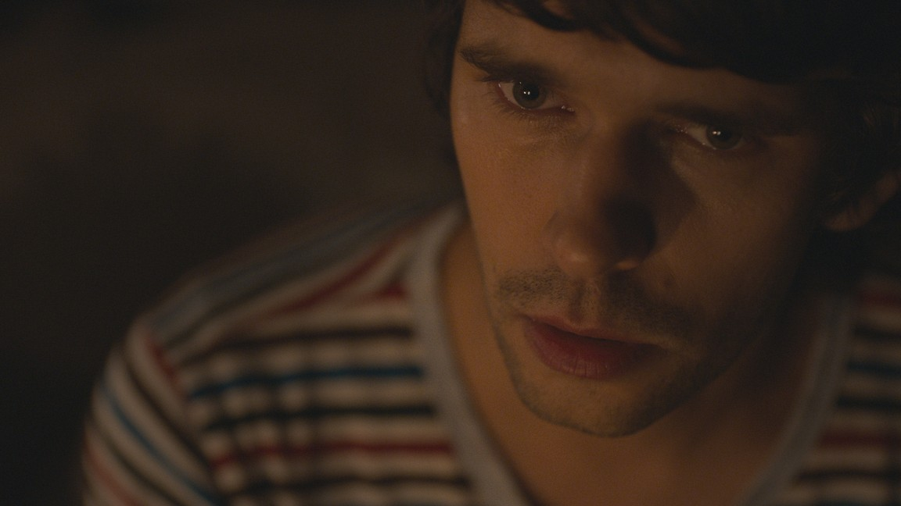
_Source : [Rotten Tomatoes - London Spy](https://www.rottentomatoes.com/tv/london_spy)_

映画『[007 スカイフォール](https://amzn.to/2VfWPqe)』シリーズで科学者Qを演じていたのが有名かと思います。実力派のイギリス人俳優。

私も『007 スカイフォール』と『[パフューム ある人殺しの物語](https://amzn.to/2OhiXiy)』を見て大好きになったんですが、演技力はもとより、母性本能をくすぐられる可愛さが尋常ではない。30歳過ぎてあの可愛さは何なんだ…。  
『[リリーのすべて](https://amzn.to/332f8BU)』は途中で挫折したんで、もう一回見てみよう。

### ジョー（アレックス） / エドワード･ホルクロフト

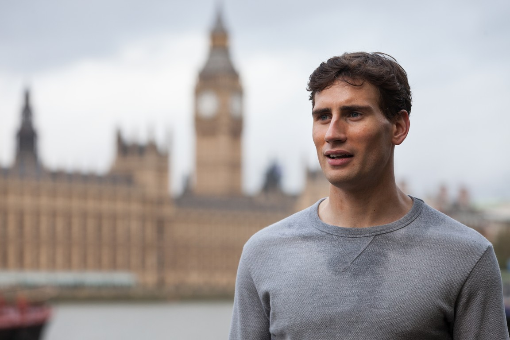
_Source : [Rotten Tomatoes - London Spy](https://www.rottentomatoes.com/tv/london_spy)_

映画『[キングスマン](https://amzn.to/2LKSLLx)』ではライバル役のチャーリーを演じていました。その時はイヤな奴だったので、こんな素敵な青年に…！とキュンとしてしまった。

この頬骨が高くて、骨ばったような顔の作りが素敵ですよね。

余談ですが、M/Mロマンス小説の『[アドリアン･イングリッシュ](/tags/adrien-english)』シリーズに出てくるジェイクや、『[All's Fair](/tags/alls-fair)』シリーズに出てくるタッカーは、こっち方向の顔だと思うんですよ。

**※これ以降はネタバレを含んでいますので、ご注意ください。**

## 切なくも哀しいラブストーリー

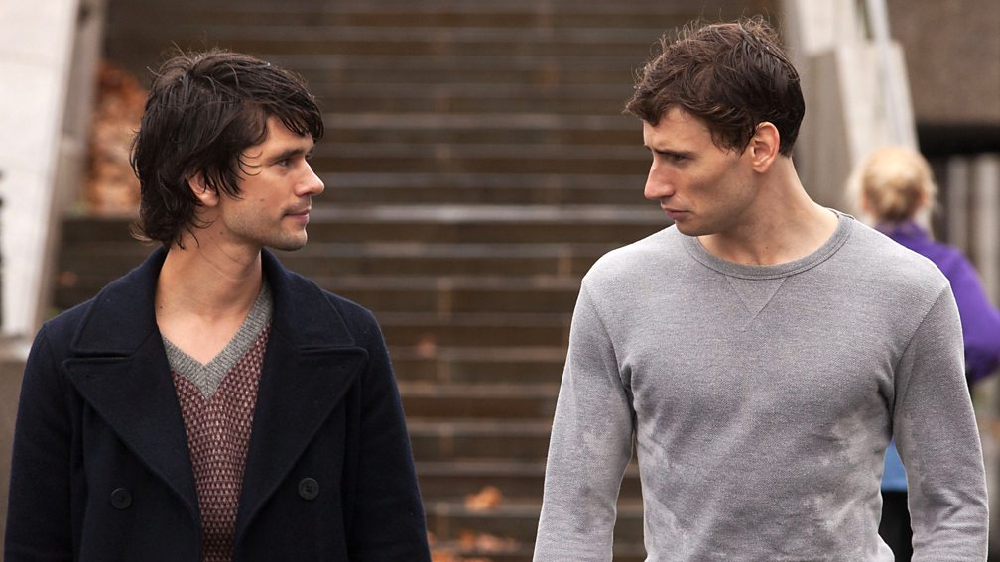
_Source : [BBC Two - London Spy](https://www.bbc.co.uk/programmes/b06pmnwn)_

一番始めに言いたいのは、このドラマはスパイドラマでも、スリラードラマでもありません。複雑に絡み合ったヒューマンドラマであり、最高に美しいラブストーリーです！

<Blockquote srcName="ロンドン･スパイ | Netflix (ネットフリックス) 公式サイト" srcURL="https://www.netflix.com/jp/title/80048568">
孤独な銀行家が失踪し、残された恋人に衝撃の事実が突きつけられる。なんと、彼はスパイ活動に携わっていた。事件の真相は、危険と陰謀が渦巻く世界の中にある。
</Blockquote>

ね、タイトルは「ロンドン･スパイ」だし、あらすじはこんなんですが、あくまでもラブストーリーです。 スパイドラマを見たくてこのドラマを見ても、全然面白くないんじゃないかな？

だって、大量の謎が降りかかって来るものの、それが紐解かれていく爽快感なんて皆無だもの！

実はこの作品、スリラードラマの体でストーリーは進みますが、謎が一つ、また一つと解かれる度に分かるのは、**どれだけアレックスがダニーを愛していたか**ということ。それだけなんです。

なので逆に言うと、2人の愛の証明に関係ない謎は一切明かされない。

こんな風にロマンスを描くのかと、ただただ感銘を受けました。ラブラブのカップルを見せるだけがロマンスではないと。むしろ、普通のロマンスよりも後々ボディーブローのように効いてくる。

そんな秀逸な脚本を担当したのはイギリスの作家、トム･ロブ･スミス。彼の書いたミステリーも読んでみたいですね。

## ベン･ウィショー無しでは成立しないドラマ

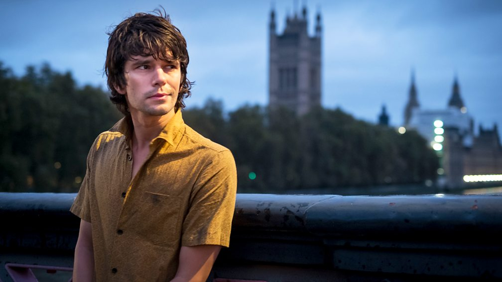
_Source : [BBC Two - London Spy](https://www.bbc.co.uk/programmes/b06pmnwn)_

もともと演技力の高さには定評がある役者なんですが、このダニー役は彼以外考えられないくらいダニーでした。

少年のような無邪気さ、可愛さがありつつも、不安定さと繊細さ、憂鬱そうな影もあり、かと思えば結構ロマンチストだったり、よくしゃべるんだけど、何だか挙動がぎこちなかったり。

すごく複雑なキャラクターなんだけど、魅力的で目が離せない。彼の表情、いえ、目の動きだけでダニーの感情を表現していて、本当にすごい役者だなぁと。改めてベン･ウィショーが大好きになりました。

## イメージビデオのような映像の美しさ

セリフが少なく、暗く、静かな映像が続くこのドラマ。ストーリー展開もゆっくりで、合わない人にはテンポが悪く退屈に感じでしまうかもしれません。

しかし、好きな人には何度も見返してしまう程、中毒性があります。特に私は3話が好きです。

例えば、クリニックにてダニーがHIVの検査を受けるシーンでは、無機質なクリニックの色味と、固定されていない不安定なカメラが、彼の不安や戸惑い、恐怖が伝わってくる。

その後、ダニーがスコッティに告白するシーンでは、暗い室内から、窓の外の土砂降りの雨だけがよく見えて、絶望しているダニーの心境がうかがえる。

そして、スコッティが自身の死んだ恋人の話をしているシーンでは、話すスコッティの顔に雨の影がずーっと流れていて、今でも悲しく、心で涙を流しているのかな、と連想させ。

そこから続く「青」い世界。悲しさや絶望から、少しだけダニーの心が癒され、戦う決意をする心情の変化。

このドラマを見るとストーリーが切ないので辛くなるんですが、つい映像に魅入って見返してしまう魔力があります。

それから、「激しい男性同士のベッドシーン」と宣伝でやたら煽っていましたが、1話でほんのちょっとだけなので、苦手な方も安心して欲しい。あんまりエロい映像には作られてないので。
何よりこのシーンが後々に重要になってくるんですよね。

## 明かされない謎

ストーリーが進むにつれて謎が謎を呼び、遂には世界中の諜報機関が敵？みたいになっていって、「おいおい、話が大きくなってきたな…」と思いながら見ていたんですが、特に何も明かされないまま終わって、ある意味驚きました。

それ以外でも、そう言えば、

- 誰がどうやってダニーにHIVウィルスを注射したんだろう？
- テムズ川で名刺渡してきたアメリカ人いたよね？
- スコッティを連れ去って殺したタクシー運転手って誰？

などなど、ぜんぶ謎がぶん投げっぱなしで終わりました。

まぁ、でも、いいんですよ、問題はそこじゃないので。  
正直もうスパイとかも全然関係なくて、結局5時間使って何が言いたかったかというと、**彼らの愛は真実だった**ってことだけなんですよね。  
ある意味すごいドラマだと思う。

## シリンダーの暗号

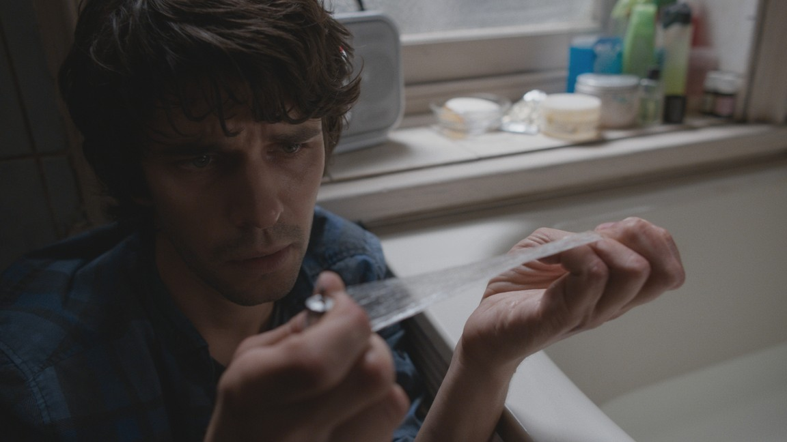
_Source : [Rotten Tomatoes - London Spy](https://www.rottentomatoes.com/tv/london_spy)_

４話で明かされる、ダニーが探し続けたシリンダーの暗号。数学の天才が残したとは思えない、まさかの**「000001」**。

いや嘘でしょと、私も一瞬拍子抜けしたんですが、そこから読み取れる「愛する人は世界で唯一人」というメッセージ。

天才ゆえに孤独な人生を歩んできたアレックスにとって、ダニーは初めての恋人で、唯一愛した人だったんですよね。嘘で塗り固められた世界で、それだけは真実。

単に「I Love You」と言うよりも何だか心に残るんですよ。
このドラマを見て、後からぞわぞわぞわぞわと湧き上がってくる何かよく分からない感情。二人の愛をかみしめてる…！

## 尊すぎる幸せな日々

と、これだけ愛が詰まったドラマなんですが、とは言えアレックスは死んでしまっているので、1話から見返すと、もう幸せな日々が尊くて尊くて。

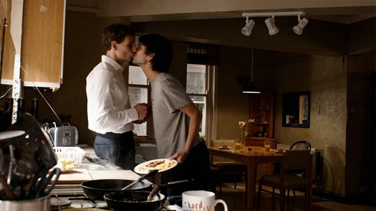
_Source : [BBC Two - London Spy](https://www.bbc.co.uk/programmes/b06pmnwn)_

1話の大好きなシーン。朝の何気ないワンシーンなんだけど、好き好きオーラ全開のダニーと、相変わらず無表情で固まってるアレックスが可愛すぎる。

これを受けて、2話でダニーがアレックスを思い泣きじゃくるシーンは胸が苦しくなります。

実は、ストーリーの合間合間にちょこちょこと彼らの幸せな日々の回想シーンが差し込まれるんですが、1回目に見た時は、何が真実なのか私も分かってない状態で見たので、てっきりダニーの妄想なんだと思ってました。  
今思うと、たぶん現実だったんじゃないかな。  
ラブラブでネクタイ結んでくれるシーンとか。

アレックスに関しても、1回目は「もしかして生きているのでは…？」と思いながら見てたんですが、やっぱり死んでましたね。  
個人の感情としては生きていて欲しいと思う反面、物語としては死んでいないと成り立たないので複雑…。

## 助演たちも素晴らしい

### スコッティ / ジム･ブロードベント

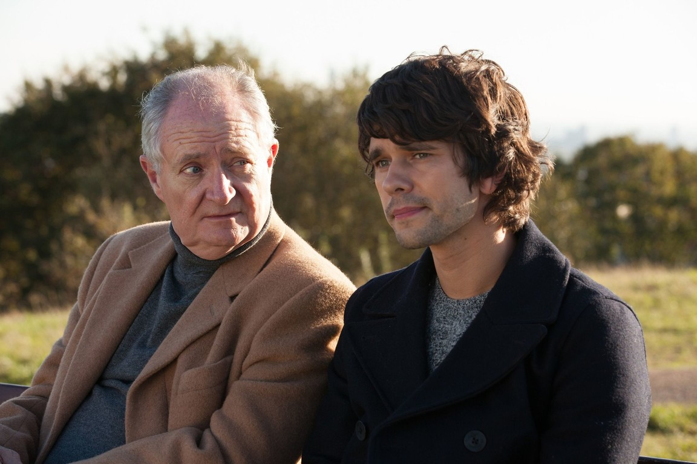
_Source : [Rotten Tomatoes - London Spy](https://www.rottentomatoes.com/tv/london_spy)_

警察も新聞社も助けてはくれない。そんな、孤独なダニーを何かと面倒見てくれるのは昔馴染みの親友、スコッティ。

ゲイが抑圧されていた時代に、偽りの中で生きてきた彼の回想は切なくなります。

ただ、私は最後までスコッティが信用できなくて、彼が殺されるまでずっと「裏切られるかもしれない」という疑念でびくびくしてました。

結局はただの寂しくていい人でしたね。それがまた切なくて。疑ってごめんなさい。

### フランシス / シャーロット･ランプリング

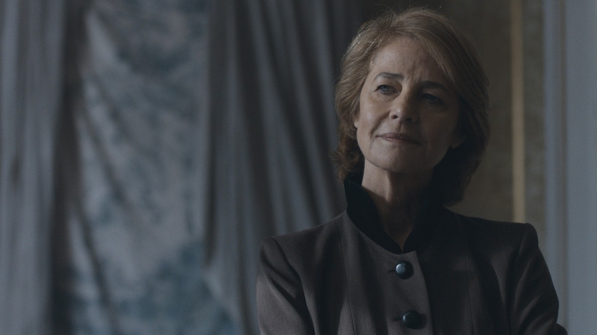
_Source : [Rotten Tomatoes - London Spy](https://www.rottentomatoes.com/tv/london_spy)_

圧倒的な存在感で、登場した瞬間、「うわー、絶対に一筋縄ではいかない相手だな、ダニー頑張って！」という気持ちになりました。

ラストで急に協力するような姿勢を見せたのが、どうも大衆向けのエンディングを取ってつけた感がありましたが…。

### リッチ / マーク･ゲイティス

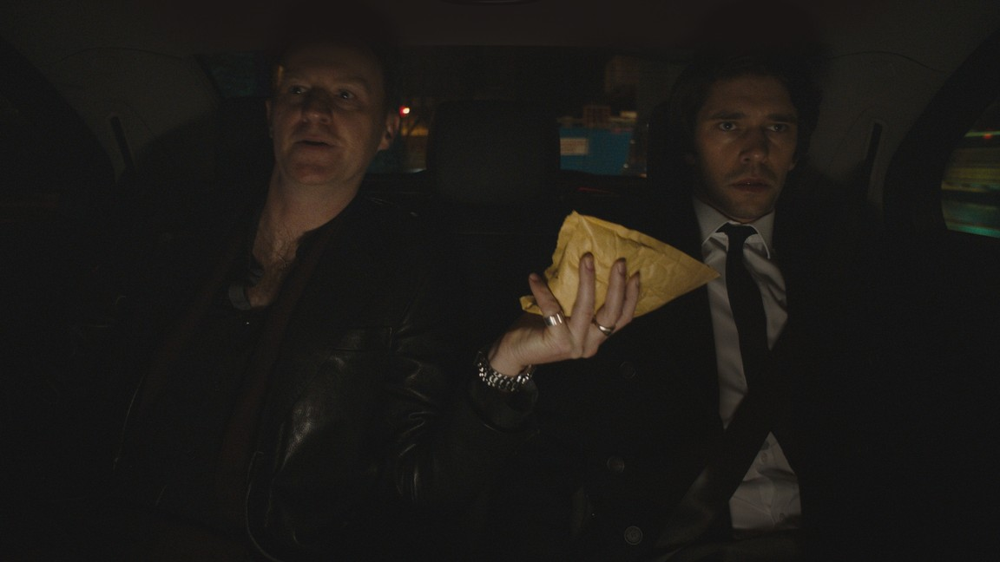
_Source : [Rotten Tomatoes - London Spy](https://www.rottentomatoes.com/tv/london_spy)_

BBCドラマ『[SHERLOCK/シャーロック](https://amzn.to/2AL2ICe)』のマイクロフトでお馴染み、マーク･ゲイティス。

濃かった。気持ち悪さが光っていました笑。  
イノセントなダニーとの対比が、もう。演出は大成功だと思う。

画面に映っているシーン自体は短かったと思うんですが、濃すぎて記憶に残りますね。

<Twitter id={'678542316022427648'} />

## バッグの中のスパイ事件

アレックス殺害のモデルとなったのは、実際にイギリスで起こった事件。全然知りませんでした。

2010年、ロンドンで、MI6の暗号解読員だったガレス･ウィリアムズさんが、アパートの浴室で、南京錠のかかったスポーツバックの中から死体で発見されました。  
彼のパソコンに、BDSMサイトの閲覧履歴が大量に残っていたことから、性倒錯者の "事故死" として警察は処理しましたが、いまだに謎に包まれた事件です。

それにしても、BDSMに明るくない私からすると、そんなプレイがあるんだなぁと。手で軽く首絞めながらSEXするくらいしか知らなかったです。  
先日、BDSM101と名高い[『Power Exchange』](https://amzn.to/2ETLfNy)を読んで、非常に興味深い世界だなぁと思いましたが、まだまだ奥が深いようですね。

[Gareth Williams: The Spy in the Bag | The Unredacted](https://theunredacted.com/gareth-williams-the-spy-in-the-bag/)

そういえば、日本でも先日、布団圧縮袋の中から窒息死体が見つかっていましたが、プレイ中の事故死なのかなぁ。

## ゲイドラマではない

いや、ゲイドラマなんだけど、そういうジャンルじゃないんです。  
彼らのセクシャリティはストーリーの中で何の問題でもない。  
スリラー調のラブストーリーのカップルが、たまたまホモセクシュアルだったっていう感じ。そういうアプローチに好感が持てます。

BLマンガを大量に読んでおいてなんなんですが、セクシャリティはパーソナリティじゃないと思うので、それ自体がドラマチックに語られる必要はないと思うんですよね。

余談ですが、先日、日本に帰った時に母親とドラマ『おっさんずラブ』を見たんだけど、確かにエンターテインメントとして面白くはあったんでが、ゲイというのを主題としない、主人公がたまたまゲイだったというドラマが日本の地上波で放送されるのは、まだ先の話なのかなぁと感じました。（全話見たけど）

## 関連リンク

BBCオフィシャルサイト。  
[BBC Two - London Spy](https://www.bbc.co.uk/programmes/b06pmnwn)

Netflixで見れます。  
[ロンドン･スパイ | Netflix (ネットフリックス) 公式サイト](https://www.netflix.com/jp/title/80048568)

本もあるので、さわりだけ読んでみたんですが、ドラマでは出てこなかったセリフもあって、読んだらこの世界をもっと理解できそうです。  
放送されなかった結末があるらしいですし。

<Amazon
  asin="B01E4BC1L6"
  title="London Spy (English Edition) "
  linkId="d4e94964d38d818f977d163901f7d163"
  author="Tom Rob Smith"
/>
