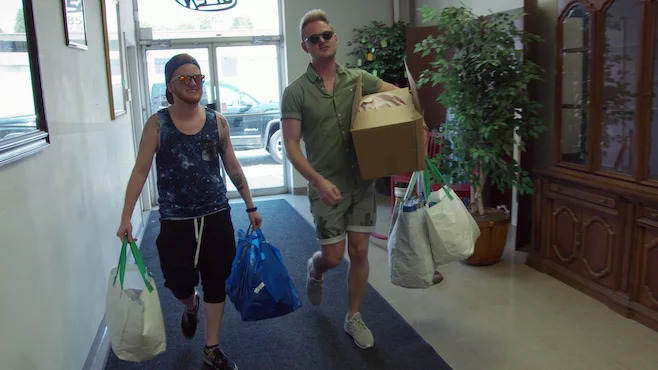
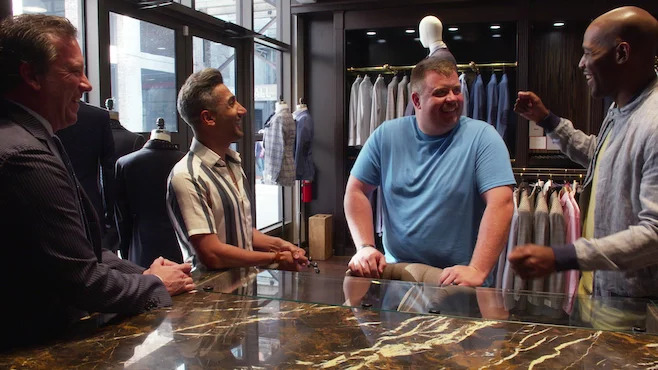
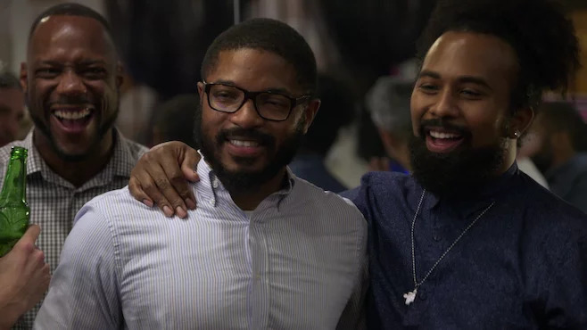
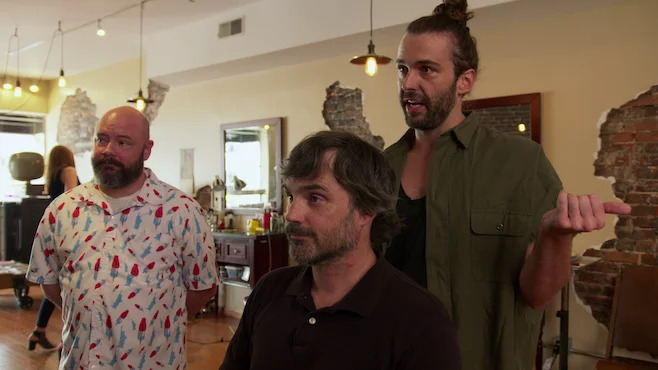
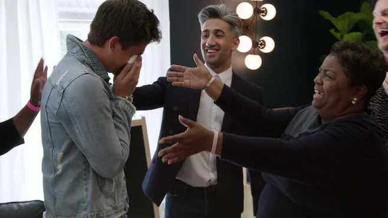
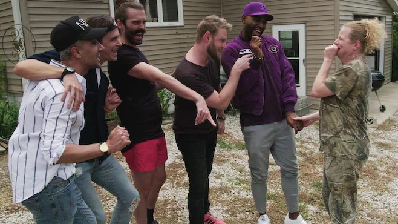
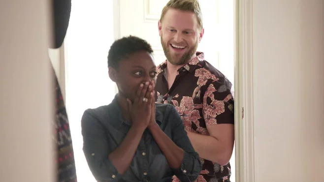

import { Amazon, Blockquote, Youtube, Twitter, Instagram } from '../../../../src/components/blog'

もう見事にハマってしまいました、Netflixオリジナルドラマ [「クィア･アイ(Queer Eye)」](https://www.netflix.com/jp/title/80160037) 。  
毎回、お腹を抱えて笑って、感動して泣いて、見た後は元気になれるから止められない。

今回はその魅力ついて語っていきたいと思います！

## クィア･アイとは？

「クィア･アイ」は、ある分野のプロフェッショナルである5人のゲイ男性「ファブ5」が、ダサいストレートの男性を改造し、魅力的にするというコンセプトのリアリティショーです。

ファブュラス(fabulous)な5人組ということで、ファブ5。

2003年～2007年にオリジナル版が放送され、人気の番組でした。私も日本にいた頃、友人に勧められてちょっとだけ見てたなぁ。

そして、2018年からNetflixにリブート版が登場。  
キャストも一新し、オリジナル版では「ストレート男性」だけだったクライアントも、リブート版では時代に合わせて、性別、年齢、セクシャリティ、宗教など多様になり、より一層興味深い内容になってます。

2018年には3つのエミー賞を受賞しました。

## ファブ5のメンバー

まずは、中心となるファブ5のメンバーを簡単に紹介します。

それにしても、日本ではファブ5じゃなくて、ゲイ5って呼ぶらしいですね。  
「同性愛」という意味ではなく、「陽気でワクワク」の方のゲイ(gay)だといいんだけど。

### ボビー･バーク

インテリア担当。  
インスタグラム([@bobby](https://www.instagram.com/bobby/))では、ボーイフレンドとの仲睦まじい様子が素敵なボビー。

クライアントの趣味や性格、生活スタイルに寄り添い、大切にしている家具は残しながら、機能的でおしゃれな部屋を作ってくれる。

この番組では、彼が一番働いてるような気がする…。

<Instagram id="B3x1nWfJJOM" />

### カラモ･ブラウン

文化＆メンタルケア担当。  
テレビ番組などの司会者もやってるカラモ。

クライアントとのコミュニケーションの中で、達成感や自信を持たせ、内側から魅力を引き出していく。

ポッドキャスト([Karamo](https://luminarypodcasts.com/listen/karamo-brown/karamo-luminary-premium/6f6452fe-6af0-4411-8ec7-1cde00622203))も配信していて、彼の優しくて力強く前向きな話し方には癒されます。

<Instagram id="Be_jia1lNg-" />

### タン･フランス

ファッション担当。  
紳士的で上品な言動が素敵なタン。

クライアントの好みや体型、生活スタイルに合った服装を提案してくれる。  
基本的にクライアントが着ていて落ち着かなくなるような服をゴリ押ししないのが好印象。

私のパートナーの服もタンに見繕ってもらいたいと切に思う。

<Instagram id="B4ALXNTAszO" />

### アントニ･ポロウスキ

料理＆ワイン担当。  
何と言うか、罪作りな顔立ちのアントニ。弟感というか、何でも許してしまえるような可愛らしさと言うか…。

料理を全くしないクライアントでも簡単に作れるような、手軽で美味しい料理を教えてくれるので、私も非常に参考になる。

<Instagram id="B3sfctcnMVF" />

### ジョナサン･ヴァン･ネス

美容担当。  
一番テンションが高くて、ムードメーカー的存在のジョナサン。  
なんだけど、ちょいちょい物凄く良いこと言うんですよね、彼。

クライアントの髪やヒゲを整えるだけでなく、スキンケアなどのアドバイスも。

個人的に彼の風貌が「ジーザスに似てる」っていう、鉄板ジョークが大好きです。

<Instagram id="B3xPv2Eglp4" />

## ジーナいち押しエピソード

現在、シーズン4まで放送されてるんですが、私はシーズン3までしか見てないので、その中でいち押しのエピソードを紹介します。  
このエピソードだけでも、ぜひ見てみて欲しい！

### 女性の身体で生まれて来た男性、スカイラー

_Source : [クィア･アイ | Netflix (ネットフリックス) 公式サイト](https://www.netflix.com/jp/title/80160037)_

一番印象に残っているのは、間違いなくシーズン2のエピソード5『クィアに乾杯』に出てきた、トランスジェンダーのスカイラー。

このエピソードは、彼の胸を切除する手術の映像から始まるという衝撃的なもの。

私自身、トランスジェンダーの方々と深くおしゃべりする機会がなかったので、彼の放つ言葉にただただ驚きを隠せませんでした。

<Blockquote>
I spent almost a decade of my life being miserable in my body. Just miserable.
</Blockquote>

（もう10年近くも、この体で惨めな気分で過ごしてきた。ただただ惨めだった。）

誰かとハグをする度に、自分の胸が相手に当たること。  
試着する時に店員に体を触られること。  
胸を切除したても、病院では「she/her」で呼ばれること。

想像もつかないほど、私にとっては些細な日常のひとつひとつの出来事が、彼にとってはとてつもなく辛い経験になっているんだと知りました。

エピソードの中でタンも言っていたんですが、私も少なからず、「莫大な費用を払って、痛みを伴う手術をしてまで、性別を変える必要があるのかな？」と思っていました。トランスジェンダーの方々に偏見を持っていたんだなと自覚。恥ずかしい。

最後の方で、免許証の性別欄を「Male」に書き換えた後、彼が「あなたたちには分からないかもしれないけど、このMaleの文字がどれだけ自分にとって意味があるか」と、晴れやかな彼の笑顔が忘れられません。

いろいろと気付かせてくれた、このエピソードには感謝しています。

ではでは、この以外で印象深かったシーンを挙げていきますね。

## シーズン1

オリジナル版のコンセプト「ダサいストレート男性を魅力的に変身させる」に近いエピソードが多いシーズン1。

シリーズを通して、ただ単にダサい男性を生まれ変わらせるだけでなく、社会の差別や偏見を超えて分かり合うことについて、考えさせられるような内容になっています。

### Episode3 : パーティー野郎の卒業式

_Source : [クィア･アイ | Netflix (ネットフリックス) 公式サイト](https://www.netflix.com/jp/title/80160037)_

クライアントは、仮想パーティー好きの警官コーリー。  
彼を家族のためにも、大人の男性に変身させるという内容。

このエピソードは、ファブ5がクライアント宅へ向かっている途中、いきなり警察に車を止められ、車外に出るよう強要されるシーンからスタート。  
一瞬にして緊張がした空気が流れました。

これは、コーリーのノミネーターで友人の警官によるドッキリだったんですが、車を運転していたカラモは、自分が黒人だから白人の警察に目を付けられたのかと思い、非常に動揺してしまいます。

というのも、舞台であるアメリカ南部は特に白人警官による黒人への差別が強い地域なんですよね。

後から、コーリーとカラモが2人でその件について話すシーンがあるんですが、

<Blockquote>
We don't want all black people to get lumped into one category as criminals, which sometimes we feel that way.
And all police officers don't wanna be lumped in to being the bad guy.
I get stereotyped - because of that 10 percent - Bad apples.
</Blockquote>

（全ての黒人をまとめて犯罪者ってくくりに入れられたくないし、たまにそう感じる時があるんだけど。もちろん、全ての警察が悪人でもない。ステレオタイプにハマってたよ。たった10パーセントの腐ったりんごのせいで。）

<Blockquote>
If we could have a conversation like me and you just did, things would be a lot better, you know, in society.
</Blockquote>

（もし、俺と君みたいに話し合いが持てれば、社会はもっと良くなっていくんだろうけどね。）

本当にその通りなんですよね。留学してみると、国同士が争い、憎み合っていたとしても、個人間では普通に話して普通に友達になれる。

このような偏見や社会問題にも切り込んでいくのも、この番組の見どころの一つ。

### Episode4 : ゲイらしく生きるか生きないか

_Source : [クィア･アイ | Netflix (ネットフリックス) 公式サイト](https://www.netflix.com/jp/title/80160037)_

ゲイの黒人男性アンソニーが、母親にカミングアウトするのをお手伝いするエピソード。

「クィア･アイ」では、ファッション担当のタンが服を選び、クライアントがベッドルームで着替えて、リビングにいる残りのファブ5にお披露目するというのがいつもの流れなんだけど、この回では素肌にハーネスを付けたアンソニーが突然登場して、ファブ5熱狂！鍛え上げた筋肉にハーネスが良く似合っていて、私もドキッとしてしまいました！

その後、ついついハーネスでGoogle検索してしまったわ。

### Episode5 : 新しいルール

_Source : [クィア･アイ | Netflix (ネットフリックス) 公式サイト](https://www.netflix.com/jp/title/80160037)_

6人の子供がいて、彼らの世話で疲れ切ったお父さん、ボビーが、愛する妻ベラとの結婚式をやり直すのをお手伝いする回。

敬虔なクリスチャンであるクライアントのボビーと、クリスチャンの家庭で育ち、ゲイだとカミングアウトしたことにより勘当された経験のある、インテリア担当のボビーの会話は、非常に興味深いものでした。

ファブ5の方ぼボビー、

<Blockquote>
I heard the word gay in church, but I heard it in a very negative way. That gay people were bad, and they were pedophiles, and they were evil.
So, I spent every prayer meeting and every Sunday crying and begging God to not make me gay.
</Blockquote>

（教会でゲイはとてもネガティブな意味で語られたよ。ゲイは悪人で、小児性愛者で、悪魔なんだって。だから、僕は毎週礼拝の時に泣きながら神に祈ったよ、僕をゲイにしないでって。）

何てつらい…。  
こういう話を聞く度に、宗教って何のためにあるんだ？と思ってしまう。

そして、クライアントの方のボビー、

<Blockquote>
God told me to love my neighbor. People need to forget religion and just focus on God. You know, God doesn't have a name, - God is God. God is love.
</Blockquote>

（神は隣人を愛せと言った。みんな宗教を忘れて、ただ神という存在にフォーカスする必要があるよ。神に名前なんて無くて、神は神で、神はただ愛なんだよ。）

私が宗教を苦手に思う理由もこのあたりにあって。自分のいいように教義を歪めて、他人を傷つける理由に宗教を使ったり、他人に何かを強要しようとするのが気持ち悪くて。

エピソード3の人種間の偏見もそうだけど、宗教にしたって、こうやって話し合うことって大事ですよね。

最後にこの敬虔なクリスチャンであるボビーがファブ5に言った言葉が素敵でした。ちょっと長いので要約すると、

「君たちに愛されていていると感じて欲しい。同性愛は許されないと教えられて育ったし、今でもそう考える人はいる。でも私たち家族は君たちを愛している。育った環境が違っても、考え方が違っても、みんなを愛すことを君たちが教えてくれた。子供たちも同じ思いでいて欲しい。」

そして、この回で私が素敵だな、と思ったのはアメリカの大型スーパーで、家族全員分の服を揃えたタン。大型スーパー内の洋服なので、もちろんリーズナブルなんだけど、あまりファッショナブルじゃない。

でも、これからの生活でも実践していけるように、服選びのコツやサイズ感等をレクチャーしてくれ、彼が選んだ結婚式用の家族の白い服は、スーパーで揃えたとは思えない程どれも素敵でした。

### Episode8 : 放水で交流

_Source : [クィア･アイ | Netflix (ネットフリックス) 公式サイト](https://www.netflix.com/jp/title/80160037)_

クライアントは消防士のジェイミー。今回の目的は、彼の改造に加えて、消防士の訓練費用を集めるためのイベントを成功させることでした。

正直、ストーリーとしてはどうかと思ったんですが、シーズン1では断トツでお腹を抱えて笑えるエピソードです。

まずね、クライアントは消防士！そう、いい体の男たちでいっぱいなワケで。もう、現場に着く前からファブ5は大盛り上がり。私もひとりで大盛り上がり。

何故か急に「濡れたTシャツ選手権」的なものが始まり、消防士に向かって放水した後、濡れたTシャツでセクシーダンスを踊るという謎の事態に。

さらに、カラモが目ざとく「スーパーマン」（ジェイミーの親友の消防士）を見つけ、彼とペアダンスを踊っている時に「16歳の時の夢が叶った」と言っていたのが、もう可愛くて可愛くて。

ジョナサンがはしゃいでいるのは毎回なんですが、今回は5人とももれなくテンションが高かったです。

## シーズン2

シーズン1に比べ、ファブ5が涙を見せる場面が多く、彼ら自身もクライアントから影響を受けるシーンが見られたシーズン2。

### Episode1 : ゲイに神のご加護を

_Source : [クィア･アイ | Netflix (ネットフリックス) 公式サイト](https://www.netflix.com/jp/title/80160037)_

クライアントは信仰深いクリスチャンのタミー。初の女性ですね。

シーズン1でも語られましたが、ファブ5のボビーは敬虔なクリスチャンとして育ったため、ゲイであることを拒絶され、家族のもとから離れた辛い過去があります。そして、二度と教会には立ち入らないと誓っていました。

教会を案内されるシーンでも、彼だけは頑なに外で待っているシーンもあったり。

しかし、クライアントであるタミーは、息子がゲイであることから偏見を改め、ファブ5を温かく招き入れます。

そして無条件の愛を説きます。

<Blockquote>
I tell people all the time, you know, this is a catchphrase people just use, and they let it roll off their tongue, "What would Jesus do?" Right. You know? And I take that, you know, very, very seriously. You can't antagonize and evangelize at the same time, you know. And that's why the greatest commandment of these is love.
</Blockquote>

（私は“イエスならどうする？”といつも真剣に考えているの。敵意を持っていては福音は説けないの。イエスの最も偉大な教えは愛なのよ。）

<Blockquote>
That's one of the things this homecoming in the community center represents. That's what we're gonna tell you. You're God's son. It's okay.
</Blockquote>

（ホームカミングやコミュニティーセンターは愛の場よ。そこはあなたのことも迎えるわ。あなたは神の子なんだから大丈夫）

最後はアントニが号泣するシーンもあり、私までもらい泣きしてしまいました。

## シーズン3

ありのままの自分を愛することがテーマになったシーズン3。シーズンを重ねても、まだまだ興味深いクライアントが出てきます。

### Episode1 : 女ハンターの大変身

_Source : [クィア･アイ | Netflix (ネットフリックス) 公式サイト](https://www.netflix.com/jp/title/80160037)_

クライアントは、狩りが大好きでいつも迷彩服を着ている女性、ジョディ。  
職業は刑務所で看守として働いています。  
夫との初デートも、ライフルを持って一緒に狩りに行ったというエピソードが大好きです。

とりあえず、一番笑ってしまったシーンは、

<Blockquote>
You look incredible. Your skin is beautiful. Your eyes are beautiful.  
Remember I am gay, I am married to a man, so this does nothing for me, Your boobs are fantastic.
</Blockquote>

（君の外見は素敵だよ。綺麗な肌に美しい瞳。僕はゲイで男性と結婚しているから言えるけど、君のおっぱいは素晴らしい！）

さらに、タンが選んだ服を試着し、自分の姿を見たジョディとの会話が素敵です。

<Blockquote>
Jody: "After having three kids. Not bad."  
Tan: "Not bad? Like, killer! Incredible body. Show it off."
</Blockquote>

（「子供3人産んだ割には悪くないんじゃない？」「悪くない？最高だよ！素晴らしい体型なんだから、見せつけないと！」）

と、鼻息荒く切り返すタンが大好き。

ショッピングの時にこんなこと言ってくれたら、どんどん買ってしまいますね（笑）

それにしても、彼女、背も高いし本当にタンが選んだ服が良く似合う。彼女っぽさもありながら、お洒落でカッコよくてセクシー。

そして、そんなジョディにメロメロな旦那様も素敵だったわ。

<Blockquote>
There’s no shame in self-love and self-care. I hope that she remembers every day, that she is beautiful and that she is worthy of the love that everybody gives her.
</Blockquote>

（自己愛と自己ケアは恥じることじゃない。毎日美しいと感じ愛されるべきだと実感してほしい。）

この言葉を聞いて、私ももっと自分を愛そうと思ったんでした。

### Episode5 : 黒人女性の大変革

_Source : [クィア･アイ | Netflix (ネットフリックス) 公式サイト](https://www.netflix.com/jp/title/80160037)_

クライアントは23歳、黒人でレズビアンのジェス。

16歳のときにレズビアンであることをカミングアウトすると、養父母は彼女を勘当し、荷造りする暇さえも与ずに、家から追い出しました。それ以来、ひとりで孤独と闘いながらウェイトレスとして生計を立てる日々。

そんな彼女の生い立ちに、同じような過去を持つボビーをはじめ、ファブ5全員がジェスに対して妹のように接しているのが微笑ましい。

家族に拒絶され、学校では「黒人らしくない」と否定され、すっかり自信を無くしていたジェスに、カラモが言葉が響きます。

今回のストーリーは、カラモのこの言葉に全てが詰まっているんじゃないでしょうか。

<Blockquote>
I don’t want you to leave here thinking that you have to check one part of your identity because somebody reflected it back to you negatively. Anything you do is your identity. A strong, black, lesbian woman.
</Blockquote>

（誰かが君の一部を否定したとしても、その部分を変えようと思わないで欲しい。全てが君のアイデンティティー。強い黒人のレズビアン女性。）

それから、タンが彼女のために選んだ、黒レザーのドレスや、黒レザーのジャケットはすごく似合ってて、カッコよかったですね。

<Blockquote>
You can flip between masculine and feminine, you don't have to decide or define who you are and how you dress. It's purely androgynous.
</Blockquote>

（ボーイッシュとかフェミニンとか、スタイルを決めなくてもいい。中性的でいいじゃない）

ありのまま、ありのまま。

そういえば、その後、彼女はTwitterで産みのお母さんに会えたことや、クィア･アイを見た人々からの寄付で大学に行くようなことを言ってました。

## 私がファブ5を好きな理由

パッと見、「社会の成功者」のように見える彼らですが、彼ら自身がマイノリティ側に属していたり、過去には辛い経験をしているからこそ、他人の問題に共感し、優しく強く寄り添える姿が魅力です。

例えば、タンはイギリス人ですが、両親が移民でイスラム教徒のパキスタン人。人生の早い段階から、人種差別に遭遇したと語っていました。

ボビーは上でも書いたように、ゲイであることを理由に15歳で養父母から勘当され、路上生活を送ったことも。

カラモもアメリカ人ですが、ジャマイカとキューバの家系に生まれ、両親が移民です。彼の両親のことは全く知らないんですが、私が住むカナダもそうなんだけど、賃金が安い仕事（ファストフード店やお掃除とか）は移民の仕事なんですよね。どこの国でも現地の人と移民の年収って全然違う。

また、生活に困窮する人々を支援するソーシャルワーカーとして10年ほど働いていたそうで、何だか納得の経歴。彼の話し方ってすごく落ち着きますよね。

そんなバックグランドを持つ、彼らは常にクライアントを肯定します。  
「あなたは魅力的だ」「あなたのままでいい」と。  
それを聞いていると、自分まで自己肯定感が上がる気がして、見始めると止まらなくなっちゃうんですよね。

特に「謙遜は美学」なんてクソな文化で育ったおかげで、自信のなさは私にとってひとつの課題。昔よりましになったけど、まだまだコンプレックスなんだよなぁ。

## 日本スペシャル

11月1日から日本スペシャル版がリリースされたみたい。

<Twitter id="1187073704468987905" />

## 関連書籍

まだ読んでないんだけど、ファブ5が出してる本も読んでみたい。

<Amazon
  asin="B07FG1HGBG"
  title="Queer Eye: Love Yourself. Love Your Life."
  url="https://amzn.to/3b2WqRF"
  author="Antoni Porowski, Tan France, Jonathan Van Ness, Bobby Berk, Karamo Brown"
/>

<Amazon
  asin="B07D1DTC5K"
  title="Naturally Tan: A Memoir"
  url="https://amzn.to/2ZYYX91"
  author="Tan France"
/>

<Amazon
  asin="B07JZD1KK2"
  title="Karamo: My Story of Embracing Purpose, Healing, and Hope"
  url="https://amzn.to/2OaA8o1"
  author="Karamo Brown"
/>

<Amazon
  asin="B07CLVLLKV"
  title="Antoni in the Kitchen"
  url="https://amzn.to/300O9qQ"
  author="Antoni Porowski"
/>

<Amazon
  asin="B07H4ZM7P2"
  title="Over the Top: A Raw Journey to Self-Love"
  url="https://amzn.to/3b0p1aa"
  author="Jonathan Van Ness"
/>
