import { Amazon, Blockquote, Youtube, AffiliateBanner, InternalLink } from '../../../../src/components/blog'

仕事そっちのけで全話見てしまった『陳情令』😇

3月1日（月）から[U-NEXT](https://ck.jp.ap.valuecommerce.com/servlet/referral?sid=3549505&pid=886995495&vc_url=https%3A%2F%2Fvideo.unext.jp%2Ftitle%2FSID0055445%2F%3Fcid%3DD33139%26adid%3DVC1%26alp%3D1%26alpad%3D1%26alpge%3D1)で、全50話が一挙に配信されるそうなので、まだ見てない方はぜひ見て欲しい！

__※U-NEXTでは、2021年8月31日23:59まで配信予定とのこと（2021/4/8時点での情報）__

<Youtube id="VFZfrRjXPjo" />

『陳情令』まとめ第二弾は、とにかく登場人物が多くて混乱しがちなので、キャラクターリストを作りました。

第一弾と三弾もよかったらどうぞ。

<InternalLink slug="/tv-movie/the-untamed-character-names-and-relationships/" />

<InternalLink slug="/tv-movie/the-untamed-for-beginner/" />

__※中国語音声＋英語字幕で見ているので、日本語訳が間違っている場合は教えていただけると助かります__

__※盛大にネタバレしています__

---

つい先日、『陳情令』の原作小説『[魔道祖師](https://amzn.to/3rqHWkW)』の日本語翻訳版が発売されましたー🙌

<Amazon
  asin="B099WTFPZR"
  title="魔道祖師 1"
  url="https://amzn.to/3rqHWkW"
  author="墨香銅臭, 千二百"
  rakuten="https://hb.afl.rakuten.co.jp/ichiba/1d191c30.c88f7897.1d191c31.80840e66/?pc=https%3A%2F%2Fitem.rakuten.co.jp%2Fbook%2F16629793%2F&link_type=hybrid_url&ut=eyJwYWdlIjoiaXRlbSIsInR5cGUiOiJoeWJyaWRfdXJsIiwic2l6ZSI6IjI0MHgyNDAiLCJuYW0iOjEsIm5hbXAiOiJyaWdodCIsImNvbSI6MSwiY29tcCI6ImRvd24iLCJwcmljZSI6MSwiYm9yIjoxLCJjb2wiOjEsImJidG4iOjEsInByb2QiOjAsImFtcCI6ZmFsc2V9"
  renta=""
  cmoa=""
  ebookjapan=""
  honto=""
/>

あくまでブロマンスである『陳情令』とは異なり、ちゃんとBがLしてるそうなので、私はKindle版が出るのを心待ちにしてますよ…😭

---

## メインカップル

### <ruby>魏無羨<rt>Wei Wuxian</rt></ruby>（ウェイ ウーシェン）, WWX

_Source : Tencent Pictures, 陳情令_

|姓+名|姓+字|号|
|---|---|---|
|魏嬰|魏無羨|夷陵老祖|
|ウェイ イン|ウェイ ウーシェン|イーリン ラォズゥー|
|Wei Ying|Wei Wuxian|YiLing LaoZu|

剣: 随便（どうぞご自由にみたいな意味）  
横笛: 陳情（昔の愛、関係、みたいな意味）

4歳で両親を亡くしたため雲蒙江氏に引き取られ、<a href="#ruby江澄rtjiang-chengrtruby（ジャン-チョン）-jc">江澄</a>、<a href="#ruby江厭離rtjiang-yanlirtruby（ジャン-イエンリー）-jyl">江厭離</a>とは実の姉弟のように育つ。

お酒が大好き。  
犬が苦手。  
正義感が強い。  
おしゃべりで、天真爛漫で、トラブルメイカー。  
しかし、頭は切れるし、剣技の腕も超一流。

鬼道を習得してからは、笛音で屍を操り、夷陵老祖と呼ばれ恐れられている。

#### 16年後

<a href="#ruby莫玄羽rtmo-xuanyurtruby（モー-シュエンユー）-mxy">莫玄羽</a>の献舎の術によって蘇る。

それ以降、銀のマスクを常に着用して正体を隠し、<a href="#ruby莫玄羽rtmo-xuanyurtruby（モー-シュエンユー）-mxy">莫玄羽</a>として過ごしている。

私は彼の腰の細さに目が釘付けです💕  
<a href="#ruby藍忘機rtlan-wangjirtruby（ラン-ワンジー）-lwj">藍忘機</a>にキュッと抱えてもらいたい。

#### 呼び名

姉弟子である<a href="#ruby江厭離rtjiang-yanlirtruby（ジャン-イエンリー）-jyl">江厭離</a>から<strong>阿羨</strong>って呼ばれてるの可愛いよね。

### <ruby>藍忘機<rt>Lan Wangji</rt></ruby>（ラン ワンジー）, LWJ

_Source : Tencent Pictures, 陳情令_

|姓+名|姓+字|号|
|---|---|---|
|藍湛|藍忘機|含光君|
|ラン ジャン|ラン ワンジー|ハングァン ジュン|
|Lan Zhan|Lan Wangji|HanGuang Jun|

剣: 避塵（汚れのないみたいな意味）  
古琴：名前は出てこなかった気がする…

姑蘇藍氏の次男。  
古琴を使った姑蘇藍氏の秘術を使える。

藍家の現宗主、<a href="#ruby藍曦臣rtlan-xichenrtruby（ラン-シーチェン）-lxc">藍曦臣</a>は実兄。共に藍氏双璧と呼ばれている。  
幼い頃から両親と別れて暮らし、叔父である<a href="#ruby藍啓仁rtlan-qirenrtruby（ラン-チーレン）-lqr">藍啓仁</a>の厳しい教えを受けて育つ。

真面目で礼節を重んじる、無口で無表情。  
お酒が飲めない。

滅多に笑顔を見せないので、彼の微笑はプレシャス度が高い。50話中、3回くらいしかなかったんじゃないかな？

#### 16年後

16年前に<a href="#ruby魏無羨rtwei-wuxianrtruby（ウェイ-ウーシェン）-wwx">魏無羨</a>を救えなかったことを悔いており、何としてでも手元に置いて守り通そうとする意気込みを感じる。

#### 呼び名

姑蘇藍氏の次男なので藍二公子とも呼ばれる。

私の周りでは __スーパー攻め様__ って呼ばれてます。

---

## <ruby>雲蒙<rt>Yunmeng</rt></ruby>の<ruby>江<rt>Jiang</rt></ruby>氏

本拠地：雲蒙にある蓮花塢  
色：紫

湖がたくさんある雲夢に拠点を置く一族。

### <ruby>江澄<rt>Jiang Cheng</rt></ruby>（ジャン チョン）, JC

_Source : Tencent Pictures, 陳情令_

|姓+名|姓+字|号|
|---|---|---|
|江澄|江晚吟| |
|ジャン チョン|ジャン ワンイン| |
|Jiang Cheng|Jiang Wanyin| |

江氏宗主の息子であり、次期宗主。

江氏に引き取られた<a href="#ruby魏無羨rtwei-wuxianrtruby（ウェイ-ウーシェン）-wwx">魏無羨</a>とは兄弟のように育った。  
彼については兄弟子として慕ってはいるものの、天才肌である<a href="#ruby魏無羨rtwei-wuxianrtruby（ウェイ-ウーシェン）-wwx">魏無羨</a>にコンプレックスも感じている。

実姉である<a href="#ruby江厭離rtjiang-yanlirtruby（ジャン-イエンリー）-jyl">江厭離</a>を非常に慕っている。

#### 16年後

雲蒙江氏の宗主。

大好きであった実姉、<a href="#ruby江厭離rtjiang-yanlirtruby（ジャン-イエンリー）-jyl">江厭離</a>の死の原因が夷陵老祖である<a href="#ruby魏無羨rtwei-wuxianrtruby（ウェイ-ウーシェン）-wwx">魏無羨</a>にあると思い、ひどく憎んでいる。

<a href="#ruby金凌rtjin-lingrtruby（ジン-リン）-jl">金凌</a>は甥であり、生後1歳で両親を失った<a href="#ruby金凌rtjin-lingrtruby（ジン-リン）-jl">金凌</a>にとっては育ての親。

#### 呼び名

この人に対して、誰も姓+字で呼んでない気がするのだが、なぜ？🤔

そして、この役者さん、すごくイケメンで笑うと可愛いのに、笑顔のシーンがあまりないのよね。いつも眉間に皺寄せてる…。

### <ruby>江厭離<rt>Jiang Yanli</rt></ruby>（ジャン イエンリー）, JYL

_Source : Tencent Pictures, 陳情令_

江氏の長女。  
<a href="#ruby江澄rtjiang-chengrtruby（ジャン-チョン）-jc">江澄</a>の実姉であり、江氏に引き取られた<a href="#ruby魏無羨rtwei-wuxianrtruby（ウェイ-ウーシェン）-wwx">魏無羨</a>とは、実の姉弟のように育った。

弟2人を非常に可愛がっていて、常に優しく面倒見のいいお姉さん。

<a href="#ruby金子軒rtjin-zixuanrtruby（ジン-ズーシュエン）-jzx">金子軒</a>の婚約者であり、後に結婚。<a href="#ruby金凌rtjin-lingrtruby（ジン-リン）-jl">金凌</a>を産む。

最後まで<a href="#ruby魏無羨rtwei-wuxianrtruby（ウェイ-ウーシェン）-wwx">魏無羨</a>を信じ続けた数少ない人物。  
彼女の死は<a href="#ruby江澄rtjiang-chengrtruby（ジャン-チョン）-jc">江澄</a>と<a href="#ruby魏無羨rtwei-wuxianrtruby（ウェイ-ウーシェン）-wwx">魏無羨</a>にとって大きなターニングポイントとなる。

#### 呼び名

<a href="#ruby江澄rtjiang-chengrtruby（ジャン-チョン）-jc">江澄</a>からは姐姐（お姉さん）と呼ばれてるし、<a href="#ruby魏無羨rtwei-wuxianrtruby（ウェイ-ウーシェン）-wwx">魏無羨</a>からは師姐（姉弟子）と呼ばれてるので、あまり厭離って呼ばれる場面はなかった気がする。

### <ruby>江楓眠<rt>Jiang Fengmian</rt></ruby>（ジャン フォンミエン）, JFM

_Source : Tencent Pictures, 陳情令_

|姓+名|姓+字|号|
|---|---|---|
| |江楓眠| |
| |ジャン フォンミエン| |
| |Jiang Fengmian| |

雲夢江氏の宗主。  
<a href="#ruby江澄rtjiang-chengrtruby（ジャン-チョン）-jc">江澄</a>と<a href="#ruby江厭離rtjiang-yanlirtruby（ジャン-イエンリー）-jyl">江厭離</a>の父。

<a href="#ruby魏無羨rtwei-wuxianrtruby（ウェイ-ウーシェン）-wwx">魏無羨</a>の父親とは親友であったため、両親を無くした彼を引き取り、実の子のように育てる。

温和な性格。

温氏の襲撃により死亡。

#### 呼び名

<a href="#ruby魏無羨rtwei-wuxianrtruby（ウェイ-ウーシェン）-wwx">魏無羨</a>からは、<ruby>江叔叔<rt>Jiang Shushu</rt></ruby>（江おじさん）って呼ばれてた気がする。

### <ruby>虞紫鳶<rt>Yu Ziyuan</rt></ruby>（ユー ズーユエン）, YZY

_Source : Tencent Pictures, 陳情令_

雲夢江氏の宗主の妻。  
<a href="#ruby江澄rtjiang-chengrtruby（ジャン-チョン）-jc">江澄</a>と<a href="#ruby江厭離rtjiang-yanlirtruby（ジャン-イエンリー）-jyl">江厭離</a>の実母。

眉山虞氏の生まれ。

すごーく気が強そう。  
喧嘩ばかりで夫婦関係は良くなさそうにしていましたが、実は夫を愛していたみたいですね。

と言うのも、夫と<a href="#ruby魏無羨rtwei-wuxianrtruby（ウェイ-ウーシェン）-wwx">魏無羨</a>の母、<a href="#ruby蔵色散人rtcangse-sanrenrtruby（ツァンスア-サンレン）-cssr">蔵色散人</a>の噂を信じていたので、夫にも<a href="#ruby魏無羨rtwei-wuxianrtruby（ウェイ-ウーシェン）-wwx">魏無羨</a>にも厳しく当たっていたようです。

金夫人とは幼なじみで仲が良いため、娘、<a href="#ruby江厭離rtjiang-yanlirtruby（ジャン-イエンリー）-jyl">江厭離</a>と<a href="#ruby金子軒rtjin-zixuanrtruby（ジン-ズーシュエン）-jzx">金子軒</a>の婚約を決めた。

温氏の襲撃により死亡。  
その際、息子であり次期宗主である<a href="#ruby江澄rtjiang-chengrtruby（ジャン-チョン）-jc">江澄</a>に、自身の武器である紫電を渡す。

#### 呼び名

ほとんど虞夫人って呼ばれてました。

紫電と言う鞭になる指輪/腕輪を武器にしているため、若い頃は「紫蜘蛛」と呼ばれていたらしい。

### <ruby>魏長沢<rt>Wei Changze</rt></ruby>（ウェイ チャンゾー）, WCZ

_Source : Tencent Pictures, 陳情令_

<a href="#ruby魏無羨rtwei-wuxianrtruby（ウェイ-ウーシェン）-wwx">魏無羨</a>の亡き父。 雲夢江氏の宗主である<a href="#ruby江楓眠rtjiang-fengmianrtruby（ジャン-フォンミエン）-jfm">江楓眠</a>の右腕として働いていた。

### <ruby>蔵色散人<rt>Cangse Sanren</rt></ruby>（ツァンスア サンレン）, CSSR

_Source : Tencent Pictures, 陳情令_

<a href="#ruby魏無羨rtwei-wuxianrtruby（ウェイ-ウーシェン）-wwx">魏無羨</a>の亡き母。 伝説の仙師、<a href="#ruby抱山散人rtbaoshan-sanrenrtruby（バオシャンサンレン）-bssr">抱山散人</a>の弟子と言われている。

---

## <ruby>姑蘇<rt>Gusu</rt></ruby>の<ruby>藍<rt>Lan</rt></ruby>氏

本拠地：姑蘇にある雲深不知処  
色：白

掟に厳しく、数千もの家訓が石壁に刻まれている。

### <ruby>藍曦臣<rt>Lan Xichen</rt></ruby>（ラン シーチェン）, LXC

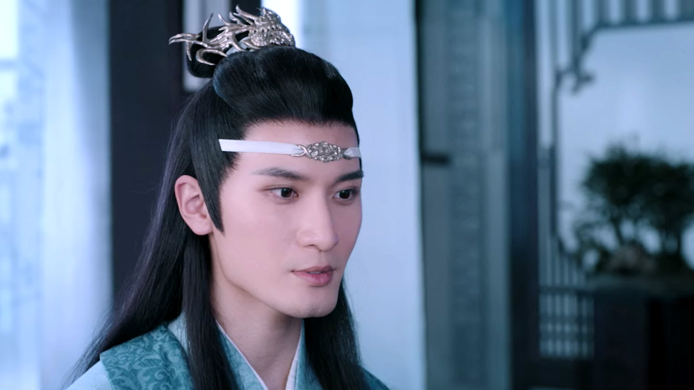
_Source : Tencent Pictures, 陳情令_

|姓+名|姓+字|号|
|---|---|---|
|藍渙|藍曦臣|沢蕪君|
|ラン ホワン|ラン シーチェン|ゼウ ジュン|
|Lan Huan|Lan Xichen|Zewu Jun|

姑蘇藍氏の宗主。  
<a href="#ruby藍忘機rtlan-wangjirtruby（ラン-ワンジー）-lwj">藍忘機</a>の実兄。

温厚で優しい性格。  
無表情な弟のよき理解者。

私は穏やかな彼が大好きです💕

#### 呼び名

<a href="#ruby藍忘機rtlan-wangjirtruby（ラン-ワンジー）-lwj">藍忘機</a>からのみ兄長と呼ばれていました。

<a href="#ruby聶明玦rtnie-mingjuertruby（ニエ-ミンジュエ）-nmj">聶明玦</a>、<a href="#ruby金光瑤rtjin-guangyaortruby（ジン-グアンヤオ）-jgy">金光瑤</a>と義兄弟の契りを交わしたため、彼らの間では「二哥」と呼ばれる。

### <ruby>藍啓仁<rt>Lan Qiren</rt></ruby>（ラン チーレン）, LQR

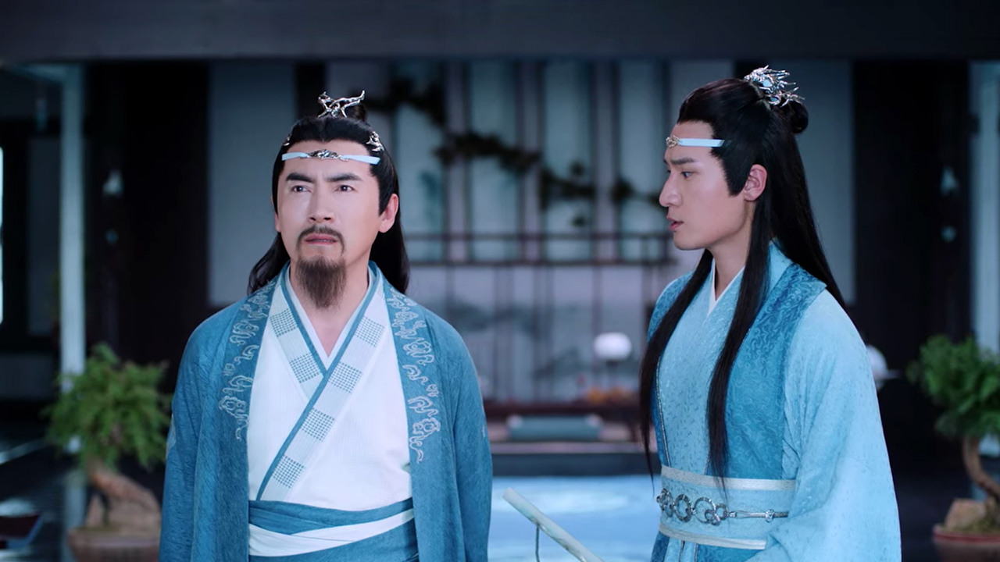
_Source : Tencent Pictures, 陳情令_

|姓+名|姓+字|号|
|---|---|---|
| |藍啓仁| |
| |ラン チーレン| |
| |Lan Qiren| |

<a href="#ruby藍忘機rtlan-wangjirtruby（ラン-ワンジー）-lwj">藍忘機</a>と<a href="#ruby藍曦臣rtlan-xichenrtruby（ラン-シーチェン）-lxc">藍曦臣</a>兄弟の叔父。

前宗主である兄が隠遁しているため、藍氏のリーダー的な存在。

規律に厳しく、堅苦しい先生。

<a href="#ruby魏無羨rtwei-wuxianrtruby（ウェイ-ウーシェン）-wwx">魏無羨</a>の母である<a href="#ruby蔵色散人rtcangse-sanrenrtruby（ツァンスア-サンレン）-cssr">蔵色散人</a>とは旧知の仲のよう。

### <ruby>藍思追<rt>Lan Sizhui</rt></ruby>（ラン スージュェイ）, LSZ

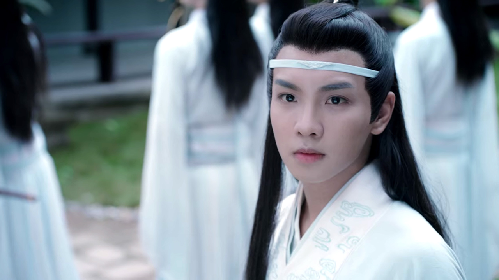
_Source : Tencent Pictures, 陳情令_

|姓+名|姓+字|号|
|---|---|---|
|藍願|藍思追| |
|ラン ユアン|ラン スージュェイ| |
|Lan Yuan|Lan Sizhui| |

藍氏の若い弟子。

真面目で心優しく、才能もある。

16年前、温氏一族が皆殺しにされた時の生き残り。  
その後、<a href="#ruby藍忘機rtlan-wangjirtruby（ラン-ワンジー）-lwj">藍忘機</a>に引き取られて、新たな名前を与えられた。

元の名前は温苑。

藍氏に引き取られる前の記憶は無かったが、<a href="#ruby魏無羨rtwei-wuxianrtruby（ウェイ-ウーシェン）-wwx">魏無羨</a>や<a href="#ruby温寧rtwen-ningrtruby（ウェン-ニン）-wn">温寧</a>と出会ったことがきっかけで思い出す。

同世代の若い弟子たちと共に「少年組」と呼ばれている。

### <ruby>藍景儀<rt>Lan Jingyi</rt></ruby>（ラン ジンイー）, LJY

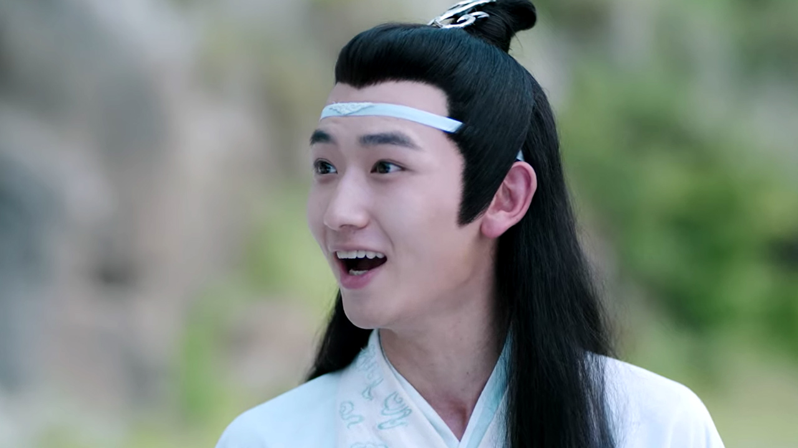
_Source : Tencent Pictures, 陳情令_

|姓+名|姓+字|号|
|---|---|---|
| |藍景儀| |
| |ラン ジンイー| |
| |Lan Jingyi| |

藍氏の若い弟子。

正義感があり、活発で喧嘩っ早い。

<a href="#ruby藍思追rtlan-sizhuirtruby（ラン-スージュェイ）-lsz">藍思追</a>と仲が良く、よく一緒に行動している。

同世代の若い弟子たちと共に「少年組」と呼ばれている。

### <ruby>藍翼<rt>Lan Yi</rt></ruby>（ラン イー）

_Source : Tencent Pictures, 陳情令_

姑蘇藍氏の開祖の孫娘で、唯一の女性宗主。

藍氏の秘技である弦殺術を編み出した人物。

### <ruby>蘇渉<rt>Su She</rt></ruby>（スー ショー）

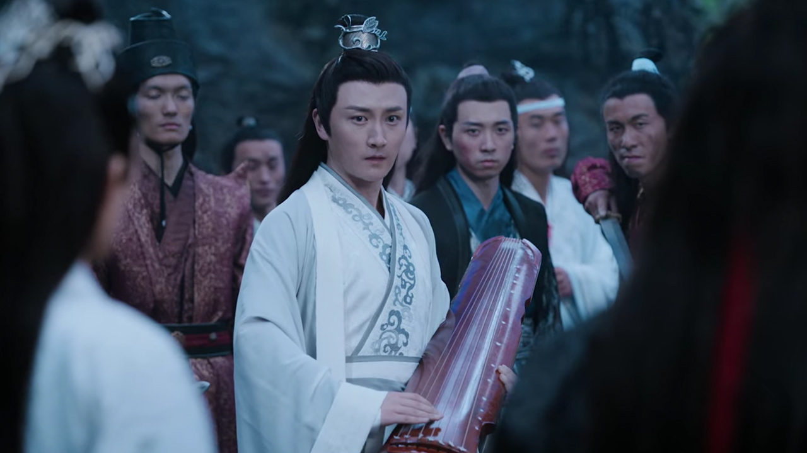
_Source : Tencent Pictures, 陳情令_

もともとは姑蘇藍氏の弟子だったが、独立して秣陵蘇氏の宗主となる。

<a href="#ruby藍忘機rtlan-wangjirtruby（ラン-ワンジー）-lwj">藍忘機</a>と同じように、七弦の琴を武器として使用している。 
独立したものの仙門の秘儀も似ているため、姑蘇藍氏との折り合いは良くなさそう。

---

## <ruby>清河<rt>Qinghe</rt></ruby>の<ruby>聶<rt>Nie</rt></ruby>氏

本拠地：清河にある不浄世  
色：灰色

先祖が餌取だったので、剣ではなく刀の扱いを専門とする一族。

### <ruby>聶明玦<rt>Nie Mingjue</rt></ruby>（ニエ ミンジュエ）, NMJ

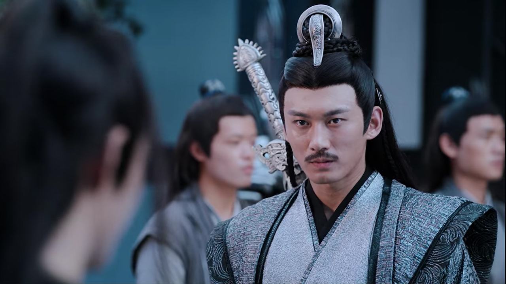
_Source : Tencent Pictures, 陳情令_

|姓+名|姓+字|号|
|---|---|---|
| |聶明玦|赤鋒尊|
| |ニエ ミンジュエ|チフェンズン|
| |Nie Mingjue|Chifeng-zun|

清河聶氏の宗主。  
<a href="#ruby聶懐桑rtnie-huaisangrtruby（ネイ-ファイサン）-nhs">聶懐桑</a>の腹違いの兄であり、彼にはやたら厳しい。

豪傑って感じの風体。

#### 16年後

発狂して失踪。

#### 呼び名

異母弟の<a href="#ruby聶懐桑rtnie-huaisangrtruby（ネイ-ファイサン）-nhs">聶懐桑</a>や、義兄弟の契りを交わした<a href="#ruby藍曦臣rtlan-xichenrtruby（ラン-シーチェン）-lxc">藍曦臣</a>、<a href="#ruby金光瑤rtjin-guangyaortruby（ジン-グアンヤオ）-jgy">金光瑤</a>からは「大哥」と呼ばれている。

### <ruby>聶懐桑<rt>Nie Huaisang</rt></ruby>（ネイ ファイサン）, NHS

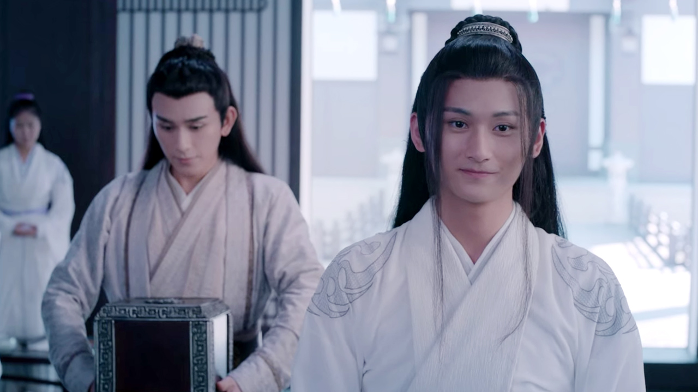
_Source : Tencent Pictures, 陳情令_

|姓+名|姓+字|号|
|---|---|---|
| |聶懐桑| |
| |ネイ ファイサン| |
| |Nie Huaisang| |

聶氏宗主の<a href="#ruby聶明玦rtnie-mingjuertruby（ニエ-ミンジュエ）-nmj">聶明玦</a>の異母弟。

<a href="#ruby魏無羨rtwei-wuxianrtruby（ウェイ-ウーシェン）-wwx">魏無羨</a>とは、藍氏に留学していた頃からの友人。

いつも扇子を持っており、修行よりも風流をこよなく愛する。

#### 16年後

清河聶氏の宗主。  
しかし、何を聞かれても「知らない、知らない、本当に知らない」と言い続けており、役立たずとして有名。

でも、実は16年後に裏で手を回していたのは彼だったみたい。

---

## <ruby>蘭陵<rt>Lanling</rt></ruby>の<ruby>金<rt>Jin</rt></ruby>氏

本拠地：蘭陵にある金鱗台  
色：金色

最も裕福な一族。

### <ruby>金光善<rt>Jin Guangshan</rt></ruby>（ジン グアンシャン）, JGS

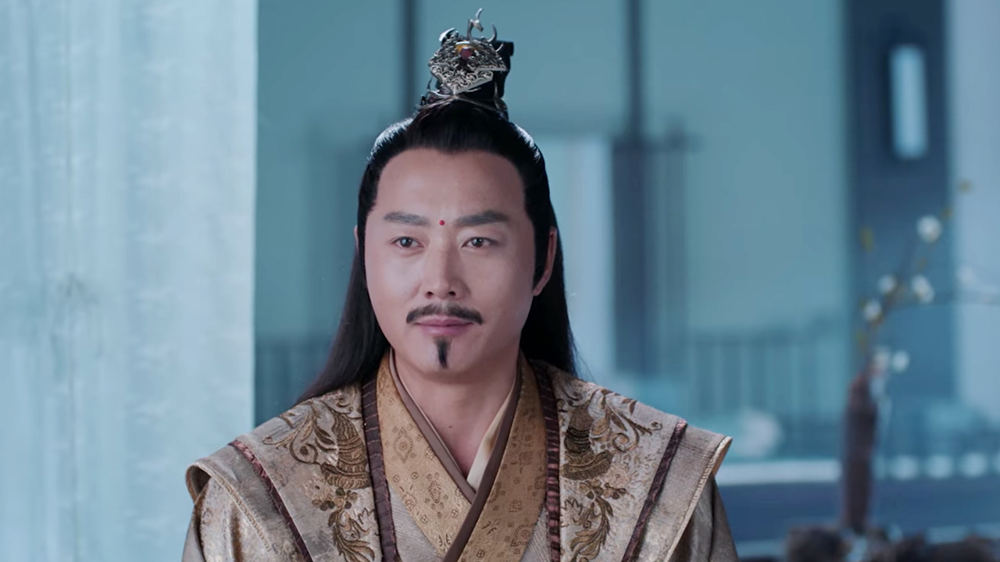
_Source : Tencent Pictures, 陳情令_

|姓+名|姓+字|号|
|---|---|---|
| |金光善| |
| |ジン グアンシャン| |
| |Jin Guangshan| |

蘭陵金氏の宗主。  
<a href="#ruby金子軒rtjin-zixuanrtruby（ジン-ズーシュエン）-jzx">金子軒</a>、<a href="#ruby金光瑤rtjin-guangyaortruby（ジン-グアンヤオ）-jgy">金光瑤</a>の父。

無類の女好きで、そこかしこに落とし胤が…。

もともと彼の庶子である<a href="#ruby金光瑤rtjin-guangyaortruby（ジン-グアンヤオ）-jgy">金光瑤</a>を自分の子とは認めていなかったものの、温氏討伐後、彼の手柄を金氏のものにするため迎え入れる。  
が、今一つ彼を大事にしている様子はない。

後に<a href="#ruby金光瑤rtjin-guangyaortruby（ジン-グアンヤオ）-jgy">金光瑤</a>によって殺害される。

### <ruby>金子軒<rt>Jin Zixuan</rt></ruby>（ジン ズーシュエン）, JZX

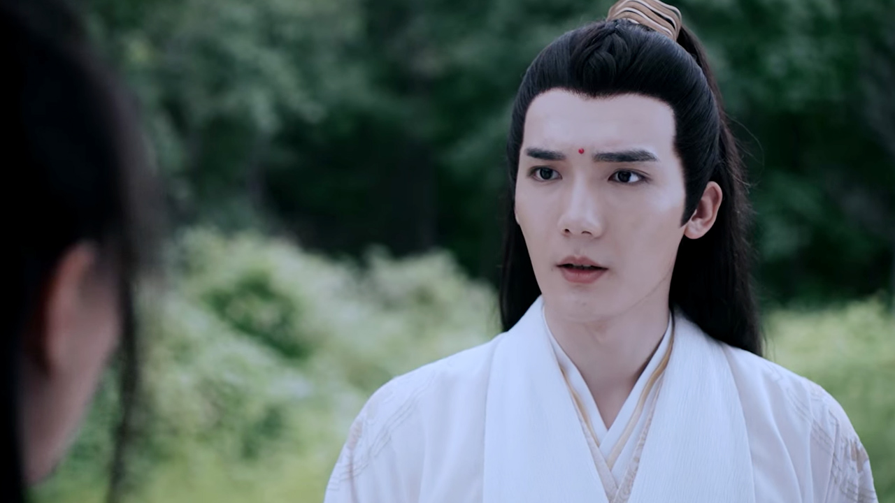
_Source : Tencent Pictures, 陳情令_

|姓+名|姓+字|号|
|---|---|---|
| |金子軒| |
| |ジン ズーシュエン| |
| |Jin Zixuan| |

蘭陵金氏の次期当主。  
<a href="#ruby金光瑤rtjin-guangyaortruby（ジン-グアンヤオ）-jgy">金光瑤</a>の異母兄。

<a href="#ruby江厭離rtjiang-yanlirtruby（ジャン-イエンリー）-jyl">江厭離</a>の婚約者であり、後に結婚。<a href="#ruby金凌rtjin-lingrtruby（ジン-リン）-jl">金凌</a>の父。

当初は我儘で傲慢な態度だったが、愛妻家へと変化した。

後に<a href="#ruby金光瑤rtjin-guangyaortruby（ジン-グアンヤオ）-jgy">金光瑤</a>の策略により、暴走した<a href="#ruby温寧rtwen-ningrtruby（ウェン-ニン）-wn">温寧</a>に殺害される。

#### 呼び名

派手な格好を好むことから、<a href="#ruby魏無羨rtwei-wuxianrtruby（ウェイ-ウーシェン）-wwx">魏無羨</a>に「孔雀」と呼ばれる。

### <ruby>綿綿<rt>Mianmian</rt></ruby>（ミエンミエン）

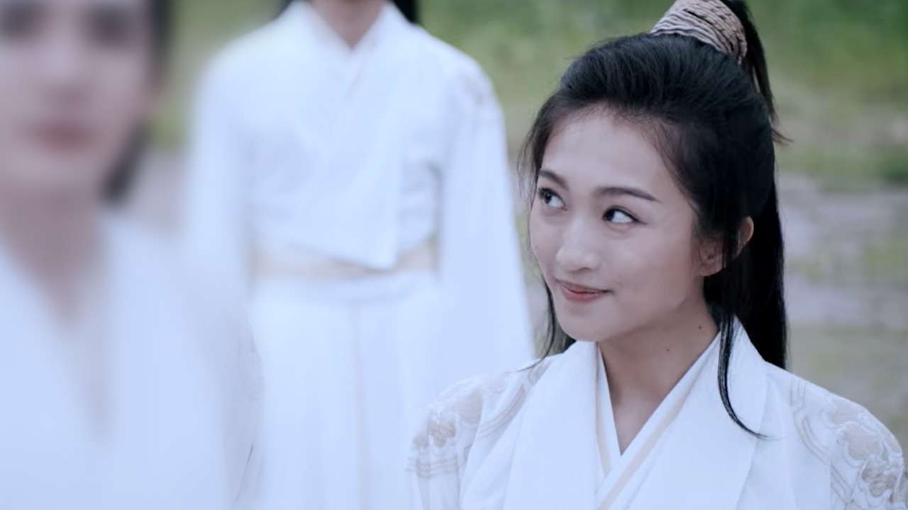
_Source : Tencent Pictures, 陳情令_

綿綿は愛称で、本名は羅青羊。

蘭陵金氏の弟子で、<a href="#ruby金子軒rtjin-zixuanrtruby（ジン-ズーシュエン）-jzx">金子軒</a>の従者の一人として行動を共にしている。

### <ruby>金光瑤<rt>Jin Guangyao</rt></ruby>（ジン グアンヤオ）, JGY

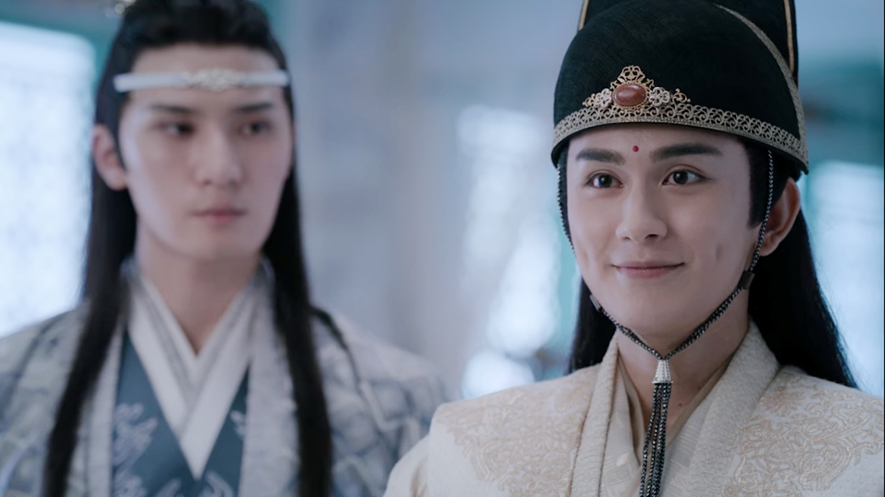
_Source : Tencent Pictures, 陳情令_

<a href="#ruby金光善rtjin-guangshanrtruby（ジン-グアンシャン）-jgs">金光善</a>の庶子。 
<a href="#ruby金子軒rtjin-zixuanrtruby（ジン-ズーシュエン）-jzx">金子軒</a>の異母弟。

母親が娼婦のため、金氏の息子とは認めてもらえず、母親に育てられる。  
その後、聶氏で暮らし、<a href="#ruby聶懐桑rtnie-huaisangrtruby（ネイ-ファイサン）-nhs">聶懐桑</a>の右腕として働く。  
当時の名前は孟瑶。

世渡り上手で記憶力がいい。

温氏討伐後は、その功績により金子へと迎え入れられ、金光瑤を名乗る。  
また、<a href="#ruby聶明玦rtnie-mingjuertruby（ニエ-ミンジュエ）-nmj">聶明玦</a>、<a href="#ruby藍曦臣rtlan-xichenrtruby（ラン-シーチェン）-lxc">藍曦臣</a>と義兄弟の契りを交わす。

#### 16年後

蘭陵金氏の宗主。

### <ruby>金凌<rt>Jin Ling</rt></ruby>（ジン リン）, JL

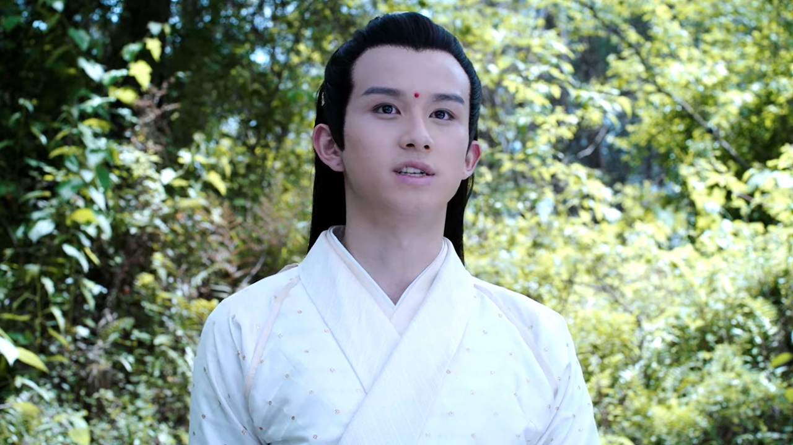
_Source : Tencent Pictures, 陳情令_

|姓+名|姓+字|号|
|---|---|---|
|金凌|金如蘭| |
|ジン リン|ジン ルーラン| |
|Jin Ling|Jin Rulan| |

蘭陵金氏のお坊ちゃん。

<a href="#ruby金子軒rtjin-zixuanrtruby（ジン-ズーシュエン）-jzx">金子軒</a>と<a href="#ruby江厭離rtjiang-yanlirtruby（ジャン-イエンリー）-jyl">江厭離</a>の息子。

1歳の時に両親を亡くしたため、叔父である<a href="#ruby江澄rtjiang-chengrtruby（ジャン-チョン）-jc">江澄</a>の元で育てられた。

両親の件で<a href="#ruby魏無羨rtwei-wuxianrtruby（ウェイ-ウーシェン）-wwx">魏無羨</a>を恨んでいる。  
そのため、彼が生まれる前に<a href="#ruby魏無羨rtwei-wuxianrtruby（ウェイ-ウーシェン）-wwx">魏無羨</a>によって名付けられた字、如蘭は使われていない。

仙子（フェアリーみたいな意味）という名前の霊犬を連れている。

同世代の若い弟子たちと共に「少年組」と呼ばれている。

#### 呼び名

我儘放題な性格のため、同世代の子たちからは「お嬢様」と陰口を叩かれている。

### <ruby>金子勲<rt>Jin Zixun</rt></ruby>（ジン ズーシュン）

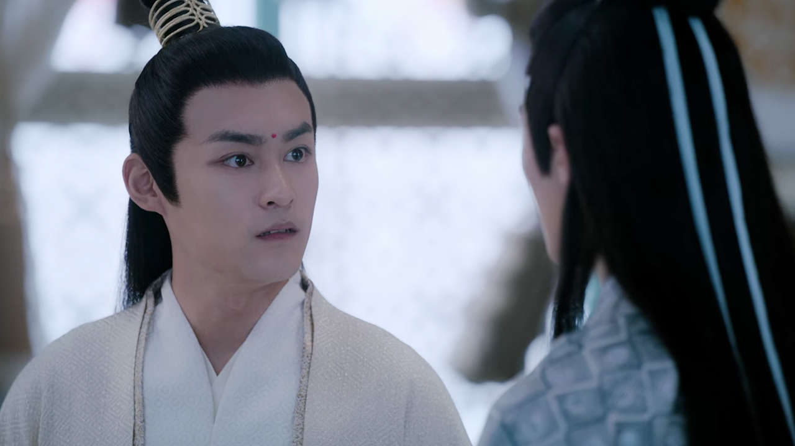
_Source : Tencent Pictures, 陳情令_

<a href="#ruby金子軒rtjin-zixuanrtruby（ジン-ズーシュエン）-jzx">金子軒</a>の従兄弟。クソ。

---

## <ruby>岐山<rt>Qishan</rt></ruby>の<ruby>温<rt>Wen</rt></ruby>氏

本拠地：岐山にある不夜天城  
色：赤

五大名家の筆頭。

### <ruby>温若寒<rt>Wen Ruohan</rt></ruby>（ウェン ルオハン）

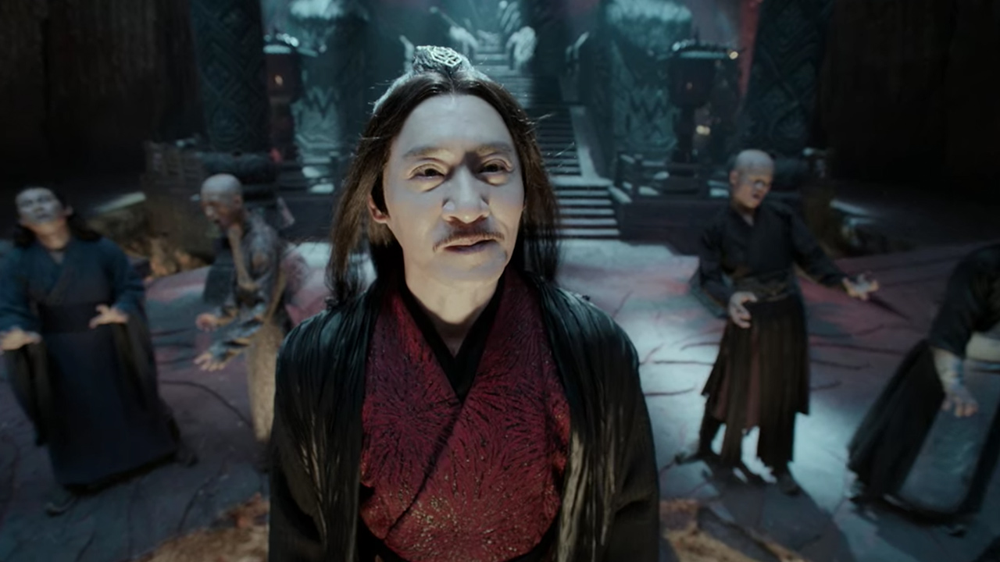
_Source : Tencent Pictures, 陳情令_

岐山温氏の宗主。  
<a href="#ruby温旭rtwen-xurtruby（ウェン-シュー）">温旭</a>と<a href="#ruby温晁rtwen-chaortruby（ウェン-チョウ）-wc">温晁</a>の父。

五大名家をまとめる仙督。

五大名家を支配し、更なる力を手に入れようと陰鉄を集めており、各地の仙家を襲撃する。

### <ruby>温旭<rt>Wen Xu</rt></ruby>（ウェン シュー）

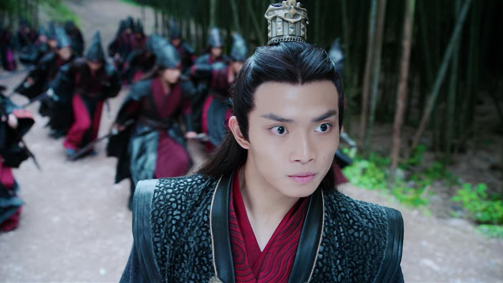
_Source : Tencent Pictures, 陳情令_

<a href="#ruby温若寒rtwen-ruohanrtruby（ウェン-ルオハン）">温若寒</a>の長男。

温氏討伐の際、<a href="#ruby聶明玦rtnie-mingjuertruby（ニエ-ミンジュエ）-nmj">聶明玦</a>によって首をはねられて死亡した。

### <ruby>温晁<rt>Wen Chao</rt></ruby>（ウェン チョウ）, WC

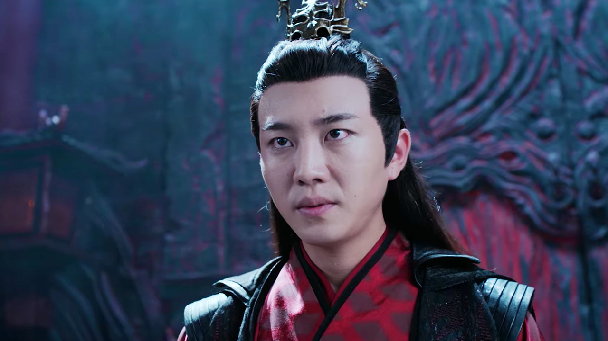
_Source : Tencent Pictures, 陳情令_

<a href="#ruby温若寒rtwen-ruohanrtruby（ウェン-ルオハン）">温若寒</a>の次男。

横暴で残虐。  
常に人を見下すような態度をとる。

<a href="#ruby魏無羨rtwei-wuxianrtruby（ウェイ-ウーシェン）-wwx">魏無羨</a>を乱葬崗へと突き落とした。

### <ruby>王霊嬌<rt>Wang LingJiao</rt></ruby>（ワン リンジャオ）

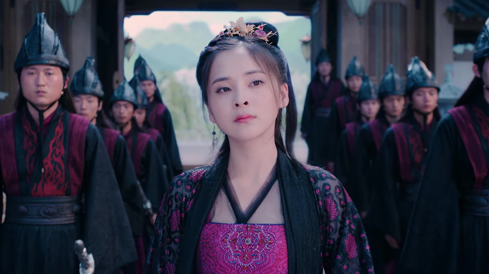
_Source : Tencent Pictures, 陳情令_

<a href="#ruby温晁rtwen-chaortruby（ウェン-チョウ）-wc">温晁</a>の愛人。 
元々は<a href="#ruby温晁rtwen-chaortruby（ウェン-チョウ）-wc">温晁</a>の正室の侍女。

### <ruby>温逐流<rt>Wen Zhuliu</rt></ruby>（ウェン ジューリウ）

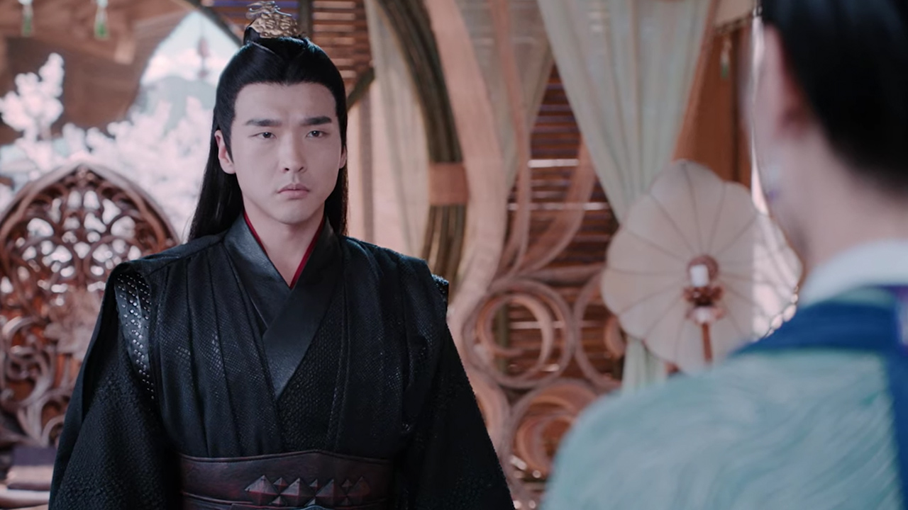
_Source : Tencent Pictures, 陳情令_

<a href="#ruby温晁rtwen-chaortruby（ウェン-チョウ）-wc">温晁</a>の部下。

温若寒に助けられた恩に報いるため、息子の<a href="#ruby温晁rtwen-chaortruby（ウェン-チョウ）-wc">温晁</a>の護衛をしている。

他人の金丹を溶かす能力を持っている。

<a href="#ruby魏無羨rtwei-wuxianrtruby（ウェイ-ウーシェン）-wwx">魏無羨</a>の両親である<a href="#ruby江楓眠rtjiang-fengmianrtruby（ジャン-フォンミエン）-jfm">江楓眠</a>、<a href="#ruby虞紫鳶rtyu-ziyuanrtruby（ユー-ズーユエン）-yzy">虞紫鳶</a>とは昔の知り合いっぽい。

本名は趙逐流。

### <ruby>温情<rt>Wen Qing</rt></ruby>（ウェン チン）, WQ

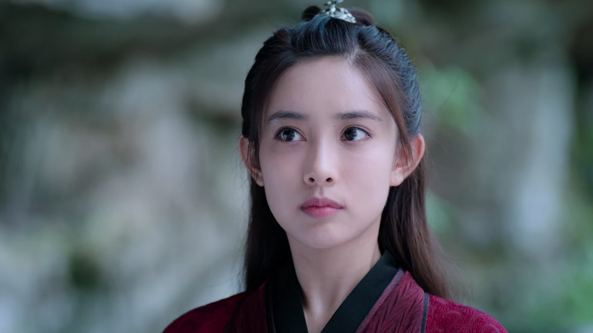
_Source : Tencent Pictures, 陳情令_

<a href="#ruby温寧rtwen-ningrtruby（ウェン-ニン）-wn">温寧</a>の姉。 
腕の立つ医者。

気が強く、弟思い。

温氏の分家で、温氏討伐の際、彼女の一族は<a href="#ruby魏無羨rtwei-wuxianrtruby（ウェイ-ウーシェン）-wwx">魏無羨</a>によって助けられた。

剣よりも鍼を武器として使う姿をよく見かける。

### <ruby>温寧<rt>Wen Ning</rt></ruby>（ウェン ニン）, WN

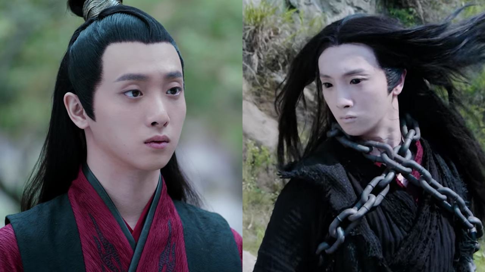
_Source : Tencent Pictures, 陳情令_

<a href="#ruby温情rtwen-qingrtruby（ウェン-チン）-wq">温情</a>の弟。

天然で、心優しく、穏やかな青年。

姉の<a href="#ruby温情rtwen-qingrtruby（ウェン-チン）-wq">温情</a>と共に藍氏に留学した際、<a href="#ruby魏無羨rtwei-wuxianrtruby（ウェイ-ウーシェン）-wwx">魏無羨</a>と友人になる。

死後、<a href="#ruby魏無羨rtwei-wuxianrtruby（ウェイ-ウーシェン）-wwx">魏無羨</a>によって「最強の鬼将軍」として蘇えり、人々から恐れられている。

---

## 義城編

### <ruby>暁星塵<rt>Xiao Xingchen</rt></ruby>（シャオ シンチェン）, XXC

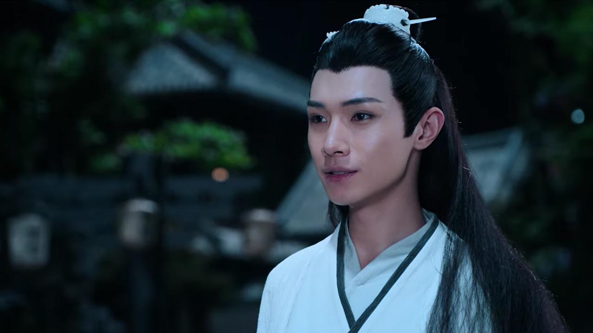
_Source : Tencent Pictures, 陳情令_

伝説の仙師、<a href="#ruby抱山散人rtbaoshan-sanrenrtruby（バオシャンサンレン）-bssr">抱山散人</a>の弟子。  
<a href="#ruby魏無羨rtwei-wuxianrtruby（ウェイ-ウーシェン）-wwx">魏無羨</a>の母、<a href="#ruby蔵色散人rtcangse-sanrenrtruby（ツァンスア-サンレン）-cssr">蔵色散人</a>の弟弟子。

己の正義を貫くため、17歳の時に下山する。

<a href="#ruby宋嵐rtsong-lanrtruby（ソン-ラン）-sl">宋嵐</a>は親友であり、旅の仲間。 
彼と共に血縁も貴賎も関係ない仙門を作ることを目指していた。

<a href="#ruby宋嵐rtsong-lanrtruby（ソン-ラン）-sl">宋嵐</a>が視力を失った際、彼を治すために<a href="#ruby抱山散人rtbaoshan-sanrenrtruby（バオシャンサンレン）-bssr">抱山散人</a>に助けを求め、自身の目を移植することで、失った視力を回復させた。 
その後は、盲目の道士として暮らしている。

顔が、顔が美しいわ…💕

#### 呼び名

道教の僧侶なので、その敬称である「道長」と呼ばれることもある。

### <ruby>宋嵐<rt>Song Lan</rt></ruby>（ソン ラン）, SL

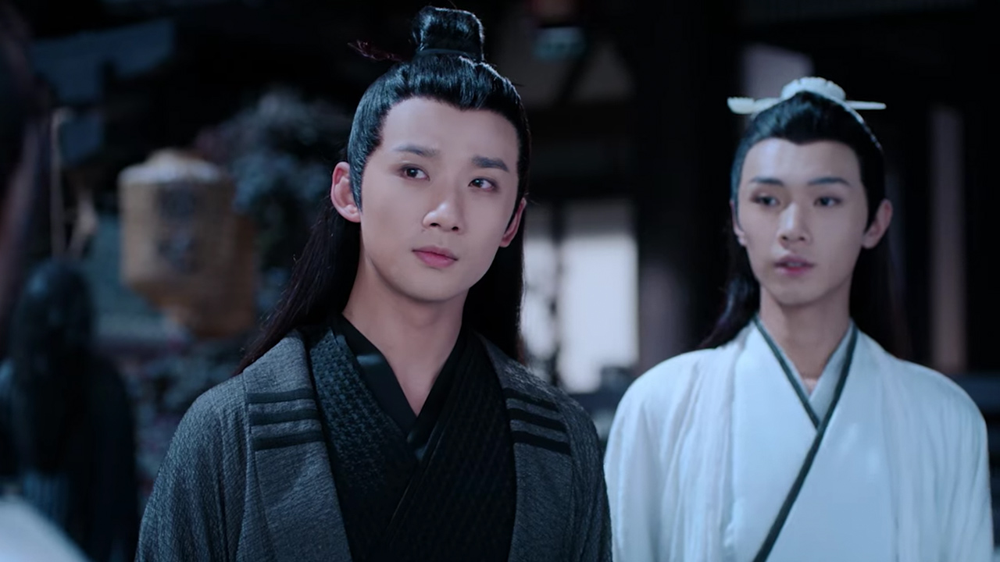
_Source : Tencent Pictures, 陳情令_

<a href="#ruby暁星塵rtxiao-xingchenrtruby（シャオ-シンチェン）-xxc">暁星塵</a>の親友であり、旅の仲間。

<a href="#ruby薛洋rtxue-yangrtruby（シュエ-ヤン）-xy">薛洋</a>によって失明したが、<a href="#ruby暁星塵rtxiao-xingchenrtruby（シャオ-シンチェン）-xxc">暁星塵</a>が<a href="#ruby抱山散人rtbaoshan-sanrenrtruby（バオシャンサンレン）-bssr">抱山散人</a>の力を借り、自身の目を移植したことで、失った視力を取り戻した。 
その後、代わりに盲目となり姿を消した<a href="#ruby暁星塵rtxiao-xingchenrtruby（シャオ-シンチェン）-xxc">暁星塵</a>を探している。

#### 呼び名

彼も道教の僧侶なので、<a href="#ruby暁星塵rtxiao-xingchenrtruby（シャオ-シンチェン）-xxc">暁星塵</a>と共に「双道長」と呼ばれることもある。

### <ruby>薛洋<rt>Xue Yang</rt></ruby>（シュエ ヤン）, XY

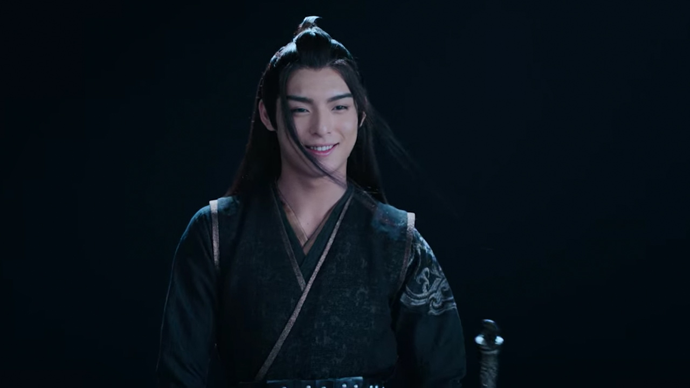
_Source : Tencent Pictures, 陳情令_

温氏にて陰鉄集めに協力していたが、温氏討伐の際は、<a href="#ruby金光瑤rtjin-guangyaortruby（ジン-グアンヤオ）-jgy">金光瑤</a>と同盟を組み、討伐から逃れた。

怪我をした際、盲目の<a href="#ruby暁星塵rtxiao-xingchenrtruby（シャオ-シンチェン）-xxc">暁星塵</a>に助けられ、それ以来、彼に異常な執着を持つ。

残忍で狡猾。  
甘いものが好き。

檪陽常氏の虐殺の首謀者。  
幼少期に左手の小指を失っており、それが原因でマイナーな仙門、檪陽常氏に恨みを持っていた。

#### 呼び名

<a href="#ruby魏無羨rtwei-wuxianrtruby（ウェイ-ウーシェン）-wwx">魏無羨</a>からは小流氓（チンピラみたいな意味）と呼ばれてました。

---

## その他

### <ruby>莫玄羽<rt>Mo Xuanyu</rt></ruby>（モー シュエンユー）, MXY

|姓+名|姓+字|号|
|---|---|---|
| |莫玄羽| |
| |モー シュエンユー| |
| |Mo Xuanyu| |

献舎の術によって<a href="#ruby魏無羨rtwei-wuxianrtruby（ウェイ-ウーシェン）-wwx">魏無羨</a>の魂を献舎の術によって蘇らせた。自分の代わりに復讐を果たしてもらうために。

なぜ献舎の術を使う前から、常にマスクを着けて顔を隠していたかは語られなかったと思う。  
彼の周りの誰もが「頭がおかしい男」と思っていたみたい。

13歳の時、金氏で修行することになったが、その後、破門されて追い出される。

### <ruby>薛重亥<rt>Xue Chonghai</rt></ruby>（シュエ チョンハイ）, XCH

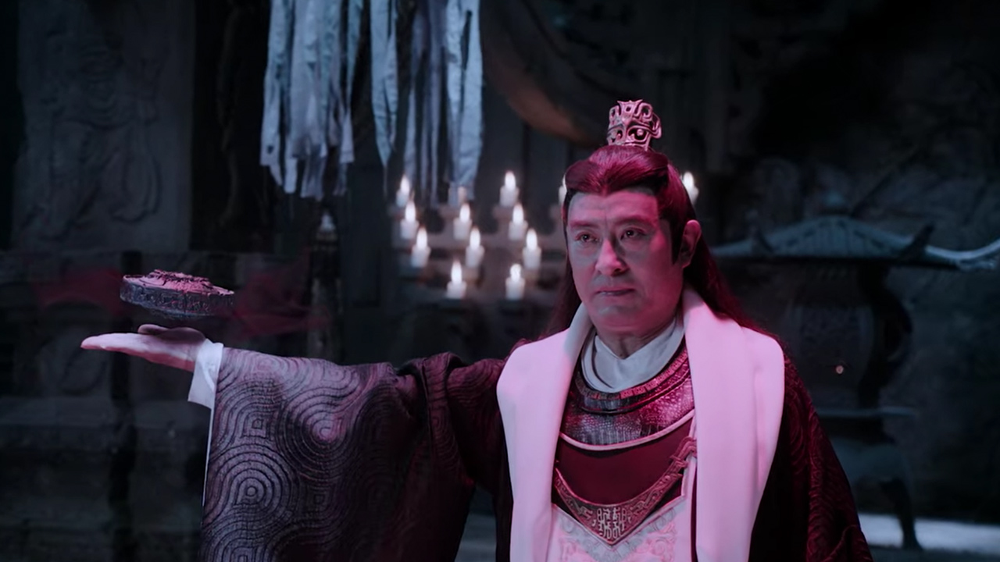
_Source : Tencent Pictures, 陳情令_

陰鉄を錬成した人物。

屠戮玄武を操って多くの者を虐殺したため、五大世家の協力により殺害された。

### <ruby>抱山散人<rt>Baoshan Sanren</rt></ruby>（バオシャンサンレン）, BSSR

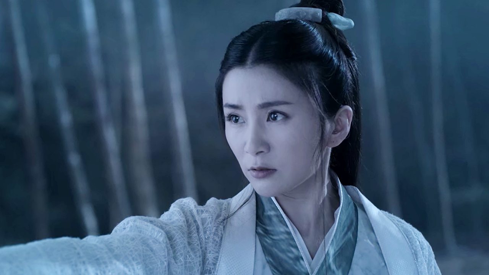
_Source : Tencent Pictures, 陳情令_

奇跡を起こせると信じられている伝説の先師であり、不老不死。  
世俗を離れ、山に籠って修行を続けている。

<a href="#ruby魏無羨rtwei-wuxianrtruby（ウェイ-ウーシェン）-wwx">魏無羨</a>の母である<a href="#ruby蔵色散人rtcangse-sanrenrtruby（ツァンスア-サンレン）-cssr">蔵色散人</a>と、<a href="#ruby暁星塵rtxiao-xingchenrtruby（シャオ-シンチェン）-xxc">暁星塵</a>の師。

孤児を山に連れ帰り、弟子にしている。  
弟子が山を下りることを禁止しており、もし山を下りて下界に戻ったら二度と山には帰ってはならないという掟がある。

### <ruby>歐陽子真<rt>Ouyang Zizhen</rt></ruby>（オウヤン ズージェン）, OYZZ/OZZ

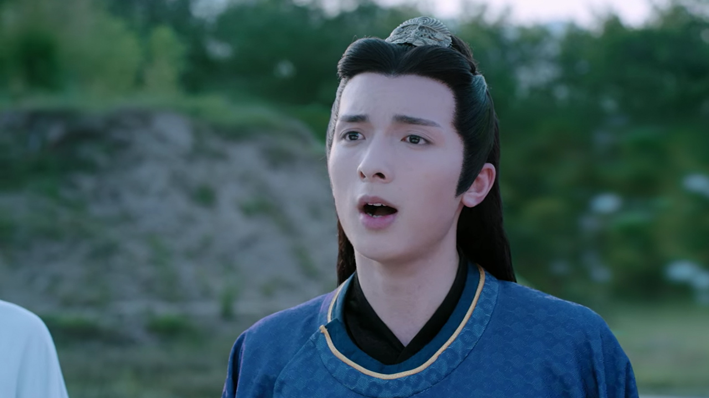
_Source : Tencent Pictures, 陳情令_

巴陵歐陽氏の宗主の息子。

同世代の若い弟子たちと共に「少年組」と呼ばれている。

__※U-NEXTでは、2021年8月31日23:59まで配信予定とのこと（2021/4/8時点での情報）__

<AffiliateBanner type="unext" />
