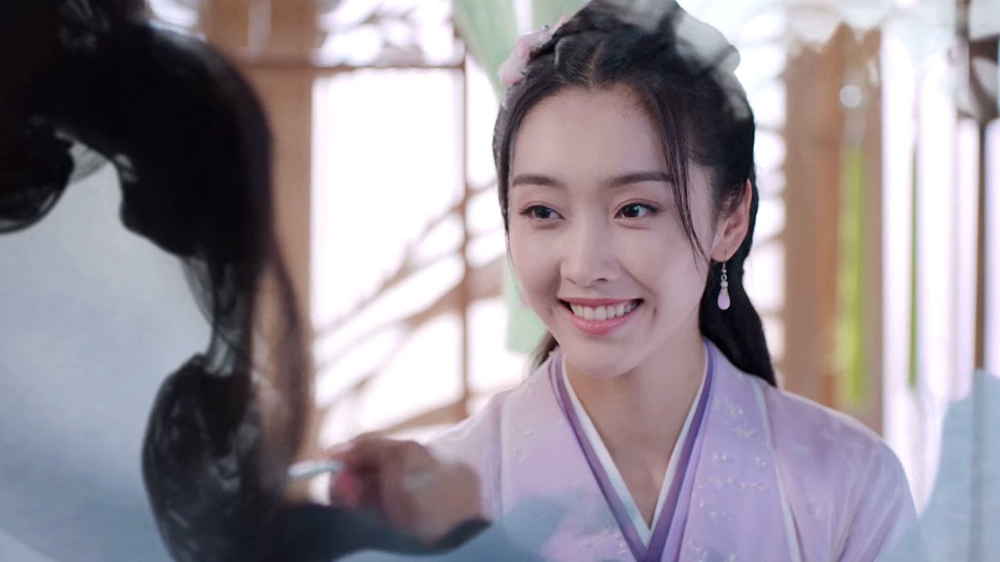
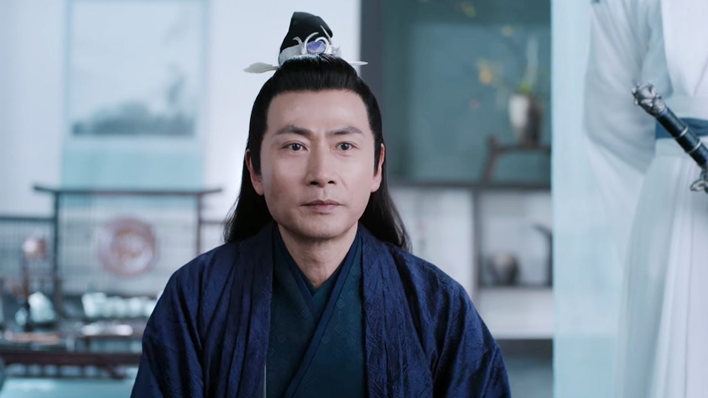
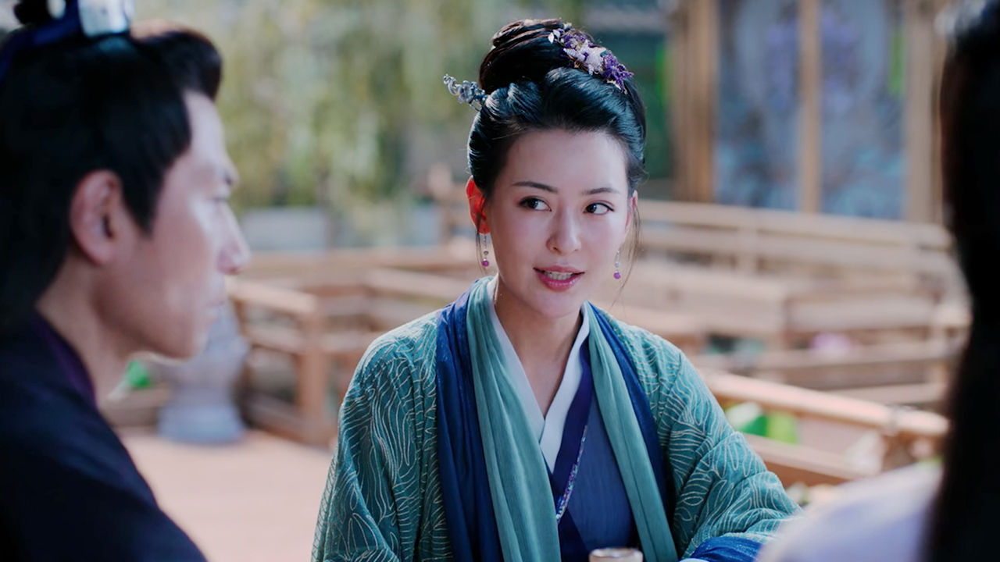
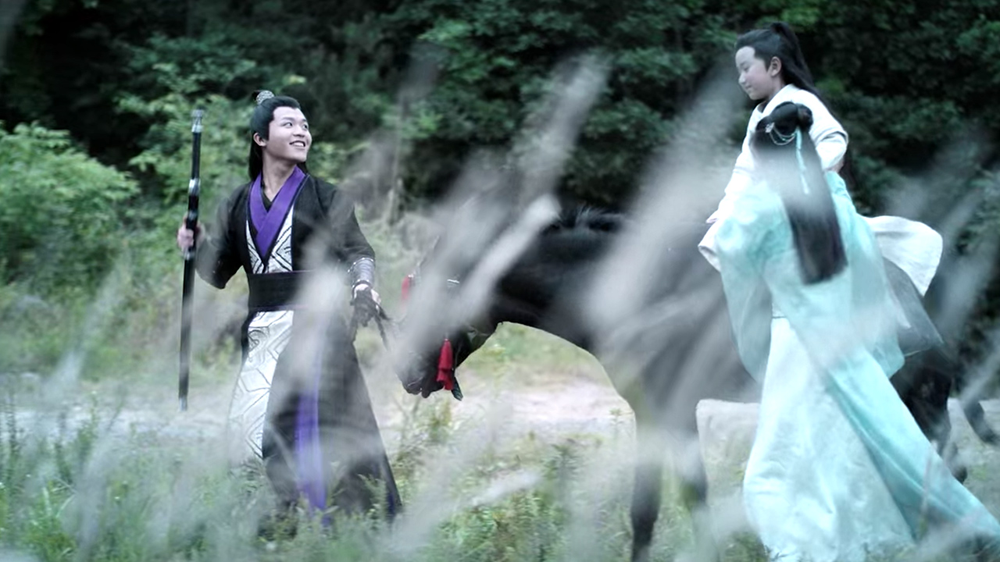
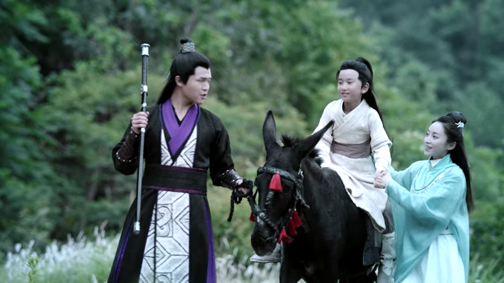

import { Amazon, Blockquote, Youtube, AffiliateBanner, InternalLink } from '../../../../src/components/blog'

仕事そっちのけで全話見てしまった『陳情令』😇

3月1日（月）から[U-NEXT](https://ck.jp.ap.valuecommerce.com/servlet/referral?sid=3549505&pid=886995495&vc_url=https%3A%2F%2Fvideo.unext.jp%2Ftitle%2FSID0055445%2F%3Fcid%3DD33139%26adid%3DVC1%26alp%3D1%26alpad%3D1%26alpge%3D1)で、全50話が一挙に配信されるそうなので、まだ見てない方はぜひ見て欲しい！

__※U-NEXTでは、2021年8月31日23:59まで配信予定とのこと（2021/4/8時点での情報）__

<Youtube id="VFZfrRjXPjo" />

『陳情令』まとめ第二弾は、とにかく登場人物が多くて混乱しがちなので、キャラクターリストを作ろうと思います。  
少しずつ更新していきますね。

第一弾と三弾もよかったらどうぞ。

<InternalLink slug="/tv-movie/the-untamed-character-names-and-relationships/" />

<InternalLink slug="/tv-movie/the-untamed-for-beginner/" />

__※中国語音声＋英語字幕で見ているので、日本語訳が間違っている場合は教えていただけると助かります__

---

つい先日、『陳情令』の原作小説『[魔道祖師](https://amzn.to/3keYGu3)』の日本語翻訳版が発売されましたー🙌

<Amazon
  asin="4866574127"
  title="魔道祖師 1"
  url="https://amzn.to/3keYGu3"
  author="墨香銅臭, 千二百"
  rakuten="https://hb.afl.rakuten.co.jp/ichiba/1d191c30.c88f7897.1d191c31.80840e66/?pc=https%3A%2F%2Fitem.rakuten.co.jp%2Fbook%2F16629793%2F&link_type=hybrid_url&ut=eyJwYWdlIjoiaXRlbSIsInR5cGUiOiJoeWJyaWRfdXJsIiwic2l6ZSI6IjI0MHgyNDAiLCJuYW0iOjEsIm5hbXAiOiJyaWdodCIsImNvbSI6MSwiY29tcCI6ImRvd24iLCJwcmljZSI6MSwiYm9yIjoxLCJjb2wiOjEsImJidG4iOjEsInByb2QiOjAsImFtcCI6ZmFsc2V9"
  renta=""
  cmoa=""
  ebookjapan=""
  honto=""
/>

あくまでブロマンスである『陳情令』とは異なり、ちゃんとBがLしてるそうなので、私はKindle版が出るのを心待ちにしてますよ…😭

---

## メインカップル

### <ruby>魏無羨<rt>Wei Wuxian</rt></ruby>（ウェイ ウーシェン）, WWX

_Source : Tencent Pictures, 陳情令_

|姓+名|姓+字|号|
|---|---|---|
|魏嬰|魏無羨|夷陵老祖|
|ウェイ イン|ウェイ ウーシェン|イーリン ラォズゥー|
|Wei Ying|Wei Wuxian|YiLing LaoZu|

剣: 随便（どうぞご自由にみたいな意味）  
横笛: 陳情（昔の愛、関係、みたいな意味）

4歳で両親を亡くしたため<a href="#ruby雲蒙rtyunmengrtrubyのruby江rtjiangrtruby氏">江氏</a>に引き取られ、<a href="#ruby江澄rtjiang-chengrtruby（ジャン-チョン）-jc">江澄</a>、<a href="#ruby江厭離rtjiang-yanlirtruby（ジャン-イエンリー）-jyl">江厭離</a>とは実の姉弟のように育つ。

お酒が大好き。  
犬が苦手。  
正義感が強い。  
おしゃべりで、天真爛漫で、トラブルメイカー。  
しかし、頭は切れるし、剣技の腕も超一流。

鬼道を習得してからは、笛音で屍を操り、夷陵老祖と呼ばれ恐れられている。

#### 16年後

<a href="#ruby莫玄羽rtmo-xuanyurtruby（モー-シュエンユー）-mxy">莫玄羽</a>の献舎の術によって蘇る。

それ以降、銀のマスクを常に着用して正体を隠し、<a href="#ruby莫玄羽rtmo-xuanyurtruby（モー-シュエンユー）-mxy">莫玄羽</a>として過ごしている。

私は彼の腰の細さに目が釘付けです💕  
<a href="#ruby藍忘機rtlan-wangjirtruby（ラン-ワンジー）-lwj">藍忘機</a>にキュッと抱えてもらいたい。

#### 呼び名

姉弟子である<a href="#ruby江厭離rtjiang-yanlirtruby（ジャン-イエンリー）-jyl">江厭離</a>から<strong>阿羨</strong>って呼ばれてるの可愛いよね。

### <ruby>藍忘機<rt>Lan Wangji</rt></ruby>（ラン ワンジー）, LWJ

_Source : Tencent Pictures, 陳情令_

|姓+名|姓+字|号|
|---|---|---|
|藍湛|藍忘機|含光君|
|ラン ジャン|ラン ワンジー|ハングァン ジュン|
|Lan Zhan|Lan Wangji|HanGuang Jun|

剣: 避塵（汚れのないみたいな意味）  
古琴：名前は出てこなかった気がする…

姑蘇藍氏の次男。  
古琴を使った姑蘇藍氏の秘術を使える。

藍家の現宗主、藍曦臣は実の兄。共に藍氏双璧と呼ばれている。  
幼い頃から両親と別れて暮らし、叔父である藍啓仁の厳しい教えを受けて育つ。

真面目で礼節を重んじる、無口で無表情。  
お酒が飲めない。

滅多に笑顔を見せないので、彼の微笑はプレシャス度が高い。50話中、3回くらいしかなかったんじゃないかな？

#### 16年後

16年前に<a href="#ruby魏無羨rtwei-wuxianrtruby（ウェイ-ウーシェン）-wwx">魏無羨</a>を救えなかったことを悔いており、何としてでも手元に置いて守り通そうとする意気込みを感じる。

#### 呼び名

姑蘇藍氏の次男なので藍二公子とも呼ばれる。

私の周りでは __スーパー攻め様__ って呼ばれてます。

---

## <ruby>雲蒙<rt>Yunmeng</rt></ruby>の<ruby>江<rt>Jiang</rt></ruby>氏

本拠地：雲蒙にある蓮花塢  
色：紫

湖がたくさんある雲夢に拠点を置く一族。

### <ruby>江澄<rt>Jiang Cheng</rt></ruby>（ジャン チョン）, JC

_Source : Tencent Pictures, 陳情令_

|姓+名|姓+字|
|---|---|
|江澄|江晚吟|
|ジャン チョン|ジャン ワンイン|
|Jiang Cheng|Jiang Wanyin|

江氏宗主の息子であり、次期宗主。

江氏に引き取られた<a href="#ruby魏無羨rtwei-wuxianrtruby（ウェイ-ウーシェン）-wwx">魏無羨</a>とは兄弟のように育った。  
彼については兄弟子として慕ってはいるものの、天才肌である<a href="#ruby魏無羨rtwei-wuxianrtruby（ウェイ-ウーシェン）-wwx">魏無羨</a>にコンプレックスも感じている。

実姉である<a href="#ruby江厭離rtjiang-yanlirtruby（ジャン-イエンリー）-jyl">江厭離</a>を非常に慕っている。

#### 16年後

雲蒙江氏の宗主。

大好きであった実姉、<a href="#ruby江厭離rtjiang-yanlirtruby（ジャン-イエンリー）-jyl">江厭離</a>の死の原因が夷陵老祖である<a href="#ruby魏無羨rtwei-wuxianrtruby（ウェイ-ウーシェン）-wwx">魏無羨</a>にあると思い、ひどく憎んでいる。

金凌は甥であり、生後1歳で両親を失った金凌にとっては育ての親。

#### 呼び名

この人に対して、誰も姓+字で呼んでない気がするのだが、なぜ？🤔

そして、この役者さん、すごくイケメンで笑うと可愛いのに、笑顔のシーンがあまりないのよね。いつも眉間に皺寄せてる…。

### <ruby>江厭離<rt>Jiang Yanli</rt></ruby>（ジャン イエンリー）, JYL

_Source : Tencent Pictures, 陳情令_

江氏の長女。  
<a href="#ruby江澄rtjiang-chengrtruby（ジャン-チョン）-jc">江澄</a>の実姉であり、江氏に引き取られた<a href="#ruby魏無羨rtwei-wuxianrtruby（ウェイ-ウーシェン）-wwx">魏無羨</a>とは、実の姉弟のように育った。

弟2人を非常に可愛がっていて、常に優しく面倒見のいいお姉さん。

金子軒の婚約者であり、後に結婚。金凌を産む。

最後まで<a href="#ruby魏無羨rtwei-wuxianrtruby（ウェイ-ウーシェン）-wwx">魏無羨</a>を信じ続けた数少ない人物。  
彼女の死は<a href="#ruby江澄rtjiang-chengrtruby（ジャン-チョン）-jc">江澄</a>と<a href="#ruby魏無羨rtwei-wuxianrtruby（ウェイ-ウーシェン）-wwx">魏無羨</a>にとって大きなターニングポイントとなる。

#### 呼び名

<a href="#ruby江澄rtjiang-chengrtruby（ジャン-チョン）-jc">江澄</a>からは姐姐（お姉さん）と呼ばれてるし、<a href="#ruby魏無羨rtwei-wuxianrtruby（ウェイ-ウーシェン）-wwx">魏無羨</a>からは師姐（姉弟子）と呼ばれてるので、あまり厭離って呼ばれる場面はなかった気がする。

### <ruby>江楓眠<rt>Jiang Fengmian</rt></ruby>（ジャン フォンミエン）, JFM

_Source : Tencent Pictures, 陳情令_

雲夢江氏の宗主。  
<a href="#ruby江澄rtjiang-chengrtruby（ジャン-チョン）-jc">江澄</a>と<a href="#ruby江厭離rtjiang-yanlirtruby（ジャン-イエンリー）-jyl">江厭離</a>の父。

<a href="#ruby魏無羨rtwei-wuxianrtruby（ウェイ-ウーシェン）-wwx">魏無羨</a>の父親とは親友であったため、両親を無くした彼を引き取り、実の子のように育てる。

温和な性格。

温氏の襲撃により死亡。

#### 呼び名

<a href="#ruby魏無羨rtwei-wuxianrtruby（ウェイ-ウーシェン）-wwx">魏無羨</a>からは、<ruby>江叔叔<rt>Jiang Shushu</rt></ruby>（江おじさん）って呼ばれてた気がする。

### <ruby>虞紫鳶<rt>Yu Ziyuan</rt></ruby>（ユー ズーユエン）, YZY

_Source : Tencent Pictures, 陳情令_

雲夢江氏の宗主の妻。  
<a href="#ruby江澄rtjiang-chengrtruby（ジャン-チョン）-jc">江澄</a>と<a href="#ruby江厭離rtjiang-yanlirtruby（ジャン-イエンリー）-jyl">江厭離</a>の実母。

眉山虞氏の生まれ。

すごーく気が強そう。  
喧嘩ばかりで夫婦関係は良くなさそうにしていましたが、実は夫を愛していたみたいですね。

と言うのも、夫と<a href="#ruby魏無羨rtwei-wuxianrtruby（ウェイ-ウーシェン）-wwx">魏無羨</a>の母、<a href="#ruby蔵色散人rtcangse-sanrenrtruby（ツァンスア-サンレン）-cssr">蔵色散人</a>の噂を信じていたので、夫にも<a href="#ruby魏無羨rtwei-wuxianrtruby（ウェイ-ウーシェン）-wwx">魏無羨</a>にも厳しく当たっていたようです。

金夫人とは幼なじみで仲が良いため、娘、<a href="#ruby江厭離rtjiang-yanlirtruby（ジャン-イエンリー）-jyl">江厭離</a>と金子軒の婚約を決めた。

温氏の襲撃により死亡。  
その際、息子であり次期宗主である<a href="#ruby江澄rtjiang-chengrtruby（ジャン-チョン）-jc">江澄</a>に、自身の武器である紫電を渡す。

#### 呼び名

ほとんど虞夫人って呼ばれてました。

紫電と言う鞭になる指輪/腕輪を武器にしているため、若い頃は「紫蜘蛛」と呼ばれていたらしい。

### <ruby>魏長沢<rt>Wei Changze</rt></ruby>（ウェイ チャンゾー）, WCZ

_Source : Tencent Pictures, 陳情令_

<a href="#ruby魏無羨rtwei-wuxianrtruby（ウェイ-ウーシェン）-wwx">魏無羨</a>の亡き父であり、雲夢江氏の宗主である<a href="#ruby江楓眠rtjiang-fengmianrtruby（ジャン-フォンミエン）-jfm">江楓眠</a>の右腕として働いていた。

### <ruby>蔵色散人<rt>Cangse Sanren</rt></ruby>（ツァンスア サンレン）, CSSR

_Source : Tencent Pictures, 陳情令_

<a href="#ruby魏無羨rtwei-wuxianrtruby（ウェイ-ウーシェン）-wwx">魏無羨</a>の亡き母であり、伝説の仙師、宝山三連の弟子と言われている。

---

## 姑蘇の藍氏

本拠地：姑蘇にある雲深不知処  
色：白

掟に厳しく、数千もの家訓が石壁に刻まれている。

### Lan Xichen

### Lan Qiren

### Lan Sizhui

### Lan Jingyi

---

## 蘭陵の金氏

本拠地：蘭陵にある金鱗台  
色：金色

お金持ち。

### Jin Guangshan

### Jin Zixuan

### Mianmian

### Jin Ling

### Jin Guangyao

### Jin Zixun

### Madame Jin

### Qin Su

---

## 清河の聶氏

本拠地：清河にある不浄世  
色：灰色

剣ではなく刀の扱いを専門とする一族。

### Nie Mingjue

### Nie Huaisang

---

## 岐山の温氏

本拠地：岐山にある不夜天城  
色：赤と黒

仙門世家の筆頭。

### Wen Ruohan

### Wen Xu

### Wen Chao

### Wang LingJiao

### Wen Zhuliu

### Wen Ning

### Wen Qing

### Wen Yuan

### Madam

---

## その他

### <ruby>莫玄羽<rt>Mo Xuanyu</rt></ruby>（モー シュエンユー）, MXY

|姓+名|姓+字|号|
|---|---|---|
||莫玄羽||
||モー シュエンユー||
||Mo Xuanyu||

献舎の術によって魏無羨（ウェイ ウーシェン）の魂を献舎の術によって蘇らせた。自分の代わりに復讐を果たしてもらうために。

なぜ献舎の術を使う前から、常にマスクを着けて顔を隠していたかは語られなかったと思う。  
誰もが「頭がおかしい男」という認識だったみたい。

<a href="#">金光善</a>の息子。

13歳の時、修行のため金家へと入ったが、破門されて追い出される。

### Xiao Xingchen

### Song Lan

### Xue Yang

### A-Jing

### Su She

### Ouyang Zizhen

### Baoshan Sanren

__※U-NEXTでは、2021年8月31日23:59まで配信予定とのこと（2021/4/8時点での情報）__

<AffiliateBanner type="unext" />
