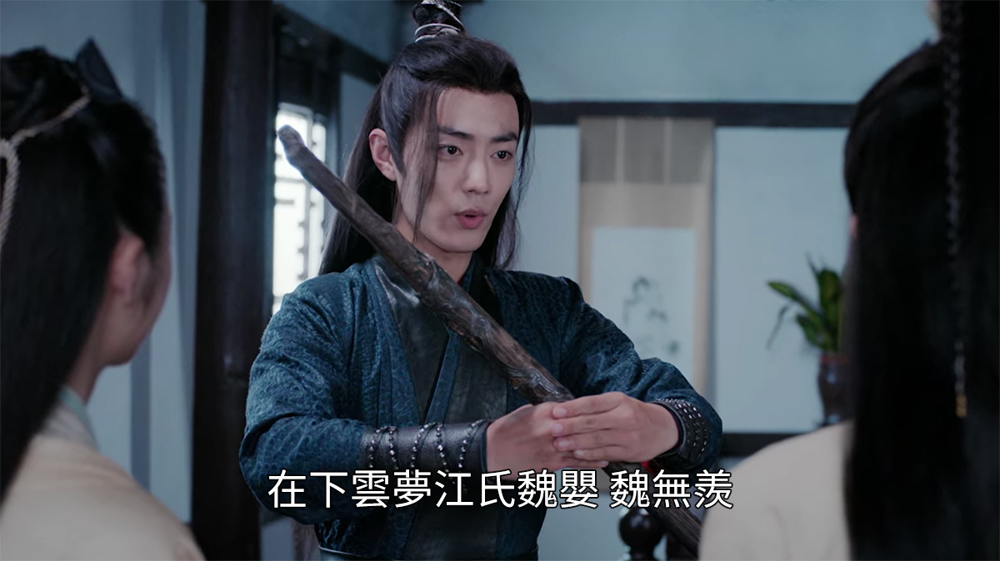
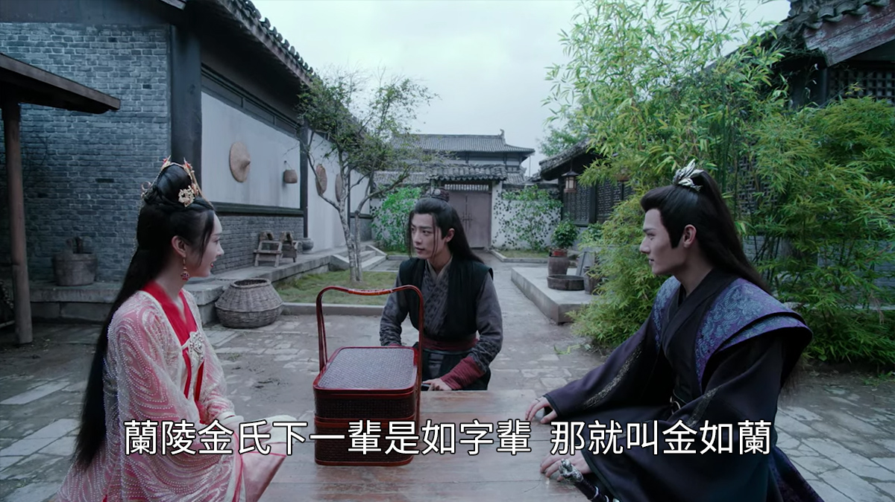
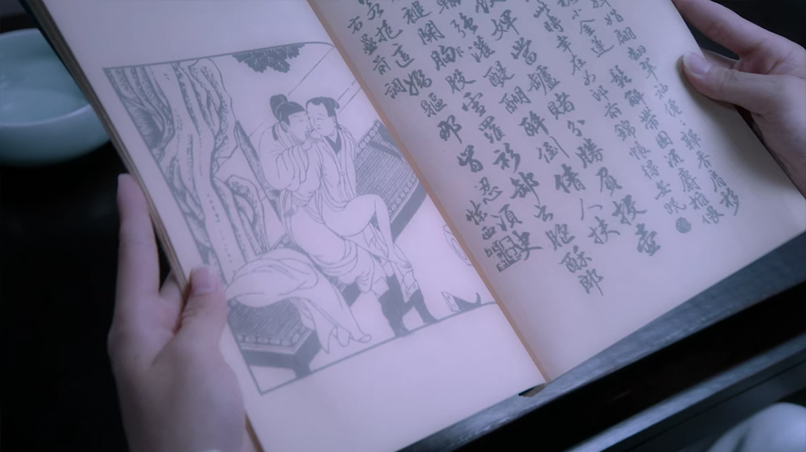
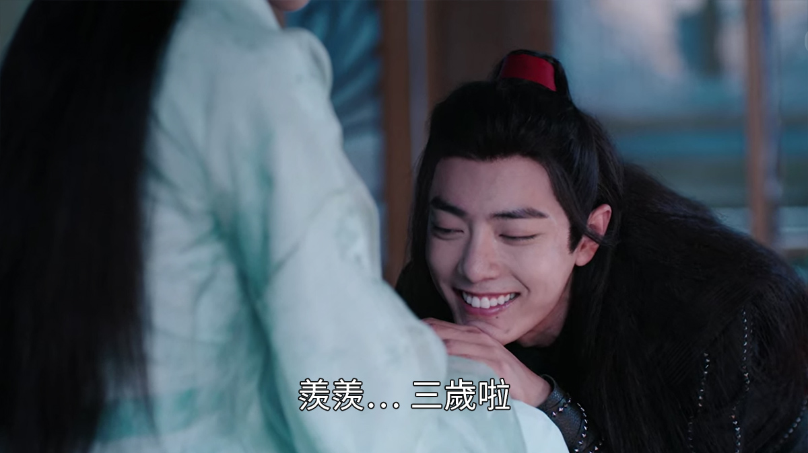
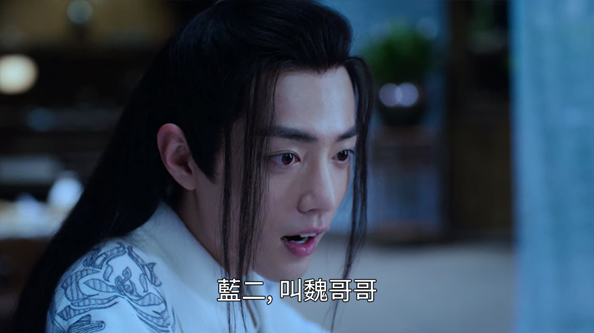
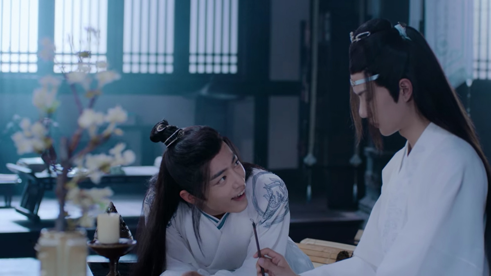

import { Amazon, Blockquote, Youtube, AffiliateBanner, InternalLink } from '../../../../src/components/blog'

仕事そっちのけで全話見てしまった『陳情令』😇

3月1日（月）から[U-NEXT](https://ck.jp.ap.valuecommerce.com/servlet/referral?sid=3549505&pid=886957917)で、全50話が一挙に配信されるそうなので、まだ見てない方はぜひ見て欲しい！

<Youtube id="VFZfrRjXPjo" />

今日から数回に分けて、『陳情令』の基礎知識や人物相関などをまとめて行きたいと思います。

まずは第一弾として、中国歴史モノを見る上で欠かせない姓･名･字（あざな）･号の違いについて。

中国歴史モノの映画やドラマやを見ていると、お互いを姓名で呼んだり、字（あざな）で呼んだり、号で呼んだり、役職で呼んだり、敬称付きで呼んだりと、もうバリエーションが多い多い。非常に混乱しやすい部分じゃないでしょうか？

ただ、その呼び方によって、相手との関係性が分かったりするので、面白い部分でもあります😊

第二弾と三弾もよかったらどうぞ。

<InternalLink slug="/tv-movie/the-untamed-all-characters/" />

<InternalLink slug="/tv-movie/the-untamed-for-beginner/" />

__※中国語音声＋英語字幕で見ているので、日本語訳が間違っている場合は教えていただけると助かります__

---

## 中国歴史モノを見る時に欠かせない基礎知識、姓･名･字･号について

まずは、それぞれの違いについて整理していきます。

### 姓（せい）

姓は自分の出自、どの一族に属するのかを示すものです。私たちの名字と同じですね。

ちなみに、本作の主人公である魏無羨（ウェイ ウーシェン）は、江（ジャン）家の養子として育ちましたが、姓は魏（ウェイ）のままですね。

そして、中国は日本に比べて同じ姓の人が多いこともあり、当時は自己紹介をする時に出身地も合わせて伝えるのが普通だったとか。

なので彼も、江（ジャン）家の本拠地である、雲蒙（うんむ）を一緒に名乗ってるシーンを見かけました。

_Source : Tencent Pictures, 陳情令 第3集_

<Blockquote>
在下雲夢江氏魏嬰 魏無羨 
私は雲蒙（うんむ）の江（ジャン）氏族の魏嬰（ウェイ イン）、魏無羨（ウェイ ウーシェン）です。
</Blockquote>

地名、姓名、字も全て名乗ってます。

### 名（めい）/ 諱（いみな）

名（めい）は、親が付けた個人を特定するためのもので、正式には諱（いみな）と言います。  
しかし、私たちが持っている名前とは、その重みが違うようです。

当時の中国において、諱（いみな）はその人の魂と強く結びついていて、諱（いみな）を呼ぶことで、その人の魂を支配できると考えられていました。

そのため、諱（いみな）で呼びかけることは、親や主君にしか許されない非常に無礼なこととされていたそうです。

### 字（あざな）

さて、諱（いみな）で呼ぶのが無礼になってしまうと、とても不便ですよね。じゃぁ、なんと呼べばいいんだよって。  
そこで、失礼にならずに呼び合うための字（あざな）が作られました。

字（あざな）は、日本語でいうところの「さん」や「くん」のような敬称が既に含まれています。  
ですので、字（あざな）で呼ぶことは、尊敬や親しみの気持ちが含まれているんですね。

また、字（あざな）は成人した時に、親や目上の人に付けてもらうか、自分で名乗るそうです。

藍願（ラン ユエン）の字、思追（スージュイ）は、藍忘機（ラン ワンジー）が付けたというエピソードがありました。

_Source : Tencent Pictures, 陳情令 第45集_

<Blockquote>
思追是你的字 
思追は字ですか？
正是 
そうです。
是誰給你取的 
誰が名付けました？
含光君
含光君です。
</Blockquote>

また、金凌（ジン リン）の字、如蘭（ルーラン）は、生まれる前に魏無羨（ウェイ ウーシェン）によって付けられていましたね。

_Source : Tencent Pictures, 陳情令 第30集_

<Blockquote>
蘭陵金氏下一輩是如字輩 
蘭陵の仁氏の次の世代は「如」だから、
那就叫金如蘭 
金如蘭はどう？
</Blockquote>

ちなみに、現代中国で字（あざな）は廃止されていて、法律上は姓名のみとなっています。  
ただ、友人同士やカップル間であだなで呼び合うなど、個人名以外を多用する社会的慣習は残っているようです。

カナダにいると、中国･台湾系の友人は全員イングリッシュ･ネームを使っているので（英語話者にとって中国語の発音が難しすぎるから）、よく考えたら友人たちの姓名って誰も知らないな…。

### 号（ごう）

号（ごう）は称号の略で、姓名と字（あざな）以外での名称です。  
日本で言うところの画家や俳人が使う雅号がそうですね。

---

では、『陳情令』のメインキャラクター2人について、見ていきましょう。

## <ruby>魏無羨<rt>Wei Wuxian</rt></ruby>（ウェイ ウーシェン）

姓は、魏（ウェイ）  
名は、嬰（イン）  
字は、無羨（ウーシェン）

### 字で呼ぶ：<ruby>魏無羨<rt>Wei Wuxian</rt></ruby>（ウェイ ウーシェン）

ほとんどの人が字（あざな）で呼んでいました。  
兄弟のように共に育った江澄（ジャン チェン）も、他の一族の人々も、噂話をする市井の人々も。

### 姓名で呼ぶ：<ruby>魏嬰<rt>Wei Ying</rt></ruby>（ウェイ イン）

先に書いた通り、家族や目上の人以外が姓名で呼ぶのは失礼なんですが、藍忘機（ラン ワンジー）だけは彼のことを魏嬰（ウェイ イン）と呼んでいます。

これは第5集の蔵書閣で、春画を彼の本に仕込んだ時から😅

_Source : Tencent Pictures, 陳情令 第5集_

品行方正で礼節を重んじる真面目な性格の藍忘機（ラン ワンジー）が、彼を姓名で呼んでるのって、かなり特別感がありますよね😊

### 号で呼ぶ：<ruby>夷陵老祖<rt>YiLing LaoZu</rt></ruby>（イーリン ラォズゥー）

まず、夷陵（イーリン）は、地名です。

温晁（ウェン チャオ）が魏無羨（ウェイ ウーシェン）を落とした無縁墓地、乱葬崗があるのが夷陵（イーリン）という地域でした。

で、老祖（ラォズゥー）は、祖師、開祖者って意味なので、鬼道の開祖者ってことなのかと。

物語の中盤〜後半では、畏怖を込めてこの号で呼ばれることが多かったです。

### その他

#### <ruby>阿羨<rt>A Xian</rt></ruby>（ア シェン）

お姉さんからは、阿羨（ア シェン）って呼ばれていました。  
この阿は「～ちゃん」みたいなニュアンスなんだと思います。  
可愛い可愛いベイビー･ブラザーなんだなー。

#### <ruby>阿嬰<rt>A Ying</rt></ruby>（ア イン）

義理のお父さんからは阿嬰（ア イン）が多かった感じ。  
先にも話した通り、家族や目上の人は名前を呼んでもOKなので、お父さんは阿嬰（ア イン）なのかな。

でも、義理のお母さんは魏嬰（ウェイ イン）って呼んでました。この辺りの温度差が面白いですよね。  
怒られる時はフルネームで呼ばれる的な、ちょっと厳しい響きがあって。

#### <ruby>魏公子<rt>Wei Gongzi</rt></ruby>

公子は、日本語で言うところの若様みたいな感じでしょうか。
<!-- 公子は、初対面だったり、それほど親しくない時の敬称です。 -->

#### <ruby>魏兄<rt>Wei Xiong</rt></ruby>

兄は、別に血縁関係があるお兄さんではなく、同世代の相手で、割と親しい間柄の時の敬称です。

#### <ruby>羨羨<rt>Xian Xian</rt></ruby>（シェン シェン）

そして見逃してはならない、羨羨は3歳ですのシーン！

_Source : Tencent Pictures, 陳情令 第24集_

<Blockquote>
羨羨… 三歲啦 
羨羨（シェンシェン）は…、3歳です。
</Blockquote>

もう、甘えた顔がとてつもなく可愛い😍

2回続けて言うと可愛く甘えて聞こえますよね。畳語って言います。  

よくパンダの名前で耳にするかと。  
中国語でも日本語でも英語でも、2回繰り返す言葉は赤ちゃん言葉というか、可愛い響きになりますね。

#### <ruby>魏哥哥<rt>Wei Gege</rt></ruby>（ウェイ グァグァ）

お酒1杯で酔っ払った藍忘機（ラン ワンジー）に、魏哥哥（ウェイ グァグァ）と呼ばせようとするシーン。

_Source : Tencent Pictures, 陳情令 第6集_

哥哥は、哥1文字だけでも「お兄さん」って意味なんですが、こちらも畳語で2回繰り返して可愛くなってます。  
血縁か親しい間柄でしか使わない呼び方らしいですよ…😌

---

## <ruby>藍忘機<rt>Lan Wangji</rt></ruby>（ラン ワンジー）

姓は、藍（ラン）  
名は、湛（ジャン）  
字は、忘機（ワンジー）

### 字で呼ぶ：<ruby>忘機<rt>Wangji</rt></ruby>（ワンジー）

字（あざな）で呼んでいたのは、叔父さんとお兄さんだけだった気がします。  
同族で全員同じ姓だからか、藍（ラン）を抜いて、忘機（ワンジー）と呼んでいました。

家族でも姓名では呼ばないんですね、この家🤔

### 姓名で呼ぶ：<ruby>藍湛<rt>Lan Zhan</rt></ruby>（ラン ジャン）

魏無羨（ウェイ ウーシェン）だけは、彼を姓名の藍湛（ラン ジャン）で呼びます。

第5集の蔵書閣のシーンで、ちゃんと礼節を守って字（あざな）で話しかけたにも関わらず、藍忘機（ラン ワンジー）が無視したから、とのことで😅

_Source : Tencent Pictures, 陳情令 第5集_

<Blockquote>
忘機兄 
ワンジーさん
藍忘機 
ラン ワンジー
藍湛 
ラン ジャン
你可不要這樣看著我啊
そんな目で見るなよ
是我叫你忘機你不答應
俺が忘機って呼んだ時に無視したから
我才叫你名字的
名前で呼んだんじゃないか
</Blockquote>

で、そこからお互いを姓名で呼び合うようになるんです。もうこれだけで萌えません？

### 号で呼ぶ：<ruby>含光君<rt>HanGuang Jun</rt></ruby>（ハングァン ジュン）

物語の後半になると、<ruby>含光君<rt>HanGuang Jun</rt></ruby>（ハングァン ジュン）と呼ばれることが多かったです。

これは彼の誠実さを称える号であり、「君」は日本語で言うところの「様」がみたいな感じで、既に尊敬の意が含まれてますね。

### その他

#### <ruby>藍二公子<rt>Lan Er Gongzi</rt></ruby>

物語の前半では、よく藍二公子と呼ばれていました。

藍（ラン）一族の次男だからですね。

---

まだまだここに書き切れないくらい、2人の呼び方だけでも、もっとバリエーションがありました。

しかし、Netflixの英語字幕では、視聴者の混乱を避けるために、姓名･字･号の3パターンくらいに絞ってあったんですよ。  
視聴者にとっては親切なのかもしれませんが、このちょっとした呼び方の違いが面白かったりするので、私は見ている間中、ものすごく耳をそばだてて聞き取ろうと必死でした😅

[U-NEXT](https://ck.jp.ap.valuecommerce.com/servlet/referral?sid=3549505&pid=886957917)には日本語吹き替えもあるのかな？でも、ぜひ中国語の音を楽しんで欲しいと思います😊

<!-- 字と、兄は、血縁とか親しい相手という意味ではなくて、単に「〜さん」みたいな感じですね。 -->

<!-- ### その他：<ruby>藍二哥哥<rt>Lan Er Gege</rt></ruby>（ラン アー グァグァ）

「藍家の２番目の兄ちゃん！」って感じですか。

お兄ちゃんこっちを見て！的な場面で使ってました。やめろ、可愛すぎる。

藍ニ＝藍家の二番目の子。

兄ちゃん＝哥哥（gege）

少々甘えた言い方です。 -->

<!-- https://www.unext.co.jp/ja/press-room/chen-qing-ling-announce-2021-02-01 -->

<AffiliateBanner type="unext" />
