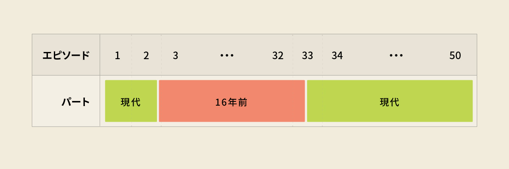
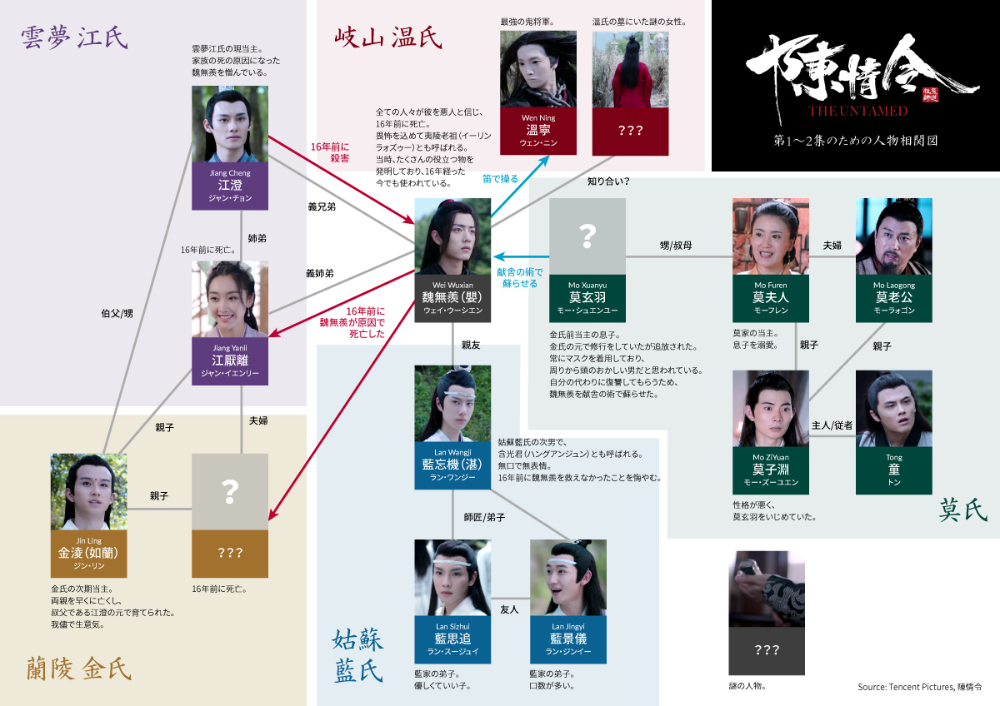
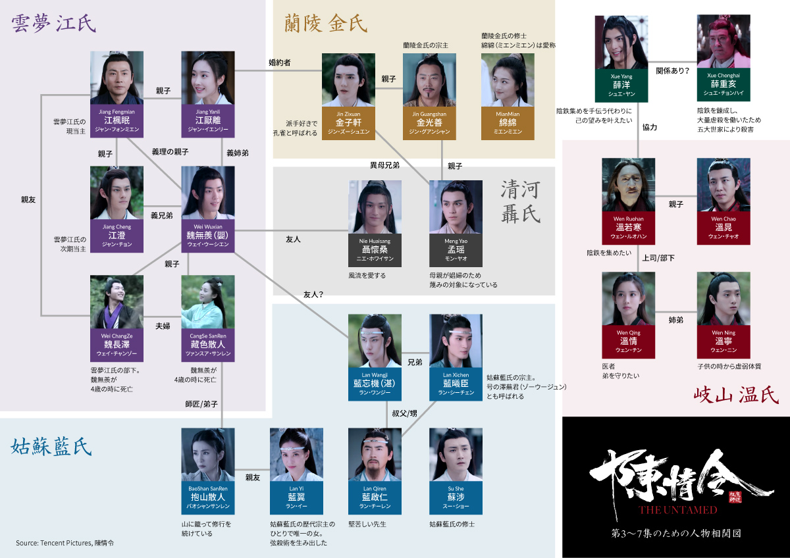
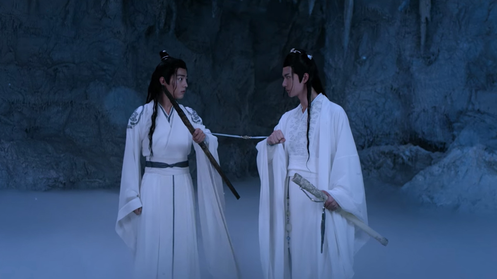
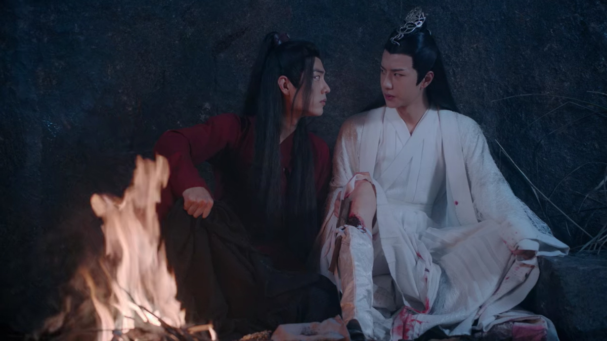
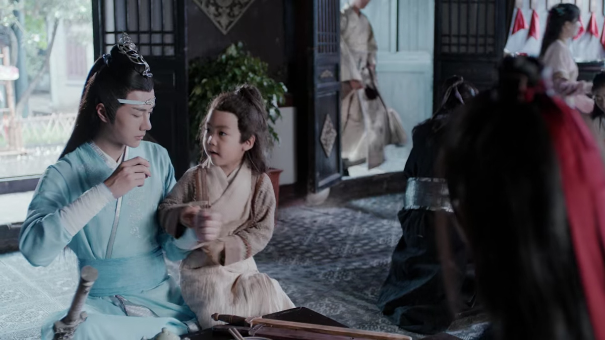
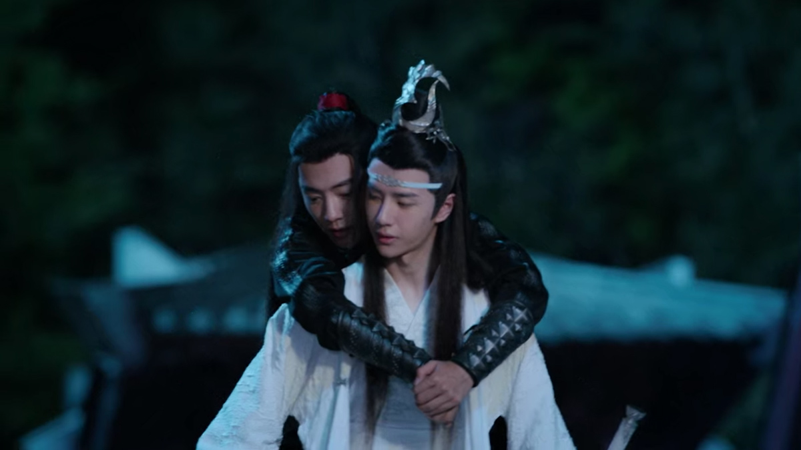
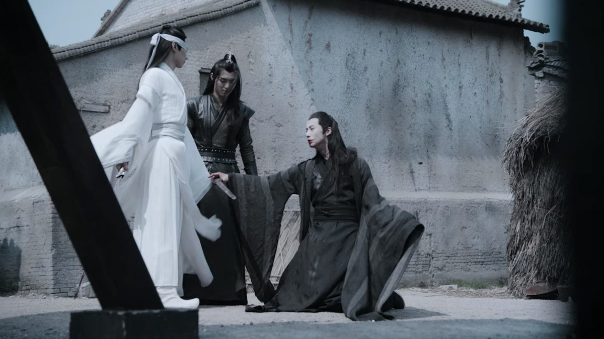
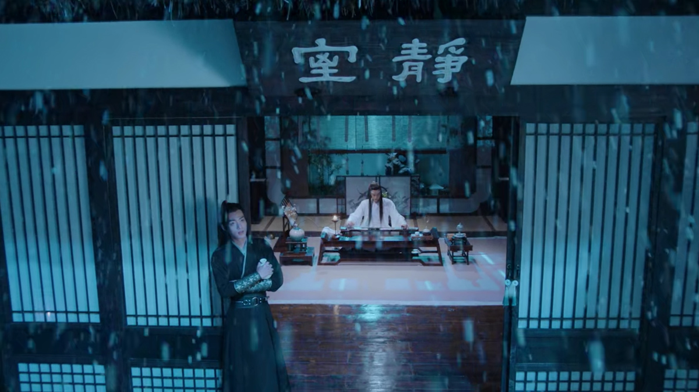

import { Amazon, Blockquote, Youtube, AffiliateBanner, InternalLink, PdfDownload, Twitter } from '../../../../src/components/blog'

仕事そっちのけで全話見てしまった『陳情令』😇

3月1日（月）から[U-NEXT](https://ck.jp.ap.valuecommerce.com/servlet/referral?sid=3549505&pid=886995495&vc_url=https%3A%2F%2Fvideo.unext.jp%2Ftitle%2FSID0055445%2F%3Fcid%3DD33139%26adid%3DVC1%26alp%3D1%26alpad%3D1%26alpge%3D1)で、全50話が一挙に配信されるそうなので、まだ見てない方はぜひ見て欲しい！

__※U-NEXTでは、2021年8月31日23:59まで配信予定とのこと（2021/4/8時点での情報）__

<Youtube id="VFZfrRjXPjo" />

『陳情令』まとめ第三弾は、これからドラマを見てみようかなーと思っている方へ、あらすじと全体的なドラマの構成、そしてジーナからのメッセージをお伝えしようと思います。

また、ドラマを見る際に役立つ人物相関図も作りましたよ。

第一弾と二弾もよかったらどうぞ。

<InternalLink slug="/tv-movie/the-untamed-character-names-and-relationships/" />

<InternalLink slug="/tv-movie/the-untamed-all-characters/" />

__※中国語音声＋英語字幕で見ているので、日本語訳が間違っている場合は教えていただけると助かります__

---

## まずは基礎知識

### 中国BLドラマ

BL小説を元に制作されたドラマなんですが、同性愛描写に規制がある中国では、BLのまま制作すると検閲にひっかかって放送できなくなる可能性が高いんです。

なので、同性愛ではなく、あくまで男性同士の親密な心の繋がりを描いたブロマンス作品として制作されています。

耽美小説をブロマンス仕立てにして制作するドラマなので、「耽改劇」とか「耽改ドラマ」とか呼ばれてます。

私はもともとブロマンスが大好きなので、この作品はもう私の心臓にえぐり込んできました🥰

### 世界観

ジャンルは、武侠ファンタジー時代劇。

古代中国っぽさのあるファンタジー世界が舞台で、人間、仙師、妖魔などが存在します。

主人公たちは仙術を使うことができる仙師（仙人）であり、妖魔を退治するため、また、より高い境地に達するために日々修行を続けています。

### 原作

原作は墨香銅臭（モーシャントンシウ）のWeb小説『[魔道祖師](https://amzn.to/3keYGu3)』。  
最近、日本語翻訳版も発売されましたー🙌

<Amazon
  asin="4866574127"
  title="魔道祖師 1"
  url="https://amzn.to/3keYGu3"
  author="墨香銅臭, 千二百"
  rakuten="https://hb.afl.rakuten.co.jp/ichiba/1d191c30.c88f7897.1d191c31.80840e66/?pc=https%3A%2F%2Fitem.rakuten.co.jp%2Fbook%2F16629793%2F&link_type=hybrid_url&ut=eyJwYWdlIjoiaXRlbSIsInR5cGUiOiJoeWJyaWRfdXJsIiwic2l6ZSI6IjI0MHgyNDAiLCJuYW0iOjEsIm5hbXAiOiJyaWdodCIsImNvbSI6MSwiY29tcCI6ImRvd24iLCJwcmljZSI6MSwiYm9yIjoxLCJjb2wiOjEsImJidG4iOjEsInByb2QiOjAsImFtcCI6ZmFsc2V9"
  renta=""
  cmoa=""
  ebookjapan=""
  honto=""
/>

<!-- 先ほどもお話しした通り、中国では検閲の関係でセクシーシーン満載のWeb小説をそのまま出版することはできません。  
しかし、みなさんご安心ください！

実はこの作品、台湾ではそんな規制がないので、原作のWeb小説同様にセクシーなまま出版されてます。  
そして、その台湾版を日本語翻訳したものが、この度発売されたんです🎉

つまり、読めます！セクシーシーンが！ -->

私はKindle版が出るのを心待ちにしてますよ…😭

### あらすじ

自由奔放で無邪気な魏無羨（ウェイ ウーシェン）と、戒律を重んじる無口で厳しい藍忘機（ラン ワンジー）。

彼らが出会い、衝突しながらも、お互いが無くてはならない存在となっていく中で、共に正義のために力を尽くすことを誓い合った。

しかし、ある時、罪を被せられた魏無羨（ウェイ ウーシェン）は、追い詰められ、断崖から身を投げて消息を絶つ。

それから16年が経ち、死んだはずの魏無羨（ウェイ ウーシェン）は呪術によってこの世に蘇り、2人は再会を果たす。

そして、今度こそ離れないと心に誓いながら、手を携えて16年前の真実を探り、人々の平和と幸福を守っていく。

みたいなストーリーです。

---

## 挫折しないために。ざっくりドラマ構成

### 「現代パート」と「16年前パート」

まず、ざっくり言うと、このドラマは __「現代パート」__ と __「16年前パート」__ に分かれています。

主人公である魏無羨（ウェイ ウーシェン）と、後に彼の”親友”となる藍忘機（ラン ワンジー）や、その他の人々のとの出会い、そして彼が世間から悪人と呼ばれ、殺されるまでを描いた __「16年前パート」__

そして、16年後、再び現代へと蘇った魏無羨（ウェイ ウーシェン）が、藍忘機（ラン ワンジー）と再開し、 ~~愛を深めながら~~ 共に16年前の謎に迫る __「現代パート」__

図にするとこんな感じなんですが、エピソード1〜2は、いきなり __「現代パート」__ から始まるんです！

もう正直に言って、私は1度エピソード2まで見た後に挫折しました…。  
だって前知識も何も無い状態だと、もう何がなんだか分からないんです😭

でも、__「16年前パート」__ を全て見終わってからエピソード1〜2に戻ると、ものっすごい萌えるんですけどね😍

ですので、もういっそのことエピソード1〜2を見ずに、エピソード3から見始めてもいいんじゃないかと個人的には思います。  
その方が混乱しないでスルッと物語の世界に入っていけるかと。

※厳密に言うと、エピソード2のラスト5分あたりから、__「16年前パート」__ が始まります。

### エピソード1〜2

しかし、やっぱり順番通り見たいよ！って方も多いと思うので、エピソード1〜2を見る時用の人物相関図を作成しました。  
ネタバレしないように注意したつもりです。

_Source : Tencent Pictures, 陳情令_

<PdfDownload pdf="the_untamed_chart_1_2" label="人物相関図をダウンロード" />

### エピソード3〜7

そして、エピソード3から __「16年前パート」__ が始まるんですが、エピソード3〜7は「留学編」。

学問に精通している姑蘇藍氏に、他家の弟子たちが集まり、寝食を共にしながら学んでいくというお話。そう、まさに学園ライフ✨

主人公たちの出会い、交流から、その後の冒険が始まるまでを描いてあるんですが、重い話もなく、けっこうコメディタッチで話が進むので、「留学編」を見終えたあなたは、すでに『陳情令』にハマっているかと思います！

とにかく頑張って！エピソード1〜2は飛ばしてもいいので、3〜7の「留学編」までは頑張って見てみてください！

エピソード3〜7を見る時用の人物相関図も作成しました。

_Source : Tencent Pictures, 陳情令_

<PdfDownload pdf="the_untamed_chart_3_7" label="人物相関図をダウンロード" />

---

## みどころマップ

全50話、長いですよね😅

でも、ちょいちょい「きゃっ💕」となるシーンが盛り込まれているので、目が離せませんよ😊  
私のオススメのエピソードをネタバレしない感じでご紹介しますね。

### 6話：2人で洞窟に閉じ込められる

_Source : Tencent Pictures, 陳情令 第6集_

BLとかでよくあるじゃないですか、嫌いあってる2人がいて、私たちにとって都合がいいアクシデントが起きて、手錠で2人が繋がったまま生活しなきゃみたいな話。みなさん好きですよね、うん。

まぁ、このドラマでは生活する程じゃないんですが、洞窟の中で2人っきり、びしょ濡れで、紐で手を繋げるという美味しいシチュエーションに。

### 13話：洞窟で恋愛トーク

_Source : Tencent Pictures, 陳情令 第13集_

またもや洞窟に閉じ込められて2人っきり。

魏無羨（ウェイ ウーシェン）が、綿綿（ミエンミエン）という女性の顔が可愛いなどと話はじめて、明らかに不機嫌になっていく藍忘機（ラン ワンジー）。あまつさえ、「え、もしかして君も彼女のこと好きなの？」と盛大な勘違い発言をする始末…。

もう、視聴者全員が「藍忘機（ラン ワンジー）が好きなのはお前だ！お前！」とツッコミを入れたに違いないシーン。

### 29話：幼子を連れて食事

_Source : Tencent Pictures, 陳情令 第29集_

魏無羨（ウェイ ウーシェン）が世話をしている子供を連れて3人で食事をするシーン。

子供が藍忘機（ラン ワンジー）の膝に座ってるんですよ。

もうなんて微笑ましいんだ…！  
可愛くて可愛くて💕

まるで2人の子供みたいな雰囲気がね、幸せそうで堪らなくてですね…。

### 33話〜：時間が現代になってから

_Source : Tencent Pictures, 陳情令 第35集_

エピソード33の途中で、16年前から現代へと時間が変わるんですが、藍忘機（ラン ワンジー）がね、なんだか16年前に比べて可愛くなってるというか😊

元々彼は無口で無表情って設定なんですけど、それにしても反応なさすぎだろ！って突っ込みたくなるくらいだったんですよ。

それなのに16年経って、魏無羨（ウェイ ウーシェン）が蘇って来たら、もう今度こそ離さないぞ！絶対に守るぞ！俺のものだ！感がすごい。

### 36〜39話：義城編

_Source : Tencent Pictures, 陳情令 第38集_

個人的に全50話の中で一番興奮したのが義城編🔥

主人公たちではなく、別の3人の男たちによるドロッドロの愛憎劇が繰り広げられます。

こんな展開は全く予想してなかったので、ちょっと、もう、私は何を見せられているんだ…？なんだこの美味しい展開、という感じでした。

なんと言っても3人とも美しいんだよ、顔が。

### 43話：心を通わせる雪見酒

_Source : Tencent Pictures, 陳情令 第43集_

藍忘機（ラン ワンジー）の自宅にて、彼が古琴を演奏するのを聞きながら、お酒を飲み、雪が降るのを眺め、お互いへの想いと感謝を噛み締める…みたいなシーン。

もう、これだけでも十分キュン💕って感じだったんですが、カメラがフレームアウトする瞬間、 魏無羨（ウェイ ウーシェン）が自ら服を脱ぐ（帯を解く？）のがチラッと写っていると…。

もう正直よく見つけたなって感じです😅

<Twitter id={'1230444435684487168'} />

そして、翌日、魏無羨（ウェイ ウーシェン）はすごく眠そうにしていて、そわそわ落ち着きがなくて、唇が切れている…と。

どれだけアグレッシブなキスしたんだよ😅  
いいぞ、もっとやれ！

---

ということで、みどころ満載です！ぜひ楽しんでくださいね😊

__※U-NEXTでは、2021年8月31日23:59まで配信予定とのこと（2021/4/8時点での情報）__

<AffiliateBanner type="unext" />
