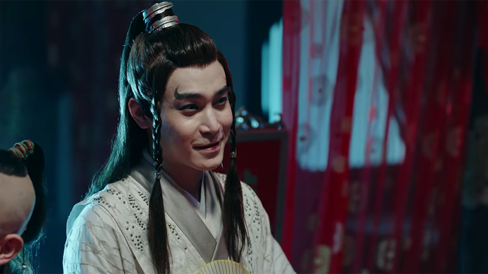
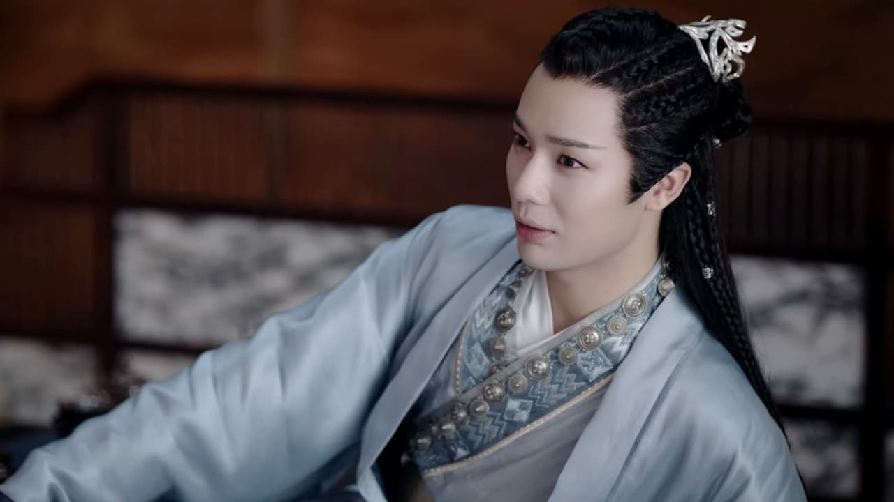
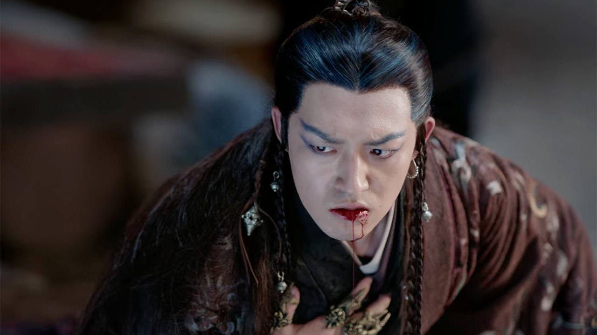

import { Amazon, Blockquote, Youtube, AffiliateBanner, InternalLink, Announce } from '../../../../src/components/blog'

<!-- <Youtube id="LUl2X99y6KM" /> -->

<Announce>

中華BLについて語り合うチャットグループを運営中です。普段はテキストチャットで語り合いつつ、たまに音声通話で思いの丈をぶつけ合っています。お気軽に参加してくださいね👋 
※ツールはディスコード(Discord)を使用しています。

<a href='https://discord.gg/fvN98csmmj' target="_blank" className="button" rel="nofollow noopener noreferrer">チャットグループへ参加</a>

</Announce>

『[陳情令](/tv-movie/the-untamed-for-beginner/)』にハマった勢いて、『山河令』も一気に見てしまいました😆  
2021/8/12から[WOWOW](https://www.wowow.co.jp/detail/173844)で放送中です！

とにかく登場人物が多くて混乱しがちな『山河令』。  
自分の頭の中の整理も兼ねて、キャラクターリストを作ろうと思います。少しずつ更新していきますね。

第二弾と三弾もよかったらどうぞ。

<InternalLink slug="/tv-movie/word-of-honor-for-beginner/" />

<InternalLink slug="/tv-movie/word-of-honor-glazed-armor/" />

__※中国語音声＋英語字幕で見ているので、日本語訳が間違っている場合は教えていただけると助かります__

__※盛大にネタバレしています__

---

## メインキャラクター

### <ruby>周子舒<rt>Zhou Zishu</rt></ruby>（ジョウ ズーシュー）/<ruby>周絮<rt>Zhou Xu</rt></ruby>（ジョウ シュー）

_Source : Youku Information Technology (Beijing) Co., Ltd, 山河令_

「四季山莊」の莊主  
「天窗」の元首領  

<a href="#ruby張成嶺rtzhang-chenglingrtruby（ジャン-チョンリン）">張成嶺</a>の師

<a href="#ruby秦懷章rtqin-huaizhangrtruby（チン-ホワイジャン）">秦懷章</a>の弟子

師である<a href="#ruby秦懷章rtqin-huaizhangrtruby（チン-ホワイジャン）">秦懷章</a>の死後、たった16歳で「四季山莊」の荘主となるものの、己の力不足を感じており、一人また一人と仲間が山荘を守るために戦い、死んでいくことに苦悩する日々。

そんな時、従兄弟である皇太子（現<a href="#ruby晉王rtjin-wangrtruby（ジン-ワン）">晉王</a>）が、宮廷内に信頼できる人間がいないため、側で働いて欲しいと助けを求めてくる。  
そこで<a href="#ruby周子舒rtzhou-zishurtruby（ジョウ-ズーシュー）ruby周絮rtzhou-xurtruby（ジョウ-シュー）">周子舒</a>は81人の仲間と共に、皇太子（現<a href="#ruby晉王rtjin-wangrtruby（ジン-ワン）">晉王</a>）の元で特務機関「天窗」を結成する。

しかし、皇太子（現<a href="#ruby晉王rtjin-wangrtruby（ジン-ワン）">晉王</a>）は、己の野心のため「天窗」を利用し、権力を強めていく。  
「天窗」の首領として任務に尽力する<a href="#ruby周子舒rtzhou-zishurtruby（ジョウ-ズーシュー）ruby周絮rtzhou-xurtruby（ジョウ-シュー）">周子舒</a>だったが、日々、皇太子（現<a href="#ruby晉王rtjin-wangrtruby（ジン-ワン）">晉王</a>）にとっての政敵（罪もない人々）を暗殺することに疑問を持つように。

そして遂に、大切にしていた師弟、<a href="#ruby秦九霄rtqin-jiuxiaortruby（チン-ジウシアオ）">秦九霄</a>をも失った時、「天窗」を抜け自由を取り戻すことを決意。

しかし「天窗」を抜ける者は「七竅三秋釘」と呼ばれる刑罰を受けなければならない。それは、<a href="#ruby周子舒rtzhou-zishurtruby（ジョウ-ズーシュー）ruby周絮rtzhou-xurtruby（ジョウ-シュー）">周子舒</a>自身が決めた掟であり、本人も例外ではない。  
「七竅三秋釘」とは、体に7本の釘を打ち込むことで、急速に五感を失い廃人となるも、3年間苦しみながら生かされ続けるという極刑である。

そこで<a href="#ruby周子舒rtzhou-zishurtruby（ジョウ-ズーシュー）ruby周絮rtzhou-xurtruby（ジョウ-シュー）">周子舒</a>は3ヶ月おきに1本ずつ、1年半をかけて7本の釘を自身の体に打ち込んでいった。そうすることで即座に廃人となることを防げるのだ。  
しかし、ゆっくりではあるものの徐々に五感は失われて行き3年後に死ぬことは変わらない。それでも、3年間自由に生きようと決意した。

気付けば「天窗」を結成してから10年の間に、81人全ての仲間を失っていた。

晴れて自由の身となった<a href="#ruby周子舒rtzhou-zishurtruby（ジョウ-ズーシュー）ruby周絮rtzhou-xurtruby（ジョウ-シュー）">周子舒</a>は、周絮という偽名を使い、変装をして、静かに余生を過ごしていた。  
しかしある時、「鬼谷」の首領である<a href="#ruby溫客行rtwen-kexingrtruby（ウェン-コーシン）">溫客行</a>と出会い、さらには<a href="#ruby張成嶺rtzhang-chenglingrtruby（ジャン-チョンリン）">張成嶺</a>を助けたのが縁で、彼の師匠になることに。

ただ静かに死ぬことを望んでいた<a href="#ruby周子舒rtzhou-zishurtruby（ジョウ-ズーシュー）ruby周絮rtzhou-xurtruby（ジョウ-シュー）">周子舒</a>だったが、弟子や友人、心を通わせる相手ができたことで、次第に生きがいを見つけていく。

その後（いろいろあって）、<a href="#ruby溫客行rtwen-kexingrtruby（ウェン-コーシン）">溫客行</a>が死んだと思い込んだ<a href="#ruby周子舒rtzhou-zishurtruby（ジョウ-ズーシュー）ruby周絮rtzhou-xurtruby（ジョウ-シュー）">周子舒</a>は、彼の復讐を果たすため、半分になった武力を取り戻そうと、自ら体に打ち込んだ全ての釘を抜き取った。その行為は、死期を早めることにもなるが、<a href="#ruby溫客行rtwen-kexingrtruby（ウェン-コーシン）">溫客行</a>がいない世界に未練などなかった。

最終的に<a href="#ruby溫客行rtwen-kexingrtruby（ウェン-コーシン）">溫客行</a>は生きていたのだが、一度抜いてしまった釘は戻らない。  
<a href="#ruby周子舒rtzhou-zishurtruby（ジョウ-ズーシュー）ruby周絮rtzhou-xurtruby（ジョウ-シュー）">周子舒</a>の死は避けられないものとなっていたが、<a href="#ruby溫客行rtwen-kexingrtruby（ウェン-コーシン）">溫客行</a>の「六合神功」によって傷が治り、延命が成功する。

現在は<a href="#ruby溫客行rtwen-kexingrtruby（ウェン-コーシン）">溫客行</a>と共に雪山で暮らしている。

#### 呼び名

<a href="#ruby溫客行rtwen-kexingrtruby（ウェン-コーシン）">溫客行</a>には阿絮と呼ばれている。

### <ruby>溫客行<rt>Wen Kexing</rt></ruby>（ウェン コーシン）

_Source : Youku Information Technology (Beijing) Co., Ltd, 山河令_

「鬼谷」の首領  

<a href="#ruby甄如玉rtzhen-ruyurtruby（ジェン-ルーユー）">甄如玉</a>の息子で、元の名前は甄衍

「四季山莊」にて<a href="#ruby周子舒rtzhou-zishurtruby（ジョウ-ズーシュー）ruby周絮rtzhou-xurtruby（ジョウ-シュー）">周子舒</a>の師弟だった時も

幼い頃、「琉璃甲」を巡り「鬼谷」によって両親を殺された。  
生き残るため、そして復讐のために「鬼谷」で育った彼は、後に「鬼谷」の人々を皆殺しにして首領となる。

<a href="#ruby吊死鬼rtdiaosi-guirtruby（ディアオスー-グイ）">吊死鬼</a>が「琉璃甲」を盗んだことを口実に（実際は違うんだけれども）、3,000人の幽霊たちに「鬼谷」を出て盗まれた「琉璃甲」を探し、裏切り者を殺すよう命じた。しかし、これは彼の復讐計画の始まりだった。

そんな時、物乞いの格好で浮浪していた<a href="#ruby周子舒rtzhou-zishurtruby（ジョウ-ズーシュー）ruby周絮rtzhou-xurtruby（ジョウ-シュー）">周子舒</a>と出会う。

自分には復讐以外に何もないと思っていた<a href="#ruby溫客行rtwen-kexingrtruby（ウェン-コーシン）">溫客行</a>だったが、<a href="#ruby周子舒rtzhou-zishurtruby（ジョウ-ズーシュー）ruby周絮rtzhou-xurtruby（ジョウ-シュー）">周子舒</a>と出会い、絆を深めていくことで人生の光を見つけ、孤独で冷酷な彼に少しずつ変化が訪れる。

その後、<a href="#ruby周子舒rtzhou-zishurtruby（ジョウ-ズーシュー）ruby周絮rtzhou-xurtruby（ジョウ-シュー）">周子舒</a>の命がもう幾ばくかしかないと知った時、彼を救うため叶白衣から「六合神功」の力をもらい、自身が「炉」となって精製した生命エネルギーを<a href="#ruby周子舒rtzhou-zishurtruby（ジョウ-ズーシュー）ruby周絮rtzhou-xurtruby（ジョウ-シュー）">周子舒</a>に送ることで、彼の傷を治癒し、延命に成功した。

しかし、その代償として自身の頭髪は瞬く間に白くなり、生涯、極寒の地にて氷を飲み、雪を食べることでしか生きられない体となる。

現在は雪山で<a href="#ruby周子舒rtzhou-zishurtruby（ジョウ-ズーシュー）ruby周絮rtzhou-xurtruby（ジョウ-シュー）">周子舒</a>と一緒に暮らしている。

#### 呼び名

<a href="#ruby周子舒rtzhou-zishurtruby（ジョウ-ズーシュー）ruby周絮rtzhou-xurtruby（ジョウ-シュー）">周子舒</a>が彼に心を許してからは、老温と呼ばれている。

### <ruby>張成嶺<rt>Zhang Chengling</rt></ruby>（ジャン チョンリン）

五湖同盟、鏡湖派、張家の三男（末っ子）

<!-- 太湖派、趙敬を目指す
三白大俠　sān bái dà xiá -->

<!-- 鏡湖山庄の現当主

張家の末っ子で、五家の中では一番若く、少し冴えないが根は優しい。 彼は、兄たちが皆、格闘技に長けていたので、ほとんど格闘技の訓練を受けずに育ちました。 一族が滅ぼされた後、釉薬のかかった甲冑を持っていたために民衆に追われたが、後に周子修に付き添い、彼から武術を学んだ。 -->

### <ruby>顧湘<rt>Gu Xiang</rt></ruby>（グー シアン）

#### 呼び名

<a href="#ruby溫客行rtwen-kexingrtruby（ウェン-コーシン）">溫客行</a>には阿湘と呼ばれている。

<!-- 幽霊谷のパープルフューリーは、谷の主である温恵星の侍女であるが、実際には彼の妹として扱われている。 幼い頃、偶然にも幽霊谷にやってきて、青年・温恵星の養子となった。 谷を出た後、彼女は曹偉寧と出会い、恋に落ちた。 二人の結婚式の日、曹偉寧は主人に殺され、その復讐のために顧襄も殺された。

生き生きとした可愛らしい若鬼です。 子供の頃に谷に連れ戻された時、ウェンハクハンに助けられ、彼に育てられた。 結婚式の日、曹叡が死んでしまい、悲しみに暮れる彼女は、復讐しようとするが、逆に殺されてしまう。 -->

---

<!-- ## 五湖盟

高崇、趙敬、陸太冲、張玉森、沈慎の5人は義兄弟の契りを交わしている。 -->

## 五湖盟：岳陽派

### <ruby>高崇<rt>Gao Chong</rt></ruby>（ガオ チョン）

_Source : Youku Information Technology (Beijing) Co., Ltd, 山河令_

五湖盟の盟主

<!-- 穏やかでまっすぐな性格の持ち主。

「琉璃甲」の5つのカケラをすべて集め、武庫を開き、武術の秘密をすべての大学校に返し、五湖連盟と一緒に幽霊谷を開拓してほしいと考えていた。 

武術大会で鬼谷と結託したという濡れ衣を着せられてしまい、自害した。 -->

<!-- 五湖リーグの元代表であり、穏やかでまっすぐな性格の持ち主。 彼は、艶やかな鎧の5つの部分をすべて集めて武術の宝庫を開き、武術の秘密をすべての大学校に返し、五湖連盟と一緒に幽霊谷を開拓してほしいと考えていた。 しかし、次兄の趙景にハメられ、武術大会で幽霊谷と結託したという濡れ衣を着せられてしまう。 -->

### <ruby>高小怜<rt>Gao Xiaolian</rt></ruby>（ガオ シアオリエン）

高崇の一人娘。

<!-- 五湖連合のマスターであるガオ・チョンの娘。 父が生きていた頃は、とても従順で、リーグマスターの娘として、より大きな利益が優先されることを知っていて、父の言うことを聞いていました。 父が亡くなり、連れ去られて初めて、彼女は父殺しの真実を知ることになる。 その後、父の仇を討つために、第二回武術会で張成嶺、申申らとともに敵の趙景を確認した。 -->

<!-- Deng Kuan
鄧師兄 -->
<!-- 鬼谷の結婚式で死亡 -->
<!-- 瀕死で戻ってくる

祝邀之
ZHU YAOZHI
グーシャンが騒ぎを起こした時に来た人

GAO SHAN

岳陽派弟子，宋懷仁　sòng huái rén
5話でマスク姿で追われる、殺される。
裏切り者？

謝無恙xiè wú yàng
ちぇんりんを護衛
しんだ？ -->

## 五湖盟：太湖派

### <ruby>趙敬<rt>Zhao Jing</rt></ruby>（ジャオ ジン）

_Source : Youku Information Technology (Beijing) Co., Ltd, 山河令_

太湖派の掌門。

<!-- 五湖リーグの5人兄弟の2番目。 趙家に仕えていたが、一人息子が事故死した後、趙家の当主と親しくなり、義理の息子として家を継いだ。 彼は、五湖連盟と武術連盟のトップになるために、自分の兄弟を罠にかけるという独自の計画と思惑を持っている。 二代にわたるライバルの息子と娘の確執は、すべて彼のおかげです。 -->

## 五湖盟：丹陽派

### <ruby>陸太冲<rt>Lu Taichong</rt></ruby>（ルー タイチョン）

物語が始まる前に死亡している。

死の直前、彼が保持していた瑠璃甲の欠片と2人の弟子を傲崍子へと預けた。
<!-- 一人は甥。 -->

## 五湖盟：鏡湖派

### <ruby>張玉森<rt>Zhang Yusen</rt></ruby>（ジャン ユーセン）

_Source : Youku Information Technology (Beijing) Co., Ltd, 山河令_

鏡湖派の統領

<a href="#ruby張成嶺rtzhang-chenglingrtruby（ジャン-チョンリン）">張成嶺</a>の父

優しく寛大。

<!-- 秋月劍qiū yuè jiàn -->

2話で鬼谷の襲撃により死亡。

## 五湖盟：大孤山派

### <ruby>沈慎<rt>Shen Shen</rt></ruby>（シェン シェン）

_Source : Youku Information Technology (Beijing) Co., Ltd, 山河令_

大孤山派の掌門

<!-- 五大家の一つである神家の当主。 無茶な行動をとることも多いが、兄弟には絶対的な忠誠心を持って接する、まっすぐな男である。 兄のガオ・チョンがザオ・ジンに殺されたことを知り、ウェンケイシン、チャン・チェンリンと協力して、第二回武術大会でザオ・ジンの陰謀を暴き、兄と弟たちの仇を討つ。 -->

---

## 鬼谷十大惡鬼

### <ruby>喜喪鬼<rt>Xisang Gui</rt></ruby>（シーサン グイ）/ <ruby>羅浮夢<rt>Luo Fumeng</rt></ruby>（ルオ フーモン）

_Source : Youku Information Technology (Beijing) Co., Ltd, 山河令_

<!-- 幽谷の「十悪霊」の一人で、元の名前は羅福蒙、幽谷の人々からは「羅おばさん」と呼ばれている。 幽霊谷の人々からは「ルオおばさん」と呼ばれており、世の中の恩知らずを狙って幸せな葬儀を仕掛けることで知られています。 趙景の裏切りにより、彼女は「孟母湯」を飲み、自ら進んで「幽霊の谷」に入った。 彼女は幼い頃の文啓星を大切に育て、幽霊の谷で彼を守った。 ウェン・ハクハンが老鬼師の周りの人々を殺したときに、彼女だけが残されたのです。 -->

### <ruby>豔鬼<rt>Yan gui</rt></ruby>（イエン グイ）/<ruby>柳千巧<rt>Liu Qianqiao</rt></ruby>（リウ チェンチアオ）

<!-- 幽霊谷の幽霊は、武術はあまり得意ではありませんが、とても上手に変装しています。 最愛の人に傷つけられた彼女は、「幽霊の谷」に参加し、「死の幽霊」に助けられた。 師匠に再会しても、師匠を忘れるために「孟婆湯」を飲むことを選び、幽谷に帰っていったのです。 -->

### <ruby>無常鬼<rt>Wuchang Gui</rt></ruby>（ウーチャン グイ）

_Source : Youku Information Technology (Beijing) Co., Ltd, 山河令_

### <ruby>黒無常<rt>Hei Wuchang</rt></ruby>（ヘイ ウーチャン）

### <ruby>白無常<rt>Bai Wuchang</rt></ruby>（バイ ウーチャン）

10話で<a href="#ruby溫客行rtwen-kexingrtruby（ウェン-コーシン）">溫客行</a>によって殺された。

### <ruby>開心鬼<rt>Kaixin Gui</rt></ruby>（カイシン グイ）

_Source : Youku Information Technology (Beijing) Co., Ltd, 山河令_

### <ruby>急色鬼<rt>Jise Gui</rt></ruby>（ジーソー グイ）

_Source : Youku Information Technology (Beijing) Co., Ltd, 山河令_

### <ruby>吊死鬼<rt>Diaosi Gui</rt></ruby>（ディアオスー グイ）

_Source : Youku Information Technology (Beijing) Co., Ltd, 山河令_

1話で<a href="#ruby溫客行rtwen-kexingrtruby（ウェン-コーシン）">溫客行</a>によって殺された。

纏魂糸という細い糸を武器に使う。

<!-- xuē fāng 
薛方 -->

### <ruby>長舌鬼<rt>Zhangshe Gui</rt></ruby>（ジャンショー グイ）

_Source : Youku Information Technology (Beijing) Co., Ltd, 山河令_

6話で<a href="#ruby溫客行rtwen-kexingrtruby（ウェン-コーシン）">溫客行</a>によって殺された。

<!-- 持っていた瑠璃甲をラオウェンが取り戻す。元は趙敬Zhao Jing（ジャオ ジン）のもの -->

### <ruby>食屍鬼<rt>Shishi Gui</rt></ruby>（シーシー グイ）

_Source : Youku Information Technology (Beijing) Co., Ltd, 山河令_

---

## 毒蠍

### <ruby>蠍王<rt>Xie Wang</rt></ruby>（シエ ワン）

_Source : Youku Information Technology (Beijing) Co., Ltd, 山河令_

毒蠍の首領

<a href="#ruby趙敬rtzhao-jingrtruby（ジャオ-ジン）">趙敬</a>に助けられ、彼の義理の息子として引き取られた。

暗殺集団「毒蠍」を作り、秘密裏に<a href="#ruby趙敬rtzhao-jingrtruby（ジャオ-ジン）">趙敬</a>に協力して、表立って処理できない問題（つまり暗殺）を担当。

盲目的に<a href="#ruby趙敬rtzhao-jingrtruby（ジャオ-ジン）">趙敬</a>に忠誠を誓っていたが、彼が自分を欺いていることを知り、<a href="#ruby溫客行rtwen-kexingrtruby（ウェン-コーシン）">溫客行</a>と手を組むことを決意。

最終的には麻痺状態になった<a href="#ruby趙敬rtzhao-jingrtruby（ジャオ-ジン）">趙敬</a>を手に入れることが出来たものの、雪崩に巻き込まれ生死不明に。

### <ruby>俏羅漢<rt>Qiao Luohan</rt></ruby>（チアオ ルオハン）

_Source : Youku Information Technology (Beijing) Co., Ltd, 山河令_

毒蠍四大刺客

### <ruby>毒菩薩<rt>Du Pusa</rt></ruby>（ドゥー プーサー）

_Source : Youku Information Technology (Beijing) Co., Ltd, 山河令_

毒蠍四大刺客

### <ruby>金毛蔣怪<rt>Jinmao Jiangguai</rt></ruby>（ジンマオ ジアングワイ）

_Source : Youku Information Technology (Beijing) Co., Ltd, 山河令_

毒蠍四大刺客

### <ruby>魅曲秦松<rt>Meiqu Qinsong</rt></ruby>（メイチュー チンソン）

_Source : Youku Information Technology (Beijing) Co., Ltd, 山河令_

毒蠍四大刺客

---

## 四季山莊

### <ruby>秦九霄<rt>Qin Jiuxiao</rt></ruby>（チン ジウシアオ）

_Source : Youku Information Technology (Beijing) Co., Ltd, 山河令_

四季山莊の前莊主と同じ姓なんだけど、関係があるのかな？姓をもらっただけでしょうか？

<a href="#ruby周子舒rtzhou-zishurtruby（ジョウ-ズーシュー）ruby周絮rtzhou-xurtruby（ジョウ-シュー）">周子舒</a>の師弟

<a href="#ruby周子舒rtzhou-zishurtruby（ジョウ-ズーシュー）ruby周絮rtzhou-xurtruby（ジョウ-シュー）">周子舒</a>と仲違いしていたものの、ある時、彼が捕らえられたと勘違いし、助けようとして命を落とした。

### <ruby>秦懷章<rt>Qin Huaizhang</rt></ruby>（チン ホワイジャン）

_Source : Youku Information Technology (Beijing) Co., Ltd, 山河令_

四季山莊の前莊主

---

## 清風剣派

### <ruby>曹蔚寧<rt>Cao Weining</rt></ruby>（ツァオ ウェイニン）

_Source : Youku Information Technology (Beijing) Co., Ltd, 山河令_

<!-- 青峰刀派の弟子。 生き生きとしていて、優しく、楽観的で陽気な人です。 武術は苦手だが、騎士道精神は旺盛。 武術大会のために五湖連盟に来た彼は、後に恋に落ちることになるグーシャンと出会った。 結婚式の当日、彼女は主人に無残にも殺された。 -->

---

## 泰山派

### <ruby>傲崍子<rt>Ao Laizi</rt></ruby>（アオ ライズー）

_Source : Youku Information Technology (Beijing) Co., Ltd, 山河令_

泰山派の掌門

5話にて2人の弟子と共に殺害され、死体は三白山壮の入り口に吊るされた。

---

## 華山派

### <ruby>于丘烽<rt>Yu Qiufeng</rt></ruby>（ユー チンフォン）

_Source : Youku Information Technology (Beijing) Co., Ltd, 山河令_

華山派の掌門

### <ruby>于天傑<rt>Yu Tianjie</rt></ruby>（ユー ティエンジエ）

_Source : Youku Information Technology (Beijing) Co., Ltd, 山河令 第5集_

于丘烽の息子

5話で殺害される。木の上で発見。

---

## 斷劍山莊

<!-- 斷劍山莊少莊主，穆雲歌mù yún gē
ルオおばさんに殺される
莫moと結婚を約束しながら裏切る -->

---

## 神醫谷

### <ruby>甄如玉<rt>Zhen Ruyu</rt></ruby>（ジェン ルーユー）

---

## 丐幫

### <ruby>黃鶴<rt>Huang He</rt></ruby>（ホアン ホー）

_Source : Youku Information Technology (Beijing) Co., Ltd, 山河令_

丐幫の長老

---

## 天窗

<!-- 天窗は西北？　南は天子が治めてる？

韓英hán yīng
天窗統領 -->

---

## <ruby>安吉<rt>Anji</rt></ruby>の四賢

<!-- 賀一凡hè yī fán
元盗人 -->

---

## その他

### <ruby>叶白衣<rt>Ye Baiyi</rt></ruby>（イエ バイイー）

<!-- 長明山剣仙人は、外見は10代に見えますが、実は数百年の歴史があります。 六波羅蜜心の修行により不老不死の体を持っているが、極寒の地で長年生きていかなければならない。 高宗から山河令を受けたため、幽霊谷の世間への進出の問題を解決するために、人々を助けるために江湖に入る。 その後、周子修や文啓星と親交を深め、彼らを大いに助けた。 -->

### <ruby>容炫<rt>Rong Xuan</rt></ruby>（ロン シュエン）

_Source : Youku Information Technology (Beijing) Co., Ltd, 山河令_

20年前に青崖山で、五湖盟やその他の人々に殺された。

彼は死ぬ前に、一夜にして無敵になれる秘密を「武庫」と呼ばれる場所に隠した。

### <ruby>晉王<rt>Jin Wang</rt></ruby>（ジン ワン）

_Source : Youku Information Technology (Beijing) Co., Ltd, 山河令_

<a href="#ruby周子舒rtzhou-zishurtruby（ジョウ-ズーシュー）ruby周絮rtzhou-xurtruby（ジョウ-シュー）">周子舒</a>は従兄弟

### <ruby>桃紅<rt>Tao Hong</rt></ruby>（タオ ホン）

_Source : Youku Information Technology (Beijing) Co., Ltd, 山河令_

綠柳の妻。20年前の戦いで息子を亡くしている。五湖盟が嫌い。

### <ruby>綠柳<rt>Lu Liu</rt></ruby>（ルー リウ）

_Source : Youku Information Technology (Beijing) Co., Ltd, 山河令_

桃紅の夫。20年前の戦いで息子を亡くしている。五湖盟が嫌い。

<!-- 

お互いに救済し合い、それぞれの過去を癒していく。

wǔ lín zhì zūn
武林至尊

江湖の覇権を握りたい。
英雄大會

5つの瑠璃甲

2
チェンリンの体の中

弟子2人が持ってる

ガオチョンが持ってる
シェンシェンが持ってる

1
趙敬→無常鬼が奪った瑠璃甲→長舌鬼に託して墓地へ→どこいった？蠍王が来て手に入れるはずだった？
長舌鬼→溫客行　soul winding box 纏魂絲匣 chán hún sī xiá　の中に瑠璃甲が入ってた、溫客行が持ってる
Fang Buzhiが盗む、殺される、天窓へ

溫客行がもってて、吊鬼のせいにしたやつはどこに？

九爪靈狐　方不知が露天で見てた
jiǔ zhǎo líng hú
Fang Buzhi

段鵬舉duàn péng jǔ

wei yunge
箱から頭が10個

安吉の四賢がなぜ瑠璃甲もってるの？たぶん偽物

-->
