import { Amazon, Blockquote, Youtube, AffiliateBanner, InternalLink, PdfDownload, Twitter } from '../../../../src/components/blog'

<Youtube id="LUl2X99y6KM" />

『[陳情令](/tv-movie/the-untamed-for-beginner/)』にハマった勢いて、『山河令』も一気に見てしまいました😆  
2021/8/12から[WOWOW](https://www.wowow.co.jp/detail/173844)で放送中です！

個人的には『[陳情令](/tv-movie/the-untamed-for-beginner/)』よりも見ていて混乱した『山河令』。  
そこで今回は、これからドラマを見てみようかなーと思っている方へ、あらすじ、用語集、人物相関図を作成しました。  
また、ジーナのオススメエピソードがどこで登場するのかもご紹介します。

第一弾もよかったらどうぞ。

<InternalLink slug="/tv-movie/word-of-honor-all-characters/" />

__※中国語音声＋英語字幕で見ているので、日本語訳が間違っている場合は教えていただけると助かります__

---

## まずは基礎知識

### 中国BLドラマ

BL小説を元に制作されたドラマなんですが、同性愛描写に規制がある中国では、BLのまま制作すると検閲にひっかかって放送できなくなる可能性が高いんです。

なので、同性愛ではなく、あくまで男性同士の親密な心の繋がりを描いたブロマンス作品として制作されています。

耽美小説をブロマンス仕立てにして制作するドラマなので、「耽改劇」とか「耽改ドラマ」とか呼ばれてます。

私はもともとブロマンスが大好きなので、この作品はもう私の心臓にえぐり込んできました🥰

### 世界観：武侠モノとは？

例えば小説のジャンルに「SF」「ファンタジー」「転生モノ」などあると思いますが、中国には「武侠モノ」というジャンルがあります。

「武」とは、武勇のことで、武術に優れ、勇気があること。  
「侠」とは、正義の心で、弱いものを助けようとする気性のことです。

なので「武侠モノ」というと、昔の中国or中国っぽい架空の世界に、いくつもの武術の門派があって、それらと敵対したり協力したりしながら、正義の人が戦う、みたいな話になります。

### 原作

原作はpriest先生のWeb小説『天涯客』。

『[魔道祖師](https://amzn.to/3mYdG0w)』のように、日本語翻訳版が発売されることを願ってます😭

### あらすじ

朝廷の暗殺組織「天窗」から抜け出すために、自身の体にくぎを打ち、代わりに残された3年間の自由を得た「天窗」の元首領、周子舒。

顔を変え、乞食のような姿で酒をあおり、残された自由の日々を謳歌していた時、謎の男、溫客行と出会い、付き纏われる。

その頃世間では、一夜にして無敵になれるという秘密が隠された「武庫」を開けるための鍵「琉璃甲」を巡り、様々な陰謀が渦巻いていた。

周子舒は、溫客行と共に「瑠璃甲」を巡る争いに巻き込まれてながら、彼との絆を深めて行き、次第に生きる希望を見いだして行くのだが、いかんせん彼に残された時間は長くない。さぁ、どうする？

みたいなストーリーです。

---

## 挫折しないための人物相関図

<!-- 登場人物は多いし、派閥も多くて混乱しがちなので、ドラマを見るときのお供に人物相関図を作りました。

【pdfダウンロード】 -->

現在、人物相関図を作成中です！数日お待ちください😣

---

## これだけは覚えておきたい！用語

<dl>
  <dt>江湖（こうこ）</dt>
  <dd>直訳すると「河と湖」なんだけど、武侠たちが活動する世の中、みたいな意味で使われます。実際に存在する場所の一つを指す言葉ではないです。</dd>
  <dt>掌門（しょうもん）</dt>
  <dd>門派のトップ、最高師範。</dd>
  <dt>武庫</dt>
  <dd>一夜にして無敵になれるらしい秘密が隠されている。</dd>
  <dt>瑠璃甲</dt>
  <dd>武庫を開けるための鍵。5つの破片に分かれている。</dd>
  <dt>鬼谷</dt>
  <dd>3,000もの幽霊たちが住む谷。それらを率いる首領と、その下に十大悪鬼と呼ばれる10人の幹部みたいな幽霊がいる。</dd>
</dl>

---

## みどころマップ

全36話、長いですよね😅  
正直、私は最初の5話までは挫折寸前でした…。

ひとつは周子舒が似合わない髭面だったこと。乞食の格好をしてるのは分かるんですが、画面を眺める楽しさが半減😭

二つ目は、張成嶺と顧湘の存在。甘やかされて育った張成嶺のうじうじした言動にイラつき、頭が悪くおしゃべりな顧湘がうるさく喋り続けてて聞いてるのが辛い😭

な感じだったんですが、6話目からようやく周子舒は素顔になるし、張成嶺はちゃんと成長する姿が描かれてますし、顧湘はその性格がだんだんと可愛く思えてくるので、最終的には「最高かよ！」ってなりました😆

ではでは、私のオススメのシーンをネタバレしない感じでご紹介しますね。

### 4話：溫客行の2つの顔

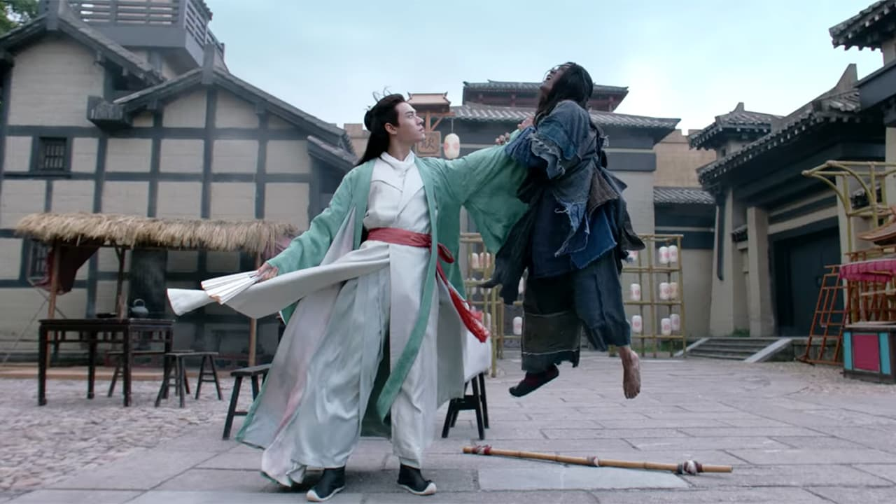
_Source : Youku Information Technology (Beijing) Co., Ltd, 山河令 第4集_

普段は風流な優男風の溫客行。

しかし、周子舒が見ていないところでは、彼に害をなす人々を容赦無く殺すシーンも。

この2面性にドキッとさせられます😳

### 5話：童貞を見抜かれてからの断袖

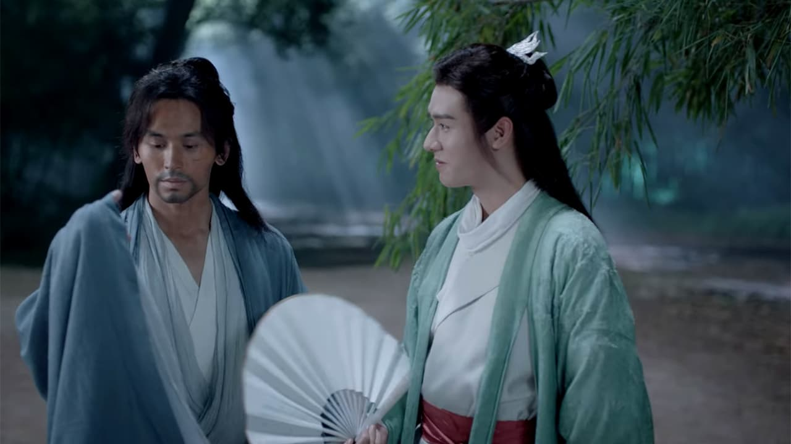
_Source : Youku Information Technology (Beijing) Co., Ltd, 山河令 第5集_

溫客行から「あー、君は童貞だから幽霊を信じないのか」って発言があって、童貞と幽霊がどう繋がってるのか私には分かりませんが、周子舒も否定しないし…。

からの、周子舒の袖が血で汚れているのをみて、その袖を切り落とす溫客行。いやいや、何してくれてるんでしょうか😳

『[魔道祖師](https://amzn.to/3mYdG0w)』などを読んでいる方からするとお馴染みかとは思いますが、断袖は男色の隠語ですから😳

### 6話：水辺でキャッキャウフフ

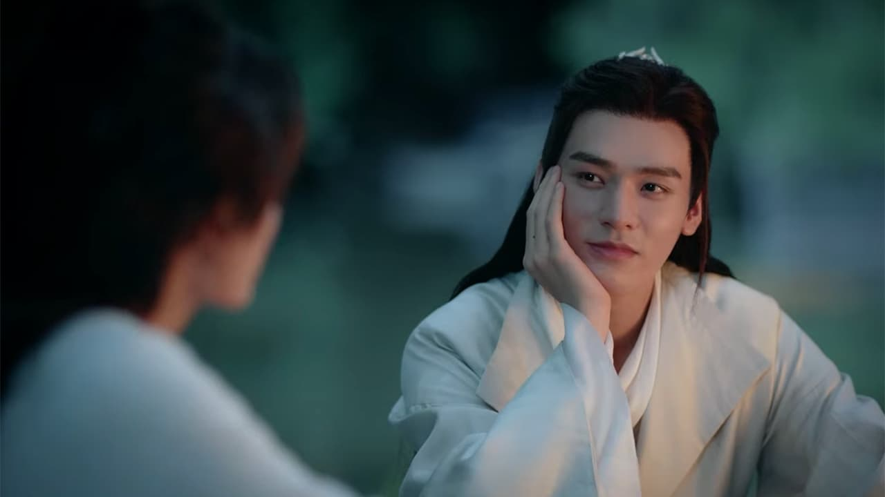
_Source : Youku Information Technology (Beijing) Co., Ltd, 山河令 第6集_

素顔になった周子舒の顔をじっと眺める溫客行。

見過ぎじゃない？

あとこの時、お互い水に濡れた後なので、外側の着物を脱いで乾かしてる最中。つまり、彼らが来てる白い着物は、下着…というか内側の着物だけの状態なんですよ😆

さらに、

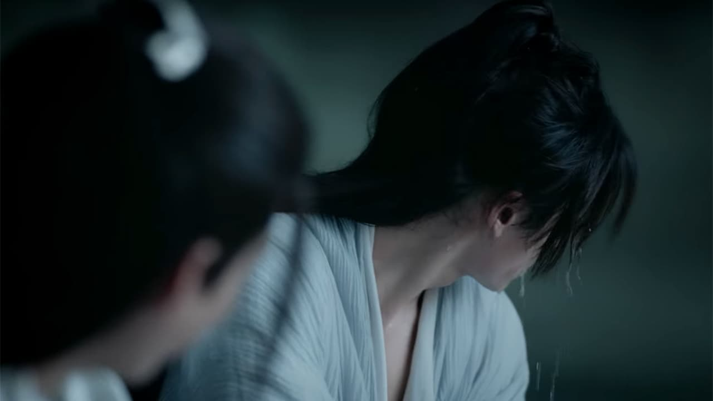
_Source : Youku Information Technology (Beijing) Co., Ltd, 山河令 第6集_

狩ったウサギを処理しながら、お互いに水を掛け合ってキャッキャウフフするシーン。

水滴が周子舒の頬から首筋にかけて滴る様子が美しすぎるんです！見てください、このセクシーな首筋😳

### 9話：展望台でデート

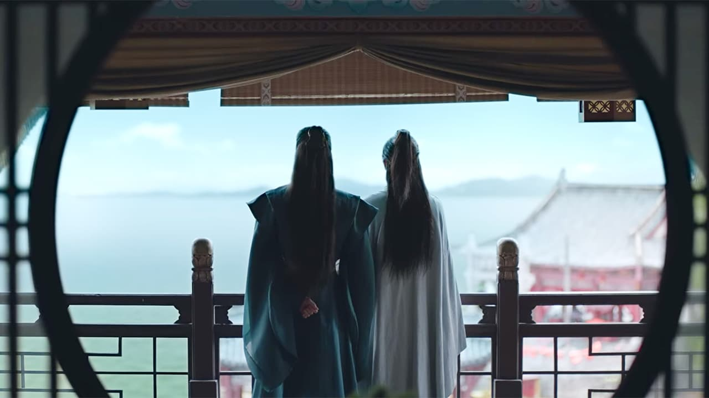
_Source : Youku Information Technology (Beijing) Co., Ltd, 山河令 第9集_

溫客行に誘われて、悅樊樓というこの辺りで一番眺めがいい場所にやってくる二人。

それただのデートだよね？！

しかも話しているのが、”親友”と出会って共に生きるって、なんて素敵なんだろう…みたいな内容で😳

### 12話：見つめあって名前を呼び合う

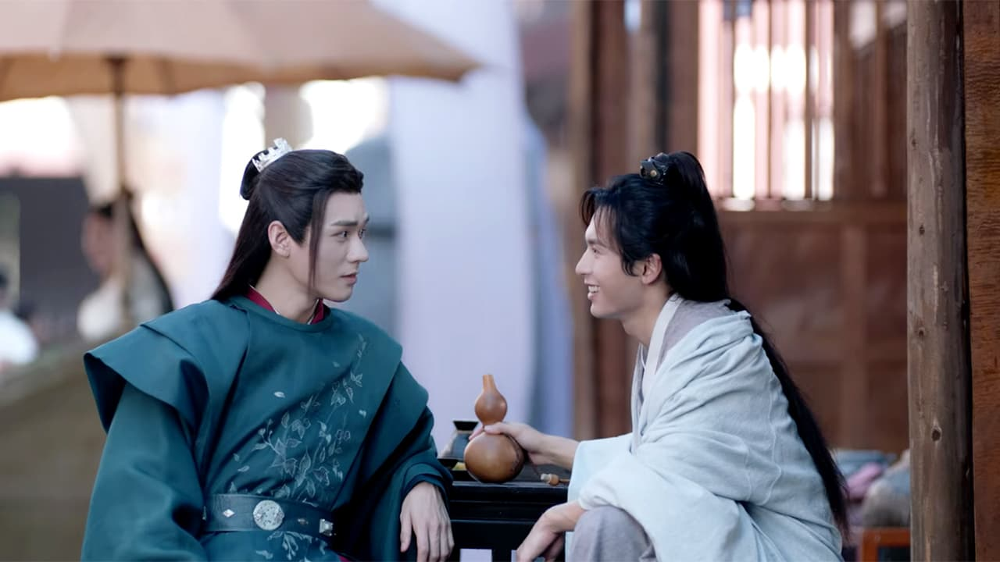
_Source : Youku Information Technology (Beijing) Co., Ltd, 山河令 第12集_

見つめ合い、お互いの名前を呼び合って戯れてるんですけどね。

ただ生きて、太陽の光を浴びて、自分の名前を呼んでくれる人がいる、それだけでなんて素晴らしい…みたいなことを言いながら、一緒にお酒を飲むんです。

いや、もうラブラブかよって😳

### 18話：起こして

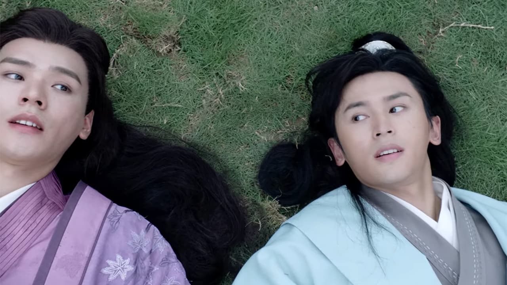
_Source : Youku Information Technology (Beijing) Co., Ltd, 山河令 第18集_

敵から逃げたりいろいろあって、地面にゴロゴロッ！と転がる二人。

先に起きた溫客行が、周子舒を助け起こそうと手を伸ばすと、完全に体の力を抜いて「起こして」と言わんばかりに甘えた態度をとるんですよ💕

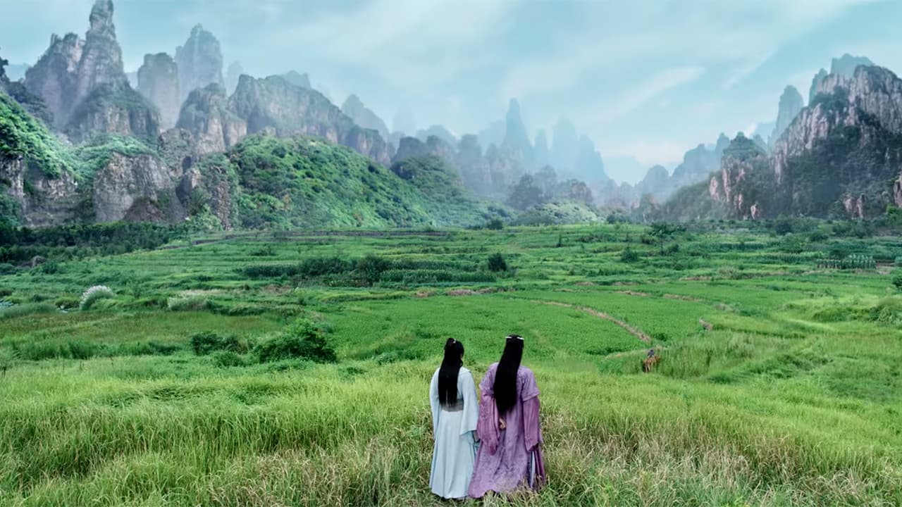
_Source : Youku Information Technology (Beijing) Co., Ltd, 山河令 第18集_

何よりこの美しいロケーションで二人っきりというシチュエーション、何というか逃避行感？ハネムーン感？が満載です😆

### 24話：パジャマパーティー

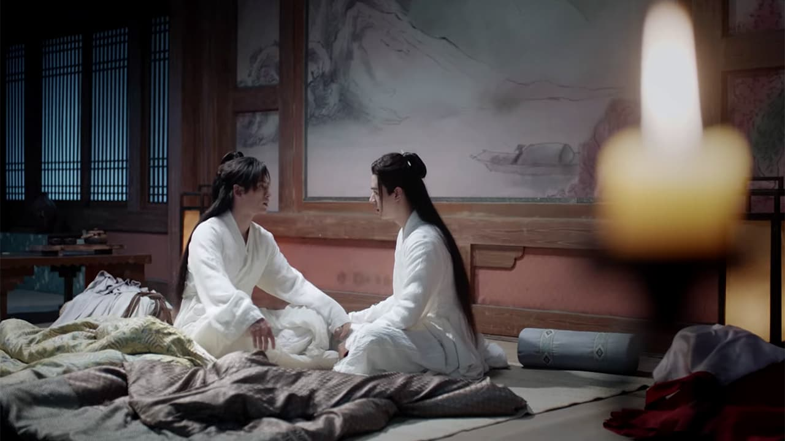
_Source : Youku Information Technology (Beijing) Co., Ltd, 山河令 第24集_

周子舒が溫客行に自分の過去、己の弱さをさらけ出すんですよ。泣きながら。パジャマで。

お布団は隣同士に敷いてあるし😳

### 27話：お互いを助けるために戦う

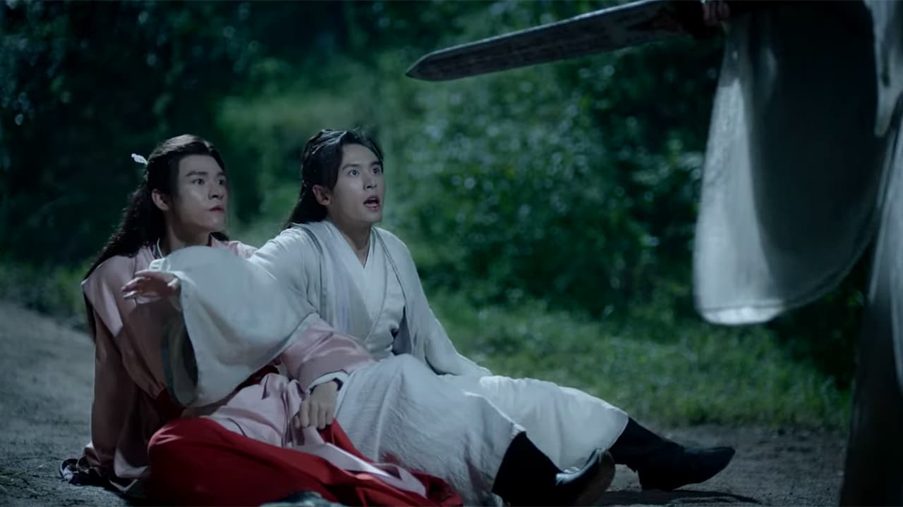
_Source : Youku Information Technology (Beijing) Co., Ltd, 山河令 第27集_

もうこの辺りになってくると、相手を助けるためなら自分の命なんて惜しくない！感があって、お互いの前に立ち塞がって戦うんですよ。

そして、また倒れた後の周子舒の「起こして」って甘えてねだる姿が…。

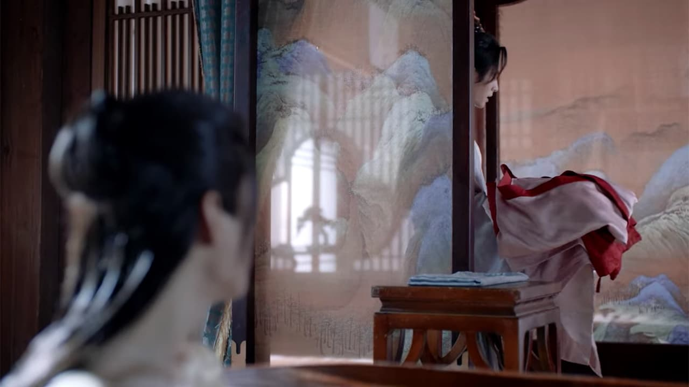
_Source : Youku Information Technology (Beijing) Co., Ltd, 山河令 第27集_

からの、昨夜負った傷を癒すため薬草のお風呂に入りながら、割と透けてる衝立を挟んでのシリアスな会話。

途中で周子舒が服を届けてくれるんですが、ということは、溫客行はお風呂に入る時に衝立の外で服を脱いだの？🤔

### 31話：四季山荘復活

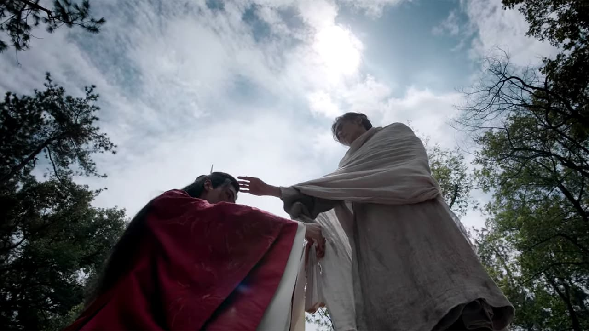
_Source : Youku Information Technology (Beijing) Co., Ltd, 山河令 第31集_

囚われた<s>姫</s>、いえ周子舒を救出。

とりあえず、胸熱過ぎるシーンなので、とにかく早く見てください！

### 34話：べったり

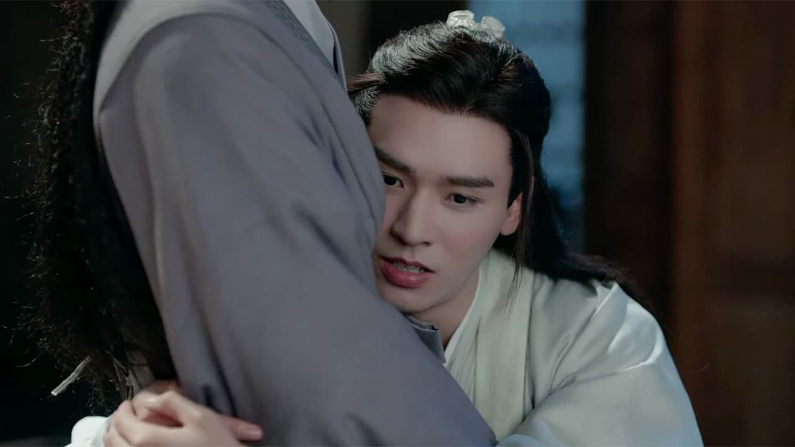
_Source : Youku Information Technology (Beijing) Co., Ltd, 山河令 第34集_

この体勢で、子供みたいな無邪気な顔で、嬉しそうに胸の内を伝える溫客行。でも、周子舒は複雑な顔をしていて…。理由はドラマを見て！

### 36話：即答

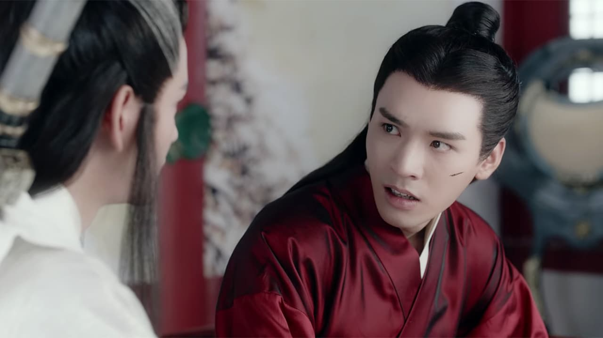
_Source : Youku Information Technology (Beijing) Co., Ltd, 山河令 第36集_

周子舒を救う方法はあるが、溫客行の命と引き換えになる。それでもやるか？との問いに、一瞬の迷いもなく「それ以上の望みなどない」との答え。 この即答にキュン💕

### 37話：ボーナスエピソード「彩蛋」

最終話の36話を見終わった瞬間、「え？これで終わり？え、ちょっと待って！？」となると思います。

実は最終回のその後を描いた7分程度の大結局「彩蛋」というエピソードが存在するんです！  
ぜひこのエピソードまで見ることを強く強くお勧めします。じゃないと、終わった気がしません😣

---

ということで、みどころ満載です！ぜひ楽しんでくださいね😊

<AffiliateBanner type="unext" />
