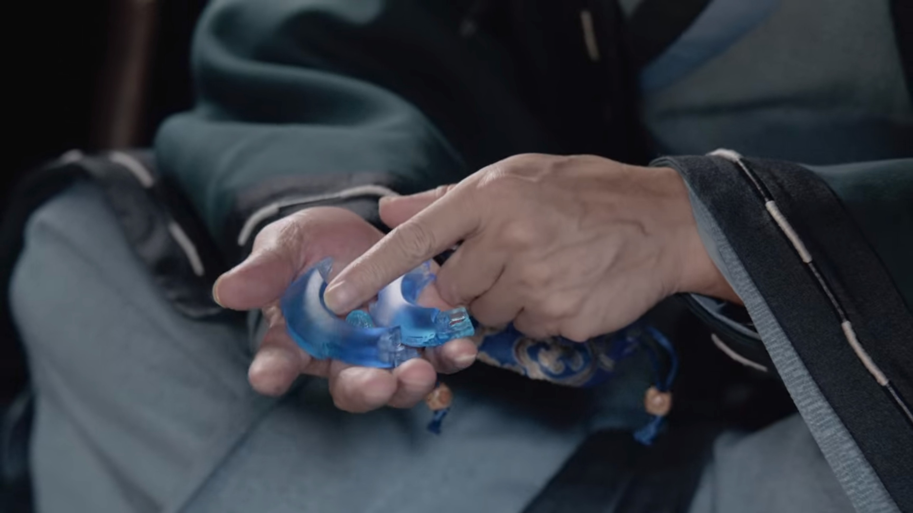
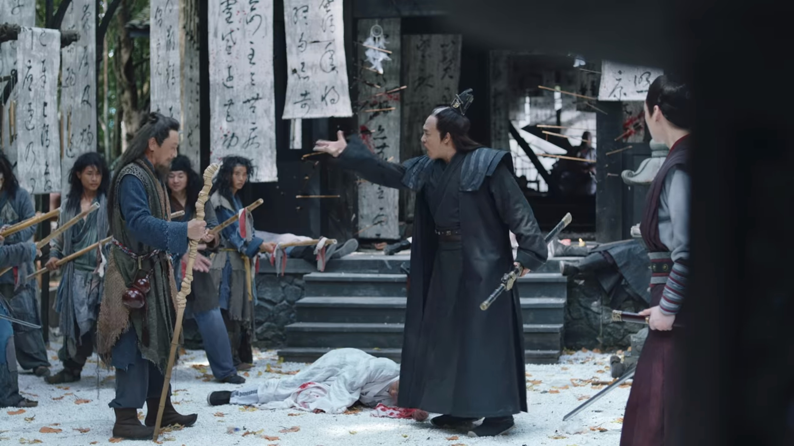

import { Amazon, Blockquote, Youtube, AffiliateBanner, InternalLink, PdfDownload, Twitter, Announce } from '../../../../src/components/blog'

<!-- <Youtube id="LUl2X99y6KM" /> -->

<Announce>

中華BLについて語り合うチャットグループを運営中です。普段はテキストチャットで語り合いつつ、たまに音声通話で思いの丈をぶつけ合っています。お気軽に参加してくださいね👋 
※ツールはディスコード(Discord)を使用しています。

<a href='https://discord.gg/fvN98csmmj' target="_blank" className="button" rel="nofollow noopener noreferrer">チャットグループへ参加</a>

</Announce>

BSで『山河令』の放送が始まったと聞いて、ついつい全話見返してしまいました😆  

ただ、個人的に『山河令』は伏線が多い上に話の展開も速いので、混乱することが多かったんですよね。  
そこで今回は、物語の中でキーになるアイテム「瑠璃甲」の行方について整理していきます。

第一弾と二弾ももよかったらどうぞ。

<InternalLink slug="/tv-movie/word-of-honor-all-characters/" />

<InternalLink slug="/tv-movie/word-of-honor-for-beginner/" />

__※中国語音声＋英語字幕で見ているので、日本語訳が間違っている場合は教えていただけると助かります__

__※盛大にネタバレしています__

---

## まずは瑠璃甲って何？

20年前、容炫という武芸の達人で人望も厚い男がいました（下の画像の左側）

_Source : Youku Information Technology (Beijing) Co., Ltd, 山河令 第12集_

彼は仲間達（後の五湖盟）と一緒に江湖の各門派の奥義書を集め、それを「武庫」と呼ばれる秘密の場所に隠しました。

で、その「武庫」を開けるためには、5個に割れた「瑠璃甲」が必要なんですね。

_Source : Youku Information Technology (Beijing) Co., Ltd, 山河令 第36集_

5つの「瑠璃甲」の欠片は、五湖盟の義兄弟5人でそれぞれ保管することにしました。つまり誰も抜け駆けできない、5人揃わないと開けられない仕様。

しかし、いつしか「武庫」を開ければ一夜にして天下無敵になれるとか、死んだ人間も蘇らせられるなどの噂が広まり、江湖の人々は「瑠璃甲」を巡って争うように。

それでは、「瑠璃甲」の欠片の行方をそれぞれ追って行きましょう。

## 最終的に3つまとめて移動した欠片

比較的遷移がシンプルな3つの欠片をまずは追っていきます。

### ①<ruby>高崇<rt>ガオ チョン</rt></ruby>が持ってた欠片

まずは五湖盟の義兄弟の長男・高崇が持っていた欠片。

この一番偉そうな感じのおじさんです（下の画像）

_Source : Youku Information Technology (Beijing) Co., Ltd, 山河令 第12集_

20年前からエピソード14で始まる英雄大会の直前まで、ずっと彼が保管してきました。

### ②<ruby>沈慎<rt>シェン シェン</rt></ruby>が持ってた欠片

次は五湖盟の義兄弟の五男・沈慎が持っていた欠片。

こちらも20年前から彼がずっと保管して来ましたが、エピソード12で英雄大会の前に高崇に渡します。

_Source : Youku Information Technology (Beijing) Co., Ltd, 山河令 第12集_

### ③<ruby>張成嶺<rt>ジャン チョンリン</rt></ruby>のお腹の中にあった欠片

次は五湖盟の義兄弟の四男・張玉森が保管していた欠片。そう、成嶺のお父さんですね。

エピソード2で鏡湖派が襲撃されたので、なんとお父さんは成嶺のお腹を切って、その中に瑠璃甲の欠片を隠し、彼を逃しました。

だから羅漢寺でお腹に傷があるっぽいのに、頑なに手当てを拒んだんでいたんですね。

_Source : Youku Information Technology (Beijing) Co., Ltd, 山河令 第12集_

そして、エピソード12でお腹から取り出し高崇へと手渡しました。

このシーンは結構びっくりだったんですが、欠片が小さくてまだよかったですよね…。

### 3つまとめて<ruby>莫懐陽<rt>モー ホワイヤン</rt></ruby>へ託される

さて、上に挙げた3つの欠片ですが、エピソード12の時点では3つまとめて高崇が持っていました。

しかし英雄大会の直前、用心深い高崇は、この3つの欠片を信頼する清風剣派の掌門・莫懐陽に託していました。

英雄大会を見ずに急に帰っていったあのおじさんです（下の画像）

_Source : Youku Information Technology (Beijing) Co., Ltd, 山河令 第16集_

手元には託された3つの欠片（下の画像）

_Source : Youku Information Technology (Beijing) Co., Ltd, 山河令 第16集_

そそくさと帰る清風剣派の人々（下の画像）

_Source : Youku Information Technology (Beijing) Co., Ltd, 山河令 第16集_

この後、清風剣派の本拠地まで無事に帰った莫懐陽は、部外者が入れないよう山を閉じ、瑠璃甲を守り続けます。

ここからしばらくこの3つの欠片は登場しなくなるのですが、エピソード35で彼が温客行に殺されたので、最終的には蝎王の手へと渡りました。

_Source : Youku Information Technology (Beijing) Co., Ltd, 山河令 第35集_

## ④<ruby>趙敬<rt>ジャオ ジン</rt></ruby>の盗まれた欠片

次は五湖盟の義兄弟の次男・趙敬が保管していた欠片の行方を追いましょう。

この欠片はエピソード5で盗まれてしまいました。うなだれる趙敬（下の画像）

_Source : Youku Information Technology (Beijing) Co., Ltd, 山河令 第5集_

盗んだのは宋懐仁（下の画像）

_Source : Youku Information Technology (Beijing) Co., Ltd, 山河令 第5集_

彼は高崇の弟子なんですが、実は趙敬の義理の息子でもあり、この盗難騒ぎは趙敬の自作自演でした。

同じ時、于丘烽の息子である于天傑（下の画像）も、同じく瑠璃甲を盗もうと忍び込みます。

_Source : Youku Information Technology (Beijing) Co., Ltd, 山河令 第5集_

しかし、宋懐仁と鉢合わせし、追いかけっこの末、殺されてしまいました。

黒い方が宋懐仁で、後から追いかけてる白い方が于天傑ね（下の画像）

_Source : Youku Information Technology (Beijing) Co., Ltd, 山河令 第5集_

しかし、その後、エピソード16で宋懐仁も蝎王によって殺されていたことが判明。

_Source : Youku Information Technology (Beijing) Co., Ltd, 山河令 第16集_

その後、この丸い欠片は趙敬から義理の息子である蝎王へ、信頼の証として（というか、彼を利用するために）贈られました。

_Source : Youku Information Technology (Beijing) Co., Ltd, 山河令 第16集_

その後は蝎王が首から下げて保管。

（それにしても蝎王が可愛すぎる…）

## ⑤<ruby>温客行<rt>ウェン コーシン</rt></ruby>が複製した欠片

最後は一番人から人へと移動した欠片の行方です。

この欠片は元々、五湖盟の義兄弟の三男・陸太冲が保管していました。

彼はエピソード1時点では既に亡くなっていて、その死に際に彼の持つ瑠璃甲の欠片と弟子2人を泰山派の傲崍子へと託しました。

義兄弟である五湖同盟に託さなかったのを見ると、その間には確執があるもよう。

下の画像は傲崍子と託された2人の弟子。

_Source : Youku Information Technology (Beijing) Co., Ltd, 山河令 第5集_

彼の持つ欠片を狙う沈慎や桃紅おばあさん、綠柳おじいさんから襲われますが、命からがら逃げきります。

しかし、最終的に傲崍子は鬼谷によって殺され、趙敬の三白山荘の門前に遺体を吊るされました（下の画像）

_Source : Youku Information Technology (Beijing) Co., Ltd, 山河令 第5集_

この時、鬼谷側はというと、無常鬼が死体の始末（吊り下げたり）をし、長舌鬼に傲崍子の持っていた欠片を持たせ、趙家の義荘へと送りました（ここで蝎王と落ち合う予定だった）

そしてエピソード6、義荘にて欠片を持った長舌鬼（下の画像）と、たまたま訪れた周子舒と温客行がはちあってしまう。

_Source : Youku Information Technology (Beijing) Co., Ltd, 山河令 第6集_

戦いの末、長舌鬼は殺され、欠片は温客行の元へ。

その後、温客行がこの欠片を複製して（下の画像）ばら撒いたので、江湖が大混乱に陥ったんですね。

_Source : Youku Information Technology (Beijing) Co., Ltd, 山河令 第6集_

そして翌る日、瑠璃甲の欠片をこれ見よがしに腰から下げて歩く温客行。注目を集めようとしています（下の画像）

_Source : Youku Information Technology (Beijing) Co., Ltd, 山河令 第7集_

そんなことをすれば、もちろんスリに狙われますよね。みごとに方不知というスリに盗まれてしまいました。

（私はてっきり盗まれたのは偽物だと思ってたんですが、本物だったっぽいですね。だって複製作ったのに本物を盗ませるとは思わないじゃないですか）

しかし、他の人から盗んだ財布にも偽の欠片が入っていて戸惑う方不知（下の画像）

_Source : Youku Information Technology (Beijing) Co., Ltd, 山河令 第8集_

その直後、彼は天窗によって暗殺されてしまいます。

手に入れた2つの欠片が瓜二つでおかしいなぁと思う天窗の韓英（下の画像）

_Source : Youku Information Technology (Beijing) Co., Ltd, 山河令 第9集_

おかしいなぁとは思いつつも、韓英は2つの欠片を晉王（下の画像）へと送りました。

_Source : Youku Information Technology (Beijing) Co., Ltd, 山河令 第28集_

（天窗から送られてきた2つのそっくりな欠片のうち、どちらが本物か晉王が見分けたんでしょうか？）

ここからしばらく晉王によって保管されてましたが、エピソード28で韓英が命懸けで晉王の書斎から盗み出します（下の画像）

_Source : Youku Information Technology (Beijing) Co., Ltd, 山河令 第28集_

その後、四季山荘に辿り着くも瀕死の韓英（下の画像）

_Source : Youku Information Technology (Beijing) Co., Ltd, 山河令 第28集_

ここでまた温客行の元へと欠片が戻ってきます。

その後、温客行と蝎王は密かに協力することを決めるのですが、その証として瑠璃甲の欠片を渡しました。

はい、これでようやく巡り巡った瑠璃甲の欠片が蝎王の手に渡ってきました。エピソード35でその欠片を持ってるシーン（下の画像）

_Source : Youku Information Technology (Beijing) Co., Ltd, 山河令 第35集_

ということで、エピソード35の時点で蝎王が全ての欠片を持ってる状態に落ち着きます。長かったですね。

## 偽物たち

私を混乱させた瑠璃甲の偽物エピソードもまとめておきます。

### <ruby>吊死鬼<rt>ディアオスー グイ</rt></ruby>が持って逃げた？

エピソード1で、瑠璃甲を吊死鬼が持ち出して逃走し（下の画像）、鬼谷の首領が十大悪鬼たちに「瑠璃甲を盗んだ裏切り者を見つけ出せ！殺せ！」と焚き付けるシーン。

_Source : Youku Information Technology (Beijing) Co., Ltd, 山河令 第1集_

まぁ、これは偽物というより温客行が仕組んだデマでしたね。

盗んだも何も温客行はそもそも瑠璃甲の欠片は持ってないので、吊死鬼は盗んでもいません。

その後、吊死鬼は谷底で殺されるんですが、この時殺したのも後に温客行だと明かされます。

### 月見酒中の戦い

エピソード9で周子舒と温客行が屋根の上で月を見ながら酒を飲んでいると（下の画像）

_Source : Youku Information Technology (Beijing) Co., Ltd, 山河令 第9集_

江湖の人々が瑠璃甲を巡って争っています（下の画像）。しかし、これらは偽物。

_Source : Youku Information Technology (Beijing) Co., Ltd, 山河令 第9集_

### 偽物を見つける五湖盟

月見酒中の戦いの翌朝、町のあちこちで瑠璃甲を巡る争いがあり、模造品が出回っていると情報共有する五湖盟（下の画像）

_Source : Youku Information Technology (Beijing) Co., Ltd, 山河令 第9集_

ここで3つの模造品が発見されたと言ってますが、彼らの手元には2つだけ。もう一つは安吉の四賢が持っているものを差しているのかしら？

ちなみにこの2つの偽物は、後ほど仁義坊で高崇が黃鶴に向けて投げつけてます（下の画像）

_Source : Youku Information Technology (Beijing) Co., Ltd, 山河令 第9集_

### 仁義坊での争い

安吉の四賢はどこかから瑠璃甲の偽物を手に入れました。

彼らはこの欠片を高崇に渡すべきだと主張し守ろうとしますが、人々はそれを奪おうと襲い掛かり、最終的に4人とも亡くなってしまいます。

_Source : Youku Information Technology (Beijing) Co., Ltd, 山河令 第9集_

あれだけドラマを繰り広げておいて、偽物だったの…？

### 英雄大会で<ruby>高崇<rt>ガオ チョン</rt></ruby>が砕いた3つの欠片

エピソード16の英雄大会で高崇が砕いた3つの欠片も偽物です（下の画像）

_Source : Youku Information Technology (Beijing) Co., Ltd, 山河令 第16集_

先にも書いた通り、用心深い高崇は、この3つの欠片を信頼する清風剣派の掌門・莫懐陽に託していました。

## まとめ

正直、ここまで記事を書きながら合ってるのかな？とちょっと不安なんですが、他の見解の方がいらっしゃったら是非お聞きしたいです！

<AffiliateBanner type="unext" />
