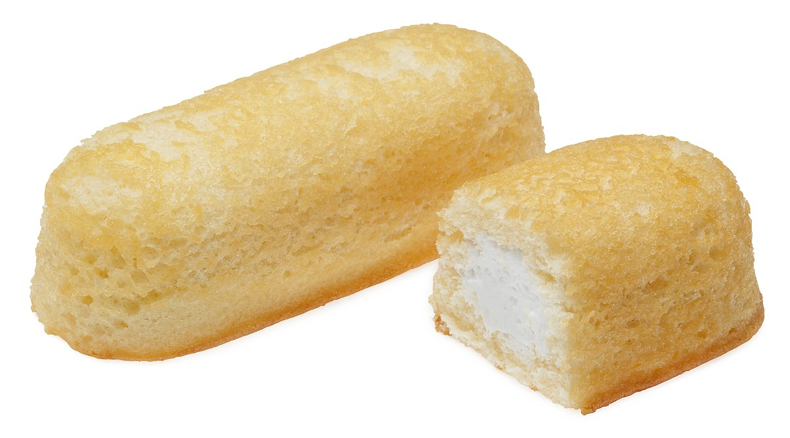

import { Amazon, Blockquote, VocabularyFooter } from '../../../../src/components/blog'

今回紹介する単語は __twink__（トゥウィンク）です。

「若くて可愛いゲイ男子」という意味のスラングで、20前後、金髪、白人、スレンダー、体毛もなく、少年っぽくて、頭も弱めなイメージ。

お菓子の「Twinkie」から来てるそうなんですが、

_Source : [Twinkie - Wikipedia](https://en.wikipedia.org/wiki/Twinkie)_

柔らかくクリームたっぷりで美味しいんだけど、栄養なんて全く無いお菓子、という皮肉。  
この形状も関係あるのだろうか？🤔

## 例文

月吠えシリーズ1巻[『月への吠えかた教えます』](/mm-romance/how-to-howl-at-the-moon/)チャプター11より。

<Blockquote book srcBook="howToHowlAtTheMoon" lang="en" chapter="11">
His body lusted after the alpha males in the clubs, the rougher the better, but he always ended up with some frail-looking <strong>twink</strong> swapping hasty blow-jobs in the bathroom.
</Blockquote>

（ティムの体はクラブ内のアルファ男子を欲しがっていた。荒っぽいなら尚いい。しかし、結局いつも相手は、トイレの中で代わる代わる慌ただしくフェラする、ひ弱そうな男だった。）

どちらかと言うと、ティムの方が twink 感ありますけどね。

それにしても、ティムはランスと出会えて本当によかったですね😊

<VocabularyFooter book="howToHowlAtTheMoon" />
