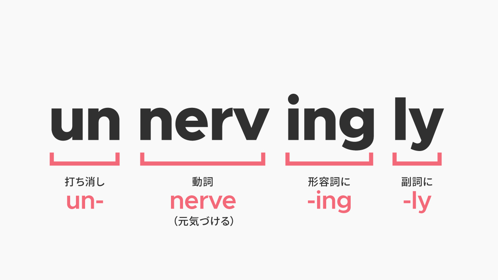

import { Amazon, Blockquote, VocabularyFooter } from '../../../../src/components/blog'

今回紹介する単語は __unnervingly__（アンナーヴィングリィ）で、「不安になるほど、狼狽するほど」という意味の副詞です。

もともと、動詞 __nurve__（元気づける）があり、  
打ち消しの un をつけて、反対の意味の動詞 __unnurve__（びっくりさせる、ろうばいさせる）になり、  
-ing をつけて形容詞 __unnerving__ になり、  
そして、-ly がついて副詞 __unnervingly__ になります。

## 例文

アドリアン･イングリッシュシリーズ2巻[『死者の囁き』](/mm-romance/a-dangerous-thing/)チャプター12より。

アドリアンとジェイクの初めてのSEXシーン。

ジェイクの指遣いが気持ち良すぎて、何か話して気を逸らそうとするも、すすり泣くような喘ぎ声が漏れるだけなアドリアンが可愛過ぎる💕

<Blockquote book srcBook="dangerousThing" lang="en" chapter="12">
I wanted to talk myself away from feeling too much, too keenly, but all that came out was a something <strong>unnervingly</strong> like a <a href="/vocabulary/whimper/">whimper</a>.
</Blockquote>

（僕はあまりにも感じすぎないよう自分に言い聞かせたかったが、口から漏れるのは、狼狽するほどのすすり泣きのような声ばかりだった。）

そして、きっとジェイクはクンクン鳴くような声を上げるアドリアンを可愛いと思ってるんだろうな〜😊

<VocabularyFooter book="dangerousThing" />
