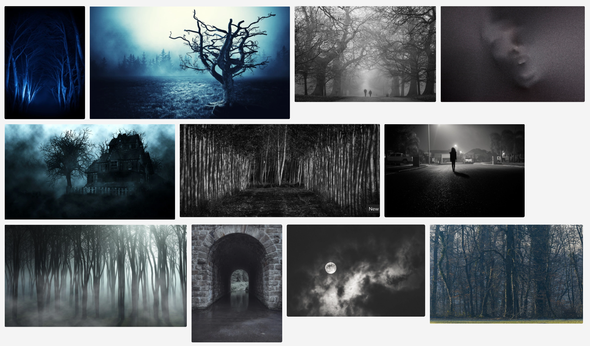

import { Amazon, Blockquote, VocabularyFooter } from '../../../../src/components/blog'

今回紹介する単語は __unnervingly__（アンナーヴィングリィ）で、「不安になるほど」という意味の副詞です。

## 単語を分解

もともと「元気づける」という意味の動詞 __nerve__ があり、  
そこに打ち消しの un を付けると、「気力を奪う」という反対の意味の動詞 __unnerve__ になります。

そして、-ing が付くと形容詞 __unnerving__ になり、  
さらに、-ly が付くと副詞 __unnervingly__ になります。

## 単語のイメージ

形容詞 __unnerving__ の基本的な意味は「不安にさせるような、恐がらせるような」です。  
「unnerving」でGoogle画像検索すると、ホラー映画のワンシーンのような、不気味な画像が並びます。

こんな感じの見ていてゾッとするイメージ。

ただ、日本語だとコンテキスト次第で、いろいろと言い方が変わりそうですね。

- 不安をかき立てるような
- 落ち着かなくさせるような
- 取り乱すような
- 怖気付くような
- 狼狽させるような
- ドキッとさせるような
- ゾッとさせられるような
- ビクビクさせるような

などなど。

## 例文1

アドリアン･イングリッシュシリーズ2巻[『死者の囁き』](/mm-romance/a-dangerous-thing/)チャプター12より。

アドリアンとジェイクの初めてのSEXシーン。

ジェイクの指遣いが気持ち良すぎて、得意のおしゃべりで気を紛らわせようとするも、すすり泣くような喘ぎ声が漏れるだけなアドリアンが可愛過ぎる💕

<Blockquote book srcBook="dangerousThing" lang="en" chapter="12">
I wanted to talk myself away from feeling <a href="/vocabulary/too/">too</a> much, <a href="/vocabulary/too/">too</a> keenly,
あまりに気持ち良くて、何か話して少しでも気を逸らそうとしたが、
but all that came out was a something <strong>unnervingly</strong> like a <a href="/vocabulary/whimper/">whimper</a>.
口から漏れるのは、自分でもドキッとするような喘ぎ声だけだった。
</Blockquote>

そして、きっとジェイクは、クンクン鳴くような声を上げるアドリアンを可愛いと思ってるんだろうな〜😊

アドリアンがこんな声を上げてるのを聞いて、「これは？これも気持ちいい？」と、ノリッノリで責めてましたし。

## 例文2

他にも、チャプター11より。

ジェイクが運転するブロンコにアドリアンが飛び乗ってきて、「外に何かいる！」と訴えたシーン。

確認するためジェイクが車を降り、あたりの様子を伺うんだけど、気持ちが悪いくらい静かすぎる様子に unnerving が使われています。

<Blockquote book srcBook="dangerousThing" lang="en" chapter="11">
Beyond the sound of the Bronco engine running quietly down the road,
道路の向こうに停めたブロンコの静かなエンジン音以外、
there was utter and <strong>unnerving</strong> silence.
完全な恐いくらいの静寂だった。
</Blockquote>

よく考えたら、こういう「恐い」系の形容詞って思いつくだけでも creepy, unnerving, scary, terrifying, horrifying など色々あるので、ニュアンスの違いを調べたいな🤔

<VocabularyFooter book="dangerousThing" />
