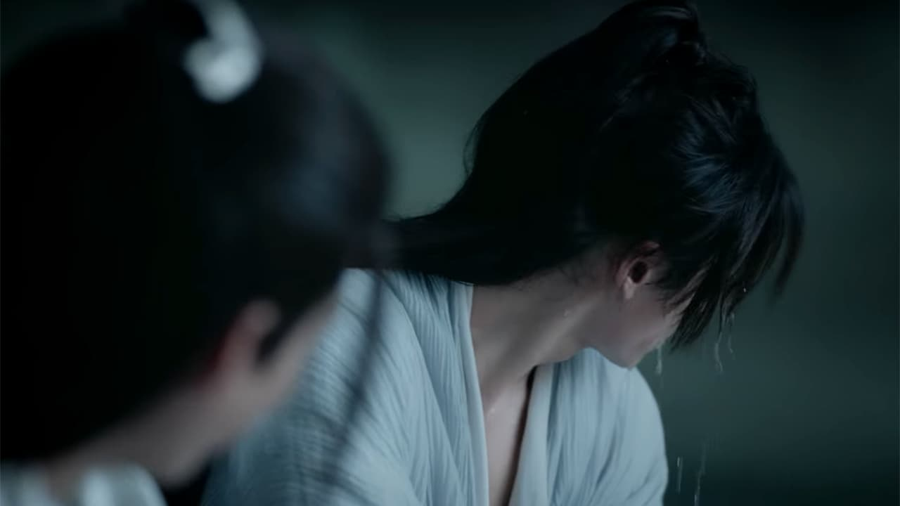
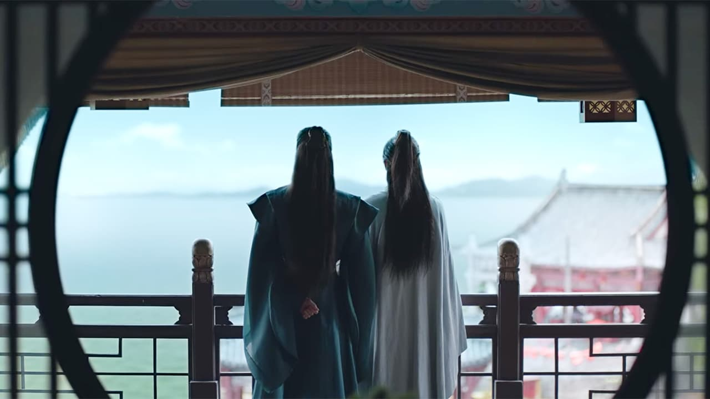
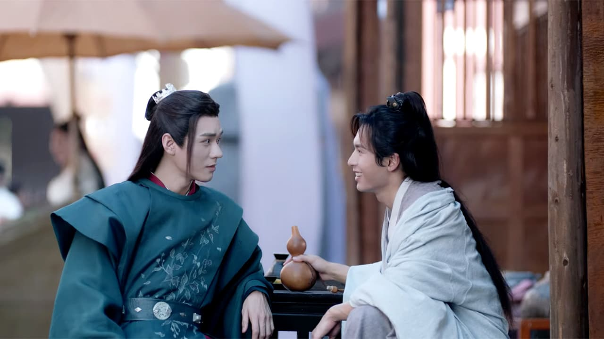
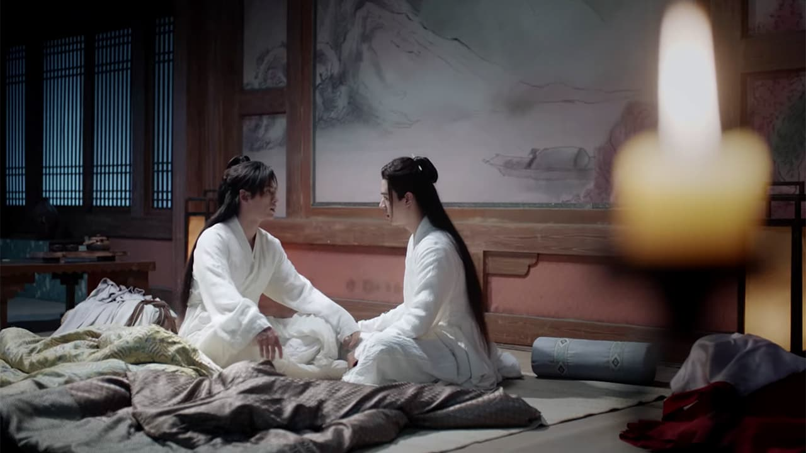
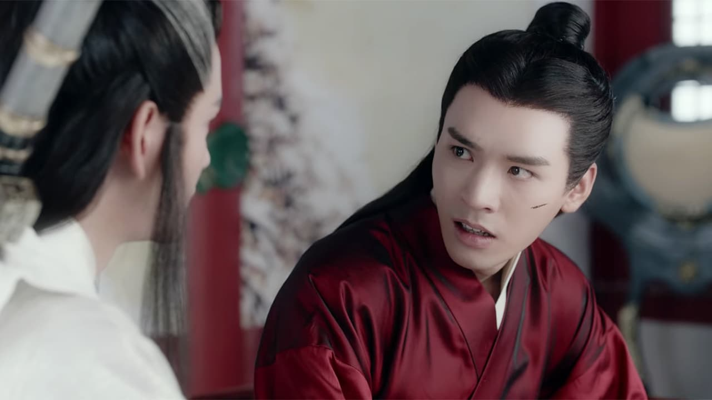

import { Amazon, Blockquote, Youtube, AffiliateBanner, InternalLink, PdfDownload, Twitter } from '../../../../src/components/blog'

陳情令にハマった勢いて、山河令も一気に見てしまいました😆

2021/08/12から[WOWOW](https://www.wowow.co.jp/detail/173844)で放送中です！

<Youtube id="LUl2X99y6KM" />

とにかく登場人物が多くて混乱しがちな『山河令』。  
自分の頭の中の整理も兼ねて、キャラクターリストを作ろうと思います。少しずつ更新していきますね。

<!-- 第二弾もよかったらどうぞ。

<InternalLink slug="/tv-movie/word-of-honor-for-beginner/" /> -->

__※中国語音声＋英語字幕で見ているので、日本語訳が間違っている場合は教えていただけると助かります__

__※盛大にネタバレしています__

---

## まずは基礎知識

### 中国BLドラマ

BL小説を元に制作されたドラマなんですが、同性愛描写に規制がある中国では、BLのまま制作すると検閲にひっかかって放送できなくなる可能性が高いんです。

なので、同性愛ではなく、あくまで男性同士の親密な心の繋がりを描いたブロマンス作品として制作されています。

耽美小説をブロマンス仕立てにして制作するドラマなので、「耽改劇」とか「耽改ドラマ」とか呼ばれてます。

私はもともとブロマンスが大好きなので、この作品はもう私の心臓にえぐり込んできました🥰

### 世界観

ジャンルは、武侠ファンタジー時代劇。

古代中国っぽさのあるファンタジー世界が舞台で、人間、仙師、妖魔などが存在します。

主人公たちは仙術を使うことができる仙師（仙人）であり、妖魔を退治するため、また、より高い境地に達するために日々修行を続けています。

### 原作

陳情令のように、日本語翻訳版が発売されることを願ってます😭

### あらすじ

●●●

みたいなストーリーです。

---

## 挫折しないために。ざっくりドラマ構成

相関図とエピソード

---

## みどころマップ

全36話、長いですよね😅

でも、ちょいちょい「きゃっ💕」となるシーンが盛り込まれているので、目が離せませんよ😊  
私のオススメのエピソードをネタバレしない感じでご紹介しますね。

### 6話：顔が綺麗

_Source : Youku Information Technology (Beijing) Co., Ltd, 山河令 第6集_

素顔になった周子舒の顔をじっと眺める溫客行。

見過ぎじゃない？

### 6話：水をパシャパシャ

_Source : Youku Information Technology (Beijing) Co., Ltd, 山河令 第6集_

狩ったウサギを処理しながら、お互いに水を掛け合ってキャッキャウフフするシーン。

もう😳って顔になりましたよね。

何より、水滴が周子舒の頬から首筋にかけて滴る様子が美しすぎるのよ😳

### 9話：デート

_Source : Youku Information Technology (Beijing) Co., Ltd, 山河令 第9集_

それただのデートだよね？！ってシーン

### 12話：名前を呼び合う

_Source : Youku Information Technology (Beijing) Co., Ltd, 山河令 第12集_

見つめあって名前を呼び合って戯れてるんですけどね

生きてて、太陽の光の下で、自分を呼んでくれる人がいる、なんて素晴らしい

お酒を飲む

### 24話：パジャマパーティー

_Source : Youku Information Technology (Beijing) Co., Ltd, 山河令 第24集_

見た瞬間「パジャマパーティーかよ！」ってツッコミを入れてしまったシーン😅

周子舒が溫客行に自分の過去、己の弱さをさらけ出すんですよ。泣きながら。パジャマで。

### 36話：即答

_Source : Youku Information Technology (Beijing) Co., Ltd, 山河令 第36集_

周子舒を救う方法はあるが、溫客行の命と引き換えになる。それでもやるか？との問いに、なんの躊躇いもなく「それ以上の望みなどない」との答え。この即答にキュン💕

### 37話：ボーナスエピソード？

36話を見終わった瞬間、「え？これで終わり？え、ちょっと待って！？」となると思います。

ネットを探せば彼らのそれからを描いた37話がアップロードされてる思うので、37話まで見ることを強くお勧めします！

---

## これだけは覚えておきたい！用語

<dl>
  <dt>仙師（せんし）</dt>
  <dd>いわゆる仙術を使う仙人のこと。仙師たちは普通の人間とは違い、妖魔などを退治するために修行している。あと、あまり歳を取らない。</dd>
</dl>

---

ということで、みどころ満載です！ぜひ楽しんでくださいね😊
